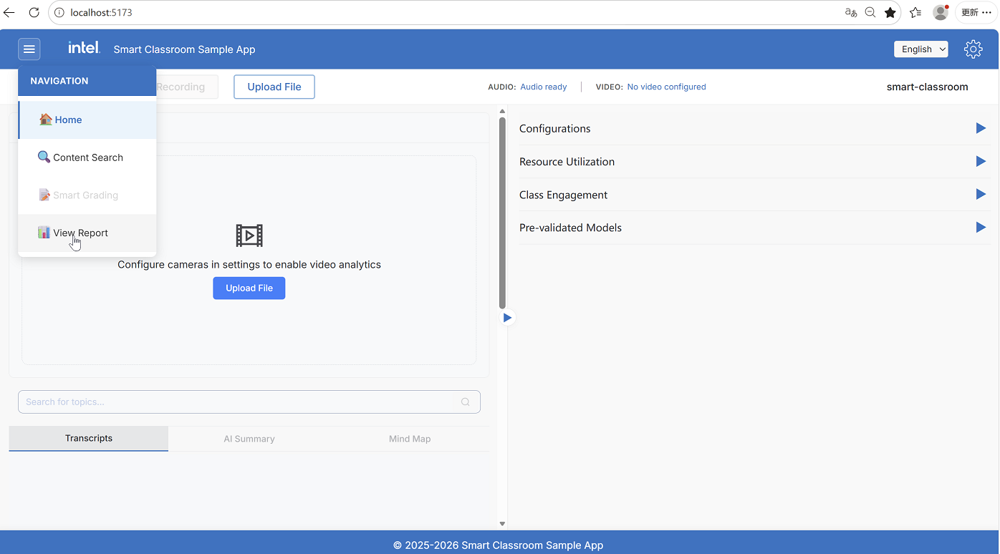
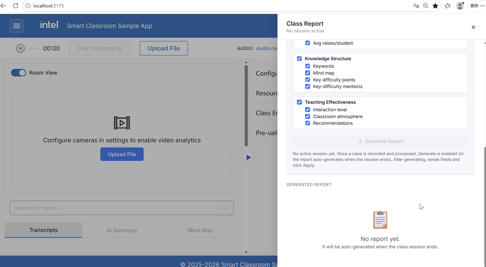
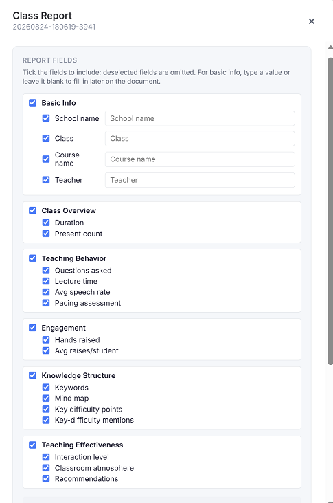
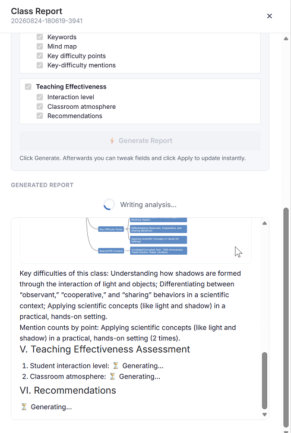
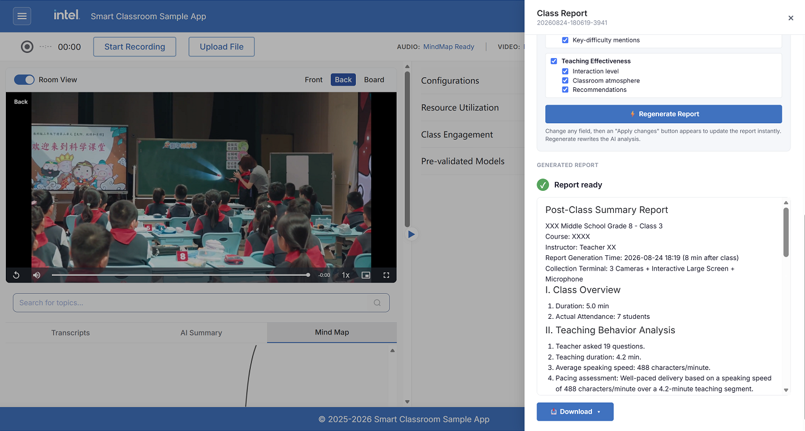
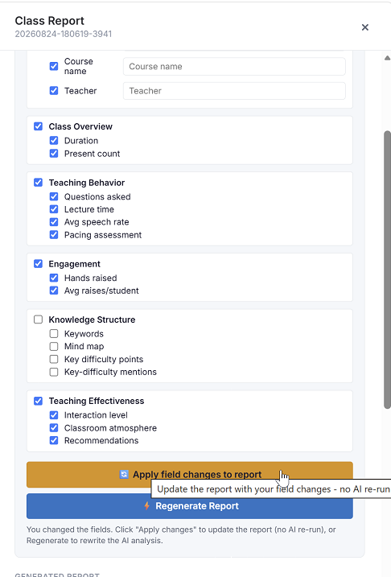
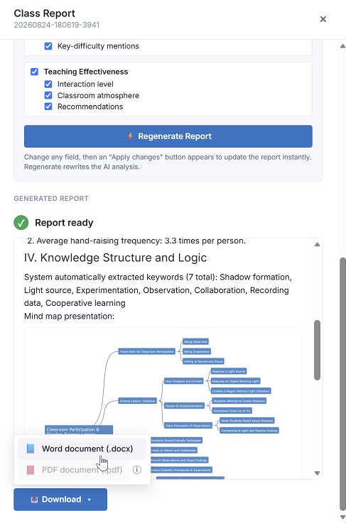

# Class Report Flow

The Class Report feature generates a structured, editable teaching evaluation report from
processed class session data, including ASR transcripts, AI summaries, mind maps, topic
segmentation, attendance, speaking speed, and hand-raise counts. It also provides
AI-generated insights on classroom interaction, atmosphere, and teaching recommendations.
The report can be exported as a Word (`.docx`) or PDF document.

To open the Class Report, click **View Report** in the top navigation menu on the Smart
Classroom main screen:

The Class Report opens as a slide-in panel with two areas:

- **Report Fields** - Choose which sections and data points to include, and type in the
  basic class information.
- **Generated Report** - A live preview of the report, with **Download** options once it is
  ready.

## When Can a Report Be Generated?

The report reads content segmentation as one of its data sources, so **Generate** becomes
available only after processing has settled:

- **Audio / Audio+Video** - After transcription, summary, mind map, and content
  segmentation complete.
- **Video-only** - After video processing reaches playback mode.

If a session is still processing, the **Generate Report** button stays disabled and the panel
shows a hint explaining what to wait for.
## Step 1: Select Report Fields

The **Report Fields** section lists every data point the report can contain, organized into
groups. Tick the fields to include; deselected fields are omitted from the document.

| Group | Example fields | Source |
| :--- | :--- | :--- |
| **Basic Info** | School, class, course, and teacher name | Typed in manually |
| **Class Overview** | Duration, attendance | Measured data |
| **Teaching Behavior** | Question count, teaching duration, speaking speed, pacing assessment | Measured data |
| **Engagement** | Hand-raise count and average | Measured data |
| **Knowledge Structure** | Keywords, mind map, key/difficult points | Extracted from the summary |
| **Teaching Effectiveness** | Interaction level, classroom atmosphere, recommendations | AI-generated |

Tick a group header to toggle all of its fields at once.

### Basic Info

Basic info cannot be derived from audio or video, so the teacher types it in. For each basic
info field:

- **Tick the checkbox** to include the field.
- **Type a value**, or leave it blank to fill it in later on the printed document.

Some metadata (such as the report generation time) is added automatically and is not shown as
a toggleable field.

> **Note:** Fields are split into two kinds. **Raw** fields (numbers, names, keywords, mind
> map) are filled directly from measured data and are never invented by the AI. Only the
> **Teaching Effectiveness** fields are written by the language model, using the class summary,
> mind map, and segmentation as context.

## Step 2: Generate the Report

Click **⚡ Generate Report**. The report is assembled in two passes:

1. The template is filled with the raw, measured fields immediately (shown as a skeleton).
2. The AI writes the Teaching Effectiveness analysis, which streams into the preview as it is
   produced.

When finished, the panel shows **✓ Report ready** with the full report rendered in the preview.

## Step 3: Adjust Fields

After a report exists, you can change the selected fields or edit the basic info without
re-running the AI:

- **🔄 Apply field changes** - Re-projects the report onto your current selection and manual
  values instantly. No AI re-run. This button appears after you change any field.
- **⚡ Regenerate Report** - Rewrites the AI analysis from scratch.

## Step 4: Download

Open the **📥 Download** menu and choose a format:

- **Word document (`.docx`)** - Always available.
- **PDF document (`.pdf`)** - Available when LibreOffice is installed on the server. When it is
  missing, the item is disabled with an install hint (`soffice` must be on the `PATH`).

## Learn More

- [Application Flow](./application-flow.md): End-to-end application flow.
- [How It Works](./how-it-works.md): Technical architecture and design details.
