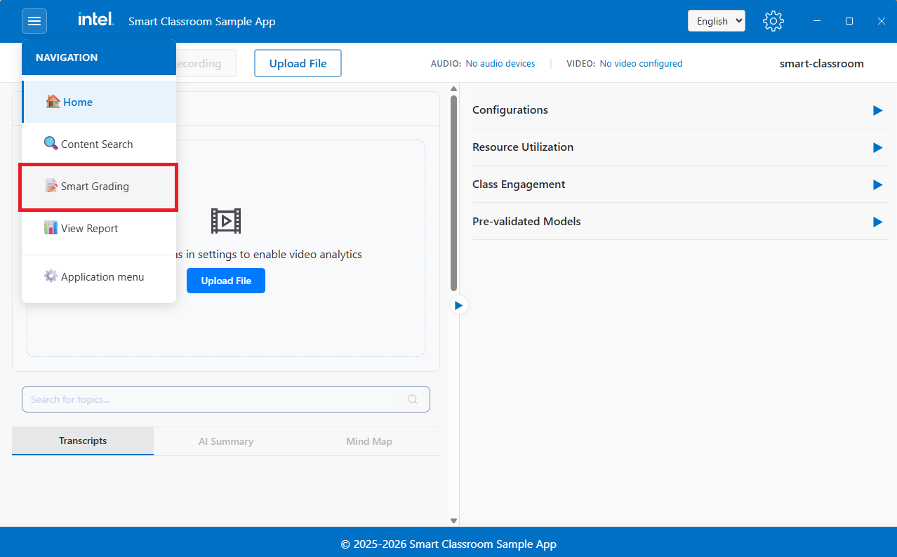
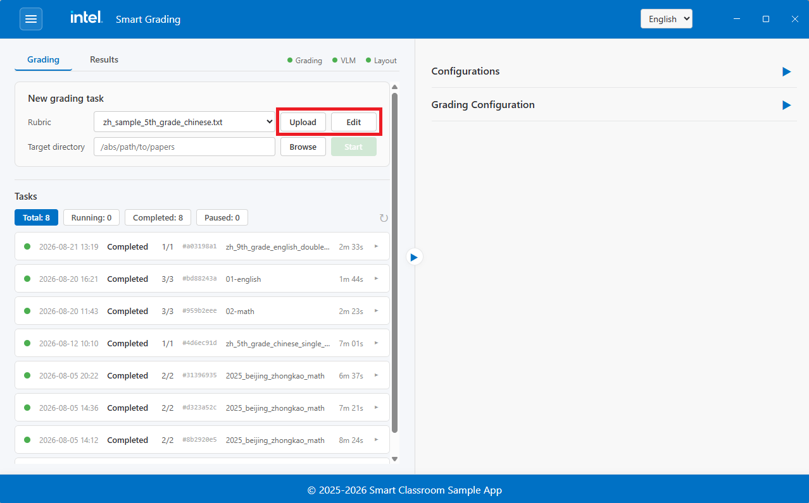
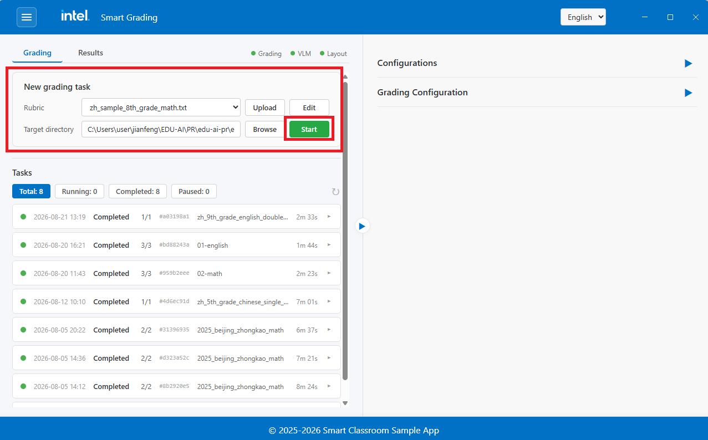
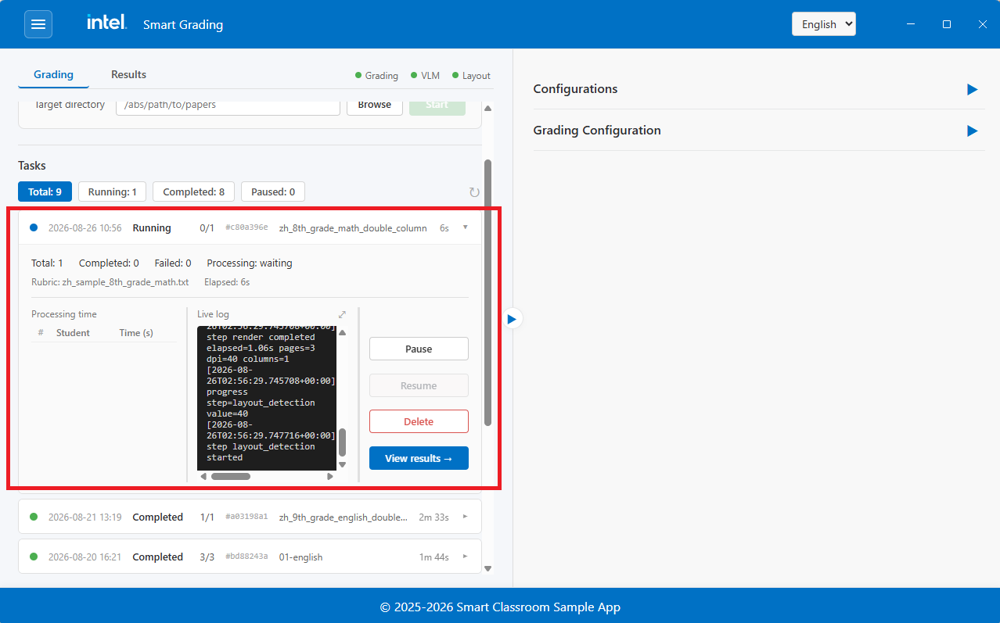
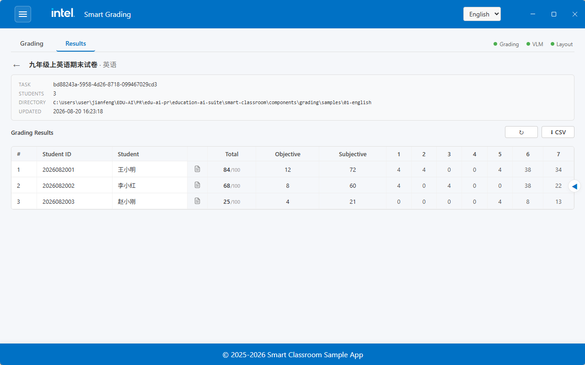

# Grading Flow

The Grading feature automatically scores scanned exam papers. You provide a paper (PDF) and a
rubric, and the system renders the pages, splits them into sections, and uses a Vision-Language
Model (VLM) to grade each section and produce a structured result with scores and reasoning.

To enter the Grading view, click the **Grading** button in the top navigation bar on the Smart
Classroom main screen:

## Step 1: Prepare a Rubric

A rubric tells the model how to grade. Upload one before creating a task:

1. Click **Upload Rubric** and select a `.txt` file.
2. The uploaded rubric appears in the rubric list and can be edited in place.

## Step 2: Create a Grading Task

1. Browse and select the exam paper (`.pdf`).
2. Select the rubric to grade against.
3. Click **Start Grading**.

The task runs through four steps automatically:

| Step | What happens |
| :--- | :--- |
| **Render** | The PDF is converted to page images. |
| **Layout detection** | Each page is analyzed to locate text, titles, tables, and formulas. |
| **Section split** | Pages are grouped into question sections, stitched across page breaks. |
| **VLM grading** | Each section image and its rubric are sent to the VLM, which returns scores and reasoning. |

## Step 3: Track Progress

The task list shows each task's status and progress. You can **pause**, **resume**, or **cancel**
a running task, and delete finished ones.

## Step 4: View Results

When a task completes, open it to see the graded result:

- **Score summary** - Objective, subjective, and total scores.
- **Per-question breakdown** - Each question's score, the student's answer, and the model's
  reasoning.

## Models

| Model | Role | Device |
| :--- | :--- | :--- |
| PP-DocLayout | Page layout detection | NPU |
| PP-OCR | Read section titles | CPU |
| Qwen VLM | Grade sections | GPU |

## Learn More

- [Application Flow](./application-flow.md): End-to-end application flow.
- [How It Works](./how-it-works.md): Technical architecture and design details.
