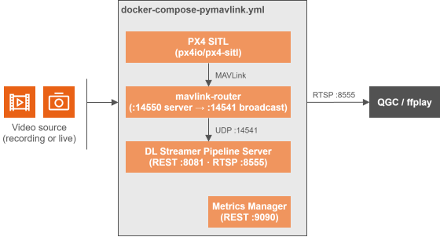
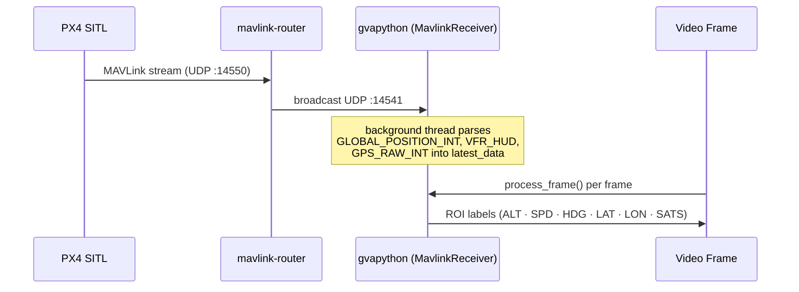

<!--
SPDX-FileCopyrightText: (C) 2026 Intel Corporation
SPDX-License-Identifier: Apache-2.0
-->


# Get Started (Standalone Mode / pymavlink)

This guide provides a step-by-step walkthrough for testing the UAV Vision Analytics application in standalone mode (pymavlink) and running the demo with a simulated UAV camera feed/RealSense cameras.

## How It Works

A self-contained stack. PX4 SITL, MAVLink router, MQTT broker, and Metrics Manager are all started together (`docker-compose-pymavlink.yml`). Telemetry flows from PX4 SITL through `mavlink-router` to the DL Streamer container, where `pymavlink` reads it directly over UDP.



**Telemetry flow:**



**Services:**

| Service | Image | Ports | Role |
|---|---|---|---|
| `dlstreamer-pipeline-server` | `intel/dlstreamer-pipeline-server` + pymavlink | `8081`, `8555` | AI inference, RTSP output |
| `px4` | `px4io/px4-sitl` | `14550`  | Flight controller simulator |
| `mavlink-router` | custom build | `14551` | MAVLink UDP routing (:14550 → :14541) |
| `metrics-manager` | `intel/metrics-manager` | `9090` | CPU/GPU/NPU/power metrics |

---

## Steps to Test the Application

### System Requirements

See [System Requirements](./system-requirements.md) for the full list of software and hardware prerequisites.

### 1. Configure environment

Clone the repo and Get into the directory:

```bash
git clone https://github.com/open-edge-platform/edge-ai-suites.git
cd edge-ai-suites/federal-and-aerospace-ai-suite/uav-vision-analytics
```

```bash
make init
```

`make init` creates `.env` from the template and **auto-detects your Intel GPU device paths** (`GPU_DEVICE`, `GPU_RENDER_DEVICE`), **Intel NPU** (`NPU_DEVICE`), and **Intel RealSense / USB camera** (`REALSENSE_DEVICE`). It skips if `.env` already exists.

Then set your host IP address in `.env`:

```bash
nano .env   # set HOST_IP=<your-machine-IP>
```

### 2. Prepare the model

Download and export the YOLOv8n-VisDrone model to OpenVINO FP16 IR:

```bash
make model
```

> See the [AI Model guide](../how-to-guides/model.md) for model details.


### 3. Standalone mode (pymavlink)

```bash
make pymav-up
```

### 4. Start inference pipelines

Two options are available depending on your use case:

#### Option A — Managed RTSP output (recommended)

Runs `pipeline_manager.py` inside the DLSPS container. It monitors the drone's ARMED/DISARMED state and automatically starts and stops inference pipelines. Annotated frames are served as RTSP on port `8555`.

`make start-rtsp` starts **one device pipeline at a time** (default: GPU). Pass `DEVICE=cpu|gpu|npu|all` to choose:

```bash
make start-rtsp                # GPU only (default)
make start-rtsp DEVICE=cpu     # CPU only
make start-rtsp DEVICE=npu     # NPU only
make start-rtsp DEVICE=all     # CPU + GPU + NPU simultaneously
```

> **Note:** Open QGroundControl (QGC) to connect and press takeoff, which arms the UAV (Only arming will automatically disarm the UAV after a few seconds). The pipeline manager will automatically start the selected pipeline and serve annotated RTSP streams.
>
> `DEVICE=npu` requires `NPU_DEVICE` to have been detected during `make init` — falls back to GPU otherwise.
>
> Refer to the [QGroundControl guide](../how-to-guides/qgroundcontrol.md#rtsp-stream) for instructions on connecting to the RTSP stream.


**pymavlink mode** — output streams (only the selected `DEVICE` is active, unless `DEVICE=all`):
```
rtsp://<HOST_IP>:8555/uav-mavlink-cpu    (CPU pipeline)
rtsp://<HOST_IP>:8555/uav-mavlink-gpu    (GPU pipeline)
rtsp://<HOST_IP>:8555/uav-mavlink-npu    (NPU pipeline) # If NPU Device is available
```

**File-source pipelines** (started via REST API or benchmark script) — output path is set in the POST request body (e.g. `uav-mavlink-cpu` for the `uav_object_detection_cpu` pipeline).

#### Option B — Manual REST API

Start a single pipeline directly without the pipeline manager. Useful for testing individual pipelines or custom configurations.

```bash
# CPU pipeline
INSTANCE_ID=$(curl -s -X POST \
  http://localhost:8081/pipelines/user_defined_pipelines/uav_object_detection_cpu \
  -H "Content-Type: application/json" \
  -d '{
    "destination": {
      "metadata": {
        "type": "file",
        "path": "/tmp/results.jsonl",
        "format": "json-lines"
      },
      "frame": {
        "type": "rtsp",
        "path": "uav-mavlink-cpu"
      }
    },
    "parameters": {
      "detection-properties": {
        "model": "/home/pipeline-server/resources/models/yolov8n-visdrone/best_openvino_model/best.xml",
        "device": "CPU"
      }
    }
  }' | tr -d '"')
echo "Instance ID: $INSTANCE_ID"
```

Change following **three values** to switch between CPU / GPU / NPU:
1. **Pipeline name** in the URL path (`uav_object_detection_cpu` → `_gpu` / `_npu`)
2. **RTSP path** in the request body (`uav-mavlink-cpu` → `uav-mavlink-gpu` / `uav-mavlink-npu`)
3. **Device** in `detection-properties` (`CPU` → `GPU` / `NPU`)

View the annotated stream immediately after posting:

```bash
ffplay rtsp://<HOST_IP>:8555/uav-mavlink-cpu   # or uav-mavlink-gpu / uav-mavlink-npu
```

Stop a pipeline:
```bash
curl -X DELETE http://localhost:8081/pipelines/${INSTANCE_ID}
```

### 5. View the output stream

```bash
# Install ffmpeg if not present, then view any device stream
ffplay rtsp://<HOST_IP>:8555/uav-mavlink-cpu   # CPU
ffplay rtsp://<HOST_IP>:8555/uav-mavlink-gpu   # GPU
ffplay rtsp://<HOST_IP>:8555/uav-mavlink-npu   # NPU
```

The annotated stream includes bounding boxes for detected objects (person, car, bus, truck, van, bicycle, tricycle, awning-tricycle, motor, others) and a live telemetry overlay (GPS, altitude, speed, heading).

### 6. Stop all services

Stop and remove the standalone pymavlink stack (also removes named volumes):

```bash
make pymav-down
```

---

## Pipelines

### pymavlink mode (`config-pymavlink.json`)

| Pipeline | Device | Source | Output |
|---|---|---|---|
| `uav_object_detection_cpu` | CPU | Looped video file (`uav_sample.avi`) | RTSP `:8555` |
| `uav_object_detection_gpu` | GPU | Looped video file (`uav_sample.avi`) | RTSP `:8555` |
| `uav_object_detection_npu` | NPU | Looped video file (`uav_sample.avi`) | RTSP `:8555` |
| `uav_realsense_cpu` | CPU | Intel RealSense camera (v4l2src) | RTSP `:8555` |
| `uav_realsense_gpu` | GPU | Intel RealSense camera (v4l2src) | RTSP `:8555` |
| `uav_realsense_npu` | NPU | Intel RealSense camera (v4l2src) | RTSP `:8555` |

---

## Telemetry Overlay Fields

Each output frame carries these overlaid fields in the upper-left corner:

| Field | Source MAVLink message | Description |
|---|---|---|
| `Name` | — | Name passed as argument to the gvapython |
| `Frame` | — | Running frame counter |
| `ALT` | `GLOBAL_POSITION_INT.relative_alt` | Relative altitude (m) |
| `SPD` | `VFR_HUD.groundspeed` | Ground speed (m/s) |
| `HDG` | `GLOBAL_POSITION_INT.hdg` | Heading (degrees) |
| `LAT` | `GPS_RAW_INT.lat` | Latitude |
| `LON` | `GPS_RAW_INT.lon` | Longitude |
| `SATS` | `GPS_RAW_INT.satellites_visible` | GPS satellites visible |

---

## Port Reference

| Port | Protocol | Service | Mode |
|---|---|---|---|
| `8081` | HTTP | DL Streamer REST API | All modes |
| `8555` | RTSP | Annotated video output | All modes |
| `14541` | UDP | MAVLink broadcast (mavlink-router) | pymavlink modes |
| `9090` | HTTP | metrics-manager (HW metrics) | pymavlink modes |

---

## RealSense Camera Support

Intel RealSense camera setup and pipelines details are provided in the [RealSense guide](../how-to-guides/realsense-guide.md).

## Documentation

| Document | Description |
|---|---|
| [index.md](../index.md) | Application overview and component block diagrams |
| [benchmark.md](../how-to-guides/benchmark.md) | Performance benchmarking guide (`calc_stream_density.sh`) |
| [makefile.md](../how-to-guides/makefile.md) | Makefile target reference |
| [troubleshooting.md](../how-to-guides/troubleshooting.md) | Known issues and resolutions |
