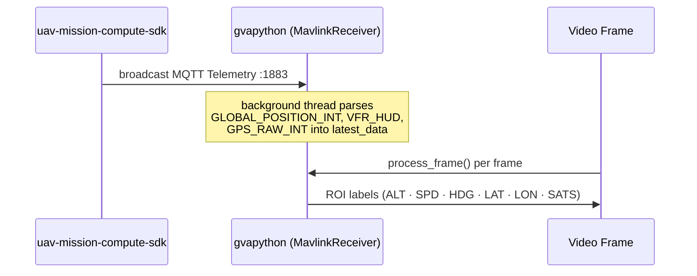

<!--
SPDX-FileCopyrightText: (C) 2026 Intel Corporation
SPDX-License-Identifier: Apache-2.0
-->


# Get Started (UAV Mission Compute SDK Mode)

This guide provides a step-by-step walkthrough for testing the UAV Vision Analytics application in UAV Mission Compute SDK mode and running the demo with a simulated UAV camera feed/RealSense cameras.

## How It Works

A minimal single-container stack. Telemetry is received via MQTT from the `uav-mission-compute-sdk` project, which must be started first. The DLSPS container reads armed/disarmed state from `uav/{id}/telemetry/status` and subscribes to three RTSP camera streams (nadir, forward, rear).


**Telemetry / pipeline lifecycle flow:**



**Services:**

| Service | Image | Ports | Role |
|---|---|---|---|
| `dlstreamer-pipeline-server` | `intel/dlstreamer-pipeline-server` | `8081`, `8555` | AI inference, RTSP output |

---

## Steps to Test the Application

### Prerequisites

- Docker and Docker Compose v2
- Intel platform with at least 16 GB RAM (Panther Lake recommended)
- Network access to pull Docker images (configure proxy if behind a corporate firewall)
- The following system packages:

```bash
sudo apt install -y python3.12-venv ffmpeg
```

> `python3.12-venv` is required by `make model` to create a Python virtual environment.
> `ffmpeg` provides `ffplay` for viewing the RTSP output stream and `ffmpeg` for recording.

### 1. Start the UAV Mission Compute SDK

Clone the repo and start the SDK's core infrastructure (PX4, MQTT broker, MediaMTX RTSP server).

```bash
git clone https://github.com/open-edge-platform/edge-ai-suites.git
cd edge-ai-suites/federal-and-aerospace-ai-suite/uav-mission-compute-sdk
make init                # create .env, detect GPU
```

> Follow only **Step 0** (configure credentials) and **Step 1+2** (`make up-sim-camera`) from the [get-started guide](../../../../uav-mission-compute-sdk/docs/user-guide/get-started.md) / [SDK README](../../../../uav-mission-compute-sdk/README.md). Do **not** run `make apps` (SDK Step 3) — that starts the SDK's own AI vision-processor and dashboard, which is not needed here since `uav-vision-analytics` runs its own inference via DLSPS.

The SDK's `.env` defaults to `HOST_IP=127.0.0.1`, which binds MQTT, RTSP, and all other published ports to loopback only. Since `uav-vision-analytics` runs in a separate Docker container/network, it cannot reach loopback-bound ports. Set the SDK's `.env` to bind on all interfaces before starting it:

```bash
sed -i 's|^HOST_IP=.*|HOST_IP=0.0.0.0|' .env
make up-sim-camera        # start PX4, MQTT, RTSP server
```

### 2. Configure environment

Get into the directory:

```bash
cd edge-ai-suites/federal-and-aerospace-ai-suite/uav-vision-analytics
```

```bash
make init
```

`make init` creates `.env` from the template and **auto-detects your Intel GPU device paths** (`GPU_DEVICE`, `GPU_RENDER_DEVICE`), **Intel NPU** (`NPU_DEVICE`), and **Intel RealSense / USB camera** (`REALSENSE_DEVICE`). It skips if `.env` already exists.

Then set your host IP address in `.env`:

```bash
nano .env   # set HOST_IP=<your-machine-IP>
```

### 3. Prepare the model

Download and export the YOLOv8n-VisDrone model to OpenVINO FP16 IR:

```bash
make model
```

> See the [AI Model guide](../how-to-guides/model.md) for model details.

### 4. Start the uav-vision-analytics application

The SDK's core infrastructure (step 1) must already be running.

```bash
cd edge-ai-suites/federal-and-aerospace-ai-suite/uav-vision-analytics
make uavsdk-up
```

### 5. Run a simple mission

> **Note:** Video streams are not available until the UAV is armed and actively on a mission.

Run the simple UAV mission in a persistent terminal window to keep the simulation active. The following sequence arms the UAV, commands a takeoff to 10 m, holds for 120 seconds, then lands:

```bash
curl -X POST http://localhost:8080/action/arm
curl -sf -X POST http://localhost:8080/action/takeoff \
  -H "Content-Type: application/json" \
  -d '{"altitude": 10}'
sleep 120
curl -X POST http://localhost:8080/action/land
```

### 6. Start inference pipelines

> Open a new terminal window and launch the inference pipeline to begin processing the video stream.

Two options are available depending on your use case:

#### Option A — Managed RTSP output (recommended)

Runs `pipeline_manager.py` inside the DLSPS container. It monitors the drone's ARMED/DISARMED state and automatically starts and stops inference pipelines. Annotated frames are served as RTSP on port `8555`.

`make start-rtsp` starts **one camera pipeline at a time** (default: GPU/forward camera). Pass `DEVICE=cpu|gpu|npu|all` to choose:

```bash
make start-rtsp                # GPU/forward only (default)
make start-rtsp DEVICE=cpu     # CPU/nadir only
make start-rtsp DEVICE=npu     # NPU/rear only
make start-rtsp DEVICE=all     # all three cameras simultaneously
```

> `DEVICE=npu` requires `NPU_DEVICE` to have been detected during `make init` — falls back to GPU otherwise.

**uav-mission-compute-sdk mode** — output streams (only the selected `DEVICE` is active, unless `DEVICE=all`; available after drone arms):
```text
rtsp://localhost:8555/nadir      (nadir camera, CPU)
rtsp://localhost:8555/forward    (forward camera, GPU)
rtsp://localhost:8555/rear       (rear camera, NPU)
```

#### Option B — Manual REST API

> **Note:** RTSP streams are not available until the UAV is armed. Run a simple mission first (see [Step 5: Run a simple mission](#5-run-a-simple-mission)).

Start a single camera pipeline directly. The UAVSDK mode loads `config-uavsdk.json` which defines the three camera-source pipelines (`nadir_camera_rtsp_cpu`, `forward_camera_rtsp_gpu`, `rear_camera_rtsp_npu`).

Once the source is confirmed live, start the pipeline:

```bash
# Start CPU pipeline (uav-mission-compute-sdk mode)
INSTANCE_ID=$(curl -s -X POST \
  http://localhost:8081/pipelines/user_defined_pipelines/nadir_camera_rtsp_cpu \
  -H "Content-Type: application/json" \
  -d '{
    "destination": {
      "metadata": {
        "type": "file",
        "path": "/tmp/results.jsonl",
        "format": "json-lines"
      },
      "frame": {
        "type": "rtsp",
        "path": "nadir"
      }
    },
    "parameters": {
      "detection-properties": {
        "model": "/home/pipeline-server/resources/models/yolov8n-visdrone/best_openvino_model/best.xml",
        "device": "CPU"
      }
    }
  }' | tr -d '"')
echo "Instance ID: $INSTANCE_ID"

# Verify it reached RUNNING state (not ERROR)
curl -s http://localhost:8081/pipelines/${INSTANCE_ID}/status | python3 -m json.tool
```

If `state` is `ERROR`, check the container logs:
```bash
docker logs dlstreamer-pipeline-server 2>&1 | tail -20
```
Change following **three values** to switch between CPU / GPU / NPU:
1. **Pipeline name** in the URL path (`nadir_camera_rtsp_cpu` → `forward_camera_rtsp_gpu` / `rear_camera_rtsp_npu`)
2. **RTSP path** in the request body (`nadir` → `forward` / `rear`)
3. **Device** in `detection-properties` (`CPU` → `GPU` / `NPU`)

Stop a pipeline:
```bash
curl -X DELETE http://localhost:8081/pipelines/${INSTANCE_ID}
```

### 7. View the output stream

#### View with ffplay

```bash
# View annotated RTSP output (install ffmpeg first if not present)
ffplay rtsp://localhost:8555/nadir               # nadir camera
ffplay rtsp://localhost:8555/forward               # forward camera
ffplay rtsp://localhost:8555/rear               # rearcamera
```

#### Capture all the video streams
Record all three streams to disk with `ffmpeg`:

```bash
ffmpeg \
  -rtsp_transport tcp -i rtsp://localhost:8555/nadir \
  -rtsp_transport tcp -i rtsp://localhost:8555/forward \
  -rtsp_transport tcp -i rtsp://localhost:8555/rear \
  -map 0:v -c:v copy nadir.mkv \
  -map 1:v -c:v copy forward.mkv \
  -map 2:v -c:v copy rear.mkv
```

The annotated stream includes bounding boxes for detected objects (person, car, bus, truck, van, bicycle, tricycle, awning-tricycle, motor, others) and a live telemetry overlay (GPS, altitude, speed, heading).

### 8. Stop all services

Stop and remove the uav-vision-analytics stack (also removes named volumes):

```bash
make uavsdk-down
```

Then stop the SDK's core infrastructure:

```bash
cd edge-ai-suites/federal-and-aerospace-ai-suite/uav-mission-compute-sdk
make down
```

---

## Pipelines

### UAV Mission Compute SDK Mode (`config-uavsdk.json`)

| Pipeline | Device | Source (inside Docker) | Output RTSP (host) |
|---|---|---|---|
| `nadir_camera_rtsp_cpu` | CPU | `rtsp://host.docker.internal:8554/uav-1/nadir` | `rtsp://<HOST_IP>:8555/nadir` |
| `forward_camera_rtsp_gpu` | GPU | `rtsp://host.docker.internal:8554/uav-1/forward` | `rtsp://<HOST_IP>:8555/forward` |
| `rear_camera_rtsp_npu` | NPU | `rtsp://host.docker.internal:8554/uav-1/rear` | `rtsp://<HOST_IP>:8555/rear` |

> `uav-1` in the source URL is the value of the `UAV_ID` environment variable (default: `uav-1`).
> Set a different value in `.env` if your SDK project uses a different vehicle ID.
> Also update the RTSP input URLs in `config-uavsdk.json` if you change the UAV ID.

All pipelines are `auto_start: false` — started explicitly via the pipeline managers (`make start-rtsp DEVICE=cpu|gpu|npu|all`) or the REST API directly.

REST endpoint: `POST http://localhost:8081/pipelines/user_defined_pipelines/{name}`

---

## Telemetry Overlay Fields

Each output frame carries these overlaid fields in the upper-left corner:

| Field | Source MAVLink message | Description |
|---|---|---|
| `Name` | — | Name passed as argument to the gvapython |
| `Frame` | — | Running frame counter |
| `ALT` | `GLOBAL_POSITION_INT.relative_alt` | Relative altitude (m) |
| `SPD` | `VFR_HUD.groundspeed` | Ground speed (m/s) |
| `HDG` | `GLOBAL_POSITION_INT.hdg` | Heading (degrees) |
| `LAT` | `GPS_RAW_INT.lat` | Latitude |
| `LON` | `GPS_RAW_INT.lon` | Longitude |
| `SATS` | `GPS_RAW_INT.satellites_visible` | GPS satellites visible |

---

## Port Reference

| Port | Protocol | Service | Mode |
|---|---|---|---|
| `8081` | HTTP | DL Streamer REST API | All modes |
| `8555` | RTSP | Annotated video output | All modes |

---

## Documentation

| Document | Description |
|---|---|
| [index.md](../index.md) | Application overview and component block diagrams |
| [realsense-guide.md](../how-to-guides/realsense-guide.md) | Intel RealSense camera setup and pipelines |
| [benchmark.md](../how-to-guides/benchmark.md) | Performance benchmarking guide (`calc_stream_density.sh`) |
| [makefile.md](../how-to-guides/makefile.md) | Makefile target reference |
| [troubleshooting.md](../how-to-guides/troubleshooting.md) | Known issues and resolutions |

