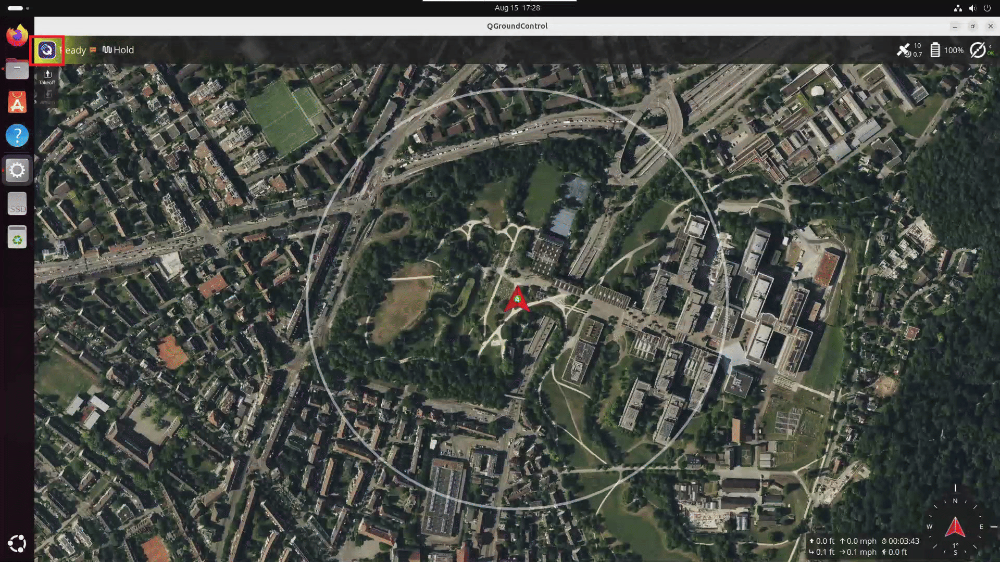

# QGroundControl

## Installation

Follow the instructions in the QGroundControl documentation to install
QGroundControl on your host machine where you are running the application.

- Stable v5.1: [Download and Install QGroundControl (Ubuntu)](https://docs.qgroundcontrol.com/Stable_V5.1/en/qgc-user-guide/getting_started/download_and_install.html#ubuntu)

> **Note:** If you run into connection or video-stream issues with the stable release, see
> [Troubleshooting: QGroundControl stable release fails to connect](./troubleshooting.md#qgroundcontrol-stable-release-fails-to-connect) for a fallback install option.

## Enabling video stream in QGroundControl

Steps to enable QGroundControl to connect to the UAV Vision Analytics application video stream.

### RTSP Stream

In QGroundControl, `Click on Left top Q icon` → `Settings` → `Video` → `Source`
→ `select "RTSP Video Stream"` in the dropdown. Then in RTSP URL enter the URL
for the desired pipeline.

URL for all three device pipelines (CPU/GPU/NPU):

```text
rtsp://<HOST_IP>:8555/uav-mavlink-cpu   # CPU
rtsp://<HOST_IP>:8555/uav-mavlink-gpu   # GPU
rtsp://<HOST_IP>:8555/uav-mavlink-npu   # NPU
```



> **Note:** Make sure `make start-rtsp` is running in the DLSPS container before
> attempting to connect QGroundControl to the RTSP stream.

## Troubleshooting

- [QGroundControl — "Network Not Available" warnings](./troubleshooting.md#qgroundcontrol--network-not-available-warnings)
