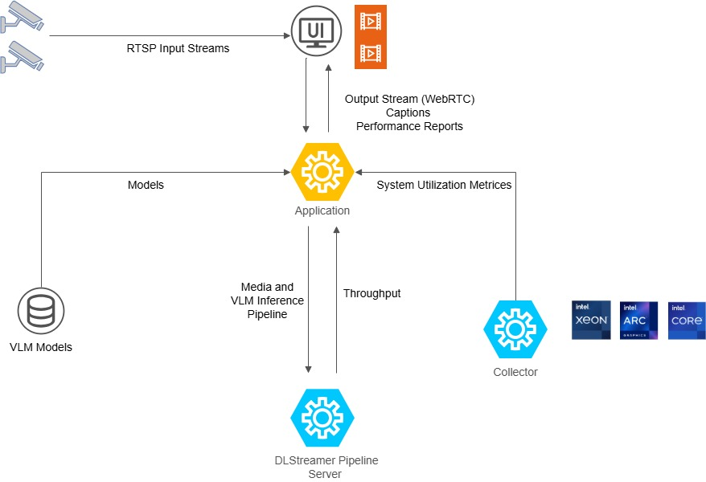

# How it Works

The stack ingests an RTSP stream, runs a DLStreamer pipeline that samples frames for VLM inference, and sends results to the dashboard.



## Data Flow

```
RTSP Source → dlstreamer-pipeline-server
            ├─→ 1fps AI branch (GStreamer gvagenai) → MQTT Broker
            └─→ 30fps preview → mediamtx (WebRTC) → Dashboard
                                                 ↓
                                  metrics-service streams metrics (CPU, GPU, RAM)
```

## System Components

- **dlstreamer-pipeline-server**: Intel DLStreamer Pipeline Server processing RTSP sources with GStreamer pipelines and `gvagenai` for VLM inference
- **mediamtx**: WebRTC/WHIP signaling server for video streaming
- **coturn**: TURN server for NAT traversal in WebRTC connections
- **app**: Python FastAPI backend serving REST APIs and SSE metadata streams
- **metrics-service**: Unified metrics collection, ingestion, and WebSocket relay (CPU, GPU, memory, power, temperature)

## Learn More

- [System Requirements](./get-started/system-requirements.md)
- [Get Started](./get-started.md)
- [API Reference](./api-reference.md)
- [Known Issues](./known-issues.md)
- [Release Notes](./release-notes.md)
