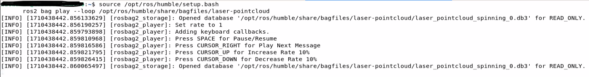
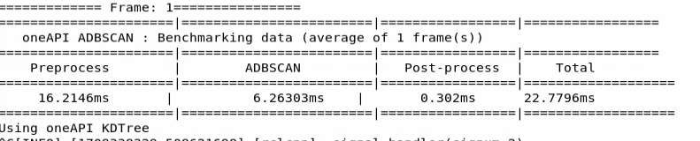
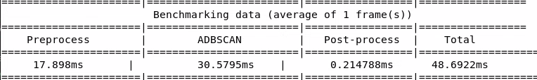

In this version of ADBSCAN, the algorithm has been optimized for Intel®
SOC by replacing linear neighbor point search with an optimized oneAPI™
PCL library (offloaded to GPU), as well as refactoring the clustering
algorithm. It has been tested and validated on 13th Generation Intel®
Core™ processors with Intel® Iris® X^e^ Integrated Graphics, 12th
Generation Intel® Core™ processors with Intel® Iris® X^e^ Integrated
Graphics and 11th Generation Intel® Core™ processors with Intel® Iris®
X^e^ Integrated Graphics. This tutorial describes how to run this
Intel-optimized ADBSCAN algorithm and compare the execution time with
the unoptimized version.

# Getting Started

The Intel-optimized and unoptimized versions of the algorithm are
distributed as `ros-humble-adbscan-oneapi` and
`ros-humble-adbscan-ros2`, respectively. We demonstrate the gain in
latency for a ROS 2 bag file with point cloud data from a Intel®
RealSense™ camera. The amount of gain is prominent when the input is
dense or the number of input points is large. In case of a 2D LIDAR, the
point cloud is comparatively sparse and hence, not showed here.

# Prerequisites

- [Prepare the target system](https://docs.openedgeplatform.intel.com/edge-ai-suites/robotics-ai-suite/main/robotics/gsg_robot/prepare-system.html)
- [Setup the Robotics AI Dev Kit APT Repositories](https://docs.openedgeplatform.intel.com/robotics-ai-suite/robotics-ai-suite/main/robotics/gsg_robot/apt-setup.html)
- [Install OpenVINO™ Packages](https://docs.openedgeplatform.intel.com/robotics-ai-suite/robotics-ai-suite/main/robotics/gsg_robot/install-openvino.html)
- [Install Robotics AI Dev Kit Deb packages](https://docs.openedgeplatform.intel.com/robotics-ai-suite/robotics-ai-suite/main/robotics/gsg_robot/install.html)
- [Install the Intel® NPU Driver on Intel® Core™ Ultra Processors (if applicable)](https://docs.openedgeplatform.intel.com/robotics-ai-suite/robotics-ai-suite/main/robotics/gsg_robot/install-npu-driver.html)

# Install and run the ROS 2 bag file Deb package

Install the following package with ROS 2 bag files in order to publish
point cloud data from LIDAR and Intel® RealSense™ camera:

> ``` bash
> sudo apt install ros-humble-bagfile-laser-pointcloud
> ```

Run the following commands in a terminal:

> ``` bash
> source /opt/ros/humble/setup.bash
> ros2 bag play --loop /opt/ros/humble/share/bagfiles/laser-pointcloud
> ```

This command will launch the ROS 2 bag file and publish the recorded
point cloud data to respective topics. You will view the following
screen output:

> 

`ros2 topic list` command will show a list of the published topics which
include `/scan` (point cloud from 2D LIDAR) and
`/camera/depth/color/points` (point cloud from Intel® RealSense™
camera).

# Install and run optimized Deb package

Install `ros-humble-adbscan-oneapi` Deb package from Intel® Robotics AI
Dev Kit APT repository:

> ``` bash
> sudo apt update
> sudo apt install ros-humble-adbscan-oneapi
> ```

Run the following command in a terminal:

> ``` bash
> source /opt/ros/humble/setup.bash
> ros2 run adbscan_ros2 adbscan_sub --ros-args --params-file /opt/ros/humble/share/adbscan_ros2/config/adbscan_sub_RS.yaml
> ```

This will print tables with the benchmarking data as showed below:

> 

The table shows a breakdown between pre-processing, ADBSCAN execution
and post-processing time. The caption at the bottom of the table will
print which PCL library is being used.

# Install and run standard (unoptimized) Deb package

Install `ros-humble-adbscan-ros2` Deb package from Intel® Robotics AI
Dev Kit APT repository

> ``` bash
> sudo apt update
> sudo apt install ros-humble-adbscan-ros2
> ```

Run the following command in a terminal

> ``` bash
> source /opt/ros/humble/setup.bash
> ros2 run adbscan_ros2 adbscan_sub --ros-args --params-file /opt/ros/humble/share/adbscan_ros2/config/adbscan_sub_RS.yaml
> ```

This will print a similar table with the benchmarking data.

> 

You will see that the ADBSCAN execution time is much smaller for the
optimized version compared to the standard one. The pre-processing and
post-processing time should be more or less of the same range in both
versions, since the input bag file is identical. The amount of gain in
execution time will depend on the system configuration, the size of the
point cloud data in the input frames etc. We observed an average gain of
\~5-8x in 13th Generation Intel® Core™ processors with Intel® Iris® X^e^
Integrated Graphics, 12th Generation Intel® Core™ processors with Intel®
Iris® X^e^ Integrated Graphics and 11th Generation Intel® Core™
processors with Intel® Iris® X^e^ Integrated Graphics for this specific
ROS 2 bag file.

# Re-configurable parameters

The optimized ADBSCAN has a user-defined parameter called
`oneapi_library` to choose from a set of PCL libraries: `oneapi_kdtree`,
`oneapi_octree`, `pcl_kdtree`. The default value is `oneapi_kdtree`.
Moreover, one can run both optimized and unoptimized packages with a
parameter called `benchmark_number_of_frames`. It will take an integer
(greater or equal to 1) as input and the benchmarking table will produce
the average execution time of `benchmark_number_of_frames` frames,
instead of a single frame (default value). For example, you can use the
following command to run the optimized ADBSCAN with `oneapi_octree`
library and display the benchmarking data for an average of 5 frames:

> ``` bash
> ros2 run adbscan_ros2 adbscan_sub --ros-args --params-file /opt/ros/humble/share/adbscan_ros2/config/adbscan_sub_RS.yaml  -p benchmark_number_of_frames:=5 -p oneapi_library:=oneapi_octree
> ```

A complete list of the reconfigurable parameters is given below:

> ------------------------------ --------------------------------------------------------
>   `Lidar_type`                   Type of the point cloud sensor. For Intel® RealSense™
>                                  camera and LIDAR inputs, the default value is set to
>                                  `RS` and `2D`, respectively.
>
>   `Lidar_topic`                  Name of the topic publishing point cloud data.
>
>   `Verbose`                      If this flag is set to `True`, the locations of the
>                                  detected target objects will be printed as the screen
>                                  log.
>
>   `subsample_ratio`              This is the downsampling rate of the original point
>                                  cloud data. Default value = 15 (i.e., every 15-th data
>                                  in the original point cloud is sampled and passed to the
>                                  core ADBSCAN algorithm).
>
>   `x_filter_back`                Point cloud data with x-coordinate \> `x_filter_back`
>                                  are filtered out (positive x direction lies in front of
>                                  the robot).
>
>   `y_filter_left`,               Point cloud data with y-coordinate \> `y_filter_left`
>   `y_filter_right`               and y-coordinate \< `y_filter_right` are filtered out
>                                  (positive y-direction is to the left of robot and vice
>                                  versa)\`\`
>
>   `z_filter`                     Point cloud data with z-coordinate \< `z_filter` will be
>                                  filtered out. This option will be ignored in case of 2D
>                                  Lidar.
>
>   `Z_based_ground_removal`       Filtering in the z-direction will be applied only if
>                                  this value is non-zero. This option will be ignored in
>                                  case of 2D Lidar.
>
>   `base`, `coeff_1`, `coeff_2`,  These are the coefficients used to calculate the
>   `scale_factor`                 adaptive parameters of the ADBSCAN algorithm. These
>                                  values are pre-computed and recommended to keep
>                                  unchanged.
>
>   `oneapi_library`               Available options are: `oneapi_kdtree`, `oneapi_octree`,
>                                  `pcl_kdtree`. `oneapi_kdtree` and `oneapi_octree` allow
>                                  the algorithm to use optimized oneAPI™ KdTree or octree
>                                  library and offload the neighbor point search method to
>                                  GPU. `pcl_kdtree` option uses the standard PCL KdTree
>                                  library, not optimized for Intel® SOC.
>
>   `benchmark_number_of_frames`   Any integer greater or equal to 1. This is the number of
>                                  frames over which the average execution time is executed
>                                  and printed in the benchmarking table.
>   ------------------------------ --------------------------------------------------------

# Troubleshooting

- Failed to install Deb package: Please make sure to run
  `sudo apt update` before installing the necessary Deb packages.

- You can stop the demo anytime by pressing `ctrl-C`.

- The screen log will show [number of points after
  subsampling]{.title-ref} and [number of points after
  filtering]{.title-ref}. If these values are zero, please make sure to
  adjust the following parameters to make sure these values are greater
  than zero.

  > - Decrease [subsample_ratio]{.title-ref}
  > - Increase the absolute values of [x_filter_back]{.title-ref},
  >   [y_filter_right]{.title-ref}, [y_filter_left]{.title-ref}. Please
  >   see the description of these parameters in the table and adjust
  >   according to your environment.

- IA-optimized ADBSCAN offloads the neighbor search to GPUs when using
  [oneapi_kdtree]{.title-ref} and [oneapi_octree]{.title-ref} library.
  Please make sure that your system is equipped with working gpu, if
  using these libraries. You can use [lspci]{.title-ref} command in a
  |Linux| terminal to view GPU info.

- `ros-humble-adbscan-ros2` and `ros-humble-adbscan-oneapi` are mutually
  exclusive Deb packages. Please refrain from installing them
  simultaneously like this
  `apt install ros-humble-adbscan-ros2 ros-humble-adbscan-oneapi`.
  Always install the packages sequentially, as showed in this document.

- Some newer 13th Generation Intel® Core™ and Intel® Core™ Ultra
  Processors may experience lower performance when the |Linux| kernel
  schedules the `adbscan_ros2` process to an efficient-core (E-core). To
  achieve better performance, you can utilize the `taskset` command to
  set the process\'s CPU affinity. For example, you can direct
  `adbscan_ros2` to run on CPU core 0 which is a performance-core
  (P-core).

  ``` bash
  source /opt/ros/humble/setup.bash
  taskset -c 0 ros2 run adbscan_ros2 adbscan_sub --ros-args --params-file /opt/ros/humble/share/adbscan_ros2/config/adbscan_sub_RS.yaml
  ```
