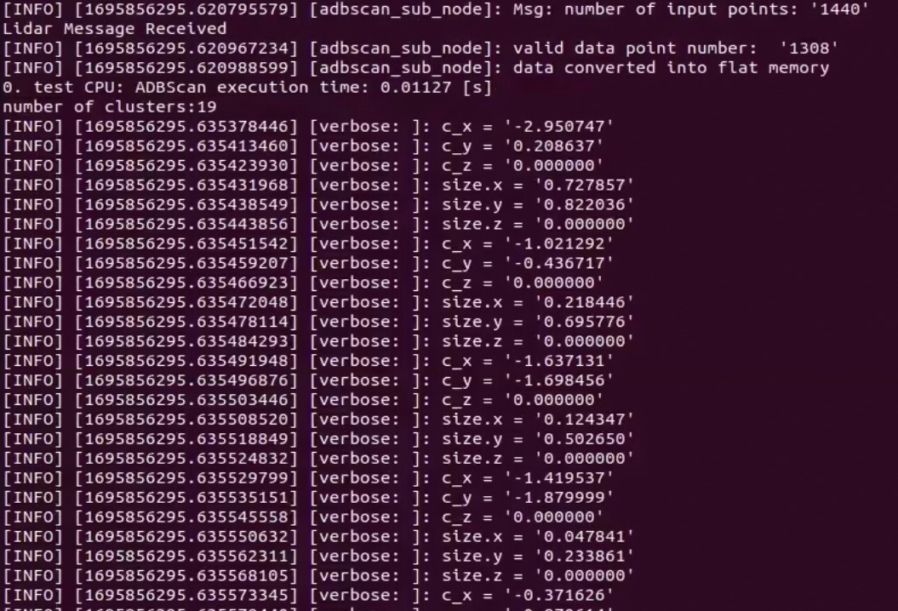
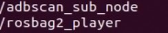

This tutorial describes how to run the ADBSCAN algorithm from Robotics
AI Dev Kit using 2D RPLIDAR input.

It outputs to the `obstacle_array` topic of type
`nav2_dynamic_msgs/ObstacleArray`.

# Prerequisites

- [Prepare the target system](https://docs.openedgeplatform.intel.com/edge-ai-suites/robotics-ai-suite/main/robotics/gsg_robot/prepare-system.html)
- [Setup the Robotics AI Dev Kit APT Repositories](https://docs.openedgeplatform.intel.com/robotics-ai-suite/robotics-ai-suite/main/robotics/gsg_robot/apt-setup.html)
- [Install OpenVINO™ Packages](https://docs.openedgeplatform.intel.com/robotics-ai-suite/robotics-ai-suite/main/robotics/gsg_robot/install-openvino.html)
- [Install Robotics AI Dev Kit Deb packages](https://docs.openedgeplatform.intel.com/robotics-ai-suite/robotics-ai-suite/main/robotics/gsg_robot/install.html)
- [Install the Intel® NPU Driver on Intel® Core™ Ultra Processors (if applicable)](https://docs.openedgeplatform.intel.com/robotics-ai-suite/robotics-ai-suite/main/robotics/gsg_robot/install-npu-driver.html)

# Install

Install `ros-humble-adbscan-ros2` Deb package from Intel® Robotics AI
Dev Kit APT repository

> ``` 
> sudo apt update
> sudo apt install ros-humble-adbscan-ros2
> ```

Install the following package with ROS 2 bag files in order to publish
point cloud data from 2D LIDAR or Intel® RealSense™ camera

> ``` 
> sudo apt install ros-humble-bagfile-laser-pointcloud
> ```

# Run the demo with 2D LIDAR

> ``` 
> sudo chmod +x /opt/ros/humble/share/adbscan_ros2/scripts/demo_lidar.sh
> /opt/ros/humble/share/adbscan_ros2/scripts/demo_lidar.sh
> ```

Expected output: ADBSCAN prints logs of its interpretation of the LIDAR
data coming from the ROS 2 bag.

> 

One can view the list of running ROS 2 nodes by typing `ros2 node list`
in a terminal.

> 
