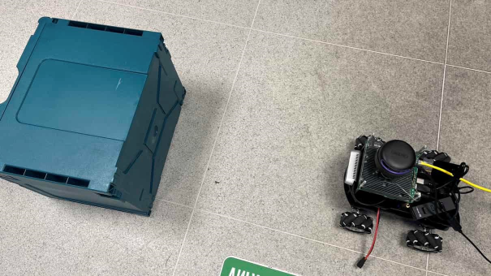
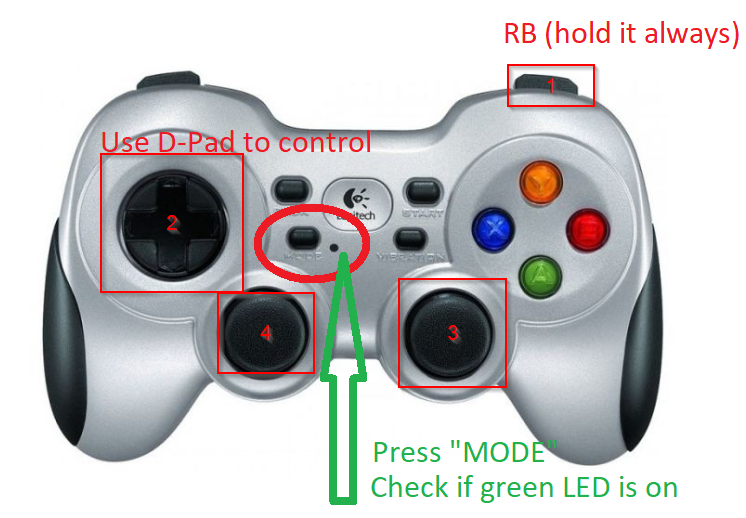
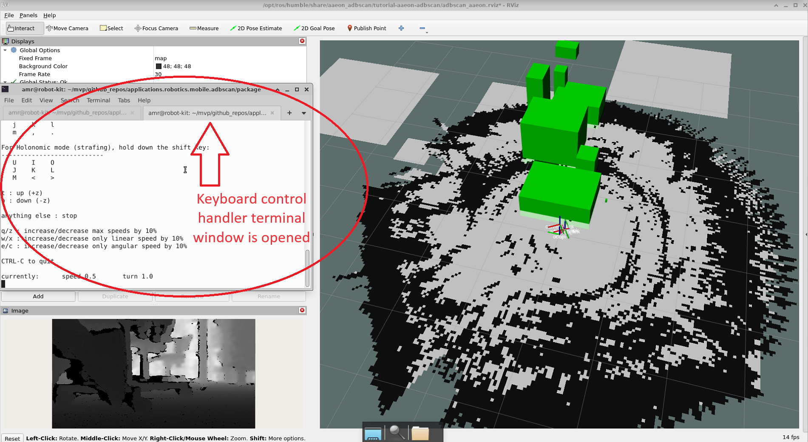
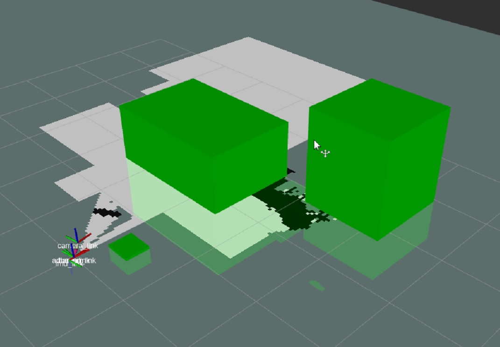
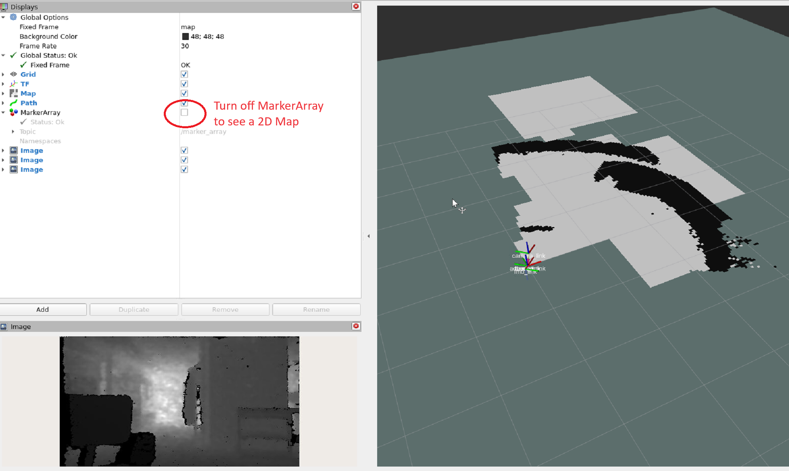
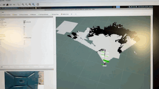
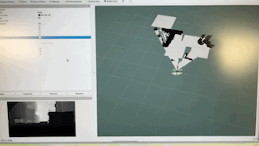

This tutorial describes how to run the ADBSCAN algorithm on the real
robot [UP Xtreme i11 AAEON Robot
Kit](https://up-shop.org/up-xtreme-i11-robotic-kit.html) using the
Intel® RealSense™ camera input. During the execution of the program the
ADBSCAN algorithm detects objects, and draws them in rviz. Then, the
FastMapping algorithm uses data from the ADBSCAN to generate a 2D Map of
the environment around. User can use the default setup to move robot via
gamepad or keyboard, so the 3D-camera on the robot can scan surroundings
around.

# Prerequisites

- Assemble your robotic kit following the instructions provided by
  AAEON.
- [Prepare the target system](https://docs.openedgeplatform.intel.com/edge-ai-suites/robotics-ai-suite/main/robotics/gsg_robot/prepare-system.html)
- [Setup the Robotics AI Dev Kit APT Repositories](https://docs.openedgeplatform.intel.com/robotics-ai-suite/robotics-ai-suite/main/robotics/gsg_robot/apt-setup.html)
- [Install OpenVINO™ Packages](https://docs.openedgeplatform.intel.com/robotics-ai-suite/robotics-ai-suite/main/robotics/gsg_robot/install-openvino.html)
- [Install Robotics AI Dev Kit Deb packages](https://docs.openedgeplatform.intel.com/robotics-ai-suite/robotics-ai-suite/main/robotics/gsg_robot/install.html)
- [Install the Intel® NPU Driver on Intel® Core™ Ultra Processors (if applicable)](https://docs.openedgeplatform.intel.com/robotics-ai-suite/robotics-ai-suite/main/robotics/gsg_robot/install-npu-driver.html)
- To control the robot remotely, you may need a Logitech\* F710 gamepad
  (to be purchased separately).

# Run the ADBSCAN Algorithm Using the AAEON Robot Kit

1.  To download and install the tutorial run the command below:

    ``` bash
    sudo apt-get install ros-humble-aaeon-adbscan-tutorial-common
    sudo apt-get install ros-humble-aaeon-adbscan-tutorial
    ```

2.  Please perform IMU calibration of the robot, launch script below:

    ``` bash
    source /opt/ros/humble/setup.bash
    /opt/ros/humble/share/ros2_amr_interface/scripts/calibration.sh
    ```

3.  Place the robot in front of an object and use one of the two methods
    described below to control the robot:

    

# Gamepad Robot Control Method

1.  Launch the ADBSCAN AAEON Robot gamepad control program:

    ``` bash
    sudo chmod a+rw /dev/input/js0
    sudo chmod a+rw /dev/input/event*
    ```

    ``` bash
    source /opt/ros/humble/setup.bash
    /opt/ros/humble/share/aaeon_adbscan/tutorial-aaeon-adbscan/aaeon_robot_with_adbscan_realsense_gamepad.sh
    ```

2.  Move the robot around using the gamepad:

    

    - Hold the **RB** button, then press the **Mode** button on the
      joystick.
    - The green LED near this button should illuminate.
    - Use the **D-pad** to control the robot\'s movement.

    

# Keyboard Robot Control Method

1.  Launch the ADBSCAN AAEON Robot keyboard control program:

    ``` bash
    source /opt/ros/humble/setup.bash
    /opt/ros/humble/share/aaeon_adbscan/tutorial-aaeon-adbscan/aaeon_robot_with_adbscan_realsense_keyboard.sh
    ```

2.  In a separate Terminal window launch keyboard control handler:

    ``` bash
    source /opt/ros/humble/setup.bash
    ros2 run teleop_twist_keyboard teleop_twist_keyboard
    ```

    The robot responds to your keyboard commands in these ways:

    - **i**: Move forward
    - **k**: Stop
    - **,**: Move backward
    - **j**: Turn right
    - **l**: Turn left
    - **q/z**: Increase/decrease max speeds by 10%
    - **w/x**: Increase/decrease only linear speed by 10%
    - **e/c**: Increase/decrease only angular speed by 10%
    - **L** or **J** (only for omnidirectional robots): Strafe (move
      sideways)
    - anything else: Stop
    - `Ctrl-c`: Quit

3.  Move the robot around using the keyboard buttons:

    

    To keep keyboard controls working keep second terminal window above
    other windows.

    

# Expected Results

1.  On the server rviz, you will see how ADBSCAN interprets the Intel®
    RealSense™ data based on real objects around the robot:

    - Green blocks indicate objects around.

      

    - Turn off MarkerArray in rviz to see a 2D Map generated by FastMapping.

      

2.  Default ADBSCAN view in the rviz window:

    

3.  Enable FastMapping 2D map view by turning off MakerArray check-box:

    

# Troubleshooting

For general robot issues, go to:
`../../../../dev_guide/tutorials_amr/robot-tutorials-troubleshooting`.
