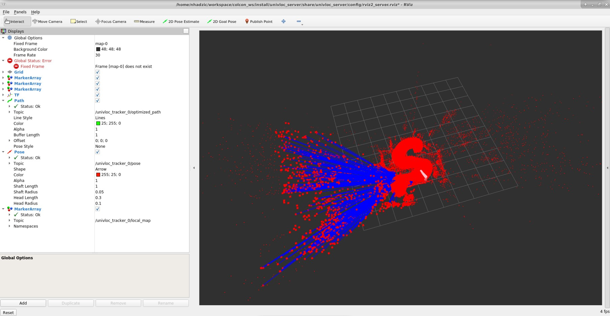

# Overview

This is a collaborative SLAM system. The main input should come from a camera, either monocular, or stereo, or RGB-D. It also supports wheel odometry, IMU and 2D LiDAR data as auxiliary input. The output include the estimated pose of the camera and visualization of the internal map. All inputs and outputs are in standard ROS formats.

There are four components:

- The tracker is a visual SLAM system with support for odometry, inertial and 2D LiDAR input. It estimates the camera pose in real-time, and maintains a local map. It can work as a standalone node. But if the server is online, it will communicate with the server to query and update the map.

- The server maintains the maps and communicates with all trackers. For each new keyframe from a tracker, it detects possible loops, both intra-map and inter-map. Once detected, the server will perform map optimization or map merging, and distribute the updated map to corresponding trackers.

- The msgs package defines the message between server and tracker.

- The slam package that contains the code of the SLAM algorithm.

Refer to [this paper](https://arxiv.org/abs/2102.03228) for more explanation of the system.

## Collab SLAM docker Run

The tracker and server are ROS programs. All the configurations are passed with ROS parameters. Check `tracker.launch.py` and `server.launch.py` for all available parameters and comments. For ROS2, parameters and launch file are separated and parameters are stored in `tracker.yaml`. There are ready-to-use configurations for RealSense D400-Series RGBD camera or the OpenLORIS-Scene dataset (`tracker.launch.py`), the TUM RGBD dataset (`tum_rgbd.launch.py`), the EuRoC dataset (`euroc_mono.launch.py` or `euroc_stereo.launch.py`), the KITTI dataset (`kitti_mono.launch.py` or `kitti_stereo.launch.py`).

Collaborative SLAM currently supports total 4 operating modes, including mapping, localization, remapping and relocalization modes. We provide `slam_mode` option for the tracker and `server_mode` option for the server to configure. The default values of these two options are "mapping" and a mismatch of the tracker and server modes may lead to unpredictable result. Currently, the relocalization mode is more for a developer or debugging use-case.

To run in the docker environment, you need to specify the path of the ORB vocabulary for both tracker and server node by adding the following line to the end of the commands used below.

```bash
vocabulary:=/home/eiforamr/workspace/CollabSLAM/prebuilt_collab_slam/univloc_tracker/share/univloc_tracker/config/orb_vocab.dbow2
```

**To support multi-robot or multi-camera or loop closure or map saving, launch univloc_server first; otherwise, only launching univloc_tracker is enough.**

```bash
# For stereo/rgbd/visual-inertial cases
ros2 launch univloc_server server.launch.py

# For monocular case
ros2 launch univloc_server server.launch.py fix_scale:=false
```

On each robot run the tracker node with unique ID:

```bash
# Please remember to replace <if_specific> and <unique_id> with your own setup
ros2 launch univloc_tracker tracker.launch.py camera:=<if_specific> publish_tf:=false queue_size:=0 ID:=<unique_id> rviz:=false gui:=false camera_fps:=30.0
```

If the server is on another machine, choose a domain ID between 0 and 101 (inclusive) and set `ROS_DOMAIN_ID` for both machines; remember to source environment setup file afterwards. See [ros2 offical doc](https://docs.ros.org/en/foxy/Concepts/About-Domain-ID.html) for a reference. The server will publish map elements on the topics of /univloc_server/{keypoints,keyframes}, which can be visualized in RViz.

## **Tracker example with a RealSense D400-Series RGBD camera**

```bash
source /home/eiforamr/workspace/CollabSLAM/install/setup.bash
# Please change the value of camera_fps that represents the real FPS of input camera images, the default value is 30.0 if you don't specify it
ros2 launch univloc_tracker tracker.launch.py camera:=camera get_camera_extrin_from_tf:=false pub_tf_child_frame:=camera_link camera_fps:=30.0
```

## **Run in localization mode**

In order to run the robot in the localization mode, the area needs to be mapped first. To map the area, run server and tracker with following commands:

```bash
# Server
ros2 launch univloc_server server.launch.py fix_scale:=true save_map_path:=/path_to_save_map.msg save_traj_folder:=/path_to_traj/

# Tracker
ros2 launch univloc_tracker tracker.launch.py publish_tf:=false queue_size:=0 rviz:=false gui:=false slam_mode:=mapping use_odom:=<true|false> camera_fps:=30.0
```

After mapping of the area is done, stop the execution of server and tracker. Run localization mode for saved map as follows:

```bash
# Server
ros2 launch univloc_server server.launch.py server_mode:=localization fix_scale:=true load_map_path:=/path_to_saved_map.msg

# Tracker:
ros2 launch univloc_tracker tracker.launch.py publish_tf:=true queue_size:=0 rviz:=false gui:=true slam_mode:=localization map_frame:=map-0 camera_fps:=30.0
```

To have better visualization effect, use the rviz started by the server node and add the topics shown in picture below.



## **Run in remapping mode**

For remapping mode, it targets to update the pre-constructed keyframe/landmark map and octree map in mapping mode. A manual 2D-region input from user is needed to identify which region of pre-constructed maps is pending to be updated. This remapping region is a quadrilateral and can be either convex or concave. Once you have a
pre-constructed keyframe/landmark map together with a octree map, you can load them in localization mode and visualize them through the server rviz. To determine the vertexes of your remapping region, you can first click on the **Publish Point** button in the top toolbar, then move your cursor to the point which you want to
select as the remapping region vertex, and finally click your mouse to publish it. To get the detailed coordinate value of such point, you can use below command:

```bash
# Subscribe to the published point
ros2 topic echo /clicked_point geometry_msgs/msg/PointStamped
```

After determining the remapping region, recommended commands to run the remapping mode are as follows:

```bash
# Tracker
ros2 launch univloc_tracker tracker.launch.py slam_mode:=remapping queue_size:=0 gui:=false rviz:=false octree_load_path:=/path_to_saved_octree_map/xx.bin enable_fast_mapping:=true octree_store_path:=/path_for_saving_updated_octree_map/xxx.bin

# Server
# Replace the server_remapping_region vertexes by your own
ros2 launch univloc_server server.launch.py server_mode:=remapping load_map_path:=/path_to_saved_keyframe_landmark_map/xx.msg server_remapping_region:="[P1.x, P1.y, ... , P4.x, P4.y]" save_map_path:=/path_for_saving_updated_keyframe_landmark_map/xxx.msg
```

### Documentation

For other documentations for Collaborative SLAM, you can refer to the markdown files under the same folder.

For enabling odometry and IMU data, you can refer to `use_odometry.md`, `use_imu.md`.

For enabling FastMapping that generates both a 3D Volumetric Map and a 2D Occupancy Grid (used for navigation), you can refer to `use_fast_mapping.md`.
