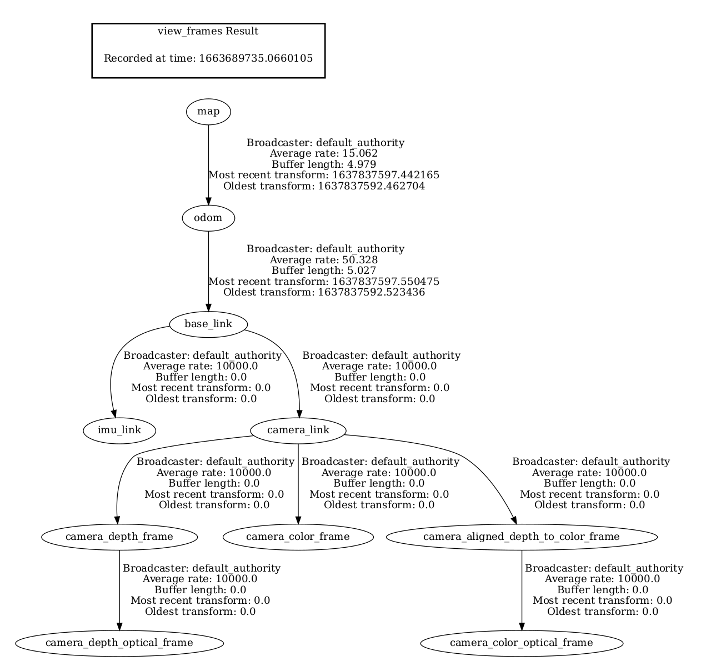

### Coordinate Definition in Collaborative SLAM


**Example TF Tree**

There are several assumptions: 
1) **odom_frame** will only appear on the tf tree when we set ```use_odom``` as true;
2) The system expects provided transform between 1) **base_link** and **camera_link**; 2) **base_link** and **imu_link**.
3) Before running the Collaborative SLAM, the **map_frame** should not appear on the tf tree. After running the SLAM system, we can get the transform between **map_frame** and **image_frame** (camera pose), and since we already know the transform between **odom_frame** (```use_odom``` as true) or **baselink_frame** (```use_odom``` as false) and **image_frame**, we can obtain the transform between **map_frame** and **odom_frame** or **baselink_frame**, which makes it possible to add **map_frame** onto the tf tree.




**Typical coodinates**

| Name in Example TF Tree    | Paramter       | Default Value | Description                                                                   |
|----------------------------|----------------|---------------|-------------------------------------------------------------------------------|
| map                        | map_frame      | map           | World coordinate (fixed, no drift)                                            |
| odom                       | odom_frame     | odom          | Odometry source coordinate (fixed, dirft in long term)                        |
| base_link                  | baselink_frame | base_link     | Robot base coordinate (odom->base_link measures the odometry data)            |
| camera_link                |                |               | Camera coordinate (typically has the same orientation as base_link)           |
| camera_color_optical_frame | image_frame    | "empty"       | Image plane coodinate (typically the orientation is different to camera_link) |
| imu_link                   | imu_frame      | d400_imu      | IMU coordinate                                                                |

Note that we can see two different frames shown in the figure - **camera_color_frame** and **camera_aligned_depth_to_color_frame**. It is because we enable the ```align_depth``` option when launching the RealSense node.

**Key concepts related to coordinate definition**

1. Extrinsic matrices used in the system
   - From **image_frame** to **base_link**: ```T_base_image```.
   - From **imu_frame** to **image_frame**: ```T_image_imu```. For more info about imu data, refer to [use_imu doc](use_imu.md)
   - From **odom_frame** to **image_frame**: ```T_image_odom```. For more info about odometry data, refer to [use_odometry doc](use_odometry.md)


2. Camera pose 
   - Note that when we talk about camera pose, we are actually referring to the transform from world coodinate to **image_frame**, rather than **camera_link**. Therefore, a more accurate way to represent camera pose is ```T_iw```;
   - For many SLAM systems (ORB-SLAM2, OpenVSLAM), they set the initial pose ```T_i1_w``` for the system as ```EigenMatrix4d::Identity()```, and for the pose of second frame, it can be calcuated as follows ```T_i2_w = T_i2_i1 * T_i1_w```;
   - For Collaborative SLAM, we set the initial pose ```T_i1_w``` for the system as ```T_i1_b``` (inverse transform of ```T_base_image``` above), and for the pose of second frame, it can be calculated as follows ```T_i2_w = T_i2_i1 * T_i1_w = T_i2_i1 * T_i1_b = T_i2_b```.


**Reference**
- For more coordinate definition illustrations, refer to [ROS REP 105](https://www.ros.org/reps/rep-0105.html#coordinate-frames)


