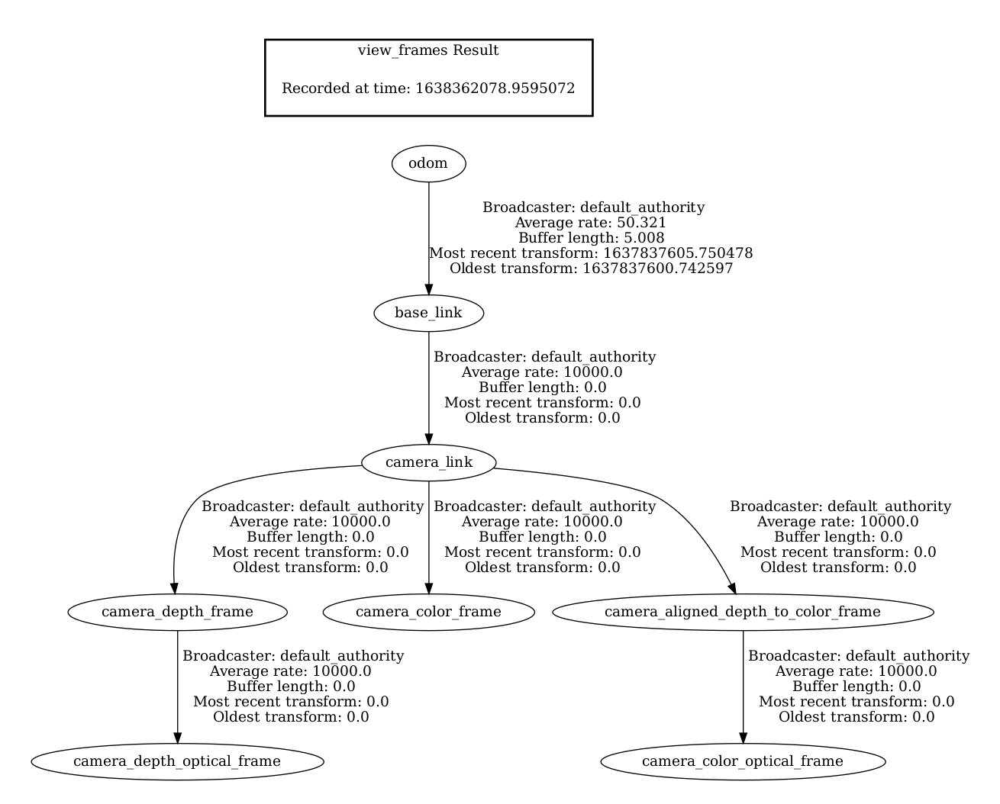

### Basic Logic using Odometry

**Odom Pipeline**
The overall idea of incorporating odometry data into our system is to use relative transform between frames based on odometry data to help the system estimate relative transform between frames. To achieve this, we first get the raw odometry data ```p1, p2, ..., p_n``` from tf tree for each frame, namely the transform from odom_frame to image_frame. Then we use the odom of the first frame ```p1``` as reference, and calculate the relative transform between each subsequent frame and reference frame using formula ```p_n1 = p_n*p1.inverse()```. Finally, the calculated relative transform can be used for robust tracking and optimization.


**Expected Behavior** In our implementation, we will only start tracking until we get valid odom. Also, we enable the switch between odom-based tracking and visual tracking seamlessly (only for RGBD/stereo input right now). For example, if there are too few features seen by the robot, the visual tracking might be lost, then we will only rely on odometry data to maintain tracking; when there are enough features as robot moves, the system will switch back to visual tracking. (For monocular input, we will only rely on odometry-based tracking once visual tracking is lost and will never switch back to visual tracking again.)


### Recommended TF Tree Structure

To properly get the odometry data, the following tf tree structure is recommended: ```odom->base_link->camera_link```.




### How to run the system with RGBD input and odometry data

```shell
# Tracker
# Please change the value of camera_fps that represents the real FPS of input camera images, the default value is 30.0 if you don't specify it
ros2 launch univloc_tracker tracker.launch.py camera_setup:=RGBD queue_size:=0 use_odom:=true odom_tf_query_timeout:=20.0 baselink_frame:=base_link image_frame:=camera_color_optical_frame publish_tf:=true pub_tf_parent_frame:=map pub_tf_child_frame:=odom rviz:=true camera_fps:=30.0

# Server
ros2 launch univloc_server server.launch.py fix_scale:=true

# Play rosbag
ros2 bag play xxx
```

Explanations for the flags:

1) Odom related:
- use_odom: set to true to use odometry data
- odom_tf_query_timeout (unit is millisecond): the bigger the number, the more likely that we can get odometry data from tf tree
- **Note** The odom_tf_query_timeout parameter will block RGBD image callback `odom_tf_query_timeout` long. So it is recommended to set the parameter to slightly larger than the time period of odometry tf publisher. For example, if the published odometry transform on tf tree is at 50Hz, then this parameter is recommended to be 25ms (> time period 20ms).
- **Note** The tracker node also has the odom_buffer_query_timeout parameter to determine the odometry buffer querying timeout in tracking module. We can wait longer than the time in the RGBD image callback since we have an internal buffer to store the odometry transform from tf tree, then we can have more opportunity to get nearby odometry info to increase the tracking accuracy in tracking module.

2) Frame related:
- baselink_frame: default is base_link
- image_frame (important): set the frame id for RGB stream
- odom_frame (important): default is odom
- **Note** Please refer to [coordinate definition doc](coordinate_definition.md) for more information.

3) Publish_tf related:
- publish_tf: set to true to enable the use of following two flags
- pub_tf_parent_frame (optional, default is map): set to map, which is the origin of SLAM system
- pub_tf_child_frame (important, default uses **image_frame**): please set to the same as **odom_frame**, in this way it will publish the transform between **map_frame** and **odom_frame** onto the tf tree; otherwise, it will publish the transform between **map_frame** and **image_frame** onto the tf tree using the default config, in some cases (i.e. the SLAM pose output frequency is low), it will prevent getting odom data properly from the tf tree.
