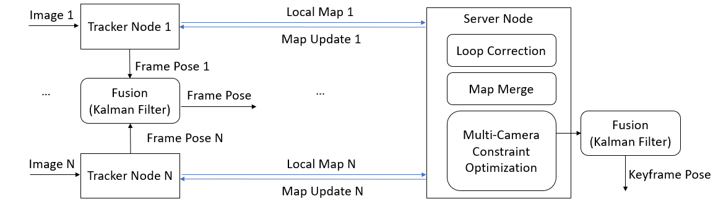

### Tracker Frame-Level Pose Trajectory Fusion using Kalman Filter


**Overall logic**
This doc illustrates part of the multi-camera feature in Collaborative SLAM. As shown in the left part of the figure below, we use Kalman Filter to fuse SLAM poses from different trackers in a loosely-coupled manner, and we treat each individual camera as a separate tracker (ROS2 node). For other parts of the multi-camera feature, they are not yet ready and will be integrated later. 




**Expected Behavior**
For the current implementation, we used two cameras (i.e. front and rear cameras) in a single robot and one Kalman Filter ROS2 node (robot_localization package) to generate the final fused pose trajectory. Since we haven't finished developing multi-camera feature, the performance is not optimal, for example, if one tracker loses tracking, it is difficult to get back to normal tracking and produce pose output for Kalman Filter unless it relocalizes itself in the local map. This will be improved after finishing the complete version of multi-camera feature.


### Prerequisite

First, clone and build robot localization package. Since I used bag files while developing feature, the default version of robot localization package has issue (maybe live test doesn't have this issue, need to confirm). So I choose to manually build it from source. You could find the patch file inside the current folder [robot_localization.patch](robot_localization.patch).
```
git clone https://github.com/cra-ros-pkg/robot_localization
cd robot_localization
# commid id is a9c96ebc245575adc06cea4dad5578a3ca3bdb02
git checkout foxy-devel
git apply robot_localization.patch
```

Second, make sure that at least two RealSense cameras (front and rear cameras) are launched properly. For Pengo robot, by default it has four cameras facing four directions. You could refer to the doc about [record bag for multiple cameras](https://intel.sharepoint.com/sites/IOTGATIEIASW/_layouts/15/Doc.aspx?sourcedoc={769afa91-dc77-4972-bc6a-beff70d06bfc}&action=edit&wd=target%28Multi-Camera.one%7Cfdb027af-8428-49d7-88fe-93f3f52cb743%2FRecord%20Bag%20for%20Multiple%20Cameras%7C3aadd5d9-bb3d-482b-ace3-ce0a9fe32911%2F%29&wdorigin=NavigationUrl) for more information. After launching the cameras, you need to check the following items are correct:

- Topic names for the 2 cameras (front camera use *camera1* and rear camera use *camera3* as prefix)
- TF tree
  - odom->base_link is published
  - TF frame names for the 2 cameras (front camera use *camera1* and rear camera use *camera3* as prefix)
  - for base_link->camera1_link and base_link->camera3_link, check the static transform publishers in the section below

### How to run

You could find the yaml file for robot localization package inside the current folder [ukf_config_two_camera.yaml](ukf_config_two_camera.yaml).

```shell
# publish static transform for front camera, the values are set for Pengo robot
ros2 run tf2_ros static_transform_publisher 0.17 0 0.14 0 0 0 base_link camera1_link --ros-args -p use_sim_time:=true

# publish static transform for rear camera, the values are set for Pengo robot
ros2 run tf2_ros static_transform_publisher -0.17 0 0.14 3.14159265 0 0 base_link camera3_link --ros-args -p use_sim_time:=true

# launch node for kalman filter
ros2 run robot_localization ukf_node --ros-args --params-file ./path_to_config/ukf_config_two_camera.yaml

# launch tracker node for front camera
ros2 launch univloc_tracker tracker.launch.py queue_size:=0 gui:=false publish_tf:=false camera:=camera1 image_frame:=camera1_color_optical_frame rviz:=true camera_fps:=5.0 odom_tf_query_timeout:=50.0 use_odom:=true get_camera_extrin_from_tf:=true ID:=0 need_covariance:=true

# launch tracker node for rear camera
ros2 launch univloc_tracker tracker.launch.py queue_size:=0 gui:=false publish_tf:=false camera:=camera3 image_frame:=camera3_color_optical_frame rviz:=true camera_fps:=5.0 odom_tf_query_timeout:=50.0 use_odom:=true get_camera_extrin_from_tf:=true ID:=2 need_covariance:=true

# play ros2 bag or live testing
ros2 bag play xxx
```

Then you should be able to get the fused pose trajectory from ```/odometry/filtered``` topic published by robot_localization package.