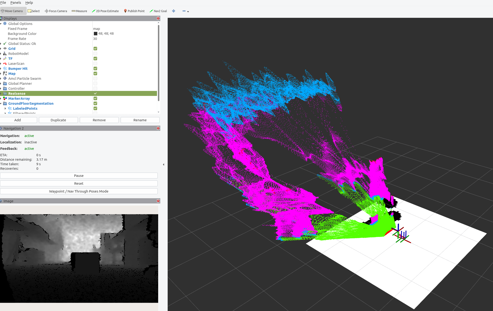
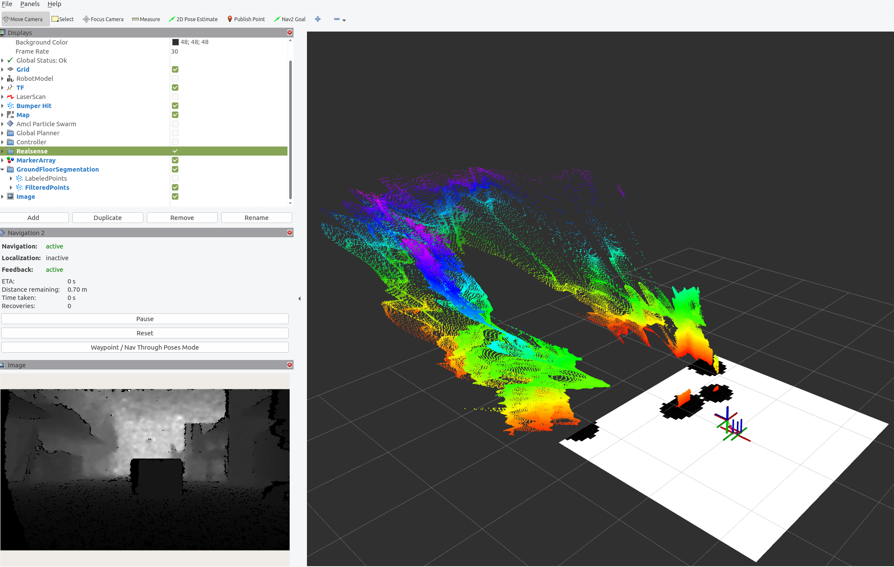
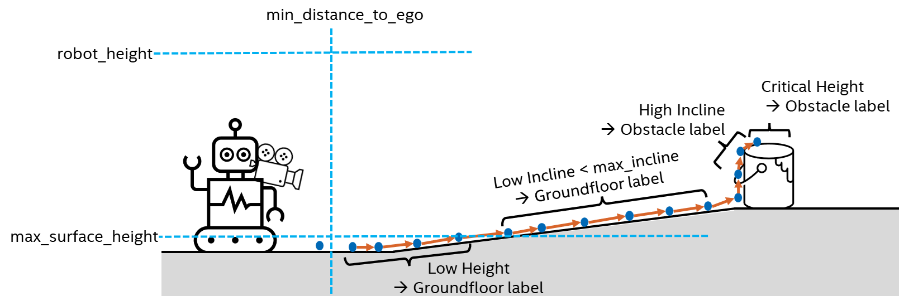

This demo showcases an Intel® algorithm designed for the segmentation of
depth sensor data, compatible with 3D LiDAR or a Intel® RealSense™
camera inputs. The application processes either a 3D pointcloud or a
depth image, producing a refined 3D pointcloud as output. Each endpoint
within this pointcloud is classified, distinguishing between ground
floor, elevated surfaces, obstacles and structures above ground level.

The algorithm addresses situations like non-flat floors, ramps,
inclines, declines, overhanging loads and other challenging conditions.
Its capabilities extend beyond standard segmentation approaches, making
it suited for diverse scenarios.

This tutorial guides users on running the algorithm from Robotics AI Dev
Kit using either a 3D LiDAR or a Intel® RealSense™ camera input,
generating `segmentation/labeled_points` and
`segmentation/obstacle_points` topic of type `sensor_msgs/PointCloud2`.
The first output topic assigns labels (ground, elevated, obstacle or
above the roof) to points within the sensor\'s 3D pointcloud. The second
topic provides a reduced pointcloud containing only points labeled as
obstacles.

# Source Code

The source code of this component can be found here:
[Groundfloor](https://github.com/open-edge-platform/edge-ai-suites/tree/main/robotics-ai-suite/components/groundfloor)

# Getting Started

Robotics AI Dev Kit provides a ROS 2 Deb package for the application,
supported by the following platform:

- OS: Ubuntu 22.04 LTS
- ROS version: humble

## Prerequisites

- [Prepare the target system](https://docs.openedgeplatform.intel.com/edge-ai-suites/robotics-ai-suite/main/robotics/gsg_robot/prepare-system.html)
- [Setup the Robotics AI Dev Kit APT Repositories](https://docs.openedgeplatform.intel.com/robotics-ai-suite/robotics-ai-suite/main/robotics/gsg_robot/apt-setup.html)
- [Install OpenVINO™ Packages](https://docs.openedgeplatform.intel.com/robotics-ai-suite/robotics-ai-suite/main/robotics/gsg_robot/install-openvino.html)
- [Install Robotics AI Dev Kit Deb packages](https://docs.openedgeplatform.intel.com/robotics-ai-suite/robotics-ai-suite/main/robotics/gsg_robot/install.html)
- [Install the Intel® NPU Driver on Intel® Core™ Ultra Processors (if applicable)](https://docs.openedgeplatform.intel.com/robotics-ai-suite/robotics-ai-suite/main/robotics/gsg_robot/install-npu-driver.html)

## Install Deb package

Install `ros-humble-pointcloud-groundfloor-segmentation` Deb package
from Intel® Robotics AI Dev Kit APT repository

> ``` bash
> sudo apt update
> sudo apt install ros-humble-pointcloud-groundfloor-segmentation
> ```

# Run the Segmentation with Intel® RealSense™ Camera Input

Execute the following command to run the demo using a Intel® RealSense™
camera input, after starting the Intel® RealSense™ ROS 2 node.

> ``` bash
> source /opt/ros/humble/setup.bash
> ros2 launch pointcloud_groundfloor_segmentation realsense_groundfloor_segmentation_launch.py
> ```

One can view the list of running ROS 2 topics by typing
`ros2 topic list` in a terminal.

> ``` console
> /camera/depth/camera_info
> /camera/depth/image_rect_raw
> /parameter_events
> /rosout
> /segmentation/labeled_points
> /segmentation/obstacle_points
> /tf
> /tf_static
> ```

> [!NOTE]
> Your topic list may differ, if you use additional ROS 2 nodes or other
> camera settings.

The ROS 2 launch file provides additional arguments, for example to run
the ROS 2 node only together with a camera, or with rviz. These can be
activated as follows:

Terminal 1:

    ``` bash
    source /opt/ros/humble/setup.bash
    ros2 launch realsense2_camera rs_launch.py enable_infra1:=true align_depth.enable:=true enable_sync:=true init_reset:=true pointcloud.enable:=true camera_namespace:=/
    ```

Terminal 2:

    ``` bash
    source /opt/ros/humble/setup.bash
    ros2 launch pointcloud_groundfloor_segmentation realsense_groundfloor_segmentation_launch.py with_rviz:=True standalone:=True
    ```

The commandline option \'-s\' will show all available flags.

In case of the standalone execution, the rviz view for the labeled
pointcloud should look as follows:

> 

In case of the standalone execution, the rviz view for the filtered
pointcloud should look as follows:

> 

# Run the Segmentation with a 3D LiDAR sensor

Execute the following script to run the demo if a given pointcloud, for
example from a 3D LiDAR sensor should be segmented.

> ``` bash
> source /opt/ros/humble/setup.bash
> ros2 launch pointcloud_groundfloor_segmentation pointcloud_groundfloor_segmentation_launch.py
> ```

One can view the list of running ROS 2 topics by typing
`ros2 topic list` in a terminal.

> ``` console
> /input/points
> /parameter_events
> /pseudo_camera/depth/camera_info
> /pseudo_camera/depth/image_rect_raw
> /rosout
> /segmentation/labeled_points
> /segmentation/obstacle_points
> /tf
> /tf_static
> ```

> [!NOTE]
> Your topic list may differ, if you use additional ROS 2 nodes or other
> camera settings.

The LiDAR node, that needs to be started in parallel, has to provide the
topic `/input/points` otherwise the topic has to be remapped.

# Run the Segmentation Algorithm with the Teleop Application

This use case is intended for the teleop application running on the
Aaeon robot, as described on page
`../developer_kit/robot-keyboard-teleop`{.interpreted-text role="doc"}.
It leverages the similar functionality of the default teleop
application. Therefore, please prepare the robot accordingly and start
all required applications.

Afterwards open three terminal sessions:

Terminal 1: Run the following commands to establish a TF link between robot and camera:

    ``` bash
    source /opt/ros/humble/setup.bash
    ros2 run tf2_ros static_transform_publisher 0 0 0.1 0 0 0 1 /base_link /camera_link
    ```

Terminal 2: Run the following commands to establish a TF link between robot and map:

    ``` bash
    source /opt/ros/humble/setup.bash
    ros2 run tf2_ros static_transform_publisher 0 0 0 0 0 0 1 /map /odom
    ```

Terminal 3: Run the segmentation application with Intel® RealSense™ camera input:

    ``` bash
    source /opt/ros/humble/setup.bash
    ros2 launch pointcloud_groundfloor_segmentation realsense_groundfloor_segmentation_launch.py with_rviz:=True
    ```

# Adjusting Application Parameters

The ROS 2 node supports a set of parameters, that can be found under:

> ``` bash
> /opt/ros/humble/share/pointcloud_groundfloor_segmentation/params/
> ```

There is one example configuration how the application\'s output can be
used for the ROS 2 nav2 application, and a second file providing
parameter values for the segmentation task. These include:

- `base_frame`:

      This is the ROS 2 TF frame that the underlying algorithm operates
      on. The default value is `base_link`. There must be a complete
      transform between the sensor frame and this `base_frame`.

- `use_best_effort_qos`:

      Defines if `best_effort` QoS should be used. By default `reliable`
      is used.

- `sensor.name`:

      Name of the connected sensor e.g. camera or realsense_camera. The
      default is `camera`. This is the prefix of the input topic, e.g.
      /camera/depth/image_rect_raw.

- `sensor.max_surface_height`:

      The maximum height of a perfectly flat groundfloor. Default value
      is 0.05 meter. If no incline is detected, measurements higher than
      this value will be flagged as `obstacle`.

- `sensor.min_distance_to_ego`:

      Sensor measurements closer than this value are ignored during
      processing. Default value is 0.4 meter.

- `sensor.max_incline`:

      The maximum allowed incline (or decline) of a ramp on the
      groundfloor. If an incline above this value is detected, the
      corresponding points will no longer receive the label
      `groundfloor`. The default value is 15 degrees.

- `sensor.robot_height`:

      Measurements above this value do not impose a collision risk for
      the robot and will be flagged as `above`. The default value is 2.0
      meter.

An example illustrating these parameters is provided in the image below:

> 

# Requirements

To achieve optimal output quality, it is essential to fulfill following
requirements:

- The input sensor should be forward facing, ideally in parallel to the
  groundfloor.
- The ROS 2 TF tree between `base_frame` and the sensor frame must be
  complete.
- Satisfactory input data quality is crucial. Incomplete depth images or
  pointclouds may result in incorrect labels.

# Troubleshooting

- Failed to install Deb package: Please make sure to run
  `sudo apt update` before installing the necessary Deb packages.
- You can stop the demo anytime by pressing `ctrl-C`.
- The quality of the segmentation and labeling depends on the quality of
  the input data. Noisy data, especially major outliers could result in
  wrong labels. If this is the case, the input data should be
  pre-processed to reduce noise.
