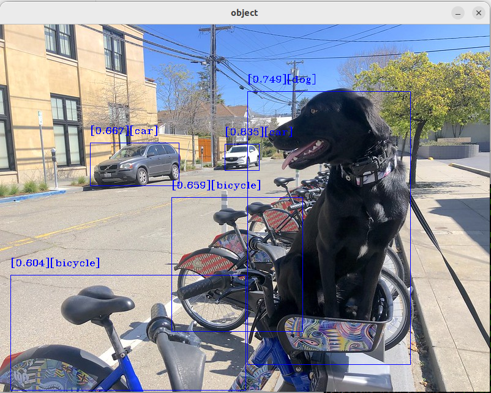

This tutorial is an example for understanding the utilization of the ROS
2 OpenVINO™ node. It outlines the steps for installing the node and
executing the object detection model. Object detection is performed
using the OpenVINO™ toolkit. The node is configured to accept
dynamically device parameters (NPU, GPU, or CPU) to specify which
inference engine should be used.

# Source Code

The source code of this component can be found here:
[Object-Detection](https://github.com/open-edge-platform/edge-ai-suites/tree/main/robotics-ai-suite/components/object-detection)


# Prerequisites

- [Prepare the target system](https://docs.openedgeplatform.intel.com/edge-ai-suites/robotics-ai-suite/main/robotics/gsg_robot/prepare-system.html)
- [Setup the Robotics AI Dev Kit APT Repositories](https://docs.openedgeplatform.intel.com/robotics-ai-suite/robotics-ai-suite/main/robotics/gsg_robot/apt-setup.html)
- [Install OpenVINO™ Packages](https://docs.openedgeplatform.intel.com/robotics-ai-suite/robotics-ai-suite/main/robotics/gsg_robot/install-openvino.html)
- [Install Robotics AI Dev Kit Deb packages](https://docs.openedgeplatform.intel.com/robotics-ai-suite/robotics-ai-suite/main/robotics/gsg_robot/install.html)
- [Install the Intel® NPU Driver on Intel® Core™ Ultra Processors (if applicable)](https://docs.openedgeplatform.intel.com/robotics-ai-suite/robotics-ai-suite/main/robotics/gsg_robot/install-npu-driver.html)

# Install OpenVINO™ tutorial packages

``` bash
sudo apt install ros-humble-object-detection-tutorial
```

# Run Demo with Image Input

Run one of the following commands to launch the object detection node
with a specific inference engine:

- GPU inference engine

  ``` bash
  ros2 launch object_detection_tutorial openvino_object_detection.launch.py device:=GPU
  ```

- CPU inference engine

  ``` bash
  ros2 launch object_detection_tutorial openvino_object_detection.launch.py device:=CPU
  ```

- NPU inference engine

  ``` bash
  ros2 launch object_detection_tutorial openvino_object_detection.launch.py device:=NPU
  ```

> [!NOTE]
> If no device is specified, the GPU is selected by default as an
> inference engine.

Once the tutorial is started, the `mobilenetssd` model is downloaded,
converted into IR files, and the inference process begins.

# Expected Output



To close this application, type `Ctrl-c` in the terminal where you ran
the launch script.
