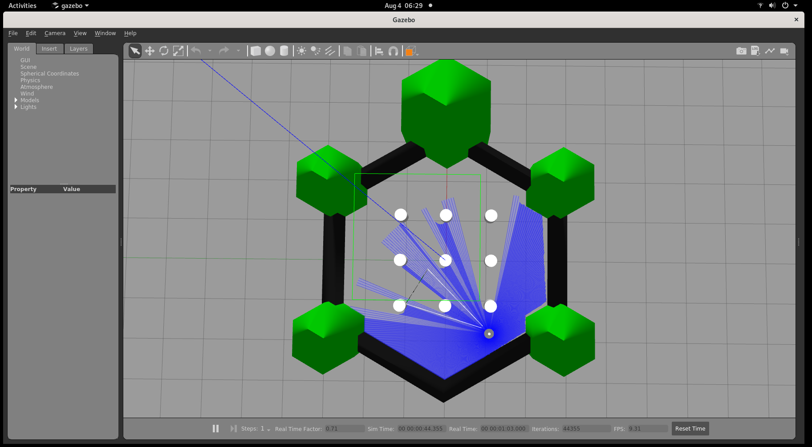
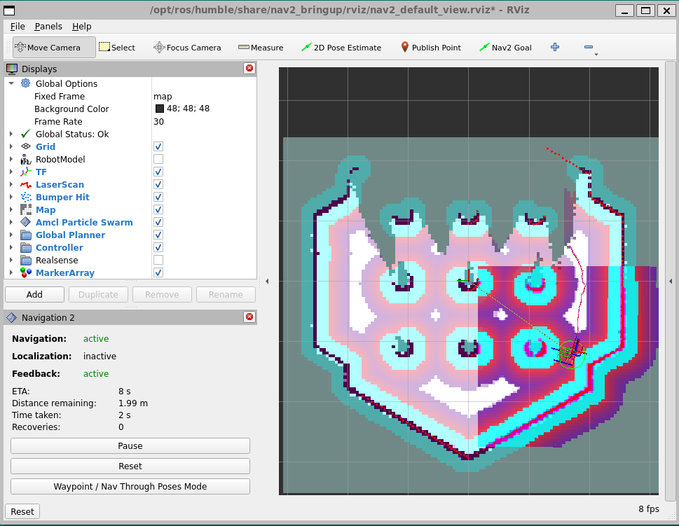

This tutorial shows a TurtleBot3 Waffle performing autonomous mapping of
a TurtleBot3 world in Gazebo simulation. For more information about
TurtleBot3 Waffle, see
[this](https://emanual.robotis.com/docs/en/platform/turtlebot3/simulation/#gazebo-simulation).

# Prerequisites

- [Prepare the target system](https://docs.openedgeplatform.intel.com/edge-ai-suites/robotics-ai-suite/main/robotics/gsg_robot/prepare-system.html)
- [Setup the Robotics AI Dev Kit APT Repositories](https://docs.openedgeplatform.intel.com/robotics-ai-suite/robotics-ai-suite/main/robotics/gsg_robot/apt-setup.html)
- [Install OpenVINO™ Packages](https://docs.openedgeplatform.intel.com/robotics-ai-suite/robotics-ai-suite/main/robotics/gsg_robot/install-openvino.html)
- [Install Robotics AI Dev Kit Deb packages](https://docs.openedgeplatform.intel.com/robotics-ai-suite/robotics-ai-suite/main/robotics/gsg_robot/install.html)
- [Install the Intel® NPU Driver on Intel® Core™ Ultra Processors (if applicable)](https://docs.openedgeplatform.intel.com/robotics-ai-suite/robotics-ai-suite/main/robotics/gsg_robot/install-npu-driver.html)

# Run the Sample Application

1.  If your system has an Intel® GPU, follow the steps in the
    `/robotics/gsg_robot/index`{.interpreted-text role="doc"} to enable
    the GPU for simulation. This step improves Gazebo\* simulation
    performance.

2.  Install the Wandering Gazebo tutorial:

    ``` bash
    sudo apt-get install ros-humble-wandering-gazebo-tutorial
    ```

3.  Execute the command below to start the tutorial:

    ``` bash
    ros2 launch wandering_gazebo_tutorial wandering_gazebo.launch.py
    ```

    **Expected output:**

    Gazebo\* client, rviz2 and RTAB-Map applications start and the robot
    starts wandering inside the simulation. See the simulation snapshot:

    

    Rviz2 shows the mapped area and the position of the robot:

    

    To enhance performance, set the real-time update to 0 by following
    the steps below:

    a.  In Gazebo\*\'s left panel, go to the **World** Tab, and click
        **Physics**.
    b.  Change the real time update rate to 0.

4.  To conclude, use `Ctrl-c` in the terminal where you are executing
    the command.

# Troubleshooting

For general robot issues, go to: [Troubleshooting for Robotics AI Dev Kit Tutorials](https://docs.openedgeplatform.intel.com/edge-ai-suites/robotics-ai-suite/main/robotics/dev_guide/tutorials_amr/robot-tutorials-troubleshooting.html)
