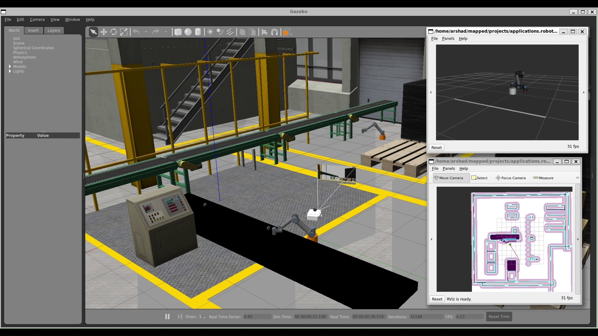
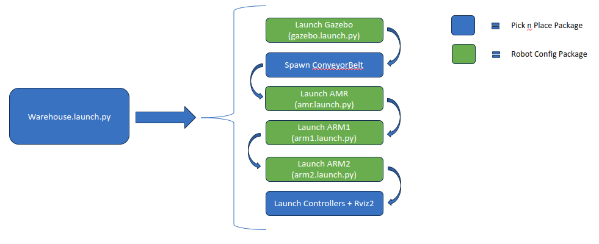

This Pick-n-Place demo is a simulation implemented using ROS 2 Humble
and Gazebo Classic. The project showcases the interaction of a conveyor
belt, a TurtleBot3 Autonomous Mobile Robot (AMR), and two UR5 robotic
arms (ARM) in a simulated environment. The aim is to harness the
capabilities of both the Nav2 and MoveIt2 stacks, presenting a
comprehensive demonstration of multi-robot coordination in a simulation
environment.



# Getting Started

## Prerequisites

- [Prepare the target system](https://docs.openedgeplatform.intel.com/edge-ai-suites/robotics-ai-suite/main/robotics/gsg_robot/prepare-system.html)
- [Setup the Robotics AI Dev Kit APT Repositories](https://docs.openedgeplatform.intel.com/robotics-ai-suite/robotics-ai-suite/main/robotics/gsg_robot/apt-setup.html)
- [Install OpenVINO™ Packages](https://docs.openedgeplatform.intel.com/robotics-ai-suite/robotics-ai-suite/main/robotics/gsg_robot/install-openvino.html)
- [Install Robotics AI Dev Kit Deb packages](https://docs.openedgeplatform.intel.com/robotics-ai-suite/robotics-ai-suite/main/robotics/gsg_robot/install.html)
- [Install the Intel® NPU Driver on Intel® Core™ Ultra Processors (if applicable)](https://docs.openedgeplatform.intel.com/robotics-ai-suite/robotics-ai-suite/main/robotics/gsg_robot/install-npu-driver.html)

## Install Debian Package

Install `ros-humble-picknplace-simulation` Debian package from Intel®
Robotics AI Dev Kit APT repository.

> ``` 
> sudo apt update
> sudo apt install ros-humble-picknplace-simulation
> ```

# Run Demo

> ``` bash
> source /opt/ros/humble/setup.bash
> ros2 launch picknplace warehouse.launch.py
> ```

FastDDS as backend some times causing stability issues. Recommended to
run with cyclone DDS.

> ``` bash
> RMW_IMPLEMENTATION=rmw_cyclonedds_cpp ros2 launch  picknplace warehouse.launch.py
> ```

# Overview

The setup consists of:

- **Two robotic arms**: Based on the UR5 model.
- **One Autonomous Mobile Robot (AMR)**: A customized version of the
  TurtleBot3.

The robotic arms are controlled using the MoveIt2 stack, whereas the AMR
is navigated using the Nav2 stack. Each robot operates within its own
namespace, showcasing the seamless integration of multiple robots, each
with its designated control stack, in a unified Gazebo environment.

The primary goal of this demo is to illustrate the combined and
coordinated use of Nav2 and MoveIt2 stacks in a Gazebo simulation.

The demonstration workflow is as follows:

- One of the robotic arms (ARM1) picks up an item from a moving conveyor
  belt.
- The item is then placed onto the AMR, which is based on the TurtleBot3
  Waffle design.
- Using Nav2, the AMR autonomously plans and traverses a path to the
  second robotic arm, referred to as ARM2.

**Note**: This demo prioritizes the representation of combined stack
usage over intricate details. Some assumptions have been made for
simplicity. For instance, the item\'s location on the conveyor belt is
sourced directly from Gazebo without integrating perception systems.

# Other Details

**State Machine Implementation**: The demo employs Smach library to
design the state machine that acts as the controller for both ARMs in
Python. Smach is a valuable tool for creating, managing, and analyzing
hierarchical state machines for robotic operations.

**Moveit wrapper**: The `moveit` commands are send using a modified
version of `pymoveit2` library which originally maintained at
[link](https://github.com/AndrejOrsula/pymoveit2) . The modified version
introduces several enhancements and rectifies existing bugs. However,
with the recent availability of Python bindings in the latest Moveit2
stack, it\'s advisable to use that instead.

**Object location**: This demonstration bypasses perception mechanisms.
Instead, object locations are sourced from the get_entity_state service,
courtesy of the Gazebo plugin. For future integrations, the objects on
the conveyor are marked with Aruco markers, readying them for
vision-based use cases.

**Serialize Gazebo model spawning**: To maintain the integrity of ROS 2
namespaces, Gazebo models (like AMR and arms) undergo sequential
deployment. In ROS 2 control, the controller manager alters the global
`gzserver` namespace based on the current robot\'s namespace to
facilitate subsequent controller initialization. This can disrupt the
namespace configuration for other models launching ROS 2 nodes via their
embedded plugins. Consequently, the demo orchestrated the model
deployments to guarantee a clean global namespace before deploying any
subsequent model. This namespace reset is achieved through a custom
Gazebo plugin found in the robot_config repository.

**Cyclone DDS usage**: It\'s recommended to execute the demo using
Cyclone DDS over FastDDS. We observed some instability with FastDDS,
potentially due to the multitude of nodes and associated interfaces
instantiated in the `gzserver`. This might overload a singular DDS
participant. In tests, Cyclone DDS emerged as the more reliable choice,
particularly when handling a vast number of nodes established by a
single entity. This might also be attributable to FastDDS\'s default
configurations, optimized for speed.

To utilize Cyclone DDS, enable it through the following commands. The
apt install command issued earlier will ensure Cyclone DDS is installed.

> ``` bash
> sudo apt-get install ros-humble-rmw-cyclonedds-cpp
> export RMW_IMPLEMENTATION=rmw_cyclonedds_cpp
> ```

# Launch Sequence

Robots are spawned in Gazebo, as illustrated in the diagram.



# Sending Nav2 Pose to AMR

Use the following command to set a new goal for the AMR:

> ``` bash
> ros2 action send_goal  /amr1/navigate_to_pose nav2_msgs/action/NavigateToPose "pose: {header: {frame_id: map}, pose: {position: {x: -3.2, y: -0.50, z: 0.0}, orientation:{x: 0.0, y: 0.0, z: 0, w: 1.0000000}}}"
> ```

# Reusing ARM and AMR modules

The robot_config package offers a straightforward way to instantiate
both AMR (Autonomous Mobile Robot) and UR5 ARM robotic configurations.
You can effortlessly integrate these configurations into any ROS 2
launch file to visualize and simulate them in Gazebo.

**Spawning AMR in Gazebo**

``` python
amr_launch_cmd = IncludeLaunchDescription(
    PythonLaunchDescriptionSource(
      os.path.join(robot_config_launch_dir, 'amr.launch.py')),
    launch_arguments={
        'amr_name': 'amr1',
        'x_pos': '1.0',
        'y_pos': '1.0',
        'yaw': '0.0',
        'use_sim_time': 'true',
        'launch_stack': 'true',
        'wait_on': 'service /spawn_entity'
    }.items()
)

ld.add_action(amr_launch_cmd)
```

**Spawning ARM in Gazebo**

``` python
arm1_launch_cmd = IncludeLaunchDescription(
       PythonLaunchDescriptionSource(
          os.path.join(robot_config_launch_dir, 'arm.launch.py')),
       launch_arguments={ 'arm_name': 'arm1',
                       'x_pos': '2.0',
                       'y_pos': '2.0',
                       'z_pos': '0.01',
                       'yaw': '0.0',
                       'pedestal_height': '0.16',
                       'use_sim_time': 'true',
                       'launch_stack': 'true',
                       'wait_on': 'service /spawn_entity'
                      }.items()
                    )
ld.add_action(arm1_launch_cmd)
```

This simulation has been tested on Gazebo Classic with ROS 2 Humble.
This project provides an example of a simple multi-robot system. It can
serve as a resource for anyone interested in robotic simulations.

# Troubleshooting

For general robot issues, go to: [Troubleshooting for Robotics AI Dev Kit Tutorials](https://docs.openedgeplatform.intel.com/edge-ai-suites/robotics-ai-suite/main/robotics/dev_guide/tutorials_amr/robot-tutorials-troubleshooting.html)
