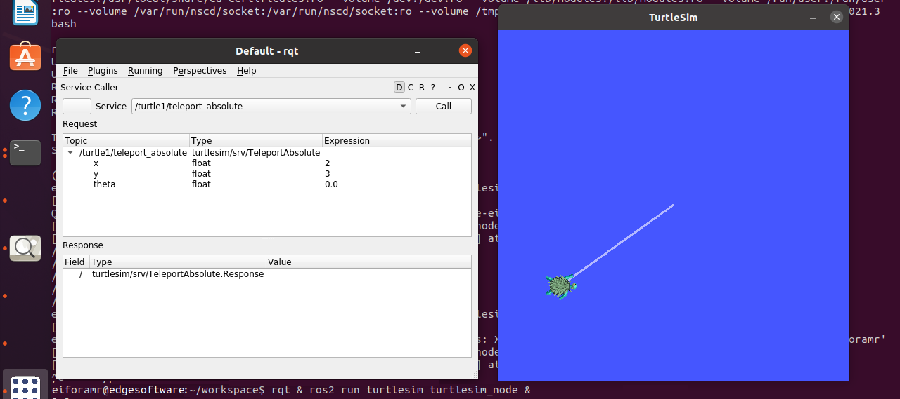

This tutorial describes how to:

- Launch ROS nodes and graphic application for turtlesim.
- List ROS topics.
- Launch rqt graphic application so that the turtle can be controlled.
- Launch rviz graphic application to view ROS topics.

# Prerequisites

- [Prepare the target system](https://docs.openedgeplatform.intel.com/edge-ai-suites/robotics-ai-suite/main/robotics/gsg_robot/prepare-system.html)
- [Setup the Robotics AI Dev Kit APT Repositories](https://docs.openedgeplatform.intel.com/robotics-ai-suite/robotics-ai-suite/main/robotics/gsg_robot/apt-setup.html)
- [Install OpenVINO™ Packages](https://docs.openedgeplatform.intel.com/robotics-ai-suite/robotics-ai-suite/main/robotics/gsg_robot/install-openvino.html)
- [Install Robotics AI Dev Kit Deb packages](https://docs.openedgeplatform.intel.com/robotics-ai-suite/robotics-ai-suite/main/robotics/gsg_robot/install.html)
- [Install the Intel® NPU Driver on Intel® Core™ Ultra Processors (if applicable)](https://docs.openedgeplatform.intel.com/robotics-ai-suite/robotics-ai-suite/main/robotics/gsg_robot/install-npu-driver.html)

# Run the Turtlesim ROS 2 Sample application

1.  To download and install the Turtlesim ROS 2 sample application run
    the command below:

    ``` 
    sudo apt-get install ros-humble-turtlesim-tutorial-demo
    ```

2.  Set up your ROS 2 environment

    ``` 
    source /opt/ros/humble/setup.bash
    ```

3.  Run the Turtlesim ROS 2 sample application:

    ``` 
    ros2 launch turtlesim_tutorial turtlesim_tutorial.launch.py
    ```

4.  In the rqt application, navigate to **Plugins** \> **Services** \>
    **Service Caller**. To move \'turtle1\', choose
    /turtle1/teleport_absolute from the service dropdown list. Ensure to
    update the x and y values from their original settings. Press the
    \'Call\' button to execute the teleportation. To close the Service
    Caller window, click the \'X\' button.

    Expected Output: The Turtle has been relocated to the coordinates
    entered in the rqt application.

    

5.  In the rviz application, navigate to **Add** \> **By topic**. Check
    the option \'Show Unvisualizable Topics\' to view hidden topics. You
    will now be able to view the hidden topics from \'turtlesim\'. To
    close the window, click the \'Cancel\' button.

6.  To close this tutorial, do the following:

    - Type `Ctrl-c` in the terminal where you executed the command for
      the tutorial.
