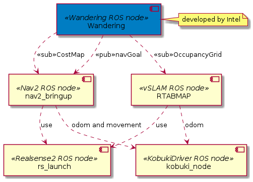
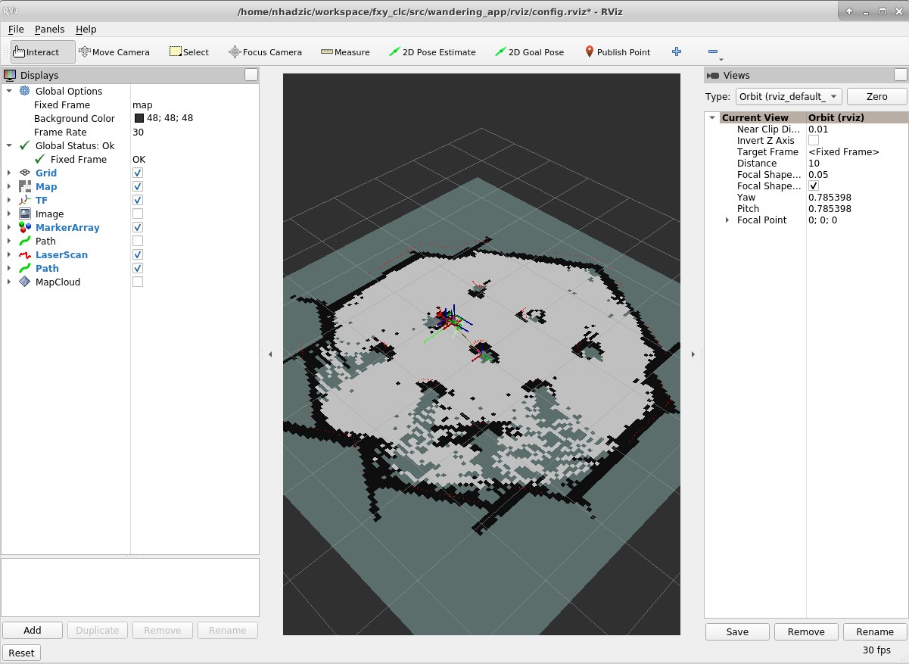

# The Wandering Mobile Robot Application

The Wandering mobile robot application is a Robot Operating System 2 (ROS 2) sample application that moves the robot around the room avoiding hitting obstacles, updating a map in real time that is exposed as the ROS topic.

## Component Documentation

Comprehensive documentation on this component is available here: [dev guide](https://docs.openedgeplatform.intel.com/edge-ai-suites/robotics-ai-suite/main/robotics/dev_guide/tutorials_amr/navigation/wandering_app/index.html)

## Architecture Design

The application consists of two ROS nodes, developed by Intel. In order to function properly, those two nodes depend on other ROS nodes/packages: RealSense ROS wrapper, Nav2 ROS package, RTABMAP and its ROS Wrapper, and robot drivers. Wandering ROS nodes are:
    - Wandering: gets updates from nav2 via costmap and issues navigation goals back to nav2 node;

This is represented on the diagram below:



In the diagram above, kobuki robot was used, and its kobuki ROS node is used for issuing movement commands coming from Nav2 ROS node.

## Dependencies

In order to run Wandering application, Ubuntu 22.04 with ROS Humble is required.

## Prerequisites

- [Prepare the target system](https://docs.openedgeplatform.intel.com/edge-ai-suites/robotics-ai-suite/main/robotics/gsg_robot/prepare-system.html)
- [Setup the Robotics AI Dev Kit APT Repositories](https://docs.openedgeplatform.intel.com/robotics-ai-suite/robotics-ai-suite/main/robotics/gsg_robot/apt-setup.html)
- [Install OpenVINO™ Packages](https://docs.openedgeplatform.intel.com/robotics-ai-suite/robotics-ai-suite/main/robotics/gsg_robot/install-openvino.html)
- [Install Robotics AI Dev Kit Deb packages](https://docs.openedgeplatform.intel.com/robotics-ai-suite/robotics-ai-suite/main/robotics/gsg_robot/install.html)
- [Install the Intel® NPU Driver on Intel® Core™ Ultra Processors (if applicable)](https://docs.openedgeplatform.intel.com/robotics-ai-suite/robotics-ai-suite/main/robotics/gsg_robot/install-npu-driver.html)

### Visualization

In the `rviz` folder, the Rviz2 config file can be found with Wandering app relevant ROS topics.

```bash
rviz2 -d rviz/config.rviz
```


