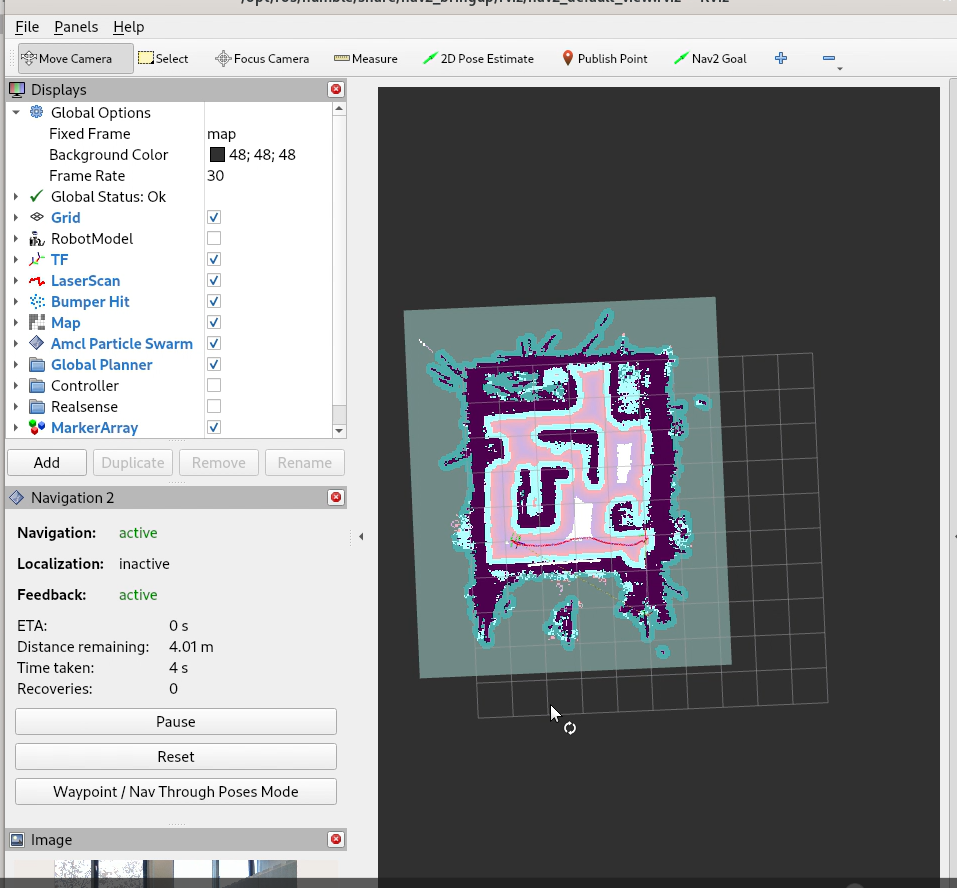

This tutorial details the steps to install Wandering Application with
Intel® RealSense™ camera input and create a map using RTAB-Map
Application.

# Getting Started

## Prerequisites

- [Prepare the target system](https://docs.openedgeplatform.intel.com/edge-ai-suites/robotics-ai-suite/main/robotics/gsg_robot/prepare-system.html)
- [Setup the Robotics AI Dev Kit APT Repositories](https://docs.openedgeplatform.intel.com/robotics-ai-suite/robotics-ai-suite/main/robotics/gsg_robot/apt-setup.html)
- [Install OpenVINO™ Packages](https://docs.openedgeplatform.intel.com/robotics-ai-suite/robotics-ai-suite/main/robotics/gsg_robot/install-openvino.html)
- [Install Robotics AI Dev Kit Deb packages](https://docs.openedgeplatform.intel.com/robotics-ai-suite/robotics-ai-suite/main/robotics/gsg_robot/install.html)
- [Install the Intel® NPU Driver on Intel® Core™ Ultra Processors (if applicable)](https://docs.openedgeplatform.intel.com/robotics-ai-suite/robotics-ai-suite/main/robotics/gsg_robot/install-npu-driver.html)

## Install Deb package

Install the `ros-humble-wandering-aaeon-tutorial` Deb package from the
Intel® Robotics AI Dev Kit APT repository.

> ``` 
> sudo apt update
> sudo apt install ros-humble-wandering-aaeon-tutorial
> ```

# Run Demo

Run the following commands to create a map using RTAB-Map and Wandering
Application tutorial on the Aaeon robot.

> ``` 
> source /opt/ros/humble/setup.bash
> ros2 launch wandering_aaeon_tutorial wandering_aaeon.launch.py
> ```

Once the command is executed, the robot starts moving and creates a map
with RTAB-Map Application.



# Troubleshooting

- You can stop the demo anytime by pressing `ctrl-C`.
