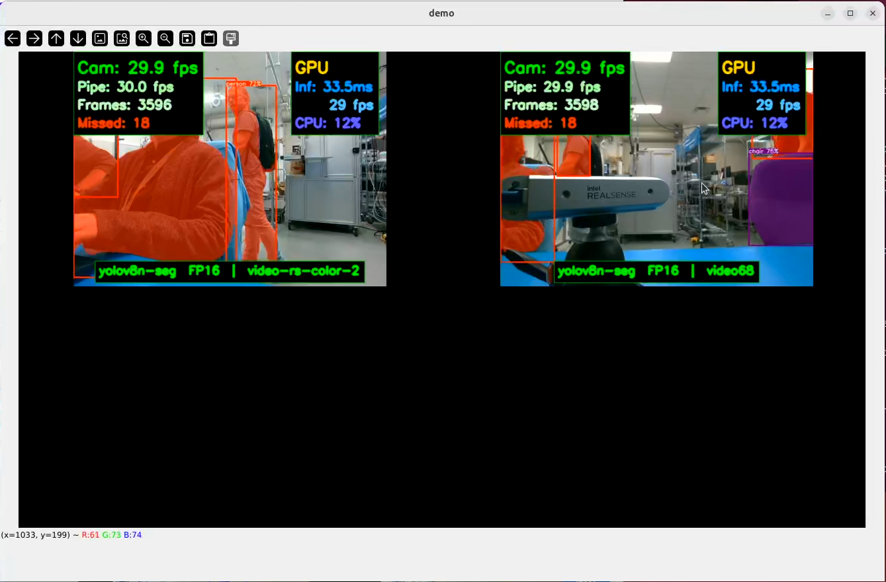

# Multi-Camera Object Detection Powered by OpenVINO™

This reference application showcases using one or multiple cameras to run simultaneous AI-powered vision pipelines.
It supports one to four USB or GMSL connected cameras.

Object detection and segmentation masking are run in parallel using up to four camera streams.
This application uses an OpenVINO-optimized version of YOLOv8, available here:
[Ultralytics YOLOv8 object detection model](https://docs.ultralytics.com/).

## Prerequisites
To run this reference applications, make sure you've completed the [Getting Started](../../../../platform_foundation/getting_started.md) guide to onboard your device, install the relevant packages, and setup your device drivers.

To use GMSL-enabled cameras, make sure you've followed the [GMSL Setup Guide](../../../sensors/cameras/gmsl/index.md).

## Source Code

The source code of this component can be found here:
[Multicamera-Demo](https://github.com/open-edge-platform/edge-ai-suites/tree/main/robotics-ai-suite/components/multicam-demo).

## Software Installation

This reference application uses some additional software. `uv` is the preferred tool for managing the Python environment - a `uv.lock` and `pyproject.toml` are provided to quickly set it up.

### Install `uv`

```bash
curl -LsSf https://astral.sh/uv/install.sh | sh

```

### Source `uv`

```bash
source $HOME/.local/bin/env
```

## Install the reference application

The reference application is available as an additional downloadable package through `apt`.

Install with the following command:

<!--hide_directive::::{tab-set}hide_directive-->
<!--hide_directive:::{tab-item}hide_directive--> **Jazzy**
<!--hide_directive:sync: jazzyhide_directive-->

```bash
sudo apt install -y ros-jazzy-pyrealsense2-ai-demo
```

<!--hide_directive:::hide_directive-->
<!--hide_directive:::{tab-item}hide_directive--> **Humble**
<!--hide_directive:sync: humblehide_directive-->

```bash
sudo apt install -y ros-humble-pyrealsense2-ai-demo
```

<!--hide_directive:::hide_directive-->
<!--hide_directive::::hide_directive-->

### Setup `uv` Python Virtual Environment

`uv` is recommended to manage the Python virtual environment.

<!--hide_directive::::{tab-set}hide_directive-->
<!--hide_directive:::{tab-item}hide_directive--> **Jazzy**
<!--hide_directive:sync: jazzyhide_directive-->

```bash
cd /opt/ros/jazzy/share/pyrealsense2-ai-demo
```

<!--hide_directive:::hide_directive-->
<!--hide_directive:::{tab-item}hide_directive--> **Humble**
<!--hide_directive:sync: humblehide_directive-->

```bash
cd /opt/ros/humble/share/pyrealsense2-ai-demo
```

<!--hide_directive:::hide_directive-->
<!--hide_directive::::hide_directive-->


```bash
uv sync
```

Once the environment is prepared, you're ready to fetch the vision models. A script is provided to download, convert, and quantize the supported models:

```bash
source .venv/bin/activate
./scripts/generate_ai_models.sh
```

## Run the Reference Application

Before running the application, you need to set configure it to use the appropriate camera streams. A script called `find_cameras.sh` will scan for RGB-compatible camera streams and create a reusable config file at `.config/config_camera.json`. You can modify this file after creation to adjust model, OpenVINO inference device, input stream settings, and other parameters. After, you can run the demo:

<!--hide_directive::::{tab-set}hide_directive-->
<!--hide_directive:::{tab-item}hide_directive--> **Jazzy**
<!--hide_directive:sync: jazzyhide_directive-->

```bash
cd /opt/ros/jazzy/share/pyrealsense2-ai-demo
./scripts/find_cameras.sh
uv run src/pyrealsense2_ai_demo_launcher.py --config=config/config_camera.json
```

<!--hide_directive:::hide_directive-->
<!--hide_directive:::{tab-item}hide_directive--> **Humble**
<!--hide_directive:sync: humblehide_directive-->

```bash
cd /opt/ros/humble/share/pyrealsense2-ai-demo
./scripts/find_cameras.sh
uv run src/pyrealsense2_ai_demo_launcher.py --config=config/config_camera.jsony
```

<!--hide_directive:::hide_directive-->
<!--hide_directive::::hide_directive-->

After a few seconds, you will see the camera streams overlaid with inference statistics:




