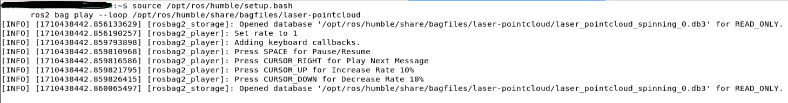
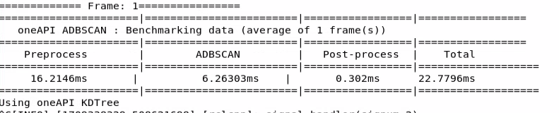
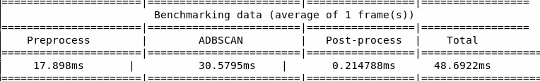
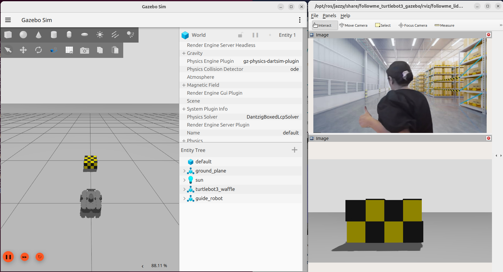

# ADBSCAN Follow-me

ADBSCAN (Adaptive DBSCAN) is an Intel® algorithm for adaptive object detection
and localization from 2D LiDAR, 3D LiDAR, and RealSense depth-camera
point clouds. It automatically determines clustering parameters from sensor
range and point density, reducing manual tuning for perception workloads.

The Follow-me application uses ADBSCAN to locate a target person and publish
robot velocity commands. This guide combines the supported optimization workflow
with one Gazebo simulation and one Clearpath Jackal deployment scenario.

## Source Code

[ADBScan source code](https://github.com/open-edge-platform/edge-ai-suites/tree/main/robotics-ai-suite/components/adbscan)

## Intel-Optimized ADBSCAN

In this version of ADBSCAN, the algorithm has been optimized for Intel® SOC by
replacing linear neighbor point search with an optimized oneAPI PCL library
(offloaded to GPU), as well as refactoring the clustering algorithm. This
tutorial describes how to run this Intel-optimized ADBSCAN algorithm and compare
the execution time with the unoptimized version.

### ADBSCAN Optimization Setup

The Intel-optimized and unoptimized versions of the algorithm are distributed
as `ros-jazzy-adbscan-oneapi` and `ros-jazzy-adbscan-ros2`, respectively.
We demonstrate the gain in latency for a ROS 2 bag file with point cloud data
from a RealSense camera. The amount of gain is prominent when the input
is dense or the number of input points is large. In case of a 2D LIDAR,
the point cloud is comparatively sparse and hence, not showed here.

### ADBSCAN Optimization Prerequisites

Complete the [Getting Started](../../platform_foundation/getting_started.md) guide before continuing.

### Install and run the ROS 2 bag file Deb package

Install the following package with ROS 2 bag files in order to publish point
cloud data from LIDAR and RealSense camera:

<!--hide_directive::::{tab-set}hide_directive-->
<!--hide_directive:::{tab-item}hide_directive--> **Jazzy**
<!--hide_directive:sync: jazzyhide_directive-->

```bash
sudo apt install ros-jazzy-bagfile-laser-pointcloud
```

<!--hide_directive:::hide_directive-->
<!--hide_directive:::{tab-item}hide_directive-->  **Humble**
<!--hide_directive:sync: humblehide_directive-->

```bash
sudo apt install ros-humble-bagfile-laser-pointcloud
```

<!--hide_directive:::hide_directive-->
<!--hide_directive::::hide_directive-->

Run the following commands in a terminal:

<!--hide_directive::::{tab-set}hide_directive-->
<!--hide_directive:::{tab-item}hide_directive--> **Jazzy**
<!--hide_directive:sync: jazzyhide_directive-->

```bash
source /opt/ros/jazzy/setup.bash
ros2 bag play --loop /opt/ros/jazzy/share/bagfiles/laser-pointcloud
```

<!--hide_directive:::hide_directive-->
<!--hide_directive:::{tab-item}hide_directive-->  **Humble**
<!--hide_directive:sync: humblehide_directive-->

```bash
source /opt/ros/humble/setup.bash
ros2 bag play --loop /opt/ros/humble/share/bagfiles/laser-pointcloud
```

<!--hide_directive:::hide_directive-->
<!--hide_directive::::hide_directive-->

This command will launch the ROS 2 bag file and publish the recorded point
cloud data to respective topics. You will view the following screen output:



`ros2 topic list` command will show a list of the published topics which
include `/scan` (point cloud from 2D LIDAR) and `/camera/depth/color/points`
(point cloud from RealSense camera).

### Install and run optimized Deb package

Install `ros-jazzy-adbscan-oneapi` Deb package from Intel® Autonomous Mobile
Robot APT repository:

<!--hide_directive::::{tab-set}hide_directive-->
<!--hide_directive:::{tab-item}hide_directive--> **Jazzy**
<!--hide_directive:sync: jazzyhide_directive-->

```bash
sudo apt update
sudo apt install ros-jazzy-adbscan-oneapi
```

<!--hide_directive:::hide_directive-->
<!--hide_directive:::{tab-item}hide_directive-->  **Humble**
<!--hide_directive:sync: humblehide_directive-->

```bash
sudo apt update
sudo apt install ros-humble-adbscan-oneapi
```

<!--hide_directive:::hide_directive-->
<!--hide_directive::::hide_directive-->

Run the following command in a terminal:

<!--hide_directive::::{tab-set}hide_directive-->
<!--hide_directive:::{tab-item}hide_directive--> **Jazzy**
<!--hide_directive:sync: jazzyhide_directive-->

```bash
source /opt/ros/jazzy/setup.bash
ros2 run adbscan_ros2 adbscan_sub --ros-args --params-file /opt/ros/jazzy/share/adbscan_ros2/config/adbscan_sub_RS.yaml
```

<!--hide_directive:::hide_directive-->
<!--hide_directive:::{tab-item}hide_directive-->  **Humble**
<!--hide_directive:sync: humblehide_directive-->

```bash
source /opt/ros/humble/setup.bash
ros2 run adbscan_ros2 adbscan_sub --ros-args --params-file /opt/ros/humble/share/adbscan_ros2/config/adbscan_sub_RS.yaml
```

<!--hide_directive:::hide_directive-->
<!--hide_directive::::hide_directive-->

This will print tables with the benchmarking data as showed below:



The table shows a breakdown between pre-processing, ADBSCAN execution and
post-processing time. The caption at the bottom of the table will print
which PCL library is being used.

### Install and run standard (unoptimized) Deb package

Install `ros-jazzy-adbscan-ros2` Deb package from Intel® Autonomous Mobile
Robot APT repository

<!--hide_directive::::{tab-set}hide_directive-->
<!--hide_directive:::{tab-item}hide_directive--> **Jazzy**
<!--hide_directive:sync: jazzyhide_directive-->

```bash
sudo apt update
sudo apt install ros-jazzy-adbscan-ros2
```

<!--hide_directive:::hide_directive-->
<!--hide_directive:::{tab-item}hide_directive-->  **Humble**
<!--hide_directive:sync: humblehide_directive-->

```bash
sudo apt update
sudo apt install ros-humble-adbscan-ros2
```

<!--hide_directive:::hide_directive-->
<!--hide_directive::::hide_directive-->

Run the following command in a terminal

<!--hide_directive::::{tab-set}hide_directive-->
<!--hide_directive:::{tab-item}hide_directive--> **Jazzy**
<!--hide_directive:sync: jazzyhide_directive-->

```bash
source /opt/ros/jazzy/setup.bash
ros2 run adbscan_ros2 adbscan_sub --ros-args --params-file /opt/ros/jazzy/share/adbscan_ros2/config/adbscan_sub_RS.yaml
```

<!--hide_directive:::hide_directive-->
<!--hide_directive:::{tab-item}hide_directive-->  **Humble**
<!--hide_directive:sync: humblehide_directive-->

```bash
source /opt/ros/humble/setup.bash
ros2 run adbscan_ros2 adbscan_sub --ros-args --params-file /opt/ros/humble/share/adbscan_ros2/config/adbscan_sub_RS.yaml
```

<!--hide_directive:::hide_directive-->
<!--hide_directive::::hide_directive-->

This will print a similar table with the benchmarking data.



You will see that the ADBSCAN execution time is much smaller for the optimized
version compared to the standard one. The pre-processing and post-processing time
should be more or less of the same range in both versions, since the input bag
file is identical. The amount of gain in execution time will depend on the
system configuration, the size of the point cloud data in the input frames etc.

### Re-configurable parameters

The optimized ADBSCAN has a user-defined parameter called `oneapi_library` to
choose from a set of PCL libraries: `oneapi_kdtree`, `oneapi_octree`,
`pcl_kdtree`. The default value is `oneapi_kdtree`.
Moreover, one can run both optimized and unoptimized packages with a parameter
called `benchmark_number_of_frames`. It will take an integer (greater or equal
to 1) as input and the benchmarking table will produce the average execution
time of `benchmark_number_of_frames` frames, instead of a single frame
(default value).

For example, you can use the following command to run the optimized ADBSCAN
with `oneapi_octree` library and display the benchmarking data for
an average of 5 frames:

<!--hide_directive::::{tab-set}hide_directive-->
<!--hide_directive:::{tab-item}hide_directive--> **Jazzy**
<!--hide_directive:sync: jazzyhide_directive-->

```bash
ros2 run adbscan_ros2 adbscan_sub --ros-args --params-file /opt/ros/jazzy/share/adbscan_ros2/config/adbscan_sub_RS.yaml  -p benchmark_number_of_frames:=5 -p oneapi_library:=oneapi_octree
```

<!--hide_directive:::hide_directive-->
<!--hide_directive:::{tab-item}hide_directive-->  **Humble**
<!--hide_directive:sync: humblehide_directive-->

```bash
ros2 run adbscan_ros2 adbscan_sub --ros-args --params-file /opt/ros/humble/share/adbscan_ros2/config/adbscan_sub_RS.yaml  -p benchmark_number_of_frames:=5 -p oneapi_library:=oneapi_octree
```

<!--hide_directive:::hide_directive-->
<!--hide_directive::::hide_directive-->

A complete list of the reconfigurable parameters is given below:

- `Lidar_type`

  Type of the point cloud sensor. For RealSense camera and LIDAR inputs,
  the default value is set to `RS` and `2D`, respectively.

- `Lidar_topic`

  Name of the topic publishing point cloud data.

- `Verbose`

  If this flag is set to `True`, the locations of the detected target objects
  will be printed as the screen log.

- `subsample_ratio`

  This is the downsampling rate of the original point cloud data. Default value
  = 15 (i.e., every 15-th data in the original point cloud is sampled and passed
  to the core ADBSCAN algorithm).

- `x_filter_back`

  Point cloud data with x-coordinate `x_filter_back` are filtered out (positive
  x direction lies in front of the robot).

- `y_filter_left`, `y_filter_right`

  Point cloud data with y-coordinate `y_filter_left` and `y-coordinate` \<
  `y_filter_right` are filtered out (positive `y-direction` is to the left of
  robot and vice versa)

- `z_filter`

  Point cloud data with z-coordinate \< `z_filter` will be filtered out.
  This option will be ignored in case of 2D Lidar.

- `Z_based_ground_removal`

  Filtering in the z-direction will be applied only if this value is non-zero.
  This option will be ignored in case of 2D Lidar.

- `base`, `coeff_1`, `coeff_2`, `scale_factor`

  These are the coefficients used to calculate the adaptive parameters of the
  ADBSCAN algorithm. These values are pre-computed and recommended to keep unchanged.

- `oneapi_library`

  Available options are: `oneapi_kdtree`, `oneapi_octree`, `pcl_kdtree`.
  `oneapi_kdtree` and `oneapi_octree` allow the algorithm to use optimized
  oneAPI™ KdTree or octree library and offload the neighbor point search method
  to GPU. `pcl_kdtree` option uses the standard PCL KdTree library,
  not optimized for Intel® SOC.

- `benchmark_number_of_frames`

  Any integer greater or equal to 1. This is the number of frames over which
  the average execution time is executed and printed in the benchmarking table.

### ADBSCAN Optimization Troubleshooting

- Failed to install Deb package: Please make sure to run `sudo apt update`
  before installing the necessary Deb packages.

- You can stop the demo anytime by pressing `ctrl-C`.

- The screen log will show `number of points after subsampling` and
  `number of points after filtering`. If these values are zero, please make
  sure to adjust the following parameters to make sure these values are
  greater than zero.

  - Decrease `subsample_ratio`.
  - Increase the absolute values of `x_filter_back`, `y_filter_right`,
    `y_filter_left`.

    Please see the description of these parameters in the table and adjust
    according to your environment.

- IA-optimized ADBSCAN offloads the neighbor search to GPUs when using
  `oneapi_kdtree` and `oneapi_octree` library.

  Please make sure that your system is equipped with working gpu, if using
  these libraries. You can use `lspci` command in a Linux terminal to
  view GPU info.

- `ros-jazzy-adbscan-ros2` and `ros-jazzy-adbscan-oneapi` are mutually
  exclusive Deb packages.

  Please refrain from installing them simultaneously
  like this `apt install ros-jazzy-adbscan-ros2 ros-jazzy-adbscan-oneapi`.
  Always install the packages sequentially, as showed in this document.

- You may experience lower performance if the Linux kernel schedules the `adbscan_ros2`
process to an efficient-core (E-core). To achieve better performance, you can
utilize the `taskset` command to set the process's CPU affinity. For example,
you can direct `adbscan_ros2` to run on CPU core 0 which is
a performance-core (P-core).

  <!--hide_directive::::{tab-set}hide_directive-->
  <!--hide_directive:::{tab-item}hide_directive--> **Jazzy**
  <!--hide_directive:sync: jazzyhide_directive-->

  ```bash
  source /opt/ros/jazzy/setup.bash
  taskset -c 0 ros2 run adbscan_ros2 adbscan_sub --ros-args --params-file /opt/ros/jazzy/share/adbscan_ros2/config/adbscan_sub_RS.yaml
  ```

  <!--hide_directive:::hide_directive-->
  <!--hide_directive:::{tab-item}hide_directive-->  **Humble**
  <!--hide_directive:sync: humblehide_directive-->

  ```bash
  source /opt/ros/humble/setup.bash
  taskset -c 0 ros2 run adbscan_ros2 adbscan_sub --ros-args --params-file /opt/ros/humble/share/adbscan_ros2/config/adbscan_sub_RS.yaml
  ```

  <!--hide_directive:::hide_directive-->
  <!--hide_directive::::hide_directive-->

## Simulate Follow-me in Gazebo

This demo of the Follow-me algorithm shows an Autonomous Mobile Robot application
for following a target person where the movement of the robot can be controlled
by the person's location and hand gestures. The entire pipeline diagram can be
found in this guide.
This demo contains only the ADBSCAN and Gesture recognition modules in the
input-processing application stack. No text-to-speech synthesis module is
present in the output-processing application stack. This tutorial describes how
to launch the demo in `Gazebo` simulator.

### Simulation Setup

#### Simulation Prerequisites

Complete the [Getting Started](../../platform_foundation/getting_started.md) guide
before continuing.

#### Install the Simulation Deb Package

Install `ros-jazzy-followme-turtlebot3-gazebo` Deb package from Intel®
Autonomous Mobile Robot APT repository. This is the wrapper package which will
launch all of the dependencies in the backend.

<!--hide_directive::::{tab-set}hide_directive-->
<!--hide_directive:::{tab-item}hide_directive--> **Jazzy**
<!--hide_directive:sync: jazzyhide_directive-->

```bash
sudo apt update
sudo apt install ros-jazzy-followme-turtlebot3-gazebo
```

<!--hide_directive:::hide_directive-->
<!--hide_directive:::{tab-item}hide_directive-->  **Humble**
<!--hide_directive:sync: humblehide_directive-->

```bash
sudo apt update
sudo apt install ros-humble-followme-turtlebot3-gazebo
```

<!--hide_directive:::hide_directive-->
<!--hide_directive::::hide_directive-->

#### Activate Python Virtual Environment

```bash
sudo apt install python3-venv
python3 -m venv venv_followme
cd venv_followme
source bin/activate
```

#### Install Python Modules

This application uses
[Mediapipe Hands Framework](https://mediapipe.readthedocs.io/en/latest/solutions/hands.html)
for hand gesture recognition. Install the following modules as a prerequisite
for the framework:

<!--hide_directive::::{tab-set}hide_directive-->
<!--hide_directive:::{tab-item}hide_directive--> **Jazzy**
<!--hide_directive:sync: jazzyhide_directive-->

```bash
pip3 install --upgrade pip
pip3 install pyyaml
pip3 install -r /opt/ros/jazzy/share/followme_turtlebot3_gazebo/scripts/requirements_jazzy.txt
```

<!--hide_directive:::hide_directive-->
<!--hide_directive:::{tab-item}hide_directive-->  **Humble**
<!--hide_directive:sync: humblehide_directive-->

```bash
pip3 install --upgrade pip
pip3 install pyyaml
pip3 install -r /opt/ros/humble/share/followme_turtlebot3_gazebo/scripts/requirements_humble.txt
```

<!--hide_directive:::hide_directive-->
<!--hide_directive::::hide_directive-->

### Run Demo with 2D Lidar

Run the following script to launch `Gazebo` simulator and ROS 2 rviz2.

<!--hide_directive::::{tab-set}hide_directive-->
<!--hide_directive:::{tab-item}hide_directive--> **Jazzy**
<!--hide_directive:sync: jazzyhide_directive-->

```bash
sudo chmod +x /opt/ros/jazzy/share/followme_turtlebot3_gazebo/scripts/demo_lidar.sh
/opt/ros/jazzy/share/followme_turtlebot3_gazebo/scripts/demo_lidar.sh
```

<!--hide_directive:::hide_directive-->
<!--hide_directive:::{tab-item}hide_directive-->  **Humble**
<!--hide_directive:sync: humblehide_directive-->

```bash
sudo chmod +x /opt/ros/humble/share/followme_turtlebot3_gazebo/scripts/demo_lidar.sh
/opt/ros/humble/share/followme_turtlebot3_gazebo/scripts/demo_lidar.sh
```

<!--hide_directive:::hide_directive-->
<!--hide_directive::::hide_directive-->

You will see two panels side-by-side: `Gazebo` GUI on the left and ROS 2 rviz
display on the right.



- The green square robot is a guide robot (namely, the target), which will
  follow a pre-defined trajectory.
- The gray circular robot is a
  [TurtleBot3](https://emanual.robotis.com/docs/en/platform/turtlebot3/simulation/#gazebo-simulation)
  robot, which will follow the guide robot. TurtleBot3 robot is equipped with a
  2D Lidar and a RealSense Depth Camera. In this demo, the 2D Lidar is
  used as the input topic.

**Both** of the following conditions need to be fulfilled to start the
TurtleBot3 robot:

- The target (guide robot) will be within the tracking radius of the
  TurtleBot3 robot. Radius is a reconfigurable parameter in:
  `/opt/ros/jazzy/share/adbscan_ros2_follow_me/config/adbscan_sub_2D.yaml`.

  In ROS 2 Humble, the file is located at the similar directory path.

- The gesture (visualized in the `/image` topic in ROS 2 rviz2) of the target
  is `thumbs up`.

The stop condition for the TurtleBot3 robot is fulfilled when **either one** of
the following conditions are true:

- The target (guide robot) moves to a distance of more than the tracking radius
  of the TurtleBot3 robot. Radius is a reconfigurable parameter in:
  `/opt/ros/jazzy/share/adbscan_ros2_follow_me/config/adbscan_sub_2D.yaml`.

  In ROS 2 Humble, the file is located at the similar directory path.

- The gesture (visualized in the `/image` topic in ROS 2 rviz2) of the target
  is `thumbs down`.

### Run Demo with RealSense Camera

Run the following script to launch `Gazebo` simulator and ROS 2 rviz2.

<!--hide_directive::::{tab-set}hide_directive-->
<!--hide_directive:::{tab-item}hide_directive--> **Jazzy**
<!--hide_directive:sync: jazzyhide_directive-->

```bash
sudo chmod +x /opt/ros/jazzy/share/followme_turtlebot3_gazebo/scripts/demo_RS.sh
/opt/ros/jazzy/share/followme_turtlebot3_gazebo/scripts/demo_RS.sh
```

<!--hide_directive:::hide_directive-->
<!--hide_directive:::{tab-item}hide_directive-->  **Humble**
<!--hide_directive:sync: humblehide_directive-->

```bash
sudo chmod +x /opt/ros/humble/share/followme_turtlebot3_gazebo/scripts/demo_RS.sh
/opt/ros/humble/share/followme_turtlebot3_gazebo/scripts/demo_RS.sh
```

<!--hide_directive:::hide_directive-->
<!--hide_directive::::hide_directive-->

In this demo, RealSense camera of the TurtleBot3 robot is selected as
the input point cloud sensor. After running all of the above commands,
you will observe similar behavior of the TurtleBot3 robot and guide robot in the
`Gazebo` GUI as in [Run Demo with 2D Lidar](#run-demo-with-2d-lidar).

There are reconfigurable parameters in
`/opt/ros/humble/share/adbscan_ros2_follow_me/config/` directory for both LIDAR
(`adbscan_sub_2D.yaml`) and RealSense camera (`adbscan_sub_RS.yaml`).

The user can modify parameters depending on the respective robot, sensor
configuration and environments (if required) before running the tutorial.
Find a brief description of the parameters in the following list:

- ``Lidar_type``

  Type of the point cloud sensor. For RealSense camera and LIDAR inputs,
  the default value is set to ``RS`` and ``2D``, respectively.

- ``Lidar_topic``

  Name of the topic publishing point cloud data.

- ``Verbose``

  If this flag is set to ``True``, the locations of the detected target objects
  will be printed as the screen log.

- ``subsample_ratio``

  This is the downsampling rate of the original point cloud data. Default value
  = 15 (i.e. every 15-th data in the original point cloud is sampled and passed
  to the core ADBSCAN algorithm).

- ``x_filter_back``

  Point cloud data with x-coordinate > ``x_filter_back`` are filtered out
  (positive x direction lies in front of the robot).

- ``y_filter_left``, ``y_filter_right``

  Point cloud data with y-coordinate > ``y_filter_left`` and y-coordinate <
  ``y_filter_right`` are filtered out (positive y-direction is to the left of
  robot and vice versa).

- ``z_filter``

  Point cloud data with z-coordinate < ``z_filter`` will be filtered out. This
  option will be ignored in case of 2D Lidar.

- ``Z_based_ground_removal``

  Filtering in the z-direction will be applied only if this value is non-zero.
  This option will be ignored in case of 2D Lidar.

- ``base``, ``coeff_1``, ``coeff_2``, ``scale_factor``

  These are the coefficients used to calculate adaptive parameters of the
  ADBSCAN algorithm. These values are pre-computed and recommended
  to keep unchanged.

- ``init_tgt_loc``

  This value describes the initial target location. The person needs to be at a
  distance of ``init_tgt_loc`` in front of the robot to initiate the motor.

- ``max_dist``

  This is the maximum distance that the robot can follow. If the person moves at
  a distance > ``max_dist``, the robot will stop following.

- ``min_dist``

  This value describes the safe distance the robot will always maintain with the
  target person. If the person moves closer than ``min_dist``,
  the robot stops following.

- ``max_linear``

  Maximum linear velocity of the robot.

- ``max_angular``

  Maximum angular velocity of the robot.

- ``max_frame_blocked``

  The robot will keep following the target for ``max_frame_blocked`` number of
  frames in the event of a temporary occlusion.

- ``tracking_radius``

  The robot will keep following the target as long as the current target
  location = previous location +/- ``tracking_radius``

### Simulation Troubleshooting

- Failed to install Deb package: Please make sure to run `sudo apt update`
  before installing the necessary Deb packages.

- You can stop the demo anytime by pressing `ctrl-C`. If the `Gazebo` simulator
  freezes or does not stop, please use the following command in a terminal:

  ```bash
  sudo killall -9 gazebo gzserver gzclient
  ```

## Deploy Follow-me on a Clearpath Jackal

This tutorial provides instructions for running the ADBSCAN-based Follow-me
algorithm from Autonomous Mobile Robot using RealSense camera input when
using a Clearpath Robotics Jackal robot.
The RealSense camera publishes to `/camera/depth/color/points` topic.
The `adbscan_sub_node` subscribes to the corresponding topic,
detects the obstacle array, computes the robot's velocity and publishes to the
`/cmd_vel` topic of type `geometry_msg/msg/Twist`.
This `twist` message consists of the updated angular and linear velocity of the
robot to follow the target, which can be subsequently subscribed
by a robot-driver.

### Deployment Setup

#### Deployment Prerequisites

Complete the [Getting Started](../../platform_foundation/getting_started.md) guide
before continuing.

#### Install the Deployment Deb Package

Install the `ros-jazzy-follow-me-tutorial` Deb package from the Autonomous
Mobile Robot APT repository.

<!--hide_directive::::{tab-set}hide_directive-->
<!--hide_directive:::{tab-item}hide_directive--> **Jazzy**
<!--hide_directive:sync: jazzyhide_directive-->

```bash
sudo apt update
sudo apt install ros-jazzy-follow-me-tutorial
```

<!--hide_directive:::hide_directive-->
<!--hide_directive:::{tab-item}hide_directive-->  **Humble**
<!--hide_directive:sync: humblehide_directive-->

```bash
sudo apt update
sudo apt install ros-humble-follow-me-tutorial
```

<!--hide_directive:::hide_directive-->
<!--hide_directive::::hide_directive-->

### Run Demo

To launch the Follow-me application tutorial on the Jackal robot, use the
following ROS 2 launch file.

<!--hide_directive::::{tab-set}hide_directive-->
<!--hide_directive:::{tab-item}hide_directive--> **Jazzy**
<!--hide_directive:sync: jazzyhide_directive-->

```bash
source /opt/ros/jazzy/setup.bash
ros2 launch tutorial_follow_me jackal_followme_launch.py
```

<!--hide_directive:::hide_directive-->
<!--hide_directive:::{tab-item}hide_directive-->  **Humble**
<!--hide_directive:sync: humblehide_directive-->

```bash
source /opt/ros/humble/setup.bash
ros2 launch tutorial_follow_me jackal_followme_launch.py
```

<!--hide_directive:::hide_directive-->
<!--hide_directive::::hide_directive-->

After starting the script, the robot should begin searching for trackable
objects in its initial detection radius (defaulting to around 0.5m), and then
following acquired targets as they move from the initial target location.

There are reconfigurable parameters in
`/opt/ros/jazzy/share/tutorial_follow_me/params/followme_adbscan_RS_params.yaml`.
You can modify the parameters depending on the respective robot, sensor
configuration and environments (if required) before running the tutorial.
Find a brief description of the parameters in the following list.

- ``Lidar_type``

  Type of the point cloud sensor. For RealSense camera and LIDAR inputs,
  the default value is set to ``RS`` and ``2D``, respectively.

- ``Lidar_topic``

  Name of the topic publishing point cloud data.

- ``Verbose``

  If this flag is set to ``True``, the locations of the detected target objects
  will be printed as the screen log.

- ``subsample_ratio``

  This is the downsampling rate of the original point cloud data. Default value
  = 15 (i.e. every 15-th data in the original point cloud is sampled and passed
  to the core BSCAN algorithm).

- ``x_filter_back``

  Point cloud data with x-coordinate > ``x_filter_back`` are filtered out
  (positive x direction lies in front of the robot).

- ``y_filter_left``, ``y_filter_right``

  Point cloud data with y-coordinate > ``y_filter_left`` and y-coordinate <
  ``y_filter_right`` are filtered out (positive y-direction is to the left of
  robot and vice versa).

- ``z_filter``

  Point cloud data with z-coordinate < ``z_filter`` will be filtered out. This
  option will be ignored in case of 2D Lidar.

- ``Z_based_ground_removal``

  Filtering in the z-direction will be applied only if this value is non-zero.
  This option will be ignored in case of 2D Lidar.

- ``base``, ``coeff_1``, ``coeff_2``, ``scale_factor``

  These are the coefficients used to calculate adaptive parameters of the
  ADBSCAN algorithm. These values are pre-computed and recommended
  to keep unchanged.

- ``init_tgt_loc``

  This value describes the initial target location. The person needs to be at a
  distance of ``init_tgt_loc`` in front of the robot to initiate the motor.

- ``max_dist``

  This is the maximum distance that the robot can follow. If the person moves
  at a distance > ``max_dist``, the robot will stop following.

- ``min_dist``

  This value describes the safe distance the robot will always maintain with
  the target person. If the person moves closer than ``min_dist``,
  the robot stops following.

- ``max_linear``

  Maximum linear velocity of the robot.

- ``max_angular``

  Maximum angular velocity of the robot.

- ``max_frame_blocked``

  The robot will keep following the target for ``max_frame_blocked`` number of
  frames in the event of a temporary occlusion.

- ``tracking_radius``

  The robot will keep following the target as long as the current target
  location = previous location +/- ``tracking_radius``

### Deployment Troubleshooting

- Failed to install Deb package: Please make sure to run `sudo apt update`
  before installing the necessary Deb packages.
- You may stop the demo anytime by pressing `ctrl-C`.
- If the robot rotates more than intended at each step, try reducing the
  parameter `max_angular` in the parameter file.
- If the motor controller board does not start, restart the robot.
- For general robot issues, refer to
  the [troubleshooting guide](../../resources/troubleshooting).