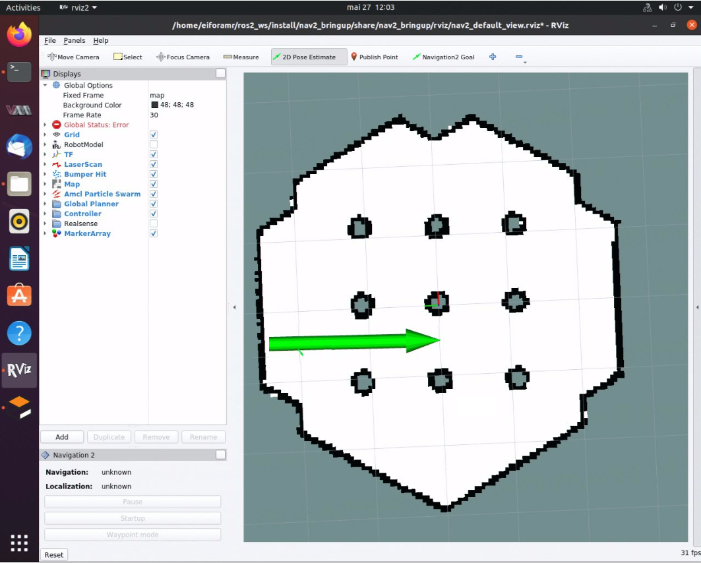

# Robot Re-localization Package for ROS 2 Navigation

The Robot Re-localization package empowers ROS 2 navigation with the capability
to re-localize a robot. In situations where sensor measurements encounter
glitches or environment disturbances or scene similarities lead to localization
loss, the robot may lose its position. This necessitates a fast and reliable
re-localization algorithm to re-establish the robot's location accurately.
To tackle this issue, we developed an innovative re-localization algorithm that
excels in both computational efficiency and memory usage, specifically
designed for mobile robots.

## Getting Started

Autonomous Mobile Robot provides a ROS 2 Deb package for the application,
supported by the following platform:

- ROS version: Jazzy, Humble

### Prerequisites

Complete the [Getting Started](../../platform_foundation/getting_started.md) guide before continuing.

### Install Deb package

Install the `ros-jazzy-its-relocalization-bringup` Deb package from the
Intel® Autonomous Mobile Robot APT repository

::::{tab-set}
:::{tab-item} **Jazzy**
:sync: jazzy

```bash
sudo apt install ros-jazzy-its-relocalization-bringup
```

:::
:::{tab-item}  **Humble**
:sync: humble

```bash
sudo apt install ros-humble-its-relocalization-bringup
```

:::
::::

### Run the Re-localization

Run the following script to set environment variables and bring up ROS 2
navigation, and TurtleBot3 robot in Gazebo simulation:

::::{tab-set}
:::{tab-item} **Jazzy**
:sync: jazzy

```bash
source /opt/ros/jazzy/setup.bash
export TURTLEBOT3_MODEL=waffle
export GAZEBO_MODEL_PATH=$GAZEBO_MODEL_PATH:/opt/ros/jazzy/share/turtlebot3_gazebo/models
ros2 launch nav2_bringup tb3_simulation_launch.py headless:=False
```

:::
:::{tab-item}  **Humble**
:sync: humble

```bash
source /opt/ros/humble/setup.bash
export TURTLEBOT3_MODEL=waffle
export GAZEBO_MODEL_PATH=$GAZEBO_MODEL_PATH:/opt/ros/humble/share/turtlebot3_gazebo/models
ros2 launch nav2_bringup tb3_simulation_launch.py headless:=False
```

:::
::::

Set the robot **2D Pose Estimate** in rviz2:

1. Set the initial robot pose by pressing **2D Pose Estimate** in rviz2.
2. At the robot estimated location, down-click inside the 2D map. For
   reference, use the robot pose as it appears in Gazebo\*.
3. Set the orientation by dragging forward from the down-click. This also
   enables ROS 2 navigation.



Once ROS 2 navigation is running in Gazebo and the initial robot position is set,
open a new terminal to bring up the re-localization:

::::{tab-set}
:::{tab-item} **Jazzy**
:sync: jazzy

```bash
source /opt/ros/jazzy/setup.bash
ros2 launch relocalization_bringup relocalization.launch.xml
```

:::
:::{tab-item}  **Humble**
:sync: humble

```bash
source /opt/ros/humble/setup.bash
ros2 launch relocalization_bringup relocalization.launch.xml
```

:::
::::

To simulate the re-localization package, we have developed a demo application
that replicates a scenario in which the sensor encounters a temporary failure.
In this application, the sensor is disabled for a few seconds while the robot
is traveling towards its goal. Once the sensor measurements are re-enabled,
the robot will automatically re-localize itself and resume its navigation
toward the goal. To run this demo application execute:

```bash
ros2 launch relocalization_bringup relocalization_demo.launch.xml mode:=demo
```

> **Note**: Before launching the relocalization package, ensure that the robot
> initial pose has been set as described above.

## Troubleshooting

For general robot issues, refer to
the [troubleshooting guide](../../resources/troubleshooting).
