# IgH EtherCAT Master Stack

The EtherCAT master stack by IgH\* is used for open source projects for
automation of systems such as Robot Operating System (ROS) and Linux\* CNC.
Applications of an open source–based EtherCAT master system reduce cost and
make application program development flexible. Based on the native stack,
Intel® made the following optimizations:

- Support Linux\* Kernel 5.x/6.x
- Support Xenomai\* 3 and Preempt RT
- Migrate latest IGB/IGC/mGBE driver to stack

## Installation

### Setup ECI Package Repository

```{include} fragment_setup_eci_repository.md
```

### Install IgH EtherCAT Master Stack

Perform either of the following commands to install this component:

**Install from meta-package**

```bash
sudo apt install eci-softplc-fieldbus
```

**Install from individual Deb packages**

```bash
# For non-Xenomai kernels
sudo apt install ighethercat ighethercat-dkms ighethercat-examples
```

## Set up EtherCAT Master

This section describes the procedure to run IgH EtherCAT Master Stack on ECI.

### Dependencies

- **Native EtherCAT Device Driver** - IGB/IGC (High performance)

  - Only supports IGB, IGC devices (Intel® Ethernet Controller I210,
    Intel® Ethernet Controller I211, Intel® Ethernet Controller I225/I226)
    and mGBE devices
  - One networking driver for EtherCAT and non-EtherCAT devices

  The driver gets more complicated, as it must handle EtherCAT and
  non-EtherCAT devices.

- **Generic EtherCAT Device Driver** - Generic (Low performance)

  - Any Ethernet hardware that is covered by a Linux Ethernet driver can be
    used for EtherCAT
  - Performance is low compared to the native approach, because the frame
    data have to traverse the lower layers of the network stack

:::{note}
If the target system does not support the IGB device driver, select the
generic EtherCAT device driver.
:::

### System Integration

#### EtherCAT Initialization Script

The EtherCAT master `init` script is installed in `/etc/init.d/ethercat`.

#### EtherCAT Sysconfig File

The `init` script uses a mandatory `sysconfig` file installed in
`/etc/sysconfig/ethercat`. The `sysconfig` file contains the configuration
variables needed to operate one or more masters. The documentation is within
the file and also included here.

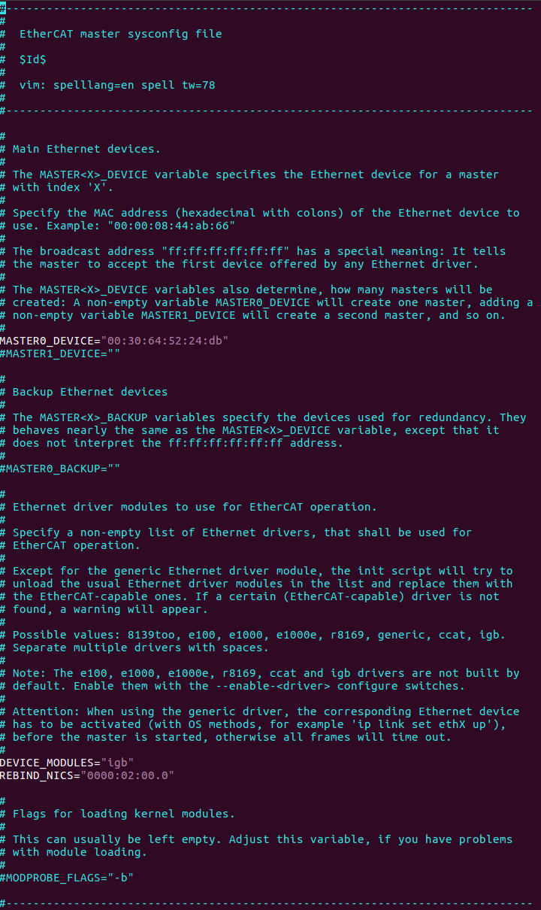

Do the following:

1. Set **REBIND_NICS**. Use `lspci` to query net devices. One of the devices
   might be specified as an EtherCAT network interface.

    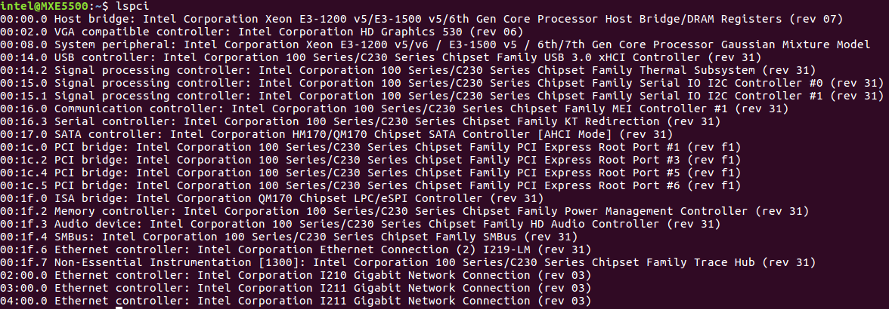

2. Fill the MAC address for **MASTER0_DEVICE**. Get the MAC address of the
   Network Interface Controllers (NICs) selected for EtherCAT.

    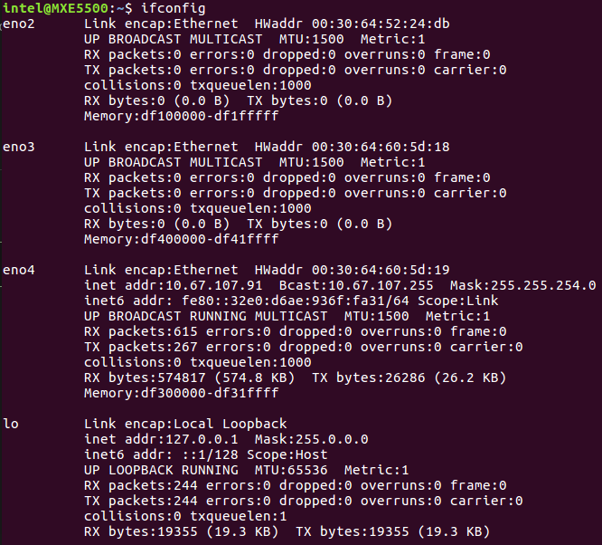

    :::{note}
    EtherCAT Master Stack supports dual master configuration. To configure a
    second master, fill the MAC address for **MASTER1_DEVICE** and add the PCI
    address in **REBIND_NICS**.
    :::

3. Modify **DEVICE_MODULES**:

    - Option 1: Intel Corporation I210 GbE controller EtherCAT driver
      (High performance)

        ```bash
        DEVICE_MODULES="igb"
        ```

    - Option 2: Intel Corporation I225 GbE controller EtherCAT driver
      (High performance)

        ```bash
        DEVICE_MODULES="igc"
        ```

    - Option 3: Intel® Core™ 12th S-Series [Alder Lake] and 11th Gen P-Series
      and U-Series [Tiger Lake] Intel® Atom™ x6000 Series [Elkhart Lake] GbE
      controller EtherCAT driver (High performance)

        ```bash
        DEVICE_MODULES="dwmac_intel"
        ```

    - Fallback: Generic driver as EtherCAT driver (Low performance)

        ```bash
        DEVICE_MODULES="generic"
        ```

#### Start Master as Service

After the `init` script and the `sysconfig` file are ready to configure, and
are placed in the right location, the EtherCAT master can be inserted as a
service. You can use the `init` script to manually start and stop the EtherCAT
master. Execute the `init` script with one of the following parameters:

| Action                    | Command                          |
| ------------------------- | -------------------------------- |
| Start EtherCAT Master     | `/etc/init.d/ethercat start`     |
| Stop EtherCAT Master      | `/etc/init.d/ethercat stop`      |
| Restart EtherCAT Master   | `/etc/init.d/ethercat restart`   |
| Status of EtherCAT Master | `/etc/init.d/ethercat status`    |

### EtherCAT Configuration & Compilation

By default, ECI provides a generic configuration to enable EtherCAT. EtherCAT
stack supports DKMS to build kernel modules whose sources generally reside
outside the kernel source tree.

The source code of the EtherCAT stack can be found at:
`/var/lib/dkms/ighethercat-dkms/1.6/source`

The default configuration of EtherCAT stack is located in a file named
`dkms.conf`. The configuration can be modified as needed.

#### Compiling EtherCAT

1. Change directory to the EtherCAT source:

    ```bash
    cd /var/lib/dkms/ighethercat-dkms/1.6/source
    ```

2. Modify the default configuration of EtherCAT stack located in `dkms.conf`
   as needed.

3. Rebuild the EtherCAT stack using the following commands:

    ```bash
    dkms uninstall ighethercat-dkms -v 1.6
    dkms unbuild ighethercat-dkms -v 1.6
    dkms build ighethercat-dkms -v 1.6
    dkms install ighethercat-dkms -v 1.6
    ```

### Makefile Template for EtherCAT application

Provided below are some Makefile templates for EtherCAT applications. These
templates are provided to build EtherCAT applications without `Makefile.am`.

**Makefile template for PREEMPT-RT kernel**

```makefile
CC     = gcc
CFLAGS = -Wall -O3 -g -D_GNU_SOURCE -D_REENTRANT -fasynchronous-unwind-tables
LIBS   = -lm -lrt -lpthread -lethercat -Wl,--no-as-needed -L/usr/lib

TARGET = test
SRCS   = $(wildcard *.c)

OBJS   = $(SRCS:.c=.o)

$(TARGET):$(OBJS)
        $(CC) -o $@ $^ $(LIBS)

clean:
        rm -rf $(TARGET) $(OBJS)

%.o:%.c
        $(CC) $(CFLAGS) -o $@ -c $<
```

**Makefile template for Dovetail kernel**

```makefile
CC     = gcc
CFLAGS = -Wall -O3 -g -I/usr/include/xenomai/cobalt -I/usr/include/xenomai -D_GNU_SOURCE -D_REENTRANT -fasynchronous-unwind-tables -D__COBALT__ -D__COBALT_WRAP__
LIBS   = -lm -lrt -lpthread -lethercat_rtdm -Wl,--no-as-needed -Wl,@/usr/lib/cobalt.wrappers -Wl,@/usr/lib/modechk.wrappers  /usr/lib/xenomai/bootstrap.o -Wl,--wrap=main -Wl,--dynamic-list=/usr/lib/dynlist.ld -L/usr/lib -lcobalt -lmodechk

TARGET = test
SRCS   = $(wildcard *.c)

OBJS   = $(SRCS:.c=.o)

$(TARGET):$(OBJS)
        $(CC) -o $@ $^ $(LIBS)

clean:
        rm -rf $(TARGET) $(OBJS)

%.o:%.c
        $(CC) $(CFLAGS) -o $@ -c $<
```

### Multi-Axis Synchronization System (MASS)

The following figure shows the setup of Multi-Axis Synchronization System
(MASS).

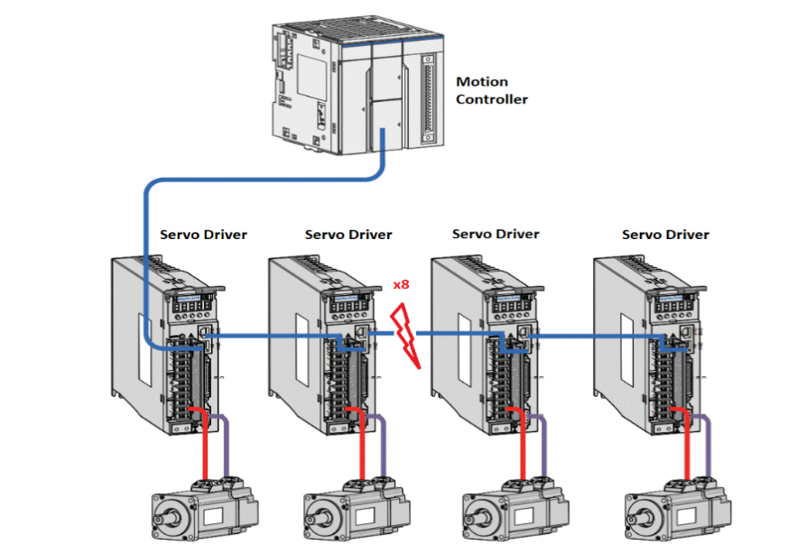

This system setup includes motion controller, servo driver, motors, and
software. The Motion Controller is an Intel-based system with ECI enabled. The
Motion Controller connects eight servo drivers. The system runs a program to
control six servo motors (three pairs) simultaneously through EtherCAT to
control pencil leads to rotate and move horizontally and vertically.

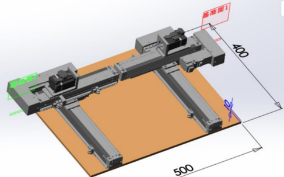

Two other servo motors are controlled simultaneously through EtherCAT to draw
a circle.

Test binary will be released in
`/opt/ighethercat/examples/ec_multi_axis_example`.

#### EtherCAT Control Loop and Time Measurement

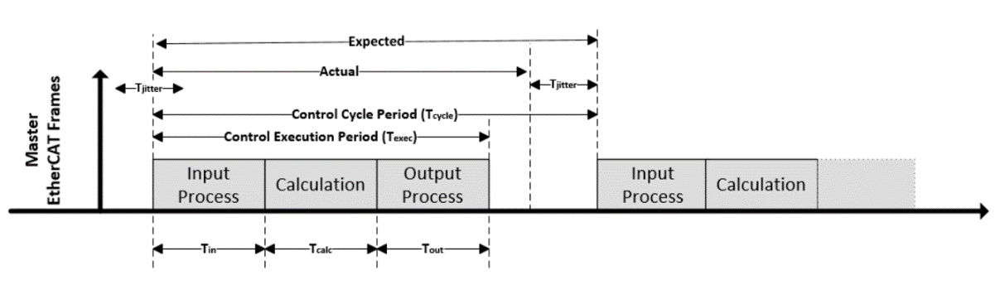

## EtherCAT Sanity Checks

### Sanity Check #1: EtherCAT Master Start

1. Start EtherCAT Master:

    ```bash
    /etc/init.d/ethercat start
    ```

    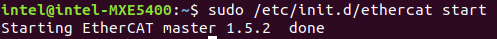

2. Check Master information:

    ```bash
    ethercat master
    ```

    **Expected output**

    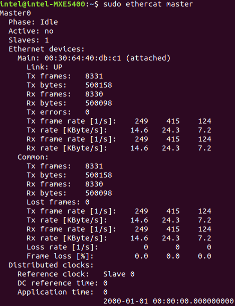

### Sanity Check #2: EtherCAT Master Scan

1. Start EtherCAT Master:

    ```bash
    /etc/init.d/ethercat start
    ```

2. Scan EtherCAT Slave:

    ```bash
    ethercat rescan
    ```

3. Check slaves on the bus:

    ```bash
    ethercat slaves
    ```

    **Expected output**

    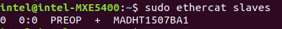

### Sanity Check #3: MASS Platform Performance Collection

1. Use an EtherCAT network cable to connect the MASS platform and the
   Controller, in specific the EtherCAT network interface. Power up the MASS
   platform.

2. Start EtherCAT Master:

    ```bash
    /etc/init.d/ethercat start
    ```

3. Check the EtherCAT bus to make sure that eight EtherCAT slaves are scanned
   and stay on PREOP status.

    ```bash
    ethercat slaves
    ```

    **Expected output**

    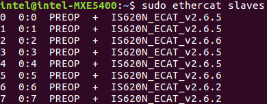

4. Start `/opt/ighethercat/examples/ec_multi_axis_example -r` to collect
   real-time performance:

    ```bash
    /opt/ighethercat/examples/ec_multi_axis_example -r
    ```

    **Expected output**

    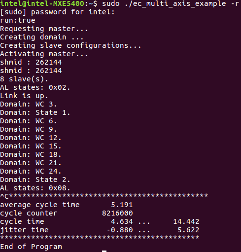

:::{tip}
Useful command parameters:

```console
-r      Motor start running
-t      Set measure time for minutes, default is no time limitation
```
:::

## EtherCAT over DPDK

### EtherCAT over DPDK Overview

EtherCAT over DPDK optimizes the IgH EtherCAT Master Stack running in user
space on Preempt RT. It keeps all APIs from the original IgH EtherCAT Master
stack to seamlessly support EtherCAT application programs. Furthermore, it is
easy to containerize the EtherCAT stack for Virtual PLC applications.

### EtherCAT over DPDK Features

The following features are verified:

- Support on Preempt-RT
- Support PDO/SDO upload/download
- Support COE/SOE profiles
- Support DC
- Support multiple masters

### EtherCAT over DPDK Installation

**Install from meta-package**

```bash
sudo apt install eci-softplc-fieldbus
```

**Install from individual Deb packages**

```bash
# For preempt-rt kernel
sudo apt install ighethercat-dpdk ighethercat-dpdk-examples ecat-enablekit-dpdk
```

### EtherCAT over DPDK Configuration

**Binding VFIO driver**

EtherCAT over DPDK provides the `dpdk-driver-bind.sh` script, which is
installed in `/usr/sbin` to bind the `vfio` driver for the EtherCAT port.

Command to bind the vfio driver:

```bash
dpdk-driver-bind.sh start <PCIe BDF address>
```

Command to unbind the vfio driver:

```bash
dpdk-driver-bind.sh stop <PCIe BDF address>
```

**EtherCAT Sysconfig File**

EtherCAT over DPDK provides an `ecrt.conf` configuration file, which is
installed at `/etc/sysconfig`. Users shall configure the file for one or more
masters per request. Configuration details are as below:

- `master_id`: It is the identification to match a group of configurations for
  a specific EtherCAT application.

- `master_mac`: It is used to specify the Ethernet MAC address of the EtherCAT
  port for the EtherCAT application.

- `debug_level`: It is used to configure the debug level, and its valid value
  is 0-2.

- `drv_argv`: It supports adding extra EAL parameters for the DPDK framework,
  please refer to
  [EAL parameters](https://doc.dpdk.org/guides/linux_gsg/linux_eal_parameters.html).

**EtherCAT Tool**

As EtherCAT over DPDK supports single-core mode, the EtherCAT master stack
starts with the EtherCAT application by the direct lib call. That is, the
EtherCAT tool cannot run independently but starts with the EtherCAT
application as well. Here, EtherCAT over DPDK provides the `ec_debug_example`
application for debugging purposes. This application only starts the EtherCAT
stack without any other workload. Then users can use the EtherCAT tool to
debug the stack as in the steps below:

```bash
/opt/ighethercat/examples/ec_debug_example -m <master id>
ethercat master
```

## Real-Time Vision with EtherCAT

Real-time vision provides a deterministic way to complete synchronization
between motion control and image capture even when the object is moving at a
high speed. The stopping time can be saved, thus improving efficiency and
productivity.

The key to achieving the synchronization is the time-aware IO. An EtherCAT IO
with timestamping can be utilized to trigger a deterministic capture for an
accurate image. You can also apply Time-aware GPIO by following the guidelines
for TCC TGPIO. Then, machine vision can process the accurate image to provide
a precise position offset and angle offset for the next-step motion control.

### Usage Case

The following figure shows an example of a SMT production line.

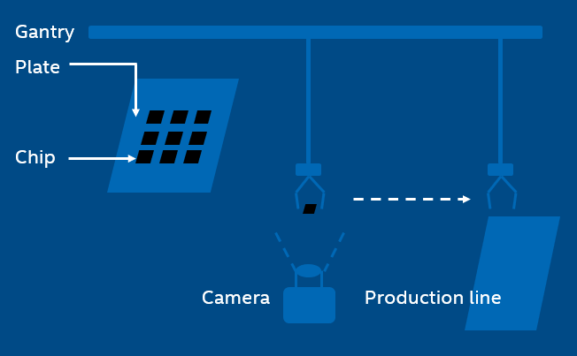

In the SMT production line, the gantry with a sucker sucks a chip from the
plate and then mounts it on the PCB. However, it is not always able to hit the
expected point and the expected angle of the chip during the suction.

Even a little shift can lead to deviation, making it impossible to mount the
chip in the right place later. After image capturing, machine vision helps to
compute the position/angle offset value of the chip for perfect mounting.

In the traditional way, the gantry will stop above the camera and wait for a
while for image capturing. This is not necessary when applying real-time
vision, thus improving efficiency significantly.

### Work Flow

The application controls the motion by EtherCAT and synchronizes with IO. When
reaching the target timing, IO will trigger the camera to capture an image.
The image is then processed with machine vision to provide the position value
and the angle value. By data exchange, the application continues the motion
control with position information.

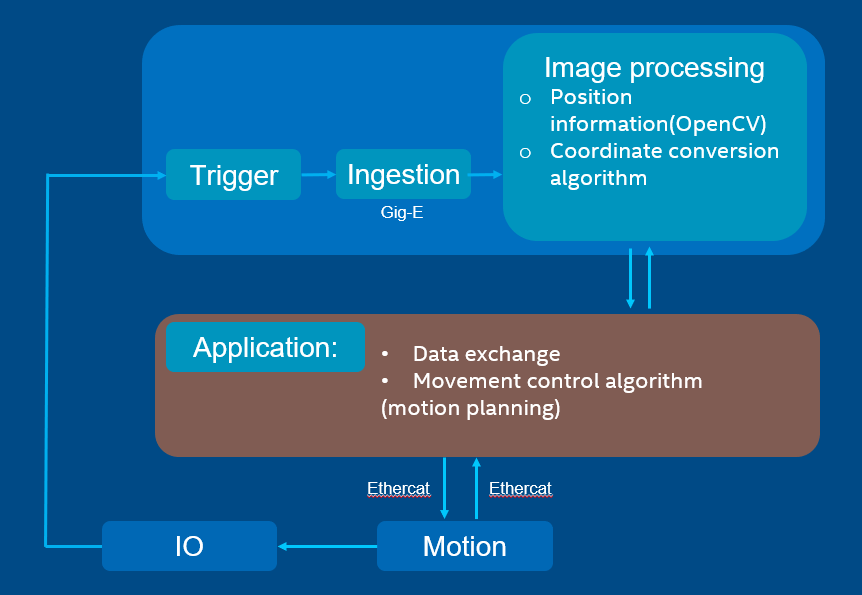

### Solution Principle

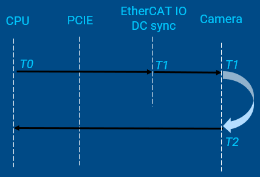

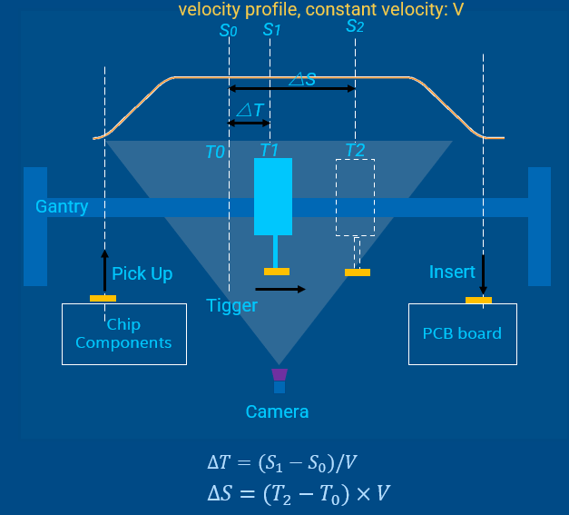

- `T0` is the time when the CPU sends the shooting command
- `S0` is the position to prepare trigger shooting, which can be read in a
  cyclic task. It corresponds to `T0`
- `T1` is the time to trigger the picture shooting
- `S1` is the expected fixed position to trigger shooting
- `△T` can be calculated with `∆𝑇=(𝑆_1−𝑆_0)/𝑉`
- `T2` is the time when the image is captured on CMOS
- `S2` reflects the real position where the image is captured
- The time between `T2` and `T1` is used for camera exposure and image
  generating
- Real-time vision should make the time intervals `(T2 - T1)` and `(T1 – T0)`
  deterministic

### Example Demonstration

The demo code is integrated into the IgH EtherCAT stack components as an
example and is in
`/usr/src/ighethercat-dkms-1.6/examples/fly_trigger_poc`.
