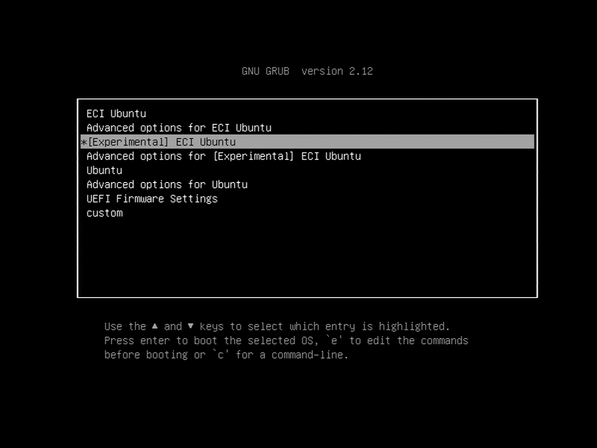
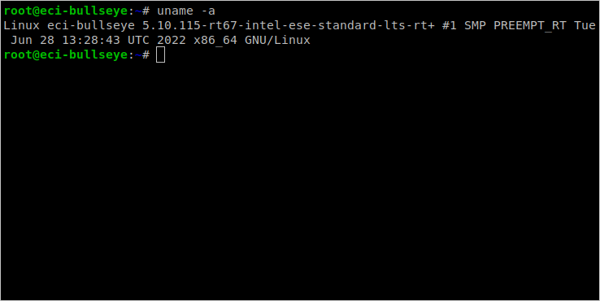

# Real-time Linux

This guide explains how to install and verify Intel's real-time Linux kernel
(PREEMPT_RT) from the ECI package repository. It walks through setting up the
repository, installing the `eci-customizations` meta-package and the
`linux-intel-rt` kernel, and confirming the real-time kernel is active after
reboot. It also covers benchmarking system determinism with the Cyclictest
workload and interpreting its latency results.

## Setup ECI Package Repository

```{include} fragment_setup_eci_repository.md
```

## Install Real-time Linux Kernel

1. The ECI package repository provides Deb packages named `customizations-*`
   which add a GRUB menu entry for the real-time kernel and prepare the system
   to be deterministic. Install these packages using the `eci-customizations`
   meta-package:

    ```bash
    sudo apt install -y eci-customizations
    ```

2. The ECI package repository provides a firmware package which backports updates
   from upstream to bring better hardware support to the OS distribution.
   Install this package:

    ```bash
    sudo apt-get reinstall '(firmware-linux-nonfree|linux-firmware$)'
    ```

3. Next, install the real-time Linux kernel.

    **Linux Intel LTS PREEMPT_RT kernel** is Intel's Long-Term-Support Linux
    kernel with PREEMPT_RT patches, which is closely tied to the OS
    distribution.

    ```bash
    sudo apt install -y linux-intel-rt
    ```

    :::{note}
    The ECI package repository also provides a Linux kernel newer than the LTS
    version, which supports the latest silicon ahead of the OS distribution.
    This Linux kernel is postfixed with `-experimental` in the package name.
    Install this Linux kernel for the latest silicon support.
    :::

    ```bash
    sudo apt install -y linux-intel-rt-experimental
    ```
    :::{attention}
    Please review the
    [Canonical Intellectual property rights policy](https://ubuntu.com/legal/intellectual-property-policy)
    regarding Ubuntu\*. Note that any redistribution of modified versions of
    Ubuntu must be approved, certified, or provided by Canonical if you are
    going to associate it with the Trademarks. Otherwise you must remove and
    replace the Trademarks and will need to recompile the source code to create
    your own binaries.
    :::

4. Reboot the system.

    ```bash
    sudo reboot
    ```

## Verify the Real-time Linux kernel

1. Reboot the target system, if not already done. When the system boots to the
   GRUB menu, there should be a menu entry for ECI at the top of the GRUB menu
   list. Select this menu entry, or wait five seconds for this menu entry to
   automatically boot.

    

2. Let the system boot normally.

    :::{note}
    If the system does not boot, then secure boot may be enabled in the BIOS.
    You may either disable secure boot in the BIOS, or sign the Linux kernel.
    :::

3. Login to the system and verify that the Linux\* Intel LTS PREEMPT_RT
   kernel is active by running the command `uname -a`. The output of this
   command should contain the following based on which kernel was installed:

    - Linux Intel LTS PREEMPT_RT kernel:
      `...-intel-ese-standard-lts-rt+ #1 SMP PREEMPT_RT ...`

    

## Verify Benchmark Performance

After installing and verifying the real-time Linux kernel, it's a good idea to
benchmark the system to establish confidence that the system is properly
configured. This section will guide you through some basic benchmarks you can
use to evaluate your system.

### Cyclictest Workload

| Benchmark | Units | Source |
|---|---|---|
| Cyclictest | microseconds | <https://github.com/jlelli/rt-tests> |

Cyclictest is most commonly used for benchmarking real-time (RT) systems. It is
one of the most frequently used tools for evaluating the relative performance of
an RT. Cyclictest accurately and repeatedly measures the difference between a
thread's intended wake-up time and the time at which it actually wakes up to
provide statistics about the system's latency. It can measure latency in
real-time systems caused by the hardware, the firmware, and the operating
system.

#### Install Cyclictest Workload

Perform the following command to install this component:

```bash
sudo apt install rt-tests-scripts
```

#### Execute Cyclictest Workload

An example script that runs the cyclictest benchmark and the README is available
at `/opt/benchmarking/rt-tests`. The script performs the following runtime
optimizations before executing the benchmark:

- Assigns benchmark thread affinity to last isolated core (typically core 3)
- Assigns non-benchmark thread affinity to core 0
- Changes the priority of benchmark thread to 95 (using: `chrt -f 95`)
- Disables kernel machine check interrupt
- Increases thread runtime utilization to infinity

To start the benchmark, run the following command:

```bash
sudo /opt/benchmarking/rt-tests/start-cyclic.py
```

Default parameters are used unless otherwise specified. Run the script with
`--help` to list the modifiable arguments.

#### Interpret Cyclictest Results

| Short | Explanation |
|---|---|
| T | Thread: Thread index and thread ID |
| P | Priority: RT thread priority |
| I | Interval: Intended wake up period for the latency measuring threads |
| C | Count: Number of times the latency was measured that is, iteration count |
| Min | Minimum: Minimum latency that was measured |
| Act | Actual: Latency measured during the latest completed iteration |
| Avg | Average: Average latency that was measured |
| Max | Maximum: Maximum latency that was measured |

On a **non-realtime** system, the result might be similar to the following:

```console
T: 0 ( 3431) P:99 I:1000 C: 100000 Min:      5 Act:   10 Avg:   14 Max:   39242
T: 1 ( 3432) P:98 I:1500 C:  66934 Min:      4 Act:   10 Avg:   17 Max:   39661
```

The right-most column contains the most important result, that is, the
worst-case latency of 39.242 ms / 39242 us (**Max** value).

On a **realtime-enabled** system, the result might be similar to the following:

```console
T: 0 ( 3407) P:99 I:1000 C: 100000 Min:      7 Act:   10 Avg:   10 Max:      18
T: 1 ( 3408) P:98 I:1500 C:  67043 Min:      7 Act:    8 Avg:   10 Max:      22
```

This result indicates an apparent short-term worst-case latency of 18 us.
According to this, it is important to pay attention to the **Max** values as
these are indicators of *outliers*. Even if the system has decent **Avg**
(average) values, a single outlier as indicated by **Max** is enough to break or
disturb a real-time system.

## Build a Custom Real-time Kernel

Use this procedure when the packaged real-time kernel needs a custom
configuration. Building and installing a custom kernel is an advanced task;
keep a known working kernel available in GRUB before installing the new
packages.

### Prepare the Build Environment

Install the build dependencies:

```bash
sudo apt-get install git fakeroot build-essential ncurses-dev xz-utils \
    libssl-dev bc flex libelf-dev bison debhelper
```

### Download the Kernel Source

Download the source package for the installed kernel series. Use the
experimental package when building for the latest silicon support:

```bash
sudo apt-get source linux-intel-rt-experimental
cd linux-intel-rt-experimental*
```

For the Intel LTS kernel, use the following instead:

```bash
sudo apt-get source linux-intel-rt
cd linux-intel-rt*
```

### Configure the Kernel

Start from the configuration installed with the matching real-time kernel. The
configuration is available under `/boot/`; copy the matching `config-*-intel-*`
file into the source directory before making changes.

The real-time configuration enables settings such as `CONFIG_PREEMPT_RT`, CPU
isolation, RCU callback offloading, tickless scheduling, and the performance CPU
frequency governor. Update the default configuration, then make any required
changes interactively:

```bash
make olddefconfig
make menuconfig
```


| kernel config fragment overrides (.cfg) | Comments |
|---|---|
| `CONFIG_HZ_250=y`<br>`CONFIG_NO_HZ=n`<br>`CONFIG_NO_HZ_FULL=y`<br>`CONFIG_NO_HZ_IDLE=n`<br>`CONFIG_ACPI_PROCESSOR=y`<br>`CONFIG_CPU_FREQ_GOV_ONDEMAND=n`<br>`CONFIG_CPU_FREQ_DEFAULT_GOV_ONDEMAND=n`<br>`CONFIG_CPU_FREQ_DEFAULT_GOV_PERFORMANCE=y`<br>`CONFIG_CPU_FREQ=y`<br>`CONFIG_CPU_IDLE=y` | Reduce task scheduling-clock overhead and disable CPU governor Linux OS features |
| `ARCH_SUSPEND_POSSIBLE=y`<br>`CONFIG_SUSPEND=y`<br>`CONFIG_PM=y` | Linux OS power-management runtime features |
| `CONFIG_VIRT_CPU_ACCOUNTING=y`<br>`CONFIG_VIRT_CPU_ACCOUNTING_GEN=y` | Enable more accurate task and CPU time accounting |
| `CONFIG_CPU_ISOLATION=y`<br>`CONFIG_RCU_NOCB_CPU=y`<br>`CONFIG_PREEMPT_RCU=y`<br>`CONFIG_PREEMPT_LAZY=y`<br>`CONFIG_PREEMPT_RT=y` | Enable more preemptive task scheduling policies and CPU temporal-isolation |

Changing kernel options can produce a non-functional kernel. Leave an option at
its default value unless its effect and dependency are understood.

### Build and Install

Build Debian packages from the configured source tree:

```bash
cp build-full/ltsintelrelease .
make ARCH=x86 bindeb-pkg
```

Install the generated packages and regenerate the GRUB configuration:

```bash
sudo dpkg -i ../*.deb
sudo update-grub
```

If package installation fails because the running kernel is being replaced,
boot a different installed kernel from GRUB and rerun the installation command.
Do not force installation of a kernel package that is actively in use.

Reboot and verify the active kernel:

```bash
sudo reboot
uname -mrs
```

### Build `cpupower` from Kernel Source

`cpupower` manages and monitors CPU frequency, governor, C-state, P-state, and
Turbo Boost settings. To build it from the same kernel source tree, first
install its dependencies:

```bash
sudo apt install -y make build-essential libpci-dev libcap-dev gettext libncurses-dev
```

Then build and install the tool:

```bash
cd tools/power/cpupower
make
sudo make install
```
