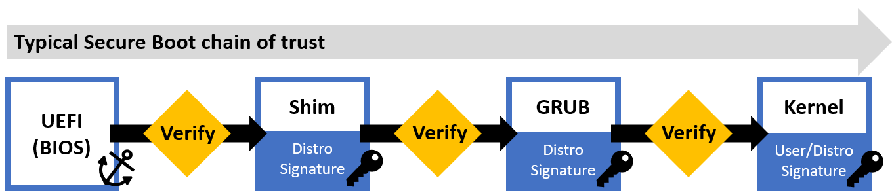
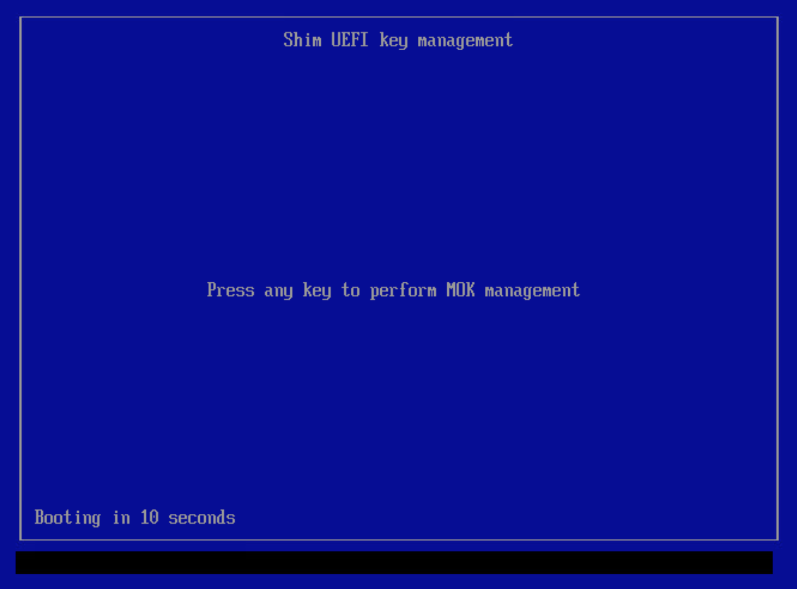
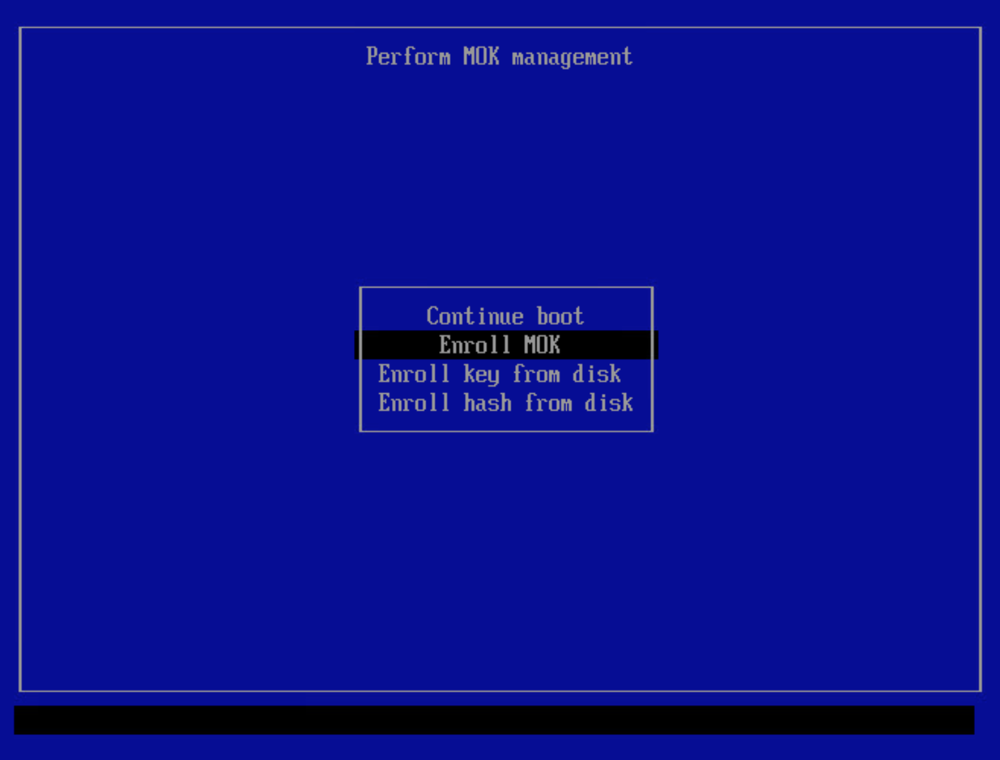
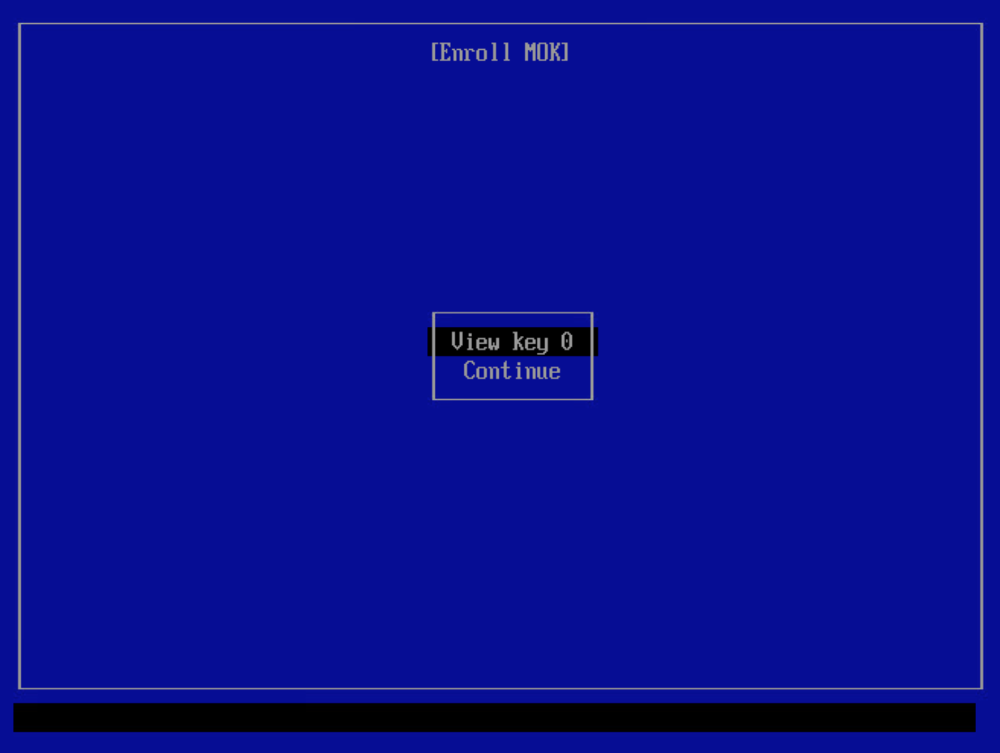
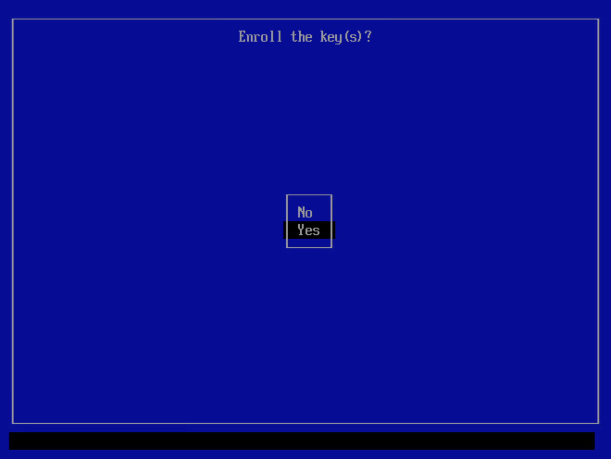
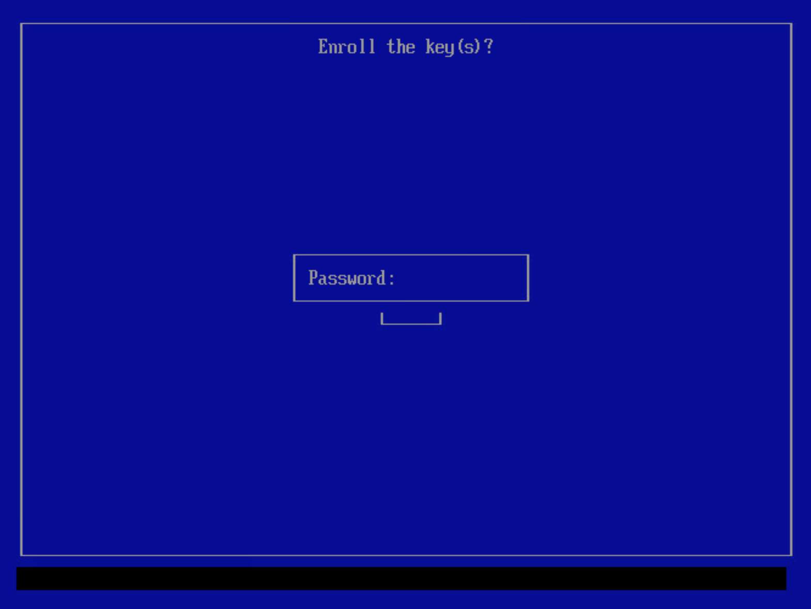
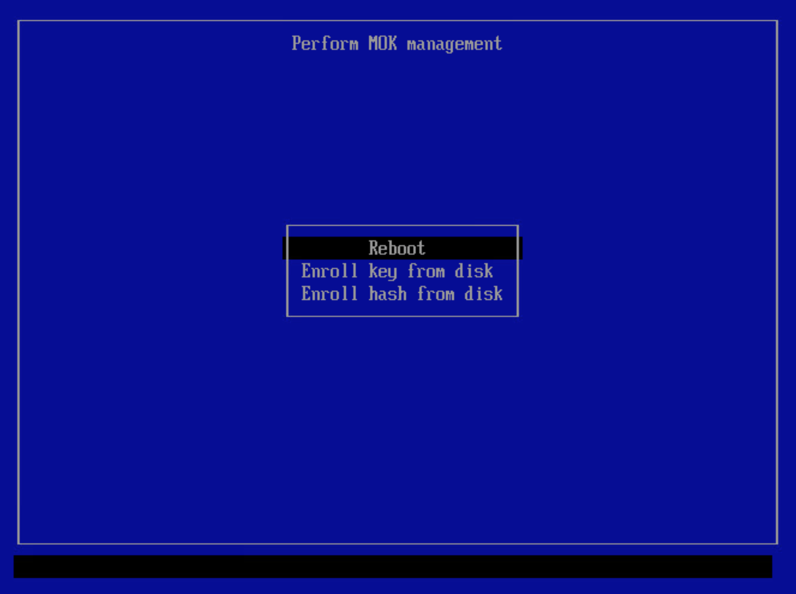
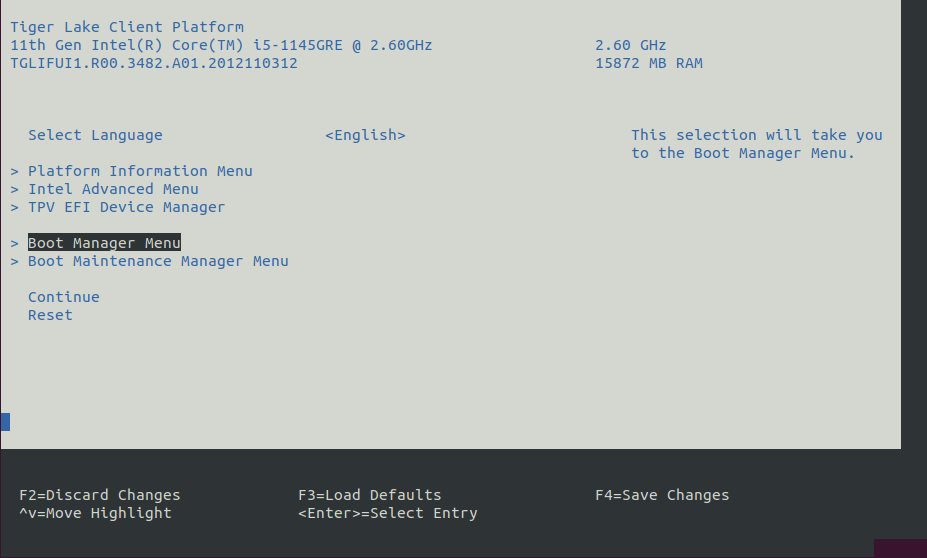
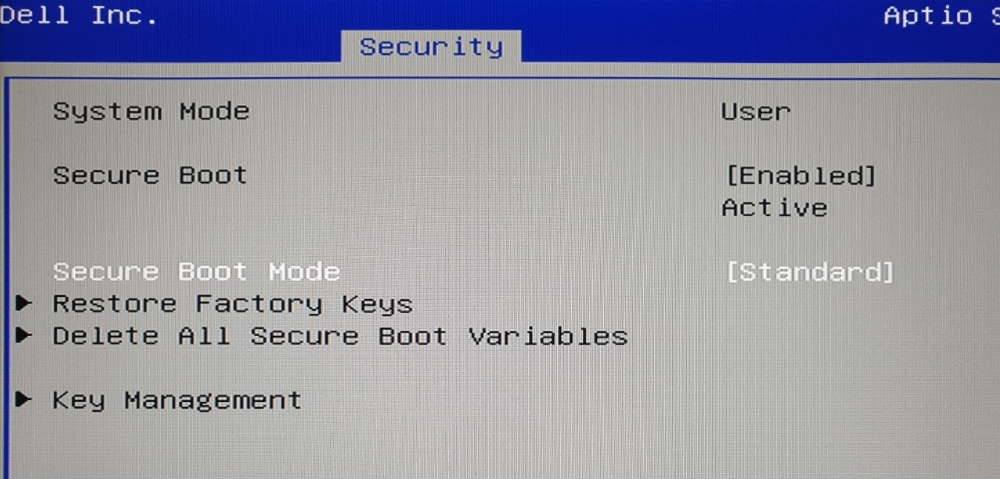
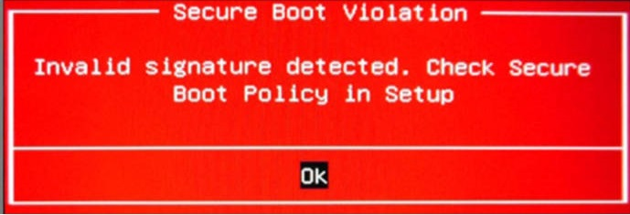

# UEFI Secure Boot

UEFI Secure Boot is a security standard designed to make sure that a device boots using only software that is trusted. It prevents a class of attacks in which the attacker modifies the system software, rendering it untrustworthy. When UEFI Secure Boot is enabled, the system firmware (BIOS) requires that all software involved during the boot process (EFI applications, bootloaders [GRUB], kernel) are signed by an authorized signer. The signature of each boot component is verified as they are loaded, forming a chain of trust. If any signature is found to be invalid (or nonexistent), the boot process terminates, thereby preventing unauthorized software from being used during the boot process.



Upon boot, if Secure Boot is enabled, the UEFI will verify the first stage bootloader (Shim). If verification passes, the shim will verify and launch the GRUB bootloader, which verifies and starts the Linux kernel. At this point, the system will have fully booted. As an optional measure of extra security, kernel modules can also be signed and verified by the kernel. Note: The implementation of Secure Boot described in this guide does not cover signed kernel modules.

## Enabling UEFI Secure Boot

This guide will help you enable Secure Boot on your system a Linux kernel.

1. Install the necessary tools and signed bootloader packages:

   ```bash
   sudo apt install openssl sbsigntool efitools mokutil shim-signed grub-efi-amd64-signed
   ```

2. Create a new private key and certificate pair which will be used to sign an authenticate the Linux kernel. You will be asked to `Enter PEM pass phrase:`. You may use any phrase. This phrase is needed to decrypt the private key and will be requested throughout the remaining steps.

   ```bash
   sudo openssl req --new -x509 -newkey rsa:2048 -keyout MOK.priv -outform DER -out MOK.der -days 36500 -subj "/CN=ECI/"
   ```

   There should be two files, `MOK.der` and `MOK.priv`, available upon creation:

   ```console
   $ ls MOK*
   MOK.der  MOK.priv
   ```

3. Convert the certificate from `DER` format to `PEM` format:

   ```bash
   sudo openssl x509 -inform der -in MOK.der -out MOK.pem
   ```

   There should be a new file named `MOK.priv` available after conversion.

4. Sign the currently booted Linux kernel with the certificate. You will be prompted to `Enter PEM pass phrase`. Enter the phrase used to create the certificate.

   ```bash
   sudo sbsign --key MOK.priv --cert MOK.pem  "/boot/vmlinuz-$(uname -r)" --output "/boot/vmlinuz-$(uname -r)-signed"
   ```

   There should be a new kernel file with `-signed` appended to the name. This is the signed kernel which will be loaded during the Secure Boot chain.

   ```console
   $ ls /boot/vmlinuz-$(uname -r)*
   /boot/vmlinuz-5.10.115-rt67-intel-ese-standard-lts-rt+
   /boot/vmlinuz-5.10.115-rt67-intel-ese-standard-lts-rt+-signed
   ```

   > **NOTE:** The `$(uname -r)` command is used to capture the name of the current booted Linux kernel. If you want to use a different Linux kernel for Secure Boot, then modify the command to use the different Linux kernel name.

5. Update the GRUB configuration to add the signed Linux kernel to the boot menu:

   ```bash
   sudo update-grub
   ```

6. Use the `mokutil` tool to queue the certificate to be enrolled as a Machine Owner Key. This will enable the signed Linux kernel to be authenticated during the boot process. You will be prompted to `input password:`. Enter the phrase used to create the certificate.

   ```bash
   sudo mokutil --import MOK.der
   ```

   You can verify that the certificate is queued for enrollment using the following command:

   ```bash
   sudo mokutil --list-new
   ```

7. Reboot the system to complete the certificate enrollment:

   ```bash
   sudo reboot
   ```

   The Machine Owner Key management occurs during boot time before the Linux kernel has been started. A direct connection or virtual console is required. It is not possible to SSH into the machine at this point. Once the Shim UEFI key management screen is present, a key must be pressed to enter Machine Owner Key management. If this opportunity is missed, the key must be enrolled again (once Linux has booted up) using the instructions above.

   

   If the UEFI key manager does not appear after rebooting, see [UEFI key manager does not appear](#uefi-key-manager-does-not-appear) for troubleshooting steps.

8. After entering the management tool, select `Enroll MOK` to enroll the queued certificate:

   

9. The tool will list the certificates queued for enrollment. You may view the certificates if you like. When ready, select `Continue`.

   

10. Select `Yes` to enroll the certificates.

    

11. You will be prompted to input a password. Enter the phrase used to create the certificate.

    

12. Select `Reboot` to reboot the system with the new certificate enrolled.

    

13. As the system is rebooting, access the BIOS (typically pressing the <kbd>Delete</kbd> or <kbd>F2</kbd> keys while booting will open the BIOS menu).

    

14. Navigate to the Secure Boot section in the BIOS. Each BIOS is different, but typically there is a menu labeled `Security` or `Secure Boot`. Enable `Secure Boot`. Note, `Secure Boot Mode` can be set to any value, as this will not impact the enrolled certificate.

    

15. Save and exit the BIOS to boot the system with Secure Boot enabled. When the GRUB bootloader appears, select the signed Linux kernel. You may need to enter an `Advanced options` menu if the signed Linux kernel is not immediately present in the list. Note, on Ubuntu-based systems, you may need to press <kbd>Esc</kbd> at boot to get the GRUB bootloader to appear.

    If the bootloader does not appear and/or you receive an error message about a Secure Boot violation, then it is possible the Debian/Ubuntu distribution certificate is not enrolled. Normally the distribution certificate is enrolled when the distribution is installed for the first time, but this could be missing in the case of virtualized systems or other edge cases. See [Enrolling distribution certificate](#enrolling-distribution-certificate) for troubleshooting steps.

16. After the system is booted, login and verify that Secure Boot is enabled:

    ```bash
    mokutil --sb-state
    ```

    If Secure Boot is successfully enabled, the command will print `SecureBoot enabled`.

    ```console
    $ mokutil --sb-state
      SecureBoot enabled
    ```

## Troubleshooting UEFI Secure Boot

You may encounter trouble when enabling UEFI Secure Boot. The topics below present typical solutions to the most common problems.

### UEFI key manager does not appear

The UEFI key manager is part of the Shim bootloader. Therefore, if the Shim bootloader is not invoked, the UEFI key manager will not appear. In this situation, the most probable cause is that the Shim boot loader is not the first entry in the UEFI boot list (not to be confused with the GRUB menu). The solution is to simply reorder the UEFI boot list such that the Shim bootloader is first.

1. Boot into Linux and open a terminal.

2. Verify the current UEFI boot list and order:

   ```bash
   efibootmgr -v
   ```

   The command will output something similar to the following:

   ```console
   BootCurrent: 0000
   Timeout: 3 seconds
   BootOrder: 0001,0000
   Boot0000* debian	HD(1,GPT,4627fcc1-6782-4594-8b41-8014d1131769,0x800,0x100000)/File(\EFI\DEBIAN\SHIMX64.EFI)
   Boot0001* debian	HD(1,GPT,4627fcc1-6782-4594-8b41-8014d1131769,0x800,0x100000)/File(\EFI\DEBIAN\GRUBX64.EFI)..BO
   ```

   In this example, the `BootOrder` is listed as `0001,0000`. The Shim bootloader is associated to `Boot0000`, and GRUB is associated to `Boot0001`. Since `0001` appears before `0000` in the `BootOrder`, the system is currently configured to boot GRUB before the Shim bootloader. The `BootOrder` needs to be modified to boot the Shim `0000` before GRUB `0001`.

3. Modify the UEFI boot list so the Shim bootloader is first:

   ```bash
   sudo efibootmgr -o 0000,0001
   ```

4. Verify the changes have been applied:

   ```bash
   efibootmgr -v
   ```

   ```console
   BootCurrent: 0000
   Timeout: 3 seconds
   BootOrder: 0000,0001
   Boot0000* debian	HD(1,GPT,4627fcc1-6782-4594-8b41-8014d1131769,0x800,0x100000)/File(\EFI\DEBIAN\SHIMX64.EFI)
   Boot0001* debian	HD(1,GPT,4627fcc1-6782-4594-8b41-8014d1131769,0x800,0x100000)/File(\EFI\DEBIAN\GRUBX64.EFI)..BO
   ```

5. Reboot the system to boot the Shim bootloader, and subsequently the UEFI key manager.

   ```bash
   sudo reboot
   ```

### Enrolling distribution certificate

If the bootloader does not appear and/or you receive an error message about a Secure Boot violation, then it is possible the Debian/Ubuntu distribution certificate is not enrolled. Normally the distribution certificate is enrolled when the distribution is installed for the first time, but this could be missing in the case of virtualized systems or other edge cases.



The solution is to enroll the distribution certificate so that the signed Shim and GRUB bootloaders can be authenticated.

1. Disable Secure Boot in the BIOS, boot into Linux normally, and open a terminal.

2. Create the distribution certificate file. Select the tab corresponding to your distribution:

   <!--hide_directive::::{tab-set}hide_directive-->
   <!--hide_directive:::{tab-item}hide_directive--> **Debian Distribution**
   <!--hide_directive:sync: debianhide_directive-->

   Execute the following command to create the distribution certificate for Debian:

   ```bash
   echo '-----BEGIN CERTIFICATE-----
   MIIDnjCCAoagAwIBAgIRAO1UodWvh0iUjZ+JMu6cfDQwDQYJKoZIhvcNAQELBQAw
   IDEeMBwGA1UEAxMVRGViaWFuIFNlY3VyZSBCb290IENBMB4XDTE2MDgxNjE4MDkx
   OFoXDTQ2MDgwOTE4MDkxOFowIDEeMBwGA1UEAxMVRGViaWFuIFNlY3VyZSBCb290
   IENBMIIBIjANBgkqhkiG9w0BAQEFAAOCAQ8AMIIBCgKCAQEAnZXUi5vaEKwuyoI3
   waTLSsMbQpPCeinTbt1kr4Cv6maiG2GcgwzFa7k1Jf/F++gpQ97OSz3GEk2x7yZD
   lWjNBBH+wiSb3hTYhlHoOEO9sZoV5Qhr+FRQi7NLX/wU5DVQfAux4gOEqDZI5IDo
   6p/6v8UYe17OHL4sgHhJNRXAIc/vZtWKlggrZi9IF7Hn7IKPB+bK4F9xJDlQCo7R
   cihQpZ0h9ONhugkDZsjfTiY2CxUPYx8rr6vEKKJWZIWNplVBrjyIld3Qbdkp29jE
   aLX89FeJaxTb4O/uQA1iH+pY1KPYugOmly7FaxOkkXemta0jp+sKSRRGfHbpnjK0
   ia9XeQIDAQABo4HSMIHPMEEGCCsGAQUFBwEBBDUwMzAxBggrBgEFBQcwAoYlaHR0
   cHM6Ly9kc2EuZGViaWFuLm9yZy9zZWN1cmUtYm9vdC1jYTAfBgNVHSMEGDAWgBRs
   zs5+TGwNH2FJ890n38xcu0GeoTAUBglghkgBhvhCAQEBAf8EBAMCAPcwEwYDVR0l
   BAwwCgYIKwYBBQUHAwMwDgYDVR0PAQH/BAQDAgGGMA8GA1UdEwEB/wQFMAMBAf8w
   HQYDVR0OBBYEFGzOzn5MbA0fYUnz3SffzFy7QZ6hMA0GCSqGSIb3DQEBCwUAA4IB
   AQB3lj5Hyc4Jz4uJzlntJg4mC7mtqSu9oeuIeQL/Md7+9WoH72ETEXAev5xOZmzh
   YhKXAVdlR91Kxvf03qjxE2LMg1esPKaRFa9VJnJpLhTN3U2z0WAkLTJPGWwRXvKj
   8qFfYg8wrq3xSGZkfTZEDQY0PS6vjp3DrcKR2Dfg7npfgjtnjgCKxKTfNRbCcitM
   UdeTk566CA1Zl/LiKaBETeru+D4CYMoVz06aJZGEP7dax+68a4Cj2f2ybXoeYxTr
   7/GwQCXV6A6B62v3y//lIQAiLC6aNWASS1tfOEaEDAacz3KTYhjuXJjWs30GJTmV
   305gdrAGewiwbuNknyFWrTkP
   -----END CERTIFICATE-----' | \
   openssl x509 -inform pem -out distribution.der -outform DER
   ```

   <!--hide_directive:::hide_directive-->
   <!--hide_directive:::{tab-item}hide_directive--> **Ubuntu Distribution**
   <!--hide_directive:sync: ubuntuhide_directive-->

   Execute the following command to create the distribution certificate for Ubuntu:

   ```bash
   echo '-----BEGIN CERTIFICATE-----
   MIIENDCCAxygAwIBAgIJALlBJKAYLJJnMA0GCSqGSIb3DQEBCwUAMIGEMQswCQYD
   VQQGEwJHQjEUMBIGA1UECAwLSXNsZSBvZiBNYW4xEDAOBgNVBAcMB0RvdWdsYXMx
   FzAVBgNVBAoMDkNhbm9uaWNhbCBMdGQuMTQwMgYDVQQDDCtDYW5vbmljYWwgTHRk
   LiBNYXN0ZXIgQ2VydGlmaWNhdGUgQXV0aG9yaXR5MB4XDTEyMDQxMjExMTI1MVoX
   DTQyMDQxMTExMTI1MVowgYQxCzAJBgNVBAYTAkdCMRQwEgYDVQQIDAtJc2xlIG9m
   IE1hbjEQMA4GA1UEBwwHRG91Z2xhczEXMBUGA1UECgwOQ2Fub25pY2FsIEx0ZC4x
   NDAyBgNVBAMMK0Nhbm9uaWNhbCBMdGQuIE1hc3RlciBDZXJ0aWZpY2F0ZSBBdXRo
   b3JpdHkwggEiMA0GCSqGSIb3DQEBAQUAA4IBDwAwggEKAoIBAQC/WzoWdO4hXa5h
   7Z1WrL3e3nLz3X4tTGIPrMBtSAgRz42L+2EfJ8wRbtlVPTlU60A7sbvihTR5yvd7
   v7p6yBAtGX2tWc+m1OlOD9quUupMnpDOxpkNTmdleF350dU4Skp6j5OcfxqjhdvO
   +ov3wqIhLZtUQTUQVxONbLwpBlBKfuqZqWinO8cHGzKeoBmHDnm7aJktfpNS5fbr
   yZv5K+24aEm82ZVQQFvFsnGq61xX3nH5QArdW6wehC1QGlLW4fNrbpBkT1u06yDk
   YRDaWvDq5ELXAcT+IR/ZucBUlUKBUnIfSWR6yGwk8QhwC02loDLRoBxXqE3jr6WO
   BQU+EEOhAgMBAAGjgaYwgaMwHQYDVR0OBBYEFK2RmQvCKrH1FwSMI7ZlWiaONFpj
   MB8GA1UdIwQYMBaAFK2RmQvCKrH1FwSMI7ZlWiaONFpjMA8GA1UdEwEB/wQFMAMB
   Af8wCwYDVR0PBAQDAgGGMEMGA1UdHwQ8MDowOKA2oDSGMmh0dHA6Ly93d3cuY2Fu
   b25pY2FsLmNvbS9zZWN1cmUtYm9vdC1tYXN0ZXItY2EuY3JsMA0GCSqGSIb3DQEB
   CwUAA4IBAQA/ffZ2pbODtCt60G1SGgODxBKnUJxHkszAlHeC0q5Xs5kE9TI6xlUd
   B9sSqVb62NR2IOvkw1Hbmlyckj8Yc9qUaqGZOIykiG3B/Dlx0HR2FgM+ViM11VVH
   WxodQcLTEkzc/64KkpxiChcBnHPgXrH9vNa1GRF6fs0+A35m21uoyTlIUf9T4Zwx
   U5EbOxB1Axe65oECgJRwTEa3lLA9Fc0fjgLgaAKP+/lHHX2iAcYHUcSazO3dz6Nd
   7ZK7vtH95uwfM1FzBL48crB9CPgB/5h9y5zgaTl3JUdxiLGNJ6UuqPc/X4Bplz6p
   9JkU284DDgtmxBxtvbgnd8FClL38agq8
   -----END CERTIFICATE-----' | \
   openssl x509 -inform pem -out distribution.der -outform DER
   ```

   <!--hide_directive:::hide_directive-->
   <!--hide_directive::::hide_directive-->

3. Use the `mokutil` tool to queue the distribution certificate to be enrolled as a Machine Owner Key. This will enable the signed Shim and GRUB bootloaders authenticated during the boot process. You will be prompted to `input password:`. Enter any phrase. You will need to enter this phrase later when enrolling the certificate using the UEFI key manager.

   ```bash
   sudo mokutil --import distribution.der
   ```

   You can verify that the certificate is queued for enrollment using the following command:

   ```bash
   sudo mokutil --list-new
   ```

4. Follow the [same steps used to enroll a custom certificate](#enabling-uefi-secure-boot).
