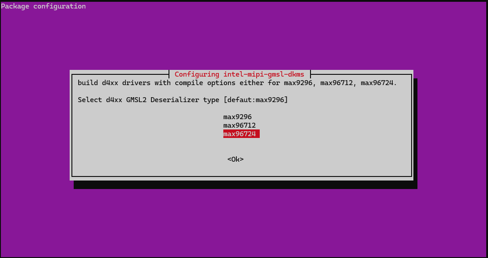

# GMSL Cameras

Gigabit Multimedia Serial Link (GMSL) is a high-speed serial interface for
connecting cameras to a processing platform. This guide covers supported camera
modules, GMSL Add-in-Card design, and GMSL `SerDes` configuration.

## Supported GMSL Cameras

```{include} fragment_camera_table_gmsl.md
```

## Enabling GMSL Camera

Follow this guide to enable a GMSL camera for your development kit.

### Step 1: Configure BIOS

Find the GMSL guide for your specific Development Kit in the table below and complete it.

| Development Kit | GMSL Guide |
| --- | --- |
| AAEON CEXD-INTRBL | [GMSL Guide](../../../../platform_foundation/development_kits/robinson-bay/interfaces/gmsl.md) |

### Step 2: GMSL Software Driver

#### Install Driver Package
After the system has been rebooted, install the GMSL driver by running the following command:

> **NOTE:** Prerequisites for the GMSL driver can be found in the [Getting Started](../../../../platform_foundation/getting_started.md) guide.

```bash
sudo apt-get update
sudo apt-get install ffmpeg # for stream verification
sudo apt-get install intel-mipi-gmsl-dkms
```

During installation, `intel-mipi-gmsl-dkms` presents a configuration dialog prompting you to select the deserializer model. 

Select the appropriate deserializer based on the your system's IPU below. Unlisted platforms may be unsupported:

| Code Name | Intel Processor | IPU Version | Deserializer |
| --- | --- | --- | --- |
| Panther Lake | Series 3 Intel® Core™ Ultra Processor | IPU7 | `max96724` |
| Arrow Lake | Series 2 Intel® Core™ Ultra Processor | IPU6 | `max9296` 



#### Reboot
**A reboot is required after installing the driver package.**

### Step 3: Bind GMSL camera
First, load the IPU driver:

<!--hide_directive::::{tab-set}hide_directive-->
<!--hide_directive:::{tab-item}hide_directive--> **IPU7**
<!--hide_directive:sync: ipu7hide_directive-->

```sh
sudo modprobe intel-ipu7-isys
```

<!--hide_directive:::hide_directive-->
<!--hide_directive:::{tab-item}hide_directive--> **IPU6**
<!--hide_directive:sync: ipu6hide_directive-->

```sh
sudo modprobe intel-ipu6-isys
```

<!--hide_directive:::hide_directive-->
<!--hide_directive::::hide_directive-->


  Camera binding involves using `mediactl` to correctly setup the GMSL cameras, and create a symbolic link.

  Helper scripts are provided for you, with variations based on supported sensor. You can find them here:

  ```sh
  /usr/share/camera/
  ```

```{note}
If you are configuring both D3 and RealSense cameras on the same system, you must bind the D3 cameras **before** the RealSense cameras. Failure to bind the cameras in the correct order will result in missing media devices.
```

  <!--hide_directive::::{tab-set}hide_directive-->
  <!--hide_directive:::{tab-item}hide_directive--> **RealSense**
  <!--hide_directive:sync: realsensehide_directive-->


  The following scripts are used for Realsense D457.
  Execute both in the order given below:

  ```sh
  sudo /usr/share/camera/rs_ipu_d457_bind.sh
  ```

  You should see console output similar to the following for a RealSense D457. This may vary by camera and manufacturer:

  ```console
  intel@intel-CEXD-INTRBL:~$ sudo /usr/share/camera/rs_ipu_d457_bind.sh 
  /dev/media0
  find /dev -type l -name *video-rs* -delete            RET=0
  Bind IPU7 to DS5 mux c-2 ...(count=1 on IPU7 CSI 2)...
  /usr/bin/media-ctl -d /dev/media0 -v -l "Intel IPU7 CSI2 2":2 -> "Intel IPU7 ISYS Capture 33":0[1]            RET=0
  /usr/bin/media-ctl -d /dev/media0 -v -l "Intel IPU7 CSI2 2":4 -> "Intel IPU7 ISYS Capture 35":0[1]            RET=0
  /usr/bin/media-ctl -d /dev/media0 -v -l "Intel IPU7 CSI2 2":13 -> "Intel IPU7 ISYS Capture 44":0[1]            RET=0
  /usr/bin/media-ctl -d /dev/media0 -v -l "Intel IPU7 CSI2 2":14 -> "Intel IPU7 ISYS Capture 45":0[1]            RET=0
  /usr/bin/media-ctl -d /dev/media0 -l "DS5 mux c-2":0 -> "Intel IPU7 CSI2 2":0[1]            RET=0
  /usr/bin/media-ctl -d /dev/media0 -R "DS5 mux c-2"[1/1->0/1[1], 2/3->0/3[1], 3/12->0/12[1], 4/13->0/13[1]]            RET=0
  /usr/bin/media-ctl -d /dev/media0 -R "Intel IPU7 CSI2 2"[0/1->2/1[1], 0/3->4/3[1], 0/12->13/12[1], 0/13->14/13[1]]            RET=0
  /usr/bin/media-ctl -d /dev/media0 -V "Intel IPU7 CSI2 2":2/1 [fmt:UYVY8_1X16/640x480 field:none]            RET=0
  /usr/bin/media-ctl -d /dev/media0 -V "DS5 mux c-2":0/1 [fmt:UYVY8_1X16/640x480@1/30 field:none]            RET=0
  /usr/bin/media-ctl -d /dev/media0 -V "DS5 mux c-2":1/1 [fmt:UYVY8_1X16/640x480@1/30 field:none]            RET=0
  /usr/bin/media-ctl -d /dev/media0 -V "D4XX depth c-2":0/1 [fmt:UYVY8_1X16/640x480@1/30 field:none]            RET=0
  /usr/bin/media-ctl -d /dev/media0 -V "Intel IPU7 CSI2 2":4/3 [fmt:YUYV8_1X16/640x480 field:none]            RET=0
  /usr/bin/media-ctl -d /dev/media0 -V "DS5 mux c-2":0/3 [fmt:YUYV8_1X16/640x480@1/30 field:none]            RET=0
  /usr/bin/media-ctl -d /dev/media0 -V "DS5 mux c-2":2/3 [fmt:YUYV8_1X16/640x480@1/30 field:none]            RET=0
  /usr/bin/media-ctl -d /dev/media0 -V "D4XX rgb c-2":0/3 [fmt:YUYV8_1X16/640x480@1/30 field:none]            RET=0
  /usr/bin/media-ctl -d /dev/media0 -V "Intel IPU7 CSI2 2":13/12 [fmt:VYUY8_1X16/640x480 field:none]            RET=0
  /usr/bin/media-ctl -d /dev/media0 -V "DS5 mux c-2":0/12 [fmt:VYUY8_1X16/640x480@1/30 field:none]            RET=0
  /usr/bin/media-ctl -d /dev/media0 -V "DS5 mux c-2":3/12 [fmt:VYUY8_1X16/640x480@1/30 field:none]            RET=0
  /usr/bin/media-ctl -d /dev/media0 -V "D4XX ir c-2":0/12 [fmt:VYUY8_1X16/640x480@1/30 field:none]            RET=0
  /usr/bin/media-ctl -d /dev/media0 -V "Intel IPU7 CSI2 2":14/13 [fmt:Y8_1X8/38x1 field:none]            RET=0
  /usr/bin/media-ctl -d /dev/media0 -V "DS5 mux c-2":0/13 [fmt:Y8_1X8/38x1@1/30 field:none]            RET=0
  /usr/bin/media-ctl -d /dev/media0 -V "DS5 mux c-2":4/13 [fmt:Y8_1X8/38x1@1/30 field:none]            RET=0
  /usr/bin/media-ctl -d /dev/media0 -V "D4XX imu c-2":0/13 [fmt:Y8_1X8/38x1@1/30 field:none]            RET=0
  ```

  Next, bind the device files to reusable symlinks:
  
  ```sh
  sudo /usr/share/camera/rs-enum-ipu.sh
  ```

  You should see output similar to:

  ```console
  intel@intel-CEXD-INTRBL:~$ sudo /usr/share/camera/rs-enum-ipu.sh
  Bus     Camera  Sensor  Node Type       Video Node      RS Link
  ipu7   c-2     ir      Stream(id=12)   /dev/video44    /dev/video-rs-ir-10     [640/480]
  ipu7   c-2     depth   Stream(id=1)    /dev/video33    /dev/video-rs-depth-10  [640/480]
  ipu7   c-2     imu     Stream(id=13)   /dev/video45    /dev/video-rs-imu-10    [38/1]
  ipu7   c-2     color   Stream(id=3)    /dev/video35    /dev/video-rs-color-10  [640/480]
  i2c    c-2     d4xx    Firmware        /dev/d4xx-dfu-c-2       /dev/d4xx-dfu-10
  ```

  <!--hide_directive:::hide_directive-->
  <!--hide_directive:::{tab-item}hide_directive--> **D3 Embedded**
  <!--hide_directive:sync: d3embeddedhide_directive-->

  Execute the following script for D3 and other cameras:

  ```sh
  sudo /usr/share/camera/ipu_max9x_bind.sh
  ```
  <!--hide_directive:::hide_directive-->
  <!--hide_directive::::hide_directive-->

### Step 4: Verify Camera

  <!--hide_directive::::{tab-set}hide_directive-->
  <!--hide_directive:::{tab-item}hide_directive--> **RealSense**
  <!--hide_directive:sync: realsensehide_directive-->

  Verify the camera(s) are available in `/dev/video`:

  ```bash
  ls -la /dev/video-rs-*
  ```

  You should see output similar to:

  ```console
  lrwxrwxrwx 1 root root 12 Aug 10 16:39 /dev/video-rs-color-10 -> /dev/video35
  lrwxrwxrwx 1 root root 12 Aug 10 16:39 /dev/video-rs-depth-10 -> /dev/video33
  lrwxrwxrwx 1 root root 12 Aug 10 16:39 /dev/video-rs-imu-10 -> /dev/video45
  lrwxrwxrwx 1 root root 12 Aug 10 16:39 /dev/video-rs-ir-10 -> /dev/video44
  ```

  <!--hide_directive:::hide_directive-->
  <!--hide_directive:::{tab-item}hide_directive--> **D3 Embedded**
  <!--hide_directive:sync: d3embeddedhide_directive-->

  Verify the camera(s) are available in `/dev/video`:

  ```bash
  ls -la /dev/video*
  ```

  You should see output similar to:

  ```bash
  lrwxrwxrwx  1 root root      11 Jul 14 15:23 /dev/video-isx031-a-0 -> /dev/video0
  ```

  <!--hide_directive:::hide_directive-->
  <!--hide_directive::::hide_directive-->

### Step 5: Test Camera Data

  Confirm that you can query camera capabilities using `v4l2-ctl`, and stream frame data. Your bound device might use a different label then what is shown:

 <!--hide_directive::::{tab-set}hide_directive-->
 <!--hide_directive:::{tab-item}hide_directive--> **RealSense**
 <!--hide_directive:sync: realsensehide_directive-->

  ```bash
  sudo v4l2-ctl -d /dev/video-rs-color-10 --stream-mmap --verbose
  ```

 <!--hide_directive:::hide_directive-->
 <!--hide_directive:::{tab-item}hide_directive--> **D3 Embedded**
 <!--hide_directive:sync: d3embeddedhide_directive-->
  
  ```bash
  sudo v4l2-ctl -d /dev/video-isx031-1-0 --stream-mmap --verbose
  ```

 <!--hide_directive:::hide_directive-->
 <!--hide_directive::::hide_directive-->

  You should see output similar to:

  ```console
  VIDIOC_QUERYCAP: ok
                  VIDIOC_REQBUFS returned 0 (Success)
                  VIDIOC_CREATE_BUFS returned 0 (Success)
                  VIDIOC_QUERYBUF returned 0 (Success)
                  VIDIOC_QUERYBUF returned 0 (Success)
                  VIDIOC_QUERYBUF returned 0 (Success)
                  VIDIOC_QUERYBUF returned 0 (Success)
                  VIDIOC_G_FMT returned 0 (Success)
                  VIDIOC_QBUF returned 0 (Success)
                  VIDIOC_QBUF returned 0 (Success)
                  VIDIOC_QBUF returned 0 (Success)
                  VIDIOC_QBUF returned 0 (Success)
                  VIDIOC_STREAMON returned 0 (Success)
  cap dqbuf: 0 seq:      0 bytesused: 614400 ts: 294.387553 field: None (ts-monotonic, ts-src-eof)
  cap dqbuf: 1 seq:      1 bytesused: 614400 ts: 294.420904 delta: 33.351 ms field: None (ts-monotonic, ts-src-eof)
  cap dqbuf: 2 seq:      2 bytesused: 614400 ts: 294.454255 delta: 33.351 ms field: None (ts-monotonic, ts-src-eof)
  cap dqbuf: 3 seq:      3 bytesused: 614400 ts: 294.487605 delta: 33.350 ms field: None (ts-monotonic, ts-src-eof)
  cap dqbuf: 0 seq:      4 bytesused: 614400 ts: 294.520956 delta: 33.351 ms fps: 29.98 field: None (ts-monotonic, ts-src-eof)
  cap dqbuf: 1 seq:      5 bytesused: 614400 ts: 294.554306 delta: 33.350 ms fps: 29.98 field: None (ts-monotonic, ts-src-eof)
  cap dqbuf: 2 seq:      6 bytesused: 614400 ts: 294.587657 delta: 33.351 ms fps: 29.98 field: None (ts-monotonic, ts-src-eof)
  cap dqbuf: 3 seq:      7 bytesused: 614400 ts: 294.621007 delta: 33.350 ms fps: 29.98 field: None (ts-monotonic, ts-src-eof)
  cap dqbuf: 0 seq:      8 bytesused: 614400 ts: 294.654358 delta: 33.351 ms fps: 29.98 field: None (ts-monotonic, ts-src-eof)
  ```


### Step 6: Capture a Live Image
Your camera is now setup. This is a good chance to fetch a live image from your camera. You can use `ffmpeg` to fetch a frame or display a live vide.


 <!--hide_directive::::{tab-set}hide_directive-->
 <!--hide_directive:::{tab-item}hide_directive--> **RealSense**
 <!--hide_directive:sync: realsensehide_directive-->

  Capture a single frame with `ffmpeg` and view it:

  ```bash
  ffmpeg -f v4l2 -i /dev/video-rs-color-10 -frames:v 1 frame.jpg
  xdg-open frame.jpg
  ```

  Or view the live video stream with `ffplay`:

  ```bash
  ffplay -f v4l2 -i /dev/video-rs-color-10
  ```
 <!--hide_directive:::hide_directive-->
 <!--hide_directive:::{tab-item}hide_directive--> **D3 Embedded**
 <!--hide_directive:sync: d3embeddedhide_directive-->
  Alternatively, capture a single frame with `ffmpeg` and view it:

  ```bash
  ffmpeg -f v4l2 -i /dev/video-isx031-a-0 -frames:v 1 frame.jpg
  xdg-open frame.jpg
  ```

  Or view the live video stream with `ffplay`:

  ```bash
  ffplay -f v4l2 -i /dev/video-isx031-a-0
  ```
 <!--hide_directive:::hide_directive-->
 <!--hide_directive::::hide_directive-->

### Next Steps

Now that your GMSL camera is properly connected, you can test out using it with various samples or immediately use in your robotics solution:
- Use OpenVINO to stream GMSL video data into a YOLO-based computer vision sample: [OpenVINO RealSense AI Demo](../../../ai_resources/openvino/reference_applications/openvino_multicam_demo.md)
- Use ROS 2 to ingest camera frames for use in a ROS-powered application: [RealSense ROS2 Node](../../reference_applications/realsense-ros2.md)
