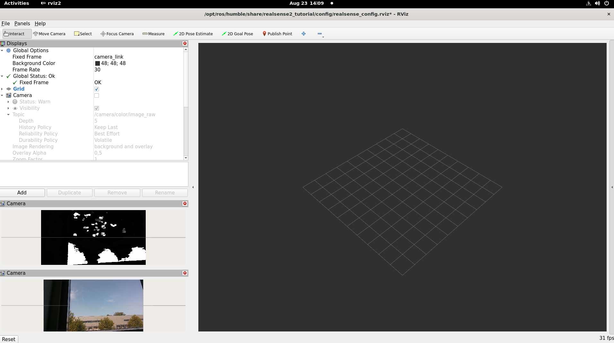
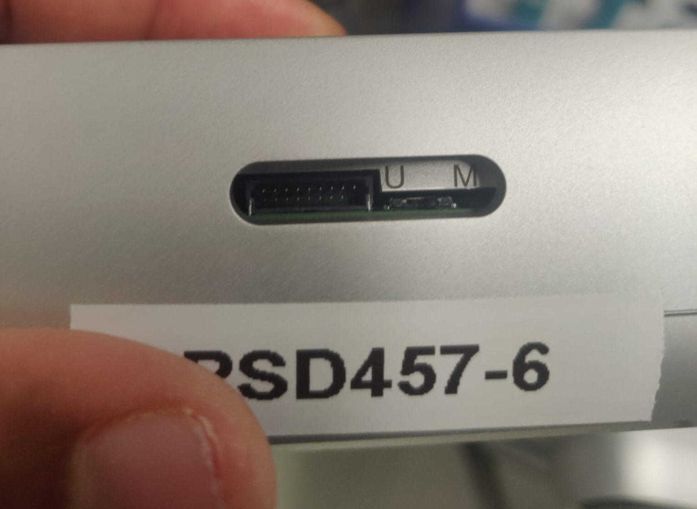
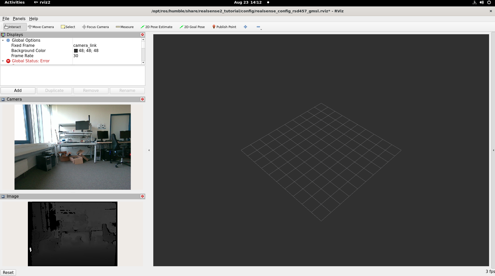

# RealSense Camera with ROS 2 Sample Application

This tutorial tells you how to:

- Launch ROS nodes for a camera.
- List ROS topics.
- Confirm that RealSense camera topics are publishing data.
- Retrieve data from the RealSense camera (data coming at FPS).
- Visualize an image from the RealSense camera displayed in rviz2.

This RealSense with ROS 2 Sample Application can be run using two
different types of RealSense cameras. The next section explains how to
run this sample application using an RealSense camera connected through
USB (for example, RealSense camera D435i). The subsequent section focuses
on an [RealSense Depth Camera D457.](https://www.realsenseai.com/products/d457-gmsl-fakra/)

> **Note:** Currently USB cameras are the only supported cameras.

## Prerequisites

Complete the [Getting Started guide](../../../platform_foundation/getting_started) before continuing.

## Install the RealSense ROS 2 Sample Application

1. Download and install the RealSense camera with ROS 2 sample application:

   <!--hide_directive::::{tab-set}hide_directive-->
   <!--hide_directive:::{tab-item}hide_directive--> **Jazzy**
   <!--hide_directive:sync: jazzyhide_directive-->

   ```bash
   sudo apt-get install -y ros-jazzy-realsense2-tutorial-demo
   ```

   <!--hide_directive:::hide_directive-->
   <!--hide_directive:::{tab-item}hide_directive--> **Humble**
   <!--hide_directive:sync: humblehide_directive-->

   ```bash
   sudo apt-get install -y ros-humble-realsense2-tutorial-demo
   ```

   <!--hide_directive:::hide_directive-->
   <!--hide_directive::::hide_directive-->

2. Run `find_cameras.sh` to detect the connected camera type:

   ```bash
   /opt/ros/$ROS_DISTRO/share/realsense2_tutorial/scripts/find_cameras.sh
   ```

## Using RealSense camera connected through USB

1. Connect an RealSense camera (for example, RealSense D435i)
   to the host, through USB.

2. Run the RealSense camera with ROS 2 sample application, passing the
   `camera_type` value reported by `find_cameras.sh` (it defaults to `usb`):

   ```bash
   ros2 launch realsense2_tutorial realsense2_tutorial.launch.py camera_type:=usb
   ```

   Expected output: The image from the RealSense camera is displayed in rviz2, on the bottom left side.

   

3. To close this, do the following:

   - Type ``Ctrl-c`` in the terminal where the tutorial was run.

## Using [RealSense Depth Camera D457](https://www.realsenseai.com/products/d457-gmsl-fakra/) over GMSL

Connect the RealSense Depth Camera D457 to a GMSL-enabled platform, then power on the target.

> **Note:** Select the "MIPI" mode of the RealSense Depth Camera D457
> by moving the select switch on the camera to "M", as shown in the below picture:
> 

Follow the [GMSL Cameras guide](../cameras/gmsl/index.md) to configure the BIOS,
install the GMSL driver, and bind the RealSense D457 camera (the **RealSense**
tab of the "Bind GMSL camera" step) before continuing.

### Run the RealSense camera with ROS 2 sample application

1. Run the RealSense camera with ROS 2 sample application, passing the
   `camera_type` value reported by `find_cameras.sh`:

   ```bash
   ros2 launch realsense2_tutorial realsense2_tutorial.launch.py camera_type:=gmsl
   ```

   Expected output: The image from the RealSense camera is displayed in rviz2, on the bottom left side.

   

2. To close this, do the following:

   - Type ``Ctrl-c`` in the terminal where the tutorial was run.
