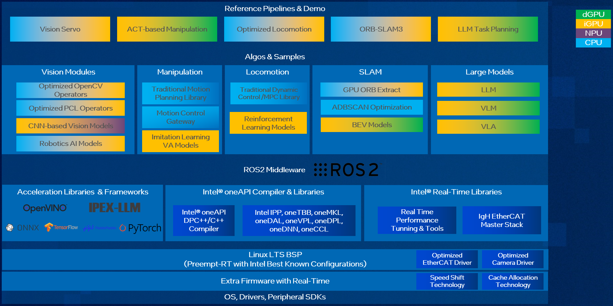

|lp_embodied|
#############

|lp_embodied| is a suite of intuitive, easy-to-use software stack designed to streamline the development process of Embodied Intelligence product and applications on Intel platform. The SDK provides developers with a comprehensive environment for developing, testing, and optimizing Embodied Intelligence software and algorithms efficiently. It also provides necessary software framework, libraries, tools, Best known configuration(BKC), tutorials and example codes to facilitate AI solution development.

|lp_embodied| includes below features:

* Comprehensive software platform from BSP, acceleration libraries, SDK to reference demos, with documentation and developer tutorials;
* Real-time BKC, |Linux| real-time kernel and optimized EtherCAT;
* Traditional vision and motion planning acceleration on CPU, Reinforcement/Imitation Learning-based manipulation, AI-based vision & LLM/VLM acceleration on iGPU & NPU;
* Typical workflows and examples including ACT/DP-based manipulation, LLM task planning, Pick & Place, ORB-SLAM3, etc.

Software Architecture
======================
Below picture is high level software architecture of |lp_embodied|:

This software architecture is designed to power Embodied Intelligence systems by integrating computer vision, AI-driven manipulation, locomotion, SLAM, and large models into a unified framework. Built on ROS2 middleware, it takes advantage of Intel's CPU, iGPU, dGPU, and NPU to optimize performance for robotics and AI applications. The stack includes high-performance AI frameworks, real-time libraries, and system-level optimizations, making it a comprehensive solution for Embodied Intelligence products.

At the highest level, the architecture is structured around key reference pipelines and demos that demonstrate its core capabilities. These include Vision Servo, which enhances robotic perception using AI-powered vision modules, and ACT-based Manipulation, which applies reinforcement learning and imitation learning to improve robotic grasping and movement. Optimized Locomotion leverages traditional control algorithms like MPC (Model Predictive Control) and LQR (Linear Quadratic Regulator), alongside reinforcement learning models for adaptive motion. Additionally, the ORB-SLAM3 pipeline focuses on real-time simultaneous localization and mapping, while LLM Task Planning integrates large language models for intelligent task execution.

Beneath these pipelines, the software stack includes specialized AI and robotics modules. The vision module supports CNN-based models, OpenCV, and PCL operators for optimized perception, enabling robots to interpret their surroundings efficiently. The manipulation module combines traditional motion planning with AI-driven control, allowing robots to execute complex movements. For locomotion, the system blends classic control techniques with reinforcement learning models, ensuring smooth and adaptive movement. Meanwhile, SLAM components such as GPU ORB extraction and ADBSCAN optimization enhance mapping accuracy, and BEV (Bird's Eye View) models contribute to improved spatial awareness. The large model module supports LLMs, Vision-Language Models (VLM), and Vision-Language-Action Models (VLA), enabling advanced reasoning and decision-making capabilities.

At the core of the system is ROS2 middleware and acceleration frameworks, which provide a standardized framework for robotics development. The architecture is further enhanced by Intel's AI acceleration libraries, including |OpenVINO| for deep learning inference, |IPEX-LLM| (IPEX-LLM) for optimized large model execution, and compatibility with TensorFlow*, PyTorch*, and ONNX*. The |oneAPI| compiler and libraries offer high-performance computing capabilities, leveraging oneMKL for mathematical operations, oneDNN for deep learning, and oneTBB for parallel processing. Additionally, Intel's real-time libraries ensure low-latency execution, with tools for performance tuning and EtherCAT-based industrial communication.

To ensure seamless integration with robotic hardware, the SDK runs on a real-time optimized |Linux| board support package. It includes support for optimized EtherCAT and camera drivers, along with Intel-specific features such as Speed Shift Technology and Cache Allocation to enhance power efficiency and performance. These system-level enhancements allow the software stack to deliver high responsiveness, making it suitable for real-time robotics applications.

Overall, the |lp_embodied| provides a highly optimized, AI-driven framework for robotics and Embodied Intelligence, combining computer vision, motion planning, real-time processing, and large-scale AI models into a cohesive system. By leveraging Intel's hardware acceleration and software ecosystem, it enables next-generation robotic applications with enhanced intelligence, efficiency, and adaptability.

|lp_embodied| Resources
=======================

- :doc:`Installation and Setup <installation_setup>`

- :doc:`Developer Tools and Tutorials <developer_tools_tutorials>`

- :doc:`Packages List <packages_list>`

- :doc:`Sample Pipelines <sample_pipelines>`

- :doc:`Troubleshooting <troubleshooting>`

- :doc:`Release Notes <release_note>`

.. toctree::
   :maxdepth: 2
   :hidden:

   installation_setup
   developer_tools_tutorials
   packages_list
   sample_pipelines
   troubleshooting
   release_note
