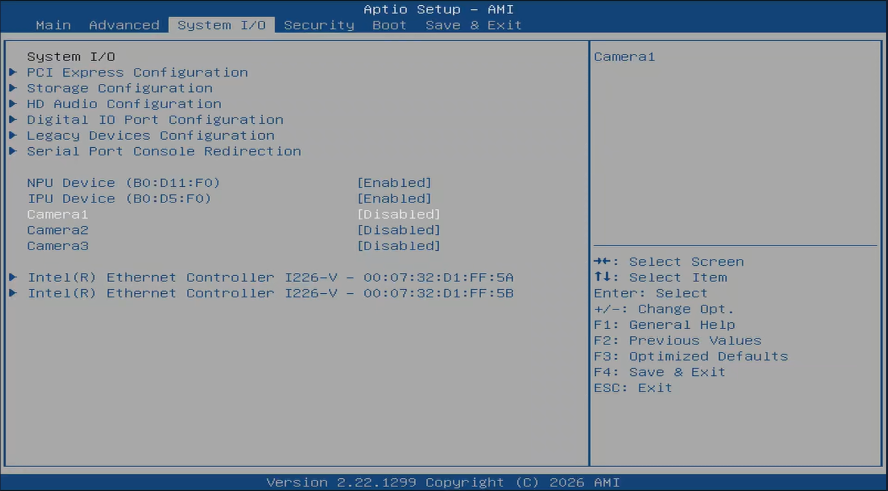

# BIOS Configuration

## Overview

This guide describes how to enable the camera and AI accelerator devices in the BIOS so the
IPU, NPU, and MIPI cameras are available to the operating system. It also describes how to
disable the Smart Fan for continuous cooling during validation.

## Enter the BIOS

Press **`ESC`** as the system boots to enter the BIOS setup screen.

## Enable the IPU and NPU

1. Navigate to the **System I/O** tab.
2. Enable the **IPU** and **NPU** devices.

> **Note:** On AMI BIOS 12 and above, the IPU, NPU, and MIPI camera settings are located under the
> **System I/O** tab. From the main page, press the right arrow key to reach **System
> I/O**.

## Disable the Smart Fan (optional)

Disable the Smart Fan to run the fan at continuous maximum speed.

1. Navigate to **Hardware Monitor**.
2. Set **Smart Fan** to **Disabled**.

:::caution
Disabling the Smart Fan keeps the fan at maximum speed at all times. Use this for
validation only.
:::

Save and exit the BIOS to apply your changes.

## Next Steps

- **[Supported Operating Systems](./supported-operating-systems.md)** — review the operating systems validated for this kit before installing your OS.
