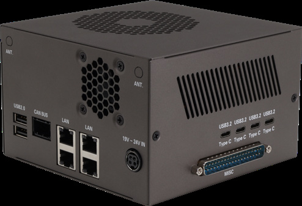

(robinson-bay-devkit)=
# AAEON CEXD-INTRBL Development Kit

## Product Link

**Product link**: [AAEON CEXD-INTRBL](https://eshop.aaeon.com/robotics-development-system-intel-core-ultra-x7-358h-cexd-intrbl.html)

## Overview

This guide describes how to set up the AAEON CEXD-INTRBL Development Kit hardware and confirm
that it powers on and boots correctly.

The kit is powered by the **Intel® Core™ Ultra X7 358H (Panther Lake)** processor. It
consists of a compute module that hosts the processor, memory, and boot components in a
100 × 87 mm footprint, paired with a carrier card that breaks out the I/O, MIPI CSI,
GMSL, and SerDes connectivity.

> **Note:** This development kit is intended for research and development purposes only.

## What you'll need

- A monitor with an **HDMI** or **DisplayPort** input.
- A **USB keyboard and mouse**.
- The bundled **DC power adapter** (19–24 V).

## Overall Flow

1. **Unbox and inspect** the kit.
2. **Connect** the display, keyboard, and mouse.
3. **Power on** the kit.
4. **Verify** the BIOS and confirm the kit boots.

## Steps

### Step 1: Unbox and inspect

Set the kit on an anti-static surface and confirm the box contains all of the
following items:

- **1×** Chassis with the compute module and carrier card
- **1×** DC power adapter
- **1×** GPIO MISC connector
- **2×** FAKRA 4-in-1 cables (for GMSL cameras)
- **1×** COM port connector

Inspect the kit to make sure no components are missing, bent, or cracked.

> **Warning:** The kit can be damaged if it is not placed on an anti-static surface. If any item is
> missing or the kit is damaged, contact Intel before proceeding.

### Step 2: Connect peripherals

Connect your monitor to the **HDMI** or **DisplayPort** output, and plug a keyboard
and mouse into the **USB** ports.

### Step 3: Power on

Plug the supplied DC power adapter into the **19–24 V DIN power connector** and press
the power button.

:::caution
Only use the DC power adapter supplied with the kit. Powering the board from another
source can damage it.
:::

### Step 4: Verify the BIOS

1. Press **`Del`** as the system boots to enter the BIOS setup screen.
2. Check the **time**, **date**, and configuration settings.
3. **Save and exit**.

The system reboots. The kit ships with an M.2 NVMe SSD already installed and is ready
for you to install an operating system.

## Next Steps

- **[BIOS Configuration](./bios-configuration.md)** — enable the IPU, NPU, and MIPI
  cameras, and tune fan behavior.

For product details, see the [manufacturer website](https://www.aaeon.com/en/article/detail/accelerate-robotics-development-aaeon-intel).

<!--hide_directive
:::{toctree}
:caption: Components
:hidden:

BIOS Configuration <bios-configuration>
Supported Operating Systems <supported-operating-systems>
Interfaces <interfaces/index>
:::
hide_directive-->