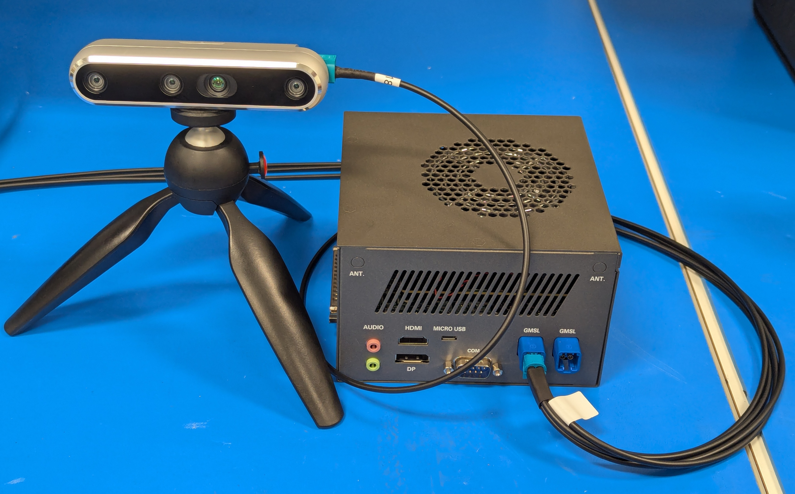
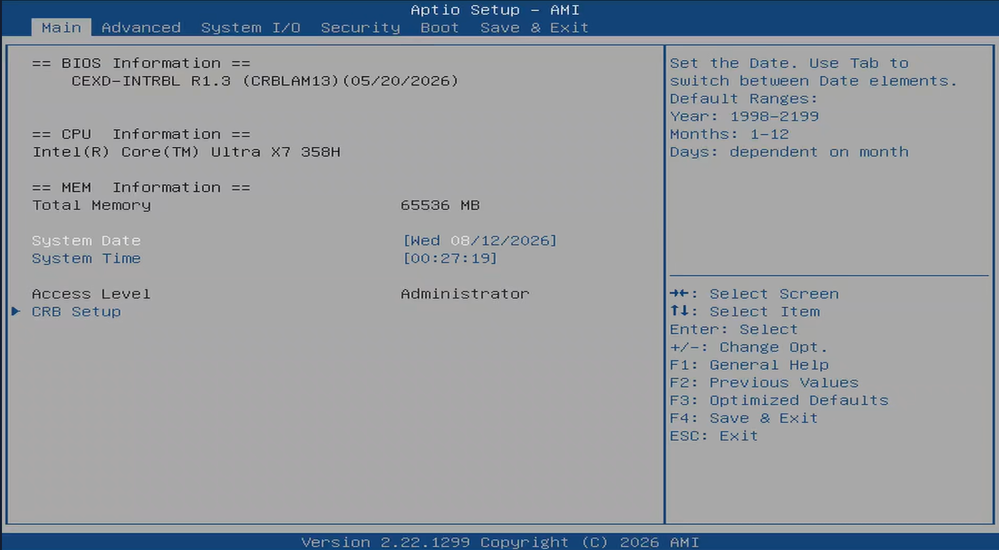
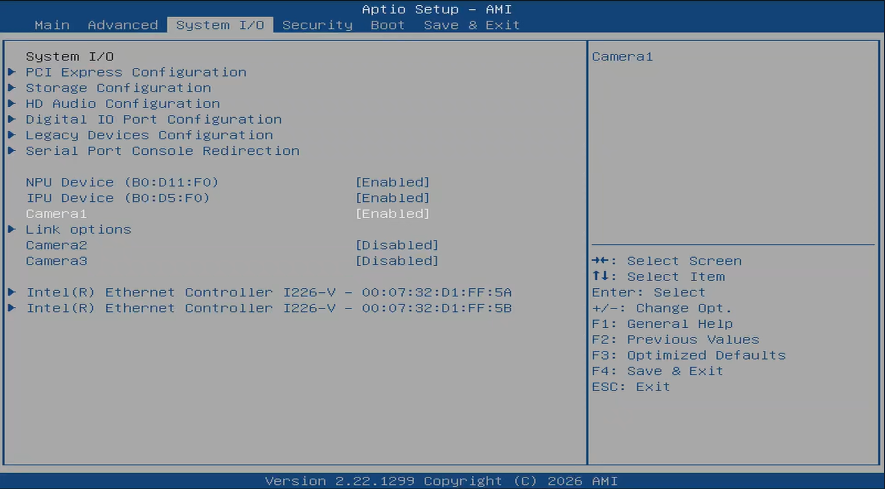
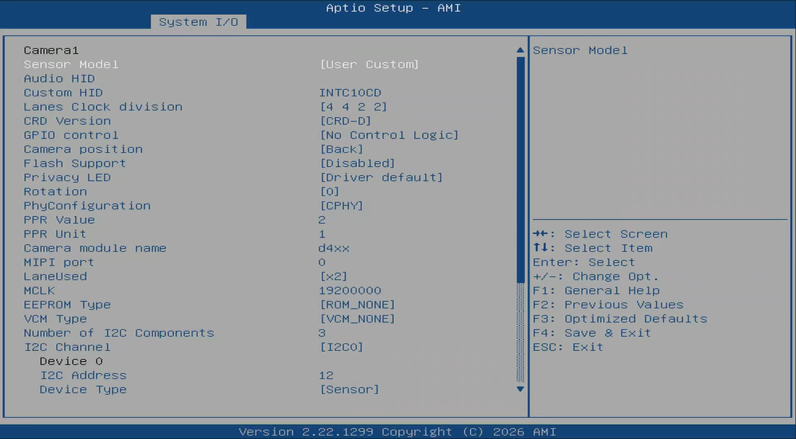
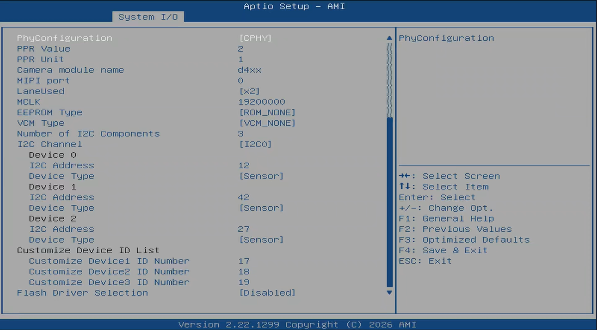
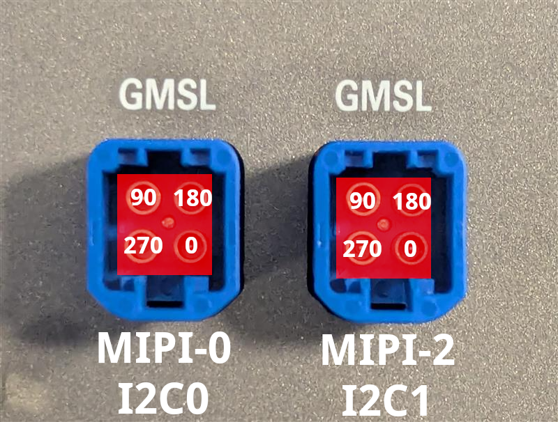

# GMSL

This guide covers connecting and configuring a GMSL camera using the AAEON CEXD-INTRBL FAKRA ports. Use of this interface requires software setup, including installing the Robotics AI Suite. Make sure you've followed the [Getting Started](../../../getting_started.md) guide.

## Physical Connection

The AAEON CEXD-INTRBL development kit includes a built-in GMSL connector board. You can see two FAKRA connectors exposed on the external housing. These support up to 8 connections, split between both ports.

For RealSense D457 GMSL cameras, connect a maximum of 2 cameras to each GMSL 4-in-1 FAKRA port. This optimizes bandwidth for the multi-sensor devices. Additional connections for this camera is not currently supported by Robotics AI Suites, and may not be supported by the manufacturer.

## BIOS Configuration

You can access the ACPI GMSL settings under the `System IO` menu.

Select Camera1 and select `Enabled`.

This will expose an additional menu called `Link options`.
Enter `Link options`  to update the ACPI GMSL settings for your sensor.

Modify these values according to the information below. Your settings may vary depending on sensor manufacturer.

<!--hide_directive::::{tab-set}hide_directive-->
<!--hide_directive:::{tab-item}hide_directive--> **RealSense D457**
<!--hide_directive:sync: realsensehide_directive-->

This table is a validated example of ACPI GMSL settings for the [RealSense D457](https://www.realsenseai.com/products/d457-gmsl-fakra/)

Here, 4 individual cameras are setup, split across both FAKRA connectors. This enables the maximum bandwidth and compatibility for the multi-sensor devices. Additional D457 GMSL connections are not currently supported. For simplicity, the top two GMSL ports (rotation 90 and 180) are used.

|                      | Camera 1         | Camera 2         | Camera 3         | Camera 4         |
| -------------------- | ---------------- | ---------------- | ---------------- | ---------------- |
| Sensor Model         | User Custom      | User Custom      | User Custom      | User Custom      |
| Custom HID           | `INTC10CD`       | `INTC10CD`       | `INTC10CD`       | `INTC10CD`       |
| Lanes Clock division | 4 4 2 2          | 4 4 2 2          | 4 4 2 2          | 4 4 2 2          |
| CRD Version          | CRD-D            | CRD-D            | CRD-D            | CRD-D            |
| GPIO control         | No Control Logic | No Control Logic | No Control Logic | No Control Logic |
| Camera position      | Back             | Back             | Front            | Front            |
| Flash Support        | Disabled         | Disabled         | Disabled         | Disabled         |
| Privacy LED          | Disabled         | Disabled         | Disabled         | Disabled         |
| Rotation             | 90               | 180              | 90               |  180             |
| PhyConfiguration     | CPHY             | CPHY             | CPHY             | CPHY             |
| PPR Value            | 2                | 2                | 2                | 2                |
| PPR Unit             | 1                | 1                | 1                | 1                |
| Camera module name   | `d4xx`           | `d4xx`           | `d4xx`           | `d4xx`           |
| MIPI port            | 0                | 0                | 2                | 2                |
| LaneUsed             | x2               | x2               | x2               | x2               |
| MCLK                 | 19200000         | 19200000         | 19200000         | 19200000         |
| EEPROM Type          | ROM_NONE         | ROM_NONE         | ROM_NONE         | ROM_NONE         |
| VCM Type             | VCM_NONE         | VCM_NONE         | VCM_NONE         | VCM_NONE         |
| Number of I2C Components     | 3                | 3                | 3                | 3                |
| I2C Channel          | I2C0             | I2C0             | I2C1             | I2C1             |
| Device0 I2C Address  | 12               | 14               | 12               | 14               |
| Device1 I2C Address  | 42               | 44               | 42               | 44               |
| Device2 I2C Address  | 27               | 27               | 27               | 27               |

<!--hide_directive:::hide_directive-->
<!--hide_directive:::{tab-item}hide_directive-->  **D3CMCXXX-106-084**
<!--hide_directive:sync: d3cmc106hide_directive-->

This table is a validated configuration of ACPI GMSL settings for the [D3 Embedded Discovery](https://www.d3embedded.com/product/isx031-smart-camera-narrow-fov-gmsl2-unsealed/) GMSL2 camera module.

When using the D3 GMSL2 series camera, set the ACPI GMSL settings according to the port being used. `Camera1` below sets up all D3 GMSL2 cameras on the **left** GMSL port. You only need the settings for a single sensor to enable all connected sensors. `Camera2` does the same for the **right** port. In this case, the rotation value is ignored.

| UEFI Custom Sensor   | Camera1          | Camera2         |
| -------------------- | ---------------- | ---------------- |
| Custom HID           | `INTC031M`       | `INTC031M`       |
| Lanes Clock Division | 4 4 2 2          | 4 4 2 2          |
| CRD Version          | CRD-D            | CRD-D            |
| GPIO Control         | No Control Logic | No Control Logic |
| Camera Position      | Back             | Front            |
| Flash Support        | Disabled         | Disabled         |
| Privacy LED          | Disabled         | Disabled         |
| Rotation             | 0                | 0                |
| Voltage Rail         | 3                | 3                |
| PhyConfiguration      | CPHY             | CPHY             |
| PPR Value            | 2                | 2                |
| PPR Unit             | 4                | 4                |
| Camera module label  | `MAX92764`       | `MAX92764`       |
| MIPI Port (Index)    | 0                | 2                |
| LaneUsed             | x4               | x4               |
| MCLK                 | 19200000         | 19200000         |
| EEPROM               | ROM_NONE         | ROM_NONE         |
| VCM TYPE             | VCM_NONE         | VCM_NONE         |
| Number of I2C        | 3                | 3                |
| I2C Channel          | I2C0             | I2C1             |
| Device0 I2C Address  | 27               | 27               |
| Device1 I2C Address  | 44               | 44               |
| Device2 I2C Address  | 54               | 54               |

<!--hide_directive:::hide_directive-->
<!--hide_directive::::hide_directive-->

The active mini-FAKRA port is determined by the rotation value.
Below is a table showing the default rotation per port location.

| Rotation | Port |
| ------- | ------- |
| 270 | Lower-left |
| 90 | Upper-left |
| 180 | Upper-right |
| 0 | Lower-right |

Here is an image overlaid with the correct rotation values, MIPI port, and I2C bus for reference:

## Next steps

Once you've setup your ACPI GMSL settings for your camera, continue with [Step 2: GMSL Software Driver](../../../../components/sensors/cameras/gmsl/index.md#step-2-gmsl-software-driver)
