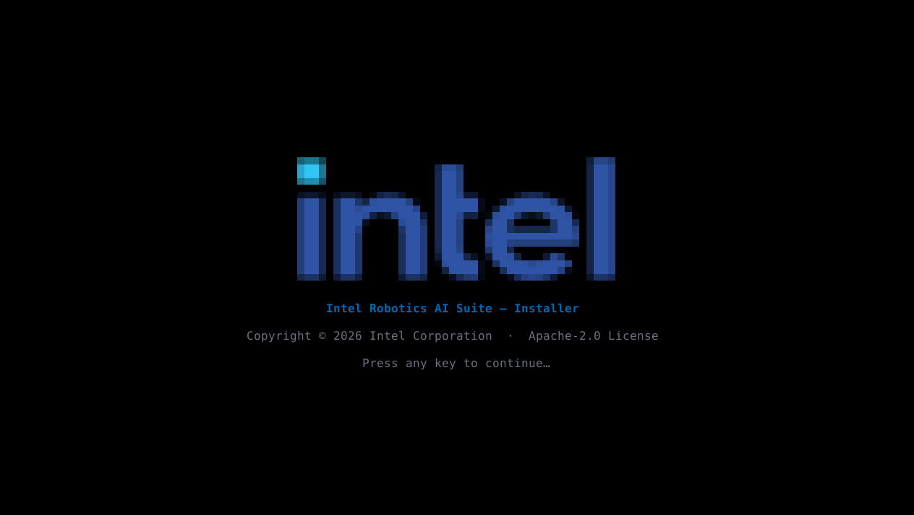
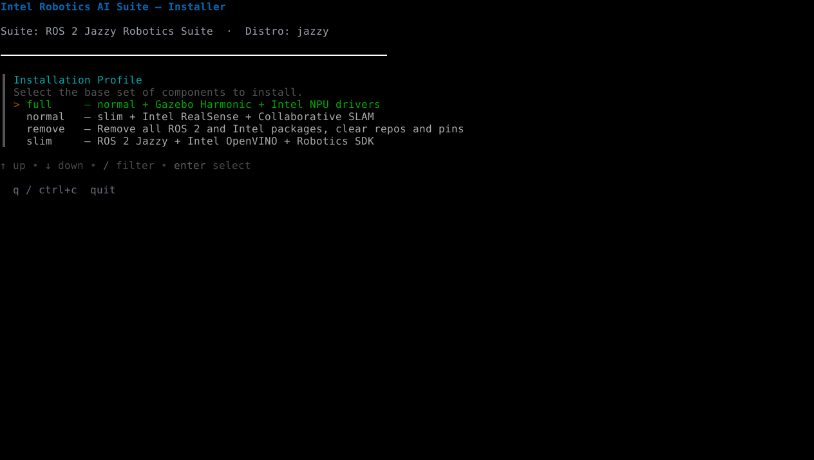
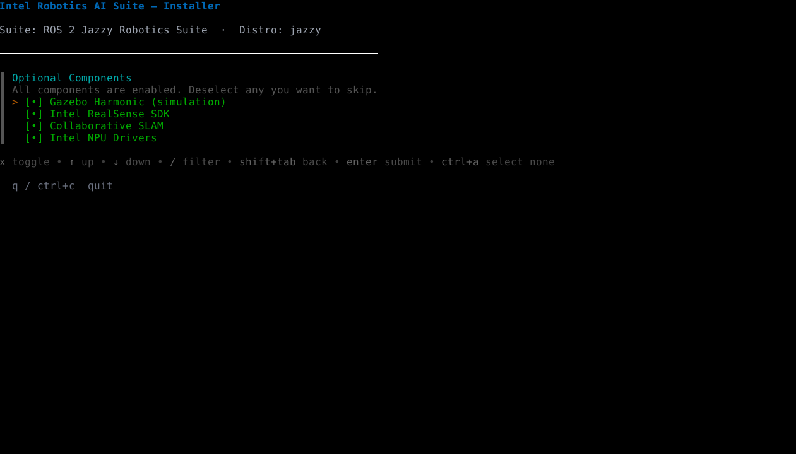
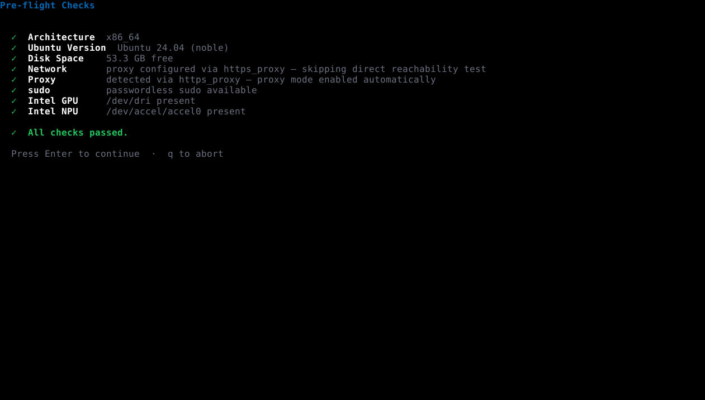
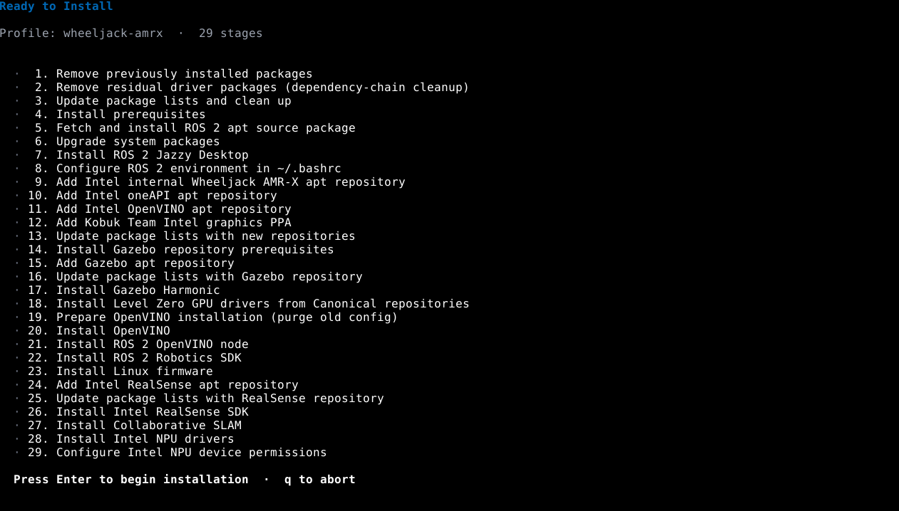
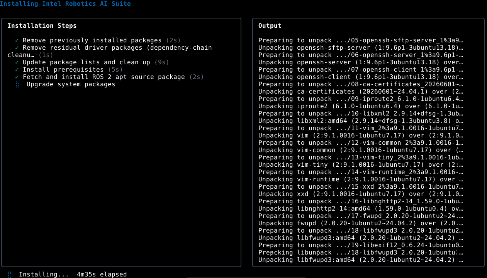
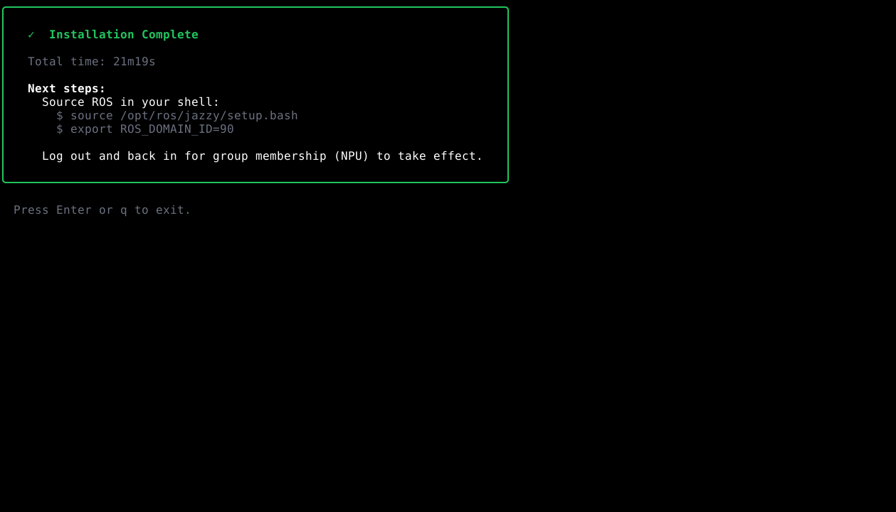

# Express Setup

The Express Setup will use an installation tool to automatically configure and install the necessary content on your system. If you prefer to perform the steps yourself, use the [Step-by-step Setup](step_by_step.md) guide.

## 1. Install Canonical Ubuntu OS

Intel recommends a fresh installation of Ubuntu.

Install Canonical Ubuntu 24.04 LTS (Noble Numbat) Desktop for the supported
platform. Ubuntu 24.04 uses ROS 2 Jazzy Jalisco.

Visit the Canonical Ubuntu website to see the detailed installation instructions: [Install Ubuntu desktop](https://ubuntu.com/tutorials/install-ubuntu-desktop).

## 2. Execute Robotics AI Suite Installer

1. Open a terminal prompt which will be used to execute the remaining steps.

2. Download and execute the Robotics AI Suite Installer.

   ```bash
   wget https://amrdocs.intel.com/downloads/robotics-installer
   wget https://amrdocs.intel.com/downloads/robotics-installer.sha256
   (sha256sum -c robotics-installer.sha256 || \
   (echo "ERROR: SHA sum incorrect"; exit 1)) && \
   chmod +x robotics-installer && \
   sudo -E ./robotics-installer
   ```

   > **Note:** If you are behind a network proxy, make sure you have
   > defined ``http_proxy`` and ``https_proxy`` environment variables

   

3. Select an installation profile to install.

   

4. Enable/Disable optional components.

   

5. The installer will perform pre-flight checks. Ensure that all checks passed, then press ``Enter`` to continue.

   

6. The installer will list all the steps which will be performed. Press ``Enter`` to proceed with the installation.
   The installation may take anywhere from 10 to 30 minutes depending on your network and system performance.

   > **Note:** The installer will first initialize the system by uninstalling any packages with names matching the following patterns:
   > ``*oneapi*`` ``ros-*`` ``intel-igc*`` ``*openvino*`` ``*gazebo*`` ``*realsense*`` ``*level-zero*`` ``libze1``

   

   

7. If the installation is successful, you will see a dialog similar to the following:

   

## 3. Prepare your ROS 2 Environment

The Robotics AI Suite Installer automatically sets ``ROS_DOMAIN_ID`` environment variable
to a random number between 0 and 100 within your ``.bashrc`` configuration.

Your shell profile script has already been modified to use this ID and the ROS toolkit.
To use ROS 2 commands in the current shell, source ROS 2 shell setup script:

```bash
source /opt/ros/jazzy/setup.bash
```

> **Note:** Use an individual ``ROS_DOMAIN_ID`` for every ROS 2
> node that is expected to participate in a given ROS 2 graph in order to avoid conflicts
> in handling messages.

## 4. Next steps

At this point, the installation is complete. For next steps, explore the following:

- [Intel Optimized Solutions and Ingredients](../../components/optimized_solutions/index.md)
- [Autonomous Mobile Robot Tutorials and Demos](../../software_references/amr/index.md)


```{include} fragment_conditional.md
```

```{include} fragment_troubleshooting.md
```