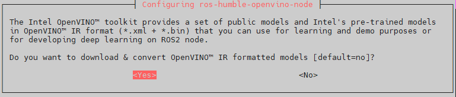
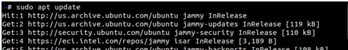
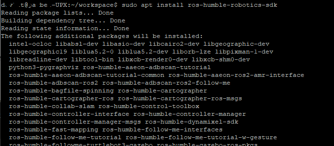
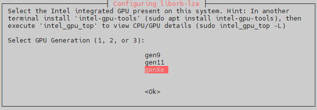

# Step-by-step Setup

If you want to manually setup Robotics AI Suite on your system, this step-by-step guide will configure and install the necessary content on your system. If you prefer to perform the steps automatically, use the [Express Setup](express.md) guide.

## 1. Install Canonical Ubuntu OS

Intel recommends a fresh installation of the Ubuntu distribution of the Linux OS
for your target system.

The manual installation only supports Install Canonical Ubuntu 24.04 LTS (Noble Numbat) Desktop on the supported
platform. See [System Requirements](../system_requirements.md) for the supported
configuration.

## 2. Install and Configure ROS 2

Follow the [ROS 2 Runtime](../../components/middleware/ros2.md) guide to install ROS 2
Jazzy and configure the environment.

## 3. Set up Robotics AI Suite, oneAPI, and Graphics APT Repositories

This section explains the procedure to configure the APT package manager to use the hosted APT repositories.

1. Open a terminal prompt which will be used to execute the remaining steps.

2. Download the GPG APT key for the Robotics AI Suite to the system keyring:

   ```bash
   sudo -E wget -O- https://amrdocs.intel.com/repos/gpg-keys/GPG-PUB-KEY-INTEL-AMR.gpg | sudo tee /usr/share/keyrings/amr-archive-keyring.gpg > /dev/null
   ```

3. Add the signed entry to the Robotics AI Suite APT sources and configure the APT client to use them:

   ```bash
   echo "deb [signed-by=/usr/share/keyrings/amr-archive-keyring.gpg] https://amrdocs.intel.com/repos/$(source /etc/os-release && echo $VERSION_CODENAME) amr main" | sudo tee /etc/apt/sources.list.d/amr.list > /dev/null
   echo "deb-src [signed-by=/usr/share/keyrings/amr-archive-keyring.gpg] https://amrdocs.intel.com/repos/$(source /etc/os-release && echo $VERSION_CODENAME) amr main" | sudo tee -a /etc/apt/sources.list.d/amr.list > /dev/null
   ```

4. Configure the Robotics AI Suite APT repository to have higher priority over other repositories:

   ```bash
   echo -e "Package: *\nPin: origin amrdocs.intel.com\nPin-Priority: 1001" | sudo tee /etc/apt/preferences.d/amr
   ```

5. Configure the APT repository for the Intel® oneAPI Base Toolkit:

   ```bash
   wget -O- https://apt.repos.intel.com/intel-gpg-keys/GPG-PUB-KEY-INTEL-SW-PRODUCTS.PUB | gpg --dearmor | sudo tee /usr/share/keyrings/oneapi-archive-keyring.gpg > /dev/null
   echo "deb [signed-by=/usr/share/keyrings/oneapi-archive-keyring.gpg] https://apt.repos.intel.com/oneapi all main" | sudo tee /etc/apt/sources.list.d/oneAPI.list > /dev/null
   echo -e "Package: intel-oneapi-runtime-*\nPin: version 2025.3.*\nPin-Priority: 1001\n" | sudo tee /etc/apt/preferences.d/oneapi > /dev/null
   echo -e "Package: intel-oneapi-compiler-*\nPin: version 2025.3.*\nPin-Priority: 1001\n" | sudo tee -a /etc/apt/preferences.d/oneapi > /dev/null
   echo -e "Package: intel-oneapi-mkl-*\nPin: version 2025.3.*\nPin-Priority: 1001" | sudo tee -a /etc/apt/preferences.d/oneapi > /dev/null
   ```

6. For the latest Intel graphics support, add the ``kobuk`` PPA. For Ubuntu 22, `kisak` is used:

   <!--hide_directive::::{tab-set}hide_directive-->
   <!--hide_directive:::{tab-item}hide_directive--> **Jazzy**
   <!--hide_directive:sync: jazzyhide_directive-->

   ```bash
   sudo -E add-apt-repository -y ppa:kobuk-team/intel-graphics
   ```

   <!--hide_directive:::hide_directive-->
   <!--hide_directive:::{tab-item}hide_directive-->  **Humble**
   <!--hide_directive:sync: humblehide_directive-->
   ```bash
   sudo -E add-apt-repository -y ppa:kisak/kisak-mesa
   ```
   <!--hide_directive:::hide_directive-->

## 4. Install OpenVINO™ Packages

The following steps will add the OpenVINO™ APT repository to your package management.

1. Install the OpenVINO™ GPG key:

   ```bash
   wget -O- https://apt.repos.intel.com/intel-gpg-keys/GPG-PUB-KEY-INTEL-SW-PRODUCTS.PUB | gpg --dearmor | sudo tee /usr/share/keyrings/openvino-archive-keyring.gpg > /dev/null
   ```

2. Add the APT package sources for OpenVINO™ 2025:

   <!--hide_directive::::{tab-set}hide_directive-->
   <!--hide_directive:::{tab-item}hide_directive--> **Jazzy**
   <!--hide_directive:sync: jazzyhide_directive-->

   ```bash
   echo "deb [signed-by=/usr/share/keyrings/openvino-archive-keyring.gpg] https://apt.repos.intel.com/openvino/2025 ubuntu24 main" | sudo tee /etc/apt/sources.list.d/intel-openvino-2025.list
   ```

   <!--hide_directive:::hide_directive-->
   <!--hide_directive:::{tab-item}hide_directive-->  **Humble**
   <!--hide_directive:sync: humblehide_directive-->

   ```bash
   echo "deb [signed-by=/usr/share/keyrings/openvino-archive-keyring.gpg] https://apt.repos.intel.com/openvino/2025 ubuntu22 main" | sudo tee /etc/apt/sources.list.d/intel-openvino-2025.list
   ```

   <!--hide_directive:::hide_directive-->
   <!--hide_directive::::hide_directive-->

3. Run the following commands to create the file ``/etc/apt/preferences.d/intel-openvino``.

   This will pin the OpenVINO™ version to 2025.3.0. Earlier versions of OpenVINO™
   might not support inferencing on the NPU of Intel® Core™ Ultra processors.

   <!--hide_directive::::{tab-set}hide_directive-->
   <!--hide_directive:::{tab-item}hide_directive--> **Jazzy**
   <!--hide_directive:sync: jazzyhide_directive-->

   ```bash
   echo -e "\nPackage: openvino-libraries-dev\nPin: version 2025.3.0*\nPin-Priority: 1001" | sudo tee /etc/apt/preferences.d/intel-openvino
   echo -e "\nPackage: openvino\nPin: version 2025.3.0*\nPin-Priority: 1001" | sudo tee -a /etc/apt/preferences.d/intel-openvino
   echo -e "\nPackage: ros-jazzy-openvino-wrapper-lib\nPin: version 2025.3.0*\nPin-Priority: 1002" | sudo tee -a /etc/apt/preferences.d/intel-openvino
   echo -e "\nPackage: ros-jazzy-openvino-node\nPin: version 2025.3.0*\nPin-Priority: 1002" | sudo tee -a /etc/apt/preferences.d/intel-openvino
   ```

   <!--hide_directive:::hide_directive-->
   <!--hide_directive:::{tab-item}hide_directive-->  **Humble**
   <!--hide_directive:sync: humblehide_directive-->

   ```bash
   echo -e "\nPackage: openvino-libraries-dev\nPin: version 2025.3.0*\nPin-Priority: 1001" | sudo tee /etc/apt/preferences.d/intel-openvino
   echo -e "\nPackage: openvino\nPin: version 2025.3.0*\nPin-Priority: 1001" | sudo tee -a /etc/apt/preferences.d/intel-openvino
   echo -e "\nPackage: ros-humble-openvino-wrapper-lib\nPin: version 2025.3.0*\nPin-Priority: 1002" | sudo tee -a /etc/apt/preferences.d/intel-openvino
   echo -e "\nPackage: ros-humble-openvino-node\nPin: version 2025.3.0*\nPin-Priority: 1002" | sudo tee -a /etc/apt/preferences.d/intel-openvino
   ```

   <!--hide_directive:::hide_directive-->
   <!--hide_directive::::hide_directive-->

   If you decide to use a different OpenVINO™ version, ensure that all four packages
   (``openvino-libraries-dev``, ``openvino``, ``ros-jazzy-openvino-wrapper-lib``,
   and ``ros-jazzy-openvino-node``) are pinned to the same OpenVINO™ version.

### 4.1 Install the OpenVINO™ Runtime and the ROS 2 OpenVINO™ Toolkit

The following steps will install the OpenVINO™ packages:

1. Ensure all APT repositories are updated:

   ```bash
   sudo apt update
   ```

2. Install the Intel® Graphics Compute Runtime:

   ```bash
   sudo apt install -y libze1 libze-intel-gpu1
   ```

3. Install ``debconf-utilities``:

   ```bash
   sudo apt install debconf-utils
   ```

4. Clear any previous installation configurations:

   <!--hide_directive::::{tab-set}hide_directive-->
   <!--hide_directive:::{tab-item}hide_directive--> **Jazzy**
   <!--hide_directive:sync: jazzyhide_directive-->

   ```bash
   sudo apt purge ros-jazzy-openvino-node
   sudo apt autoremove -y
   echo PURGE | sudo debconf-communicate ros-jazzy-openvino-node
   ```

   <!--hide_directive:::hide_directive-->
   <!--hide_directive:::{tab-item}hide_directive-->  **Humble**
   <!--hide_directive:sync: humblehide_directive-->

   ```bash
   sudo apt purge ros-humble-openvino-node
   sudo apt autoremove -y
   echo PURGE | sudo debconf-communicate ros-humble-openvino-node
   ```

   <!--hide_directive:::hide_directive-->
   <!--hide_directive::::hide_directive-->

5. Install the OpenVINO™ Runtime:

   ```bash
   sudo apt install openvino
   ```

6. Install the ROS 2 OpenVINO™ Node:

   <!--hide_directive::::{tab-set}hide_directive-->
   <!--hide_directive:::{tab-item}hide_directive--> **Jazzy**
   <!--hide_directive:sync: jazzyhide_directive-->

   ```bash
   sudo -E apt install ros-jazzy-openvino-node
   ```

   <!--hide_directive:::hide_directive-->
   <!--hide_directive:::{tab-item}hide_directive-->  **Humble**
   <!--hide_directive:sync: humblehide_directive-->

   ```bash
   sudo -E apt install ros-humble-openvino-node
   ```

   <!--hide_directive:::hide_directive-->
   <!--hide_directive::::hide_directive-->

   During the installation of the "openvino-node" package,
   you will be prompted to decide whether to install the OpenVINO™ IR
   formatted models. Answer `yes`.

   

### 4.2 OpenVINO™ Re-Installation and Troubleshooting

If you need to reinstall OpenVINO™ or clean your system after a failed
installation, run the following commands:

<!--hide_directive::::{tab-set}hide_directive-->
<!--hide_directive:::{tab-item}hide_directive--> **Jazzy**
<!--hide_directive:sync: jazzyhide_directive-->

```bash
sudo apt purge ros-jazzy-openvino-node
sudo apt autoremove -y
echo PURGE | sudo debconf-communicate ros-jazzy-openvino-node
sudo apt install ros-jazzy-openvino-node
```

<!--hide_directive:::hide_directive-->
<!--hide_directive:::{tab-item}hide_directive-->  **Humble**
<!--hide_directive:sync: humblehide_directive-->

```bash
sudo apt purge ros-humble-openvino-node
sudo apt autoremove -y
echo PURGE | sudo debconf-communicate ros-humble-openvino-node
sudo -E apt install ros-humble-openvino-node
```

<!--hide_directive:::hide_directive-->
<!--hide_directive::::hide_directive-->

## 5. Install RealSense Camera SDK

RealSense SDK is a cross-platform library for RealSense
depth cameras. The SDK allows depth and color streaming, and provides
intrinsic and extrinsic calibration information. The library also offers
synthetic streams (pointcloud, depth aligned to color and vise-versa), and a
built-in support for record and playback of streaming sessions.

RealSense SDK includes support for ROS and ROS 2, allowing you
access to commonly used robotic functionality with ease.

1. Register the server’s public key:

   ```bash
   sudo mkdir -p /etc/apt/keyrings
   curl -sSf https://librealsense.realsenseai.com/Debian/librealsenseai.asc | gpg --dearmor | sudo tee /etc/apt/keyrings/librealsenseai.gpg > /dev/null
   ```

2. Add RealSense to the list of repositories:

   ```bash
   echo "deb [signed-by=/etc/apt/keyrings/librealsenseai.gpg] https://librealsense.realsenseai.com/Debian/apt-repo `lsb_release -cs` main" | sudo tee /etc/apt/sources.list.d/librealsense.list
   ```

3. Update your APT repository caches after setting up the repository:

   ```bash
   sudo apt update
   ```

4. Install the RealSense drivers and libraries:

   <!--hide_directive:::::{tab-set}hide_directive-->
   <!--hide_directive::::{tab-item}hide_directive--> **Jazzy**
   <!--hide_directive:sync: jazzyhide_directive-->

   ```bash
   sudo apt-get install -y --allow-downgrades ros-jazzy-librealsense2
   sudo apt install librealsense2-dkms
   sudo apt install librealsense2
   ```

   <!--hide_directive::::hide_directive-->
   <!--hide_directive::::{tab-item}hide_directive--> **Humble**
   <!--hide_directive:sync: humblehide_directive-->

   ```bash
   sudo apt-get install -y --allow-downgrades ros-humble-librealsense2
   sudo apt install librealsense2-dkms
   sudo apt install librealsense2
   ```

   <!--hide_directive::::hide_directive-->
   <!--hide_directive:::::hide_directive-->

## 6. Install Robotics AI Suite Deb packages

This section details steps to install Robotics AI Suite Deb packages.

1. Before using the Robotics AI Suite APT repositories, update the APT packages list:

   ```bash
   sudo apt update
   ```

   The APT package manager will download the latest list of packages available for all configured repositories.

   

2. Follow the instructions to install Gazebo:

   <!--hide_directive::::{tab-set}hide_directive-->
   <!--hide_directive:::{tab-item}hide_directive--> **Jazzy**
   <!--hide_directive:sync: jazzyhide_directive-->

   ```bash
   sudo apt-get update
   sudo apt-get install curl lsb-release gnupg

   sudo -E curl https://packages.osrfoundation.org/gazebo.gpg --output /usr/share/keyrings/pkgs-osrf-archive-keyring.gpg
   echo "deb [arch=$(dpkg --print-architecture) signed-by=/usr/share/keyrings/pkgs-osrf-archive-keyring.gpg] https://packages.osrfoundation.org/gazebo/ubuntu-stable $(lsb_release -cs) main" | sudo tee /etc/apt/sources.list.d/gazebo-stable.list > /dev/null
   sudo apt-get update
   sudo apt-get install gz-harmonic
   ```

   <!--hide_directive:::hide_directive-->
   <!--hide_directive:::{tab-item}hide_directive-->  **Humble**
   <!--hide_directive:sync: humblehide_directive-->

   ```bash
   sudo apt-get update
   sudo apt-get install curl lsb-release gnupg

   sudo -E add-apt-repository ppa:openrobotics/gazebo11-gz-cli
   sudo -E curl https://packages.osrfoundation.org/gazebo.gpg --output /usr/share/keyrings/pkgs-osrf-archive-keyring.gpg
   echo "deb [arch=$(dpkg --print-architecture) signed-by=/usr/share/keyrings/pkgs-osrf-archive-keyring.gpg] https://packages.osrfoundation.org/gazebo/ubuntu-stable $(lsb_release -cs) main" | sudo tee /etc/apt/sources.list.d/gazebo-stable.list > /dev/null
   sudo apt-get update
   ```

   <!--hide_directive:::hide_directive-->
   <!--hide_directive::::hide_directive-->

3. Choose the Autonomous Mobile Robot Deb package to install.

   <!--hide_directive::::{tab-set}hide_directive-->
   <!--hide_directive:::{tab-item}hide_directive--> **Jazzy**
   <!--hide_directive:sync: jazzyhide_directive-->

   **ros-jazzy-robotics-sdk**
      The standard version of the Autonomous Mobile Robot. This package includes almost everything except for a handful of tutorials and bag files.

   **ros-jazzy-robotics-sdk-complete**
      The complete version of the Autonomous Mobile Robot. It also includes those items excluded from the standard version. Please note that the complete SDK downloads approximately 20GB of additional files.

   <!--hide_directive:::hide_directive-->
   <!--hide_directive:::{tab-item}hide_directive--> **Humble**
   <!--hide_directive:sync: humblehide_directive-->

   **ros-humble-robotics-sdk**
      The standard version of the Autonomous Mobile Robot. This package includes almost everything except for a handful of tutorials and bag files.

   **ros-humble-robotics-sdk-complete**
      The complete version of the Autonomous Mobile Robot. It also includes those items excluded from the standard version. Please note that the complete SDK downloads approximately 20GB of additional files.

   <!--hide_directive:::hide_directive-->
   <!--hide_directive::::hide_directive-->

4. Install the Robotics AI Suite Deb package

   Install command example:

   <!--hide_directive::::{tab-set}hide_directive-->
   <!--hide_directive:::{tab-item}hide_directive--> **Jazzy**
   <!--hide_directive:sync: jazzyhide_directive-->

   ```bash
   sudo apt install ros-jazzy-robotics-sdk
   ```

   <!--hide_directive:::hide_directive-->
   <!--hide_directive:::{tab-item}hide_directive--> **Humble**
   <!--hide_directive:sync: humblehide_directive-->

   Intel oneAPI requires GCC >= 12:

   ```bash
   sudo apt install gcc-12 g++-12
   sudo update-alternatives --install /usr/bin/gcc gcc /usr/bin/gcc-12 60 --slave /usr/bin/g++ g++ /usr/bin/g++-12
   sudo apt install ros-humble-robotics-sdk
   ```

   <!--hide_directive:::hide_directive-->
   <!--hide_directive::::hide_directive-->

   Your installation time will vary based on network speed and chosen packages.

   

5. Install one of the following packages based upon your processor type:

   - Intel SSE-only CPU instruction accelerated package for Collaborative SLAM (installed by default):

     <!--hide_directive:::::{tab-set}hide_directive-->
     <!--hide_directive::::{tab-item}hide_directive--> **Jazzy**
     <!--hide_directive:sync: jazzyhide_directive-->

     ```bash
     # Required for Intel® Atom® processor-based systems
     sudo apt-get install ros-jazzy-collab-slam-sse
     ```

     <!--hide_directive::::hide_directive-->
     <!--hide_directive::::{tab-item}hide_directive--> **Humble**
     <!--hide_directive:sync: humblehide_directive-->

     ```bash
     # Required for Intel® Atom® processor-based systems
     sudo apt-get install ros-humble-collab-slam-sse
     ```

     <!--hide_directive::::hide_directive-->
     <!--hide_directive:::::hide_directive-->

   - Intel AVX2 CPU instruction accelerated package for Collaborative SLAM:

     <!--hide_directive:::::{tab-set}hide_directive-->
     <!--hide_directive::::{tab-item}hide_directive--> **Jazzy**
     <!--hide_directive:sync: jazzyhide_directive-->

     ```bash
     # Works only on Intel® Core™ processor-based systems
     sudo apt-get install ros-jazzy-collab-slam-avx2
     ```

     <!--hide_directive::::hide_directive-->
     <!--hide_directive::::{tab-item}hide_directive--> **Humble**
     <!--hide_directive:sync: humblehide_directive-->

     ```bash
     # Works only on Intel® Core™ processor-based systems
     sudo apt-get install ros-humble-collab-slam-avx2
     ```

     <!--hide_directive::::hide_directive-->
     <!--hide_directive:::::hide_directive-->

   - Intel GPU Level-Zero accelerated package for Collaborative SLAM:

     <!--hide_directive:::::{tab-set}hide_directive-->
     <!--hide_directive::::{tab-item}hide_directive--> **Jazzy**
     <!--hide_directive:sync: jazzyhide_directive-->

     ```bash
     # Works only on Intel® Core™ processors with Intel® Xe Integrated Graphics or Intel® UHD Graphics
     sudo apt-get install ros-jazzy-collab-slam-lze
     ```

     <!--hide_directive::::hide_directive-->
     <!--hide_directive::::{tab-item}hide_directive--> **Humble**
     <!--hide_directive:sync: humblehide_directive-->

     ```bash
     # Works only on Intel® Core™ processors with Intel® Xe Integrated Graphics or Intel® UHD Graphics
     sudo apt-get install ros-humble-collab-slam-lze
     ```

     <!--hide_directive::::hide_directive-->
     <!--hide_directive:::::hide_directive-->

     During the installation of the above packages, you will see a dialogue
     asking you for the GPU generation of your system:

     

     In this dialogue, select the GPU Generation according to the following table
     depending on your processor type. If you are unsure, select
     ``genXe``.

     |GPU Generation|Processors|
     |-|-|
     |``genXe``|Intel® Core™ Ultra Processors<br>11-13th Generation Intel® Core™ Processors<br>Intel® Processor N-series (products formerly Alder Lake-N)|
     |``gen11``|Products formerly Ice Lake|
     |``gen9``|Products formerly Skylake|

## 7. Install the Intel® NPU Driver on Intel® Core™ Ultra Processors

If you want to run OpenVINO™ inferencing applications on the NPU device
of Intel® Core™ Ultra processors, you need to install the Intel® NPU driver.
If your system does not have an Intel® Core™ Ultra Processor, you should skip
this step.

General information on the Intel® NPU driver can be found on the
[Linux NPU Driver](https://github.com/intel/linux-npu-driver/releases)
website. The driver consists of the following packages:

- ``intel-driver-compiler-npu``: Intel® driver compiler for NPU hardware;
  the driver compiler enables compilation of OpenVINO™ IR models using
  the Level Zero Graph Extension API.

- ``intel-fw-npu``: Intel® firmware package for NPU hardware.

- ``intel-level-zero-npu``: Intel® Level Zero driver for NPU hardware;
  this library implements the Level Zero API to interact with the NPU
  hardware.

> **Note:** The installation instructions on the
> [Linux NPU Driver](https://github.com/intel/linux-npu-driver/releases)
> website download the ``*.deb`` files for these components,
> and install the packages from the downloaded files. Installation through this method
> will not include automatic updating through `apt-get`.

To install the Intel® NPU driver, complete the following steps:

1. Install the NPU packages:

   ```bash
   sudo apt-get install intel-level-zero-npu intel-driver-compiler-npu
   ```

2. Add your user account to the ``render`` group:

   ```bash
   sudo usermod -a -G render $USER
   ```

3. After this step, log-out (or reboot) and log-in again.
   Verify that your account belongs to the ``render`` group now:

   ```bash
   groups $USER
   ```

4. Set the render group for ``accel`` device:

   ```bash
   sudo chown root:render /dev/accel/accel0
   sudo chmod g+rw /dev/accel/accel0
   ```

   This step must be repeated each time when the module is reloaded or after every reboot.
   To avoid the manual setup of the group for the ``accel`` device, you can
   configure the following ``udev`` rules:

   ```bash
   sudo bash -c "echo 'SUBSYSTEM==\"accel\", KERNEL==\"accel*\", GROUP=\"render\", MODE=\"0660\"' > /etc/udev/rules.d/10-intel-vpu.rules"
   sudo udevadm control --reload-rules
   sudo udevadm trigger --subsystem-match=accel
   ```

   Now, you can check that the device has been set up with appropriate
   access rights. Verify that you can see the ``/dev/accel/accel0`` device
   and that the device belongs to the ``render`` group:

   ```bash
   ls -lah /dev/accel/accel0
   crw-rw---- 1 root render 261, 0 Jul  1 13:10 /dev/accel/accel0
   ```

## 8. Reboot to load latest Linux kernel and firmware

```bash
sudo reboot
```

## 9. Next steps

Setup is complete! For next steps, explore the [Tutorials](../../components/optimized_solutions/index.md) for ready-to-use applications and examples.


```{include} fragment_conditional.md
```

```{include} fragment_troubleshooting.md
```
