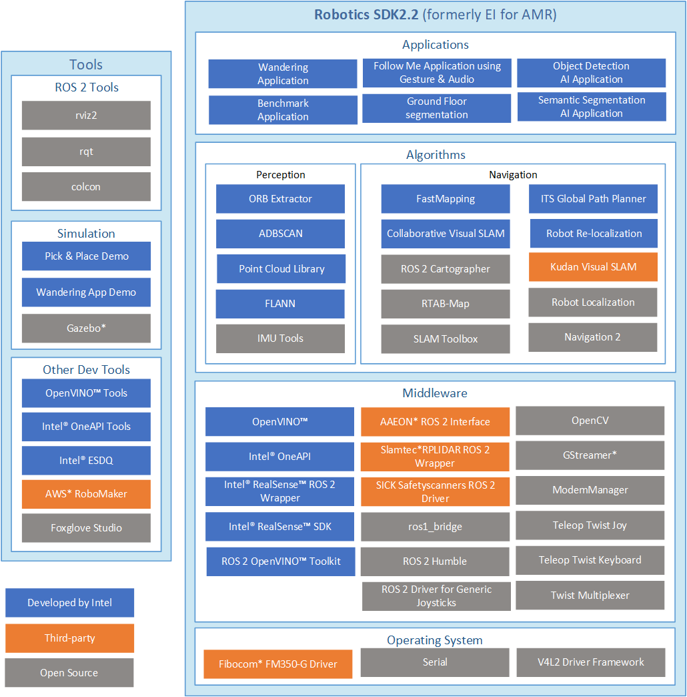

.. _how_it_works:

How it Works |how_it_works|
===========================

The |lp_amr| (\ |p_amr|\ ) modules are deployed as |deb_packs|, 
enhancing the Developer Experience (DX) and supporting Continuous Integration and
Continuous Deployment (CI/CD) practices. They offer flexible deployment across various
execution environments, including robots, development PCs, servers, and the cloud.

Modules and Services
--------------------

In the |l_oneapi| (|oneapi|) and |l_openvino| (|openvino|), a middleware layered 
architecture that abstracts hardware dependencies from algorithm implementation.

The |ros| with a data distribution service (DDS) is used as a message bus.
This Publisher-Subscriber architecture based on |ros| topics decouples
data providers from consumers.

Camera and LiDAR sensor data is abstracted through |ros| topics.

Video streaming processing pipelines are supported by |GStreamer_Framework|. |GStreamer_Framework|
is a library for constructing media handling component graphs. It decouples
sensor ingestion, video processing and AI object detection via |openvino|
toolkit DL Streamer framework. This versatile framework supports applications ranging from simple
Ogg Vorbis playback audio and video streaming to complex audio (mixing) and
video (non-linear editing) processing.

For more complex computational graphs that decouple Sense-Plan-Act in AMR applications, |ros| topic registration can be implemented.

This diagram shows the software components included in the |p_amr|
package.

The |p_amr| software stack relies on the underlying hardware platform, software supported by and integrated into
their respective Unified Extensible Firmware Interface (UEFI) based boot processes, and supported |Linux|
operating system. For requirement details, see :doc:`../../dev_guide/requirements`.

|p_amr| Drivers
---------------------

|lp_amr| relies on standard |intel|
Architecture |Linux| drivers that are included and upstreamed in the |Linux| kernel
from kernel.org and forming part of |Ubuntu| distributions. These drivers
are not bundled within the |p_amr| package. Some notable drivers that are
specifically important for |p_amr| include:

-  Video4Linux2 Driver Framework, a collection of device drivers and an API for
   supporting realtime video capture on |Linux| systems (compatible with USB
   webcams, TV tuners etc.), standardizing the video output, so that
   programmers can easily add video support to their applications.

-  The Serial Driver, the serial stream as used in Ethernet and USB interfaces.

.. include:: tools.rst

.. include:: robot-apps.rst

.. include:: robot-algorithms.rst

.. include:: robot-middleware.rst
