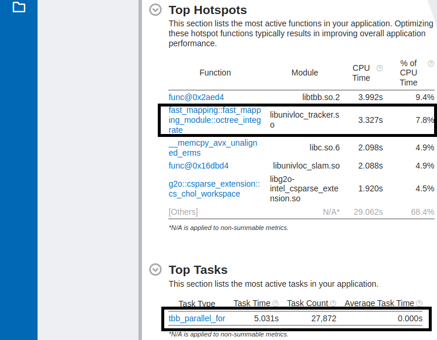
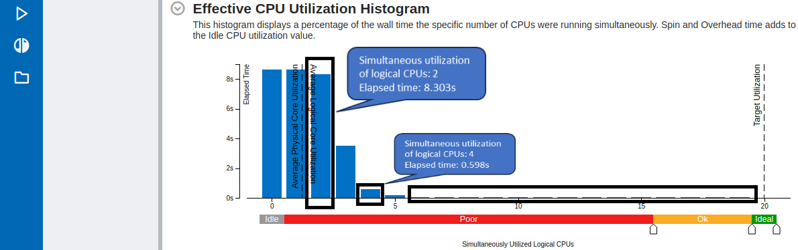
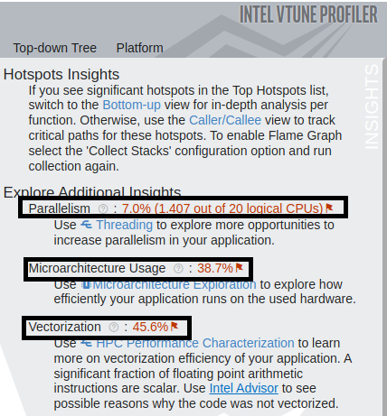
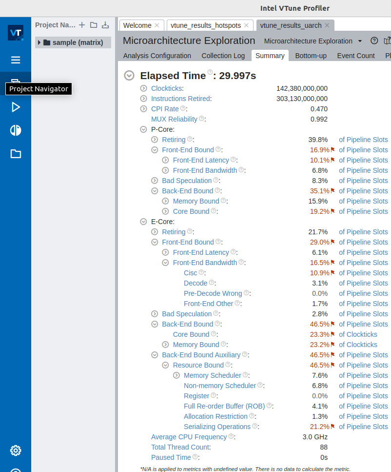
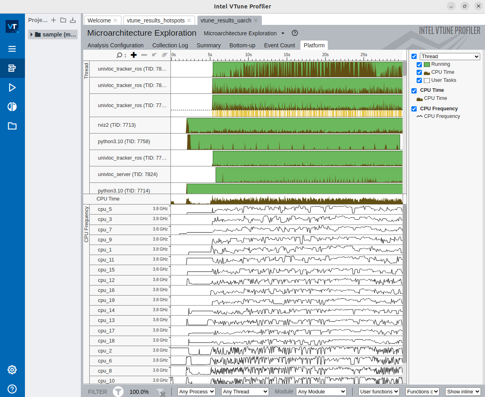

=================================
|vtune| for CPU and GPU profiling
=================================

Overview
========

|vtune| is a performance analysis tool for applications and systems, which helps in analyzing and optimizing the application performance, system performance and system configuration. The profiling can be executed on a CPU, GPU or FPGA. It can profile both single-threaded as well as multi-threaded applications. Refer the |vtune_get_started_guide| for more details on |vtune|.

Installation of |vtune|
=======================

Follow the |vtune_profiler_installation_guide| to install |vtune| by choosing one of the following two options:

* |vtune_get_the_intel_oneapi_base_toolkit|
* |vtune_get_the_intel_vtune_profiler|


Additional System Setup for CPU and GPU Profiling
=================================================

#. Build and Install the Sampling Drivers for |Linux| Targets.

   To do CPU and GPU profiling using driverless sampling collection on processors based on |intel| Performance Hybrid Architecture, which has been introduced from 12th Gen |core| processors, the |vtune| sampling drivers must be installed and loaded using root credentials. Follow the steps to |vtune_sampling_driver_installation_guide|.

#. System setup for CPU and GPU profiling.

   As described in |vtune_setup_system_for_GPU_analysis|, to analyze |intel| HD and |intel| Iris Graphics hardware events, the profiler requires that the "Intel Metric Discovery(MD) API" Library is installed and that the necessary permissions to enable the collecting of GPU hardware metrics.

   * Follow the steps |vtune_setup_system_for_GPU_analysis|, to build and install the Intel Metric Discovery(MD) API Library.
   * Run the below command to grant relevant permission to enable the collecting of GPU hardware metrics for non-privileged users.

      .. code-block::

         sudo sysctl -w dev.i915.perf_stream_paranoid=0

   * Run the below command to remove the limited scope of the "ptrace()" system call.
  
      .. code-block::

         sudo sysctl -w kernel.yama.ptrace_scope=0
   
   * Run the below command to disallow raw tracepoint access to unprivileged users.
  
      .. code-block::

         sudo sysctl -w kernel.perf_event_paranoid=0

   * Run the below command to remove the restrictions are placed on exposing kernel addresses via /proc and other interfaces.

      .. code-block::

         sudo sysctl -w kernel.kptr_restrict=0

   * Run the below command to add the user to the video and render group.
  
      .. code-block::

         sudo usermod -a -G video $USER
         sudo usermod -a -G render $USER


Profiling an Application from |lp_amr|
======================================

The example application from |lp_amr| considered for the CPU and GPU profiling is the "Collaborative visual slam with fastmapping enabled" application from the  :doc:`../../tutorials_amr/navigation/collaborative-slam` tutorial. The two CPU analyses types considered in this example are ``CPU Hotspots`` analysis and ``CPU Microarchitecture Exploration`` analysis. Furthermore, the GPU analysis type considered is ``GPU Offload`` analysis. The CPU and GPU profiling are carried out using the ``vtune`` command line tool. However, the ``vtune-gui`` tool is later used to visualize and understand the findings. 


CPU Profiling
-------------

CPU Hotspots Analysis
`````````````````````

The CPU Hotspots Analysis is carried out with the following parameters:

* Hardware sampling enabled with sampling interval of 5ms.
* Stack collection enabled with stack size of 2048B.
* The application is called directly by the profiler.
* The profiler runs and profiles the application for 30 seconds and terminates the application.

Steps to run CPU Hotspots Analysis
''''''''''''''''''''''''''''''''''
      
#. Install the "Collaborative visual slam with fastmapping enabled" application from the :doc:`../../tutorials_amr/navigation/collaborative-slam` tutorial.

#. Run the below command to source the |ros| setup files.

   .. code-block::

      source /opt/ros/humble/setup.bash

#. Run the below command to set the ROS_DOMAIN_ID.

   .. code-block::

      export ROS_DOMAIN_ID=67

#. Run the below command to source the VTune environment

   .. code-block::

      source /opt/intel/oneapi/vtune/latest/env/vars.sh

#. Run the below command on the terminal to start the CPU Hotspots Analysis of the "Collaborative visual slam with fastmapping enabled" application from the :doc:`../../tutorials_amr/navigation/collaborative-slam` tutorial.

   .. code-block::

      vtune -collect hotspots -knob sampling-mode=hw -knob sampling-interval=5 -knob enable-stack-collection=true -knob stack-size=2048 -duration=30 -result-dir ./vtune_results_hotspots /opt/ros/humble/share/collab-slam/tutorial-fastmapping/cslam-fastmapping.sh
         
The results are collected in ``vtune_results_hotspots`` directory.

.. note::

   The sampling interval and the duration can be changed by adapting the value of the parameters ``-sampling-interval`` and ``-duration`` respectively.

Analysis of the CPU Hotspots Results
''''''''''''''''''''''''''''''''''''

After the CPU Hotspots Analysis results are saved, open the ``vtune-gui`` by running the following command.

.. code-block::
         
   vtune-gui
      
Now click on the ``open-results`` button on the left side of the tool, browse to the directory ``vtune_results_hotspots``, select the ``vtune_results_hotspots.vtune`` file and click on ``open``. This will open the CPU Hotspots Analysis results for the "Collaborative visual slam with fastmapping enabled" application from the :doc:`../../tutorials_amr/navigation/collaborative-slam` tutorial which ran for 30 seconds.

From the summary page, some of the CPU Hotspots Analysis details that can be observed are mentioned below. Refer to the page, |vtune_run_and_interrupt_hotspots_analysis|, for more details on the CPU Hotspots Analysis using |vtune|.

Top Hotspots and the Top Tasks
..............................
      
The below picture showcases the most active functions in the application, the total CPU time it has run and the % of CPU time it has utilized. For example, here, it can be observed that from the "Collaborative visual slam with fastmapping enabled" application from the :doc:`../../tutorials_amr/navigation/collaborative-slam` tutorial, the function ``fast_mapping::fast_mapping_module::octree_integrate`` is the second most active function consuming 7.8% of CPU time. Also the top running task is ``tbb_parallel_for`` with a task time of 5.031 seconds and the task being called 27,872 times as shown under "Task Count" column.



Effective CPU Utilization Histogram
...................................

The below histogram shows the effective CPU core utilization when the application is running. From the below picture it can be observed that the effective elapsed time wherein two logical CPU cores are utilized is slightly above 8 seconds. On the other hand, the effective elapsed time wherein four logical CPU cores are utilized is slightly greater than 0.5 seconds. It can also be observed that at no time six or more logical CPU cores are utilized simultaneously.
         


Additional Insights
...................

Under "Explore Additional Insights" section, an overview of the following can be observed. This will encourage to further explore the relevant analysis types which further helps in the optimization of the application.

* Parallelism: On an average how many CPUs out of total available CPUs were utilized. Here 1.407 out of available 20 logical CPUs were utilized.
* Microarchitecture usage: This gives an estimate (in %) on how effectively the application has utilized the underlying hardware architecture.




CPU Microarchitecture Exploration
`````````````````````````````````

The CPU Microarchitecture Exploration is carried out with the following parameters:

* Hardware sampling enabled with sampling interval of 5ms.
* The application is called directly by the profiler.
* The profiler runs and profiles the application for 30 seconds and terminates the application.
   
Steps to run CPU Microarchitecture Exploration
''''''''''''''''''''''''''''''''''''''''''''''
   
#. Install the "Collaborative visual slam with fastmapping enabled" application from the :doc:`../../tutorials_amr/navigation/collaborative-slam` tutorial.

#. Run the below command to source the |ros| setup files.

   .. code-block::

      source /opt/ros/humble/setup.bash

#. Run the below command to set the ROS_DOMAIN_ID.

   .. code-block::

      export ROS_DOMAIN_ID=67

#. Run the below command to source the VTune environment

   .. code-block::

      source /opt/intel/oneapi/vtune/latest/env/vars.sh

#. Run the below command on the terminal to start the CPU Microarchitecture Exploration of the "Collaborative visual slam with fastmapping enabled" application from the :doc:`../../tutorials_amr/navigation/collaborative-slam` tutorial.

   .. code-block::

      vtune -collect uarch-exploration -knob sampling-interval=5 -duration=30 -result-dir=./vtune_results_uarch /opt/ros/humble/share/collab-slam/tutorial-fastmapping/cslam-fastmapping.sh
      
The results are collected in ``vtune_results_uarch`` directory.

.. note::

   The sampling interval and the duration can be changed by adapting the value of the parameters ``sampling-interval`` and ``-duration`` respectively.

Analysis of the CPU Microarchitecture Exploration results
'''''''''''''''''''''''''''''''''''''''''''''''''''''''''

After the CPU Microarchitecture Exploration results are saved, open the ``vtune-gui`` by running the following command.

.. code-block::
         
   vtune-gui
      
Now click on the ``open-results`` button on the left side of the tool, browse to the directory ``vtune_results_uarch``, select the ``vtune_results_uarch.vtune`` file and click on ``open``. This will open the CPU Microarchitecture Exploration results for the "Collaborative visual slam with fastmapping enabled" application from the :doc:`../../tutorials_amr/navigation/collaborative-slam` tutorial which ran for 30 seconds.

From the summary page, some of the CPU Microarchitecture Exploration details that can be observed are mentioned below. Refer to the page, |vtune_analyze_microarchitecture_usage|, for more details on the CPU Microarchitecture Exploration using |vtune|.

P-core and E-core execution summary
...................................

The below picture showcases the execution summary of the application running on P-cores and E-cores. This gives an overview on percentage of retired instructions on P-core and E-core respectively, percentage of slots during which the CPU was waiting due to front-end bound and back-end bound latencies on P-core and E-core respectively and many other parameters giving a comparison between the tasks executing on P-core and E-core respectively.
      


CPU Bandwidth utilization
.........................

Click on ``Platform`` tab to see the CPU Bandwidth utilization. The below picture shows the CPU bandwidth usage by different threads of the running application.


