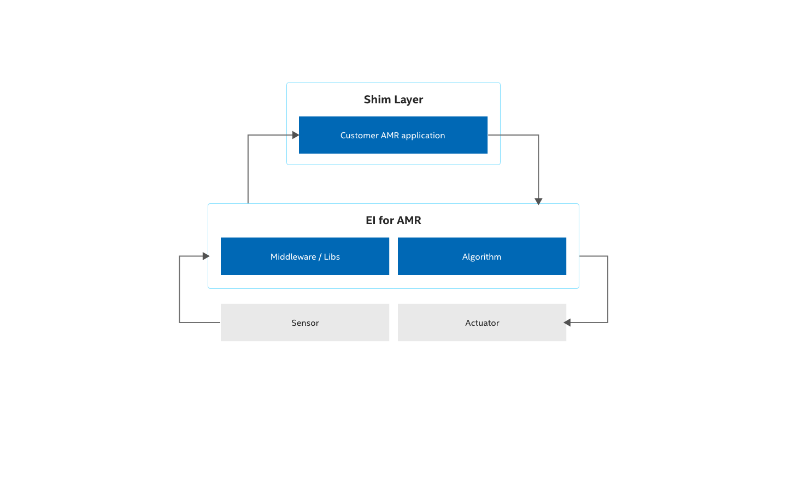

Security
========

This section highlights the security features offered by
|lp_amr| and provides
an overview of the security features. For further reading, refer to the
specific documents listed below.

Shim Layer - Protect your application data
------------------------------------------

The |p_amr| includes open-source components, which may be affected by
vulnerabilities. A shim layer can help to protect your program data
against an attack initiated via these vulnerabilities.

The main task of the shim layer is to reduce the attack surface by
verifying the data (such as size, value range, memory range, etc.)
transferred via a function call to or from a library or an executable
and protect the customer code and data via this mechanism.

Due to architecture constraints, only the developer of the application
code can implement the matching shim layer correctly.

The following picture shows a potential implementation of a shim layer
around the customer application like a shell.

Keep in mind, complex checks and more layers might have an impact on the
overall system performance.

In general, it is highly recommended to check regularly for updates and
vulnerabilities on the component web sites.

|lp_amr| Platform
--------------------

The main |p_amr| platform is based on the 12th generation
|core| processor with accelerators primarily used for AI inference
and vision processing. The platform inherits many security elements from
the processor.

Security Use Cases and Features
-------------------------------

The |p_amr| platform offers various security features that customers
can leverage in the context of Autonomous Robotics Applications. They
are listed as follows:

**Secure Boot**

Ensure the system boots from a trusted source and is not manipulated by
an attacker. To establish a secure boot, a chain of trust is set up; the
root-of trust is unmodifiable by nature. Typically, the root-of trust is
a key burned in fuses in the device or ROM based program code.

Intel devices support secure boot with |intel| Trusted Execution
Technology (|intel| TXT) and offers via the |intel| CSME, a software
implementation of the Trusted Platform Module (TPM).

More information about the described use cases and features can be found
in the following documents:

.. list-table::
   :header-rows: 1
   :widths: 40 20 40

   * -  Document Title
     -  Intel Document ID
     -  Document Link
   * -  |intel| Converged Boot Guard and |intel| Trusted Execution Technology (|intel| TXT)
     -  575623
     -  https://cdrdv2.intel.com/v1/dl/getContent/575623
   * -  |tgl| - Firmware Architecture Specification
     -  608531
     -  https://cdrdv2.intel.com/v1/dl/getContent/608531
   * -  |intel| Trusted Execution Technology (|intel| TXT) DMA Protection Ranges
     -  633933
     -  https://cdrdv2.intel.com/v1/dl/getContent/633933
   * -  |intel| Trusted Execution Technology (|intel| TXT) Enabling Guide
     -  –  
     -  https://www.intel.com/content/www/us/en/developer/articles/guide/intel-trusted-execution-technology-intel-txt-enabling-guide.html
   * -  Trusted Platform Module Specification
     -  –
     -  https://trustedcomputinggroup.org/

**Authentication**

Authentication helps to develop a secure system. A run-time
authentication system is the next step following secure boot. Any
program code can be authenticated before it is executed by the
system. This powerful tool enables AMR suppliers to guarantee a level of
security, and safety during run-time. Executing code from an unknown
source or malware would not be possible.

The |intel| Dynamic Application Loader (|intel| DAL) is a feature of
|intel| platforms that allows you to run small portions of Java\* code on
|intel| Converged Security and Management Engine (|intel| CSME) firmware.
Intel has developed DAL Host Interface Daemon (also known as JHI), which
contains the APIs that enable a |Linux| operating system to communicate
with Intel DAL. The daemon is available both in a standalone software
package and as part of the Yocto Project's |Linux| 64-bit distribution.

More information about the described use cases and features can be found
in the following documents:

.. list-table::
   :header-rows: 1
   :widths: 40 20 40

   * -  Document Title
     -  Intel Document ID
     -  Document Link
   * -  Trusty TEE Software Architecture Specification
     -  607736
     -  https://cdrdv2.intel.com/v1/dl/getContent/607736
   * -  |intel| Dynamic Application Loader (|intel| DAL) Developer Guide
     -  –
     -  https://www.intel.com/content/www/us/en/develop/documentation/dal-developer-guide/top.html

**Virtualization**

Virtualization is another important element to increase the level of
security and safety. It helps to establish freedom from interference
(FFI), as it's requested for safety use cases, and workload
consolidation. Intel devices have supported this use case with |intel|
Virtualization Technology (|intel| VT) for decades.

More information about the described use cases and features can be found
in the following documents:

.. list-table::
   :header-rows: 1
   :widths: 40 20 40

   * -  Document Title
     -  Intel Document ID
     -  Document Link
   * -  |intel| 64 and IA-32 Architectures Software Developer Manuals
     -  –
     -  https://www.intel.com/content/www/us/en/developer/articles/technical/intel-sdm.html

**Encryption**

Encryption is required for many security use cases. The |p_amr|
platform supports the common encryption algorithms like AES or RSA in
hardware. This increases the encryption/decryption performance and
the security level. Typical use cases are the encryption of
communication messages, a file system, or single files for IP protection
or the creation of a secure storage for security relevant data like
crypto keys or passwords. Another use case is memory encryption; the EI
for AMR platform supports this with the Total Memory Encryption (TME)
feature.

More information about the described use cases and features can be found
in the following documents:

.. list-table::
   :header-rows: 1
   :widths: 40 20 40

   * -  Document Title
     -  Intel Document ID
     -  Document Link
   * -  |tgl| |intel| Total Memory Encryption (|intel| TME)
     -  620815
     -  https://cdrdv2.intel.com/v1/dl/getContent/620815
   * -  Whitley Platform Memory Encryption Technologies -TME/MK-TME deep Dive
     -  611211
     -  https://cdrdv2.intel.com/v1/dl/getContent/611211
   * -  |intel| 64 and IA-32 Architectures Software Developer Manuals
     -  –
     -  https://www.intel.com/content/www/us/en/developer/articles/technical/intel-sdm.html
   * -  Filesystem-level encryption (|Linux| OS)
     -  –
     -  https://www.kernel.org/doc/html/v4.16/filesystems/fscrypt.html
   * -  |intel| Advanced Encryption Standard Instructions (AES-NI)
     -  –
     -  https://www.intel.com/content/dam/develop/external/us/en/documents/introduction-to-intel-secure-key-instructions.pdf

**Firmware Update**

To improve the security and safety status over the lifetime of a device,
the internal firmware (e.g. BIOS) must be updatable. In this case the
update packages are signed by the supplier (e.g. Intel, OEM etc.).

More information about the described use cases and features can be found
in the following document:

.. list-table::
   :header-rows: 1
   :widths: 40 20 40

   * -  Document Title
     -  Intel Document ID
     -  Document Link
   * -  |tgl| - Firmware Architecture Specification
     -  608531
     -  https://cdrdv2.intel.com/v1/dl/getContent/608531

**Secure Debug**

Debugging is an important feature during product development. During
in-field usage, debugging might also be needed to analyze field returns.
To prevent anyone from accessing internal resources via the debugger, a
secure debugging system is developed. In this case an engineer who wants
to use the debugger has to authenticate via a valid token which has to
be offered to the system (e.g. storing it in flash). Tokens must be
signed by a key which was stored during manufacturing flow into the
device fuses.

More information about the described use cases and features can be found
in the following documents:

.. list-table::
   :header-rows: 1
   :widths: 40 20 40

   * -  Document Title
     -  Intel Document ID
     -  Document Link
   * -  |tgl| - Firmware Architecture Specification
     -  608531
     -  https://cdrdv2.intel.com/v1/dl/getContent/608531
   * -  |tgl| enDebug User Guide
     -  630604
     -  https://cdrdv2.intel.com/v1/dl/getContent/630604
   * -  Anderson Lake Secure Debug User Guide
     -  614222
     -  https://cdrdv2.intel.com/v1/dl/getContent/614222
