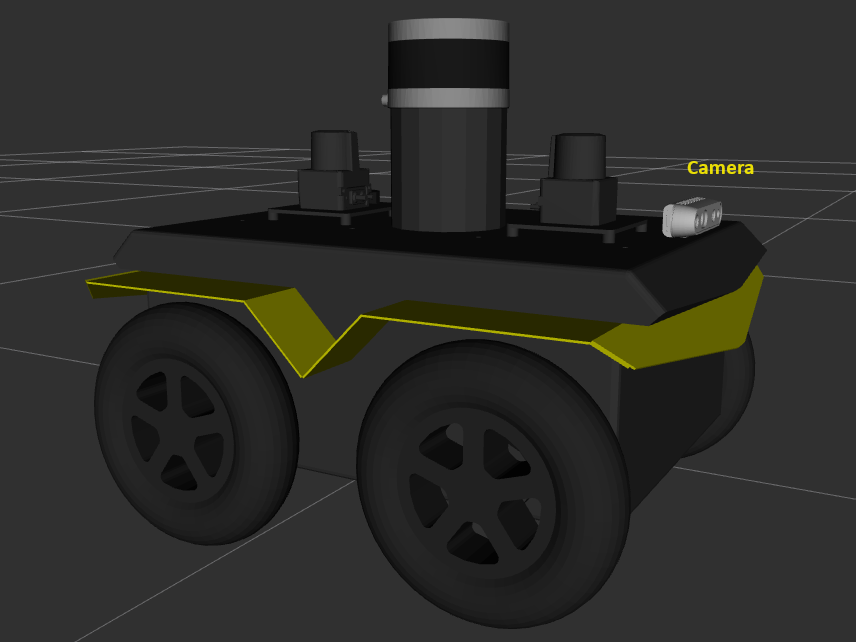
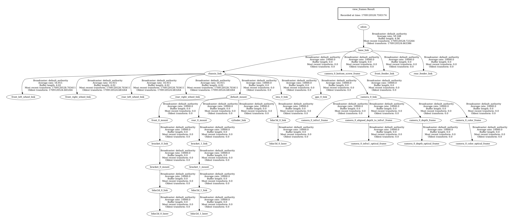
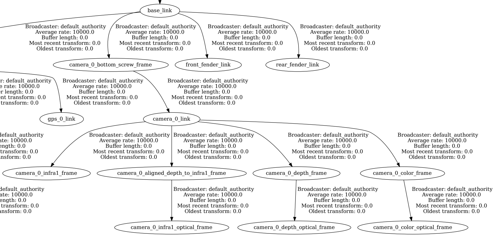

Install the |lp_amr| on the |jackal| Onboard Computer
=====================================================

This chapter describes how to install the |lp_amr| together with the
|ros| middleware and the |clearpath_robotics| ecosystem on
the onboard computer of the |jackal| robot.

The |clearpath_robotics| |jackal| robot is equipped with an onboard
computer that has a pre-installed |ubuntu| 22.04 LTS operating system,
|ros| Humble, and the |clearpath_robotics| software packages. We
recommend that you use the pre-installed software for the initial bring-up
of your |jackal| robot. During the initial bring-up, you should also update
the firmware of the MCU, as described on the
`Robot Installation
<https://docs.clearpathrobotics.com/docs/ros/installation/robot/>`__
page of the |clearpath_robotics| documentation.

We recommend that you create a backup of the default software installation
or replace the pre-installed SATA M.2 SSD with an empty storage device,
before you continue with the next steps.

Install |ros| Humble and the |lp_amr|
-------------------------------------

To install |ros| Humble and the |lp_amr| on the
|clearpath_robotics| |jackal| robot, follow the instructions in the 
:doc:`../../../../gsg_robot/index` of the |lp_amr|.

Since the |clearpath_robotics| services will need an account with the
username ``administrator``, you can create this account during the
installation of the |ubuntu| operating system. Otherwise, you can create this
account and set its group membership by means of:

.. code-block:: bash

   sudo adduser administrator
   sudo usermod -a -G sudo administrator

.. _install-clearpath-software-packages:

Install the |clearpath_robotics| Software Packages
--------------------------------------------------

After you have installed |ros| Humble and the |lp_amr|, you also need the
|ros| development tools (compilers and other tools to build |ros| packages).
They can be installed as described by the official
`ROS 2 Installation Instructions
<https://docs.ros.org/en/humble/Installation/Ubuntu-Install-Debians.html>`__:

.. code-block:: bash

   sudo apt-get install ros-dev-tools

Now you can install the |clearpath_robotics| software packages as described in the
`Package Install <https://docs.clearpathrobotics.com/docs/ros/installation/robot/#package-install>`__
section of the |clearpath_robotics| documentation. |clearpath_robotics| offers two
alternative ways to install the software:

* `Option 1: Install Script
  <https://docs.clearpathrobotics.com/docs/ros/installation/robot/#option-1-install-script>`__
  uses an automated installer.
* `Option 2: Manual Source Install
  <https://docs.clearpathrobotics.com/docs/ros/installation/robot/#option-2-manual-source-install>`__
  provides detailed instructions on how to install the software with higher flexibility.

Use one of these procedures to install the software on the |jackal| onboard computer.

.. _create-your-robot-config:

Create Your Robot Configuration
-------------------------------

This section describes how you can create the ``robot.yaml`` configuration
file for your |jackal| robot with an |realsense| D435i camera. Make sure
that you have completed the steps described in the previous section,
:ref:`install-clearpath-software-packages`.

.. _identify-realsense-serial-number:

Identify the Serial Number of your |realsense| Camera
~~~~~~~~~~~~~~~~~~~~~~~~~~~~~~~~~~~~~~~~~~~~~~~~~~~~~

The serial number of the |realsense| camera has to be included in the
``robot.yaml`` file. To identify the serial number, connect the camera
to the onboard computer of the |jackal| robot and run this command:

.. code-block:: bash

   ros2 launch realsense2_camera rs_launch.py

The output of this command will print the serial number. The serial
number of the camera in the example below is ``207522xxxx38`` (some digits
are masked here to preserve confidentiality).

.. code-block:: text

   [realsense2_camera_node-1] [INFO] [1709051840.999128954] [camera.camera]: RealSense ROS v4.54.1
   [realsense2_camera_node-1] [INFO] [1709051840.999193090] [camera.camera]: Built with LibRealSense v2.55.0
   [realsense2_camera_node-1] [INFO] [1709051840.999200850] [camera.camera]: Running with LibRealSense v2.55.0
   [realsense2_camera_node-1] [INFO] [1709051841.005234011] [camera.camera]: Device with serial number 207522xxxx38 was found.

Now you can stop the command by pressing ``Ctrl-c``.

.. note::

   Don't use the command ``lsusb -v`` to identify the serial number. The
   number displayed by this command might differ from the true serial number.

Create your Robot YAML File
~~~~~~~~~~~~~~~~~~~~~~~~~~~

To create the ``robot.yaml`` file with the configuration of your
|jackal| robot, follow the instructions on the
`Robot YAML Overview <https://docs.clearpathrobotics.com/docs/ros/config/yaml/overview/>`__
page of the |clearpath_robotics| documentation. As a starting point, you
can use the example configuration
`j100_sample.yaml <https://github.com/clearpathrobotics/clearpath_config/blob/main/clearpath_config/sample/j100/j100_sample.yaml>`__
in the |clearpath_robotics|
`configuration repository <https://github.com/clearpathrobotics/clearpath_config>`__.
Open this yaml file with an editor and adapt the sections ``serial_number``
and ``system`` according to your needs.

* Change the ``serial_number`` according to the serial
  number of your robot, for example ``j100-1234``.
* In the ``system/hosts`` section, adapt the ``hostname`` according to the
  hostname of the onboard computer of your |jackal| robot.
* In the ``system/hosts`` section, adapt the ``ip`` value according to the
  IP address of your |jackal| robot -- either its static address or
  the dynamic address that is assigned by the router of your network.
* In the ``system/ros2`` section, adapt the ``namespace`` string.
  While the |clearpath_robotics| default configuration usually defines
  a namespace for the |ros| topics, we recommend to use an empty
  namespace, as it is used by the tutorials of the |lp_amr|. An empty
  namespace is indicated by a slash character: ``namespace: /``
* In the ``system/ros2`` section, add the ``domain_id`` entry and set it
  to a value that does not conflict with the ``ROS_DOMAIN_ID`` of
  other |ros| installations in your neighborhood. The value that you
  use here will be propagated into the ``/etc/clearpath/setup.bash`` script,
  whose execution has been added to your ``~/.basrc`` script when you 
  executed one of the installation options in section
  :ref:`install-clearpath-software-packages`.
  In consequence, your ``ROS_DOMAIN_ID`` environment variable will be
  set to the value that you define here.
* If you have used the manual installation option in section
  :ref:`install-clearpath-software-packages`, add the ``workspaces`` entry
  to the ``system/ros2`` section. This entry provides a list of setup
  scripts that need to be sourced. Provide the path to the ``setup.bash``
  script of the workspace that was created when you executed the steps in
  `Option 2: Manual Source Install <https://docs.clearpathrobotics.com/docs/ros/installation/robot/#option-2-manual-source-install>`__,
  section "Source Install". The path of this script is
  ``/home/administrator/clearpath_ws/install/setup.bash``

Details on these configuration entries are provided on the
`System
<https://docs.clearpathrobotics.com/docs/ros/config/yaml/system/>`__
page of the |clearpath_robotics| documentation. To provide an example,
the following listing shows the first sections of a ``robot.yaml`` file.

.. code-block:: text

   serial_number: j100-1234
   version: 0
   system:
     hosts:
       - hostname: jackal-cfls-01
         ip: 192.168.1.78
     ros2:
       namespace: /
       domain_id: 68
       workspaces:
         - /home/administrator/clearpath_ws/install/setup.bash
   platform:
     ...

After you have completed the configuration, copy the ``robot.yaml`` file
to the ``/etc/clearpath/`` folder on the onboard computer of your
|jackal| robot.

If your ``~/.bashrc`` script defines a ``ROS_DOMAIN_ID`` environment variable,
you have to remove this definition. As mentioned above, this variable will be
set by the ``/etc/clearpath/setup.bash`` script according to the ``domain_id``
value that you have defined in the ``robot.yaml`` file.

After you have installed the |clearpath_robotics| software packages and
configured your ``robot.yaml`` file, you can run the commands
``ros2 node list`` and ``ros2 topic list`` in order to verify that
the |clearpath_robotics| services have started the |jackal|-specific |ros|
nodes, so that the related |ros| topics are published.

Add your |realsense| D435i Camera to the Robot YAML File
~~~~~~~~~~~~~~~~~~~~~~~~~~~~~~~~~~~~~~~~~~~~~~~~~~~~~~~~

The robot configuration file, which you have created in the previous section,
still requires to define a camera in the ``sensors`` section.

The `Sensors/Cameras <https://docs.clearpathrobotics.com/docs/ros/config/yaml/sensors/cameras>`__
page of the |clearpath_robotics| documentation shows an example of the
data structure that defines an |realsense| camera instance. We propose to
add the following ``camera`` configuration as the first device in the
``sensors`` section. This configuration has been tested successfully with
the |lp_amr|:

.. code-block:: text

   sensors:
     camera:
     - model: intel_realsense
       urdf_enabled: true
       launch_enabled: true
       parent: base_link
       xyz: [0.21, 0.0, 0.19]
       rpy: [0.0, 0.0, 0.0]
       ros_parameters:
         camera:
           camera_name: camera_0
           device_type: d435i
           serial_no: "207522xxxx38"
           enable_color: true
           rgb_camera.profile: 640,480,30
           enable_depth: true
           depth_module.profile: 640,480,30
           pointcloud.enable: true
           enable_infra1: true
           align_depth.enable: true
           enable_sync: true
           initial_reset: true

In comparison to the example data structure in the |clearpath_robotics| documentation,
the following items have been adapted:

* The ``xyz`` position of the ``camera`` joint relative to the ``base_link``
  has been set to ``[0.21, 0.0, 0.19]``. This means that the camera sits above
  the front fender of the |jackal| robot as shown in the image below.
* The ``device_type`` has been set to ``d435i``.
* The ``serial_no`` has been replaced with the actual serial number of the
  camera, which can be identified as described in the
  :ref:`identify-realsense-serial-number` section.
* The following features have been enabled:
  ``enable_infra1``, ``align_depth.enable``, ``enable_sync``, and ``initial_reset``.

Copy the ``robot.yaml`` file to the ``/etc/clearpath/`` folder on the onboard computer
of your |jackal| robot.
Reboot the robot, so that the new configuration will be propagated.

   |jackal| robot with an |realsense| camera above the front fender.
   The image has been rendered by the rviz2 tool using the TF data
   published by the |clearpath_robotics| services running on the robot.

Verify the Robot Configuration
------------------------------

Verify the Frames of the TF2 Tree
~~~~~~~~~~~~~~~~~~~~~~~~~~~~~~~~~

If not already installed, use the following command to install the ROS2 TF2 Tools:

.. code-block:: bash

   sudo apt install ros-humble-tf2-tools

To verify that the robot state publisher communicates the correct TF2 tree,
run the following command:

.. code-block:: bash

   ros2 run tf2_tools view_frames

This command will listen to the frames that are being broadcast over the |ros|
middleware and generate a PDF file showing how the frames of the robot are connected.
Open the PDF file and verify that the TF2 tree contains the ``camera_0_link``
and its children as shown in the images below. 

   Complete TF2 tree of the |jackal| robot with |realsense| camera;
   to increase the figure, right-click on the image and open the image
   in a new browser tab

   TF2 tree of the |jackal| robot -- detailed view on the camera_0_link

.. _verify-ros-topics:

Verify the |ros| Topics
~~~~~~~~~~~~~~~~~~~~~~~

Execute the command

.. code-block:: bash

   ros2 topic list

and verify that the required |ros| topics are published:

.. code-block:: text

   /cmd_vel
   /diagnostics
   /diagnostics_agg
   /diagnostics_toplevel_state
   /joint_state_broadcaster/transition_event
   /joy_teleop/cmd_vel
   /joy_teleop/joy
   /joy_teleop/joy/set_feedback
   /parameter_events
   /platform/bms/state
   /platform/cmd_vel_unstamped
   /platform/dynamic_joint_states
   /platform/emergency_stop
   /platform/joint_states
   /platform/mcu/status
   /platform/mcu/status/power
   /platform/mcu/status/stop
   /platform/motors/cmd_drive
   /platform/motors/feedback
   /platform/odom
   /platform/odom/filtered
   /platform/wifi_connected
   /platform/wifi_status
   /platform_velocity_controller/transition_event
   /rc_teleop/cmd_vel
   /robot_description
   /rosout
   /sensors/camera_0/camera/aligned_depth_to_color/camera_info
   /sensors/camera_0/camera/aligned_depth_to_color/image_raw
   /sensors/camera_0/camera/aligned_depth_to_color/image_raw/compressed
   /sensors/camera_0/camera/aligned_depth_to_color/image_raw/compressedDepth
   /sensors/camera_0/camera/aligned_depth_to_color/image_raw/theora
   /sensors/camera_0/camera/aligned_depth_to_infra1/camera_info
   /sensors/camera_0/camera/aligned_depth_to_infra1/image_raw
   /sensors/camera_0/camera/aligned_depth_to_infra1/image_raw/compressed
   /sensors/camera_0/camera/aligned_depth_to_infra1/image_raw/compressedDepth
   /sensors/camera_0/camera/aligned_depth_to_infra1/image_raw/theora
   /sensors/camera_0/camera/color/camera_info
   /sensors/camera_0/camera/color/image_raw
   /sensors/camera_0/camera/color/image_raw/compressed
   /sensors/camera_0/camera/color/image_raw/compressedDepth
   /sensors/camera_0/camera/color/image_raw/theora
   /sensors/camera_0/camera/color/metadata
   /sensors/camera_0/camera/depth/camera_info
   /sensors/camera_0/camera/depth/color/points
   /sensors/camera_0/camera/depth/image_rect_raw
   /sensors/camera_0/camera/depth/image_rect_raw/compressed
   /sensors/camera_0/camera/depth/image_rect_raw/compressedDepth
   /sensors/camera_0/camera/depth/image_rect_raw/theora
   /sensors/camera_0/camera/depth/metadata
   /sensors/camera_0/camera/extrinsics/depth_to_color
   /sensors/camera_0/camera/extrinsics/depth_to_infra1
   /sensors/camera_0/camera/infra1/camera_info
   /sensors/camera_0/camera/infra1/image_rect_raw
   /sensors/camera_0/camera/infra1/image_rect_raw/compressed
   /sensors/camera_0/camera/infra1/image_rect_raw/compressedDepth
   /sensors/camera_0/camera/infra1/image_rect_raw/theora
   /sensors/camera_0/camera/infra1/metadata
   /sensors/camera_0/color/image
   /sensors/camera_0/depth/image
   /sensors/camera_0/points
   /sensors/gps_0/nmea_sentence
   /sensors/imu_0/data
   /sensors/imu_0/data_raw
   /sensors/imu_0/magnetic_field
   /sensors/lidar2d_0/diagnostics
   /sensors/lidar2d_0/laser_status
   /sensors/lidar2d_0/scan
   /sensors/lidar2d_1/diagnostics
   /sensors/lidar2d_1/laser_status
   /sensors/lidar2d_1/scan
   /sensors/lidar3d_0/diagnostics
   /sensors/lidar3d_0/points
   /sensors/lidar3d_0/scan
   /sensors/lidar3d_0/velodyne_packets
   /sensors/lidar3d_0/velodyne_points
   /set_pose
   /tf
   /tf_static
   /twist_marker_server/cmd_vel
   /twist_marker_server/feedback
   /twist_marker_server/update

The names of the camera-related topics depend on the version of the
``ros-humble-realsense2-camera`` package on your system. The list above
has been created on a system with version 4.55 of this package.

To identify the installed package version on your board, run the command:

.. code-block:: bash

   apt show ros-humble-realsense2-camera

The following table shows how the names of the camera-related topics
depend on the package version.

+-----------------------------------+----------------------------------+
| Version of                        | Camera-related topics start with |
| ``ros-humble-realsense2-camera``  |                                  |
+===================================+==================================+
| 4.55                              | ``/sensors/camera_0/camera/``    |
+-----------------------------------+----------------------------------+
| 4.54                              | ``/sensors/camera_0/``           |
+-----------------------------------+----------------------------------+

.. _jackal-troubleshooting:

|jackal| Troubleshooting
------------------------

If the output of the ``ros2 topic list`` command does not show any topics,
verify that you are logged in as the ``administrator`` user. Furthermore,
check that the ``ROS_DOMAIN_ID`` environment variable contains the value
that is defined in your ``/etc/clearpath/robot.yaml`` file
under the ``system/ros2/domain_id`` entry.

If the output of the ``ros2 topic list`` command shows that there are some
|ros| topics missing (see the :ref:`verify-ros-topics` section for a list of topics),
there might be an issue with your installation of the |clearpath_robotics|
services. In this case, you can check whether the required services are
up and running. These services are responsible for parsing the ``robot.yaml``
file and for staring the required |ros| nodes.

.. code-block:: bash

   sudo systemctl status clearpath-platform.service clearpath-sensors.service clearpath-robot.service

If any of these services are not active (running), you can check whether
the systemd journal shows any error messages:

.. code-block:: bash

   sudo journalctl -b | grep clearpath

References
----------

-  `Clearpath Robotics - Jackal Unmanned Ground Vehicle Overview <https://clearpathrobotics.com/jackal-small-unmanned-ground-vehicle/>`__
-  `Clearpath Robotics - Jackal Unmanned Ground Vehicle User Manual <https://docs.clearpathrobotics.com/docs_robots/outdoor_robots/jackal/user_manual_jackal/>`__
-  `Clearpath Robotics - Robot Installation <https://docs.clearpathrobotics.com/docs/ros/installation/robot/>`__

