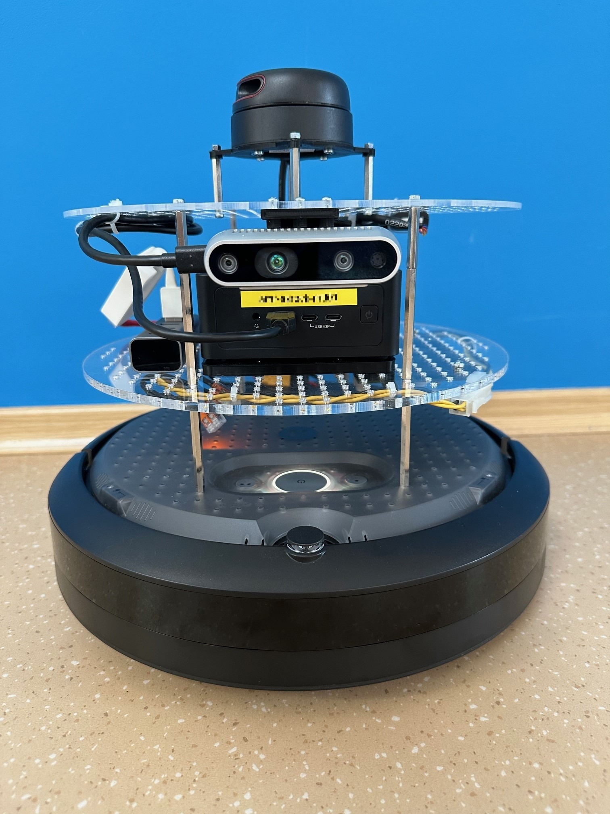
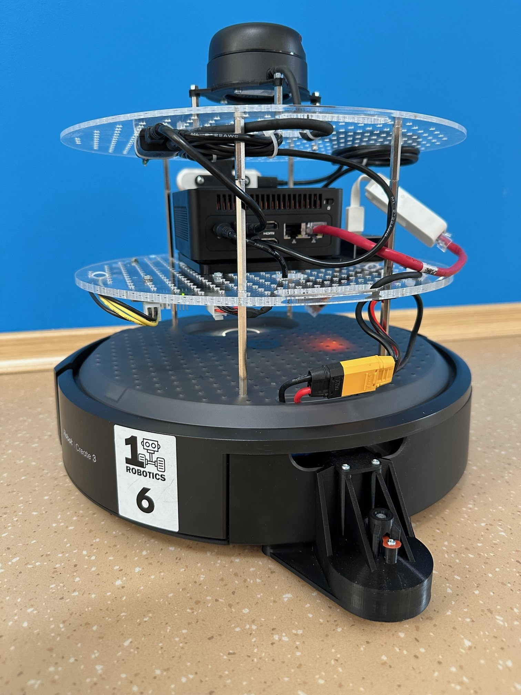
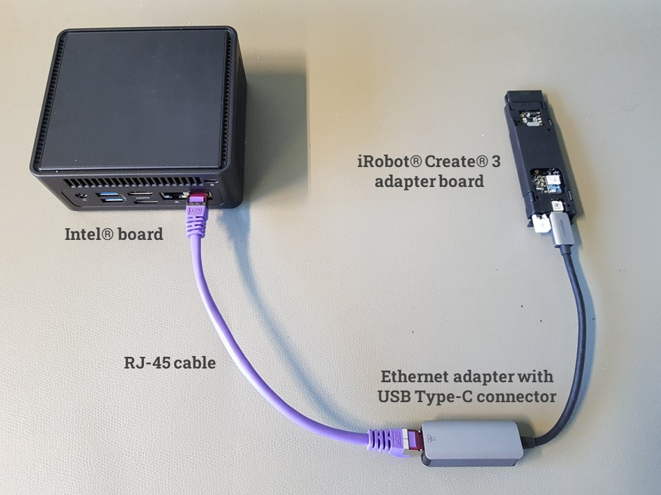
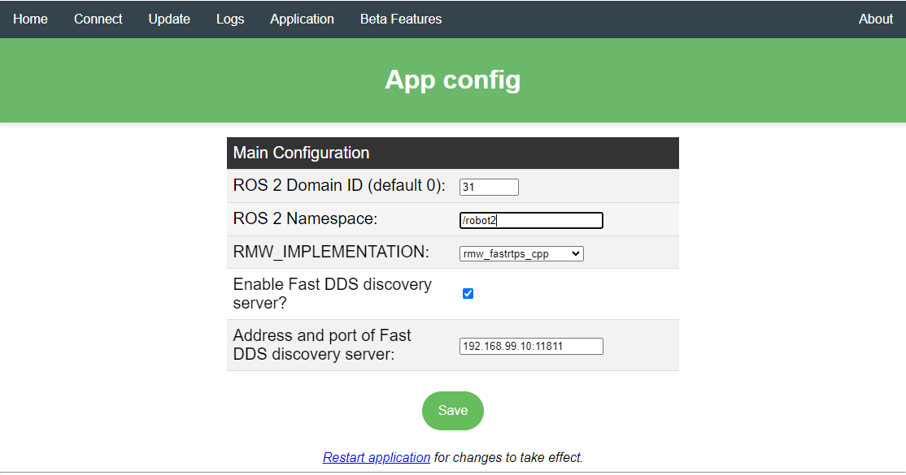

|irobot_create3|
================

|irobot_create3| is a mobile robotics platform, which developers can use
to gain hands-on experience with the technologies and concepts that are
foundational to the field of autonomous mobile robots. This practical
understanding is invaluable for those looking to enter the robotics
industry or further their knowledge in this rapidly evolving field.

Before starting, review the |irobot_create3_documentation| to be able to
perform the configuration changes needed for the tutorial.

|irobot_create3| hardware extensions
------------------------------------

|irobot_create3| contains a compute unit running |ros| that provides
access to the on-board sensors and actuators. For this tutorial, the
following modifications have been applied to the robot:

 - two support layers added on top of the robot,

 - |intel| board mounted on the bottom layer,

 - |realsense| camera mounted on the front of the top layer and
   connected to a USB port on the |intel| board,

 - |slamtec_rplidar| 2D (|slamtec_rplidar_a3| or |slamtec_rplidar_a2m8|) on a mount in the center of the
   top layer and connected to two USB ports on the |intel| board,

 - custom battery in the cargo bay to power the |intel| board and
   accessories, namely the camera and the lidar,

 - an Ethernet adapter connected to the |irobot_create3| adapter board
   and to the |intel| board,

 - a rear caster wheel attached to the cargo bay, as described in the
   `iRobot® Create® 3 Mechanical System
   <https://iroboteducation.github.io/create3_docs/hw/mechanical/>`__
   documentation.

   |irobot_create3| robot front view.

   |irobot_create3| robot rear view.

|irobot_create3| software configuration
^^^^^^^^^^^^^^^^^^^^^^^^^^^^^^^^^^^^^^^

Update the robot to use the latest |l_ros| firmware and configure it
to access your WiFi network following the
`iRobot® Create® 3 Setup
<https://edu.irobot.com/create3-setup>`__ documentation.

With the robot connected to your WiFi network continue configuring it
using its web interface. Refer to the |irobot_create3_documentation| for the exact
steps to follow.

Wired (Ethernet) network
........................

The |intel| board and the compute unit of the |irobot_create3| should be
connected using an Ethernet adapter with a USB Type-C connector. The
USB Type-C plug should be connected to the adapter board of the
|irobot_create3|, while the |intel| board should be connected to the
Ethernet adapter using an RJ-45 cable.

   Ethernet via USB connection between |irobot_create3|  adapter board
   and |intel| board.

The |irobot_create3| robot is configured to use the address
``192.168.186.2/24`` on the USB interface. You can change the network
part of the address by following the instructions on page
|irobot_create3_webserver_set_wired_subnet|.

On the |intel| board, the network interface connected to the robot
has to be configured with a static IP address of the same subnet.

NTP server
..........

Time synchronization is very important in |ros|. For this reason, the
|irobot_create3| includes an NTP server, which can be configured as described on page
`iRobot® Create® 3 Webserver - Edit ntp.conf
<https://iroboteducation.github.io/create3_docs/webserver/edit-ntp-conf/>`__.

Alternatively, you can set up an NTP server on the |intel| board by following
the |irobot_create3| documentation `Set up NTP on compute board
<https://iroboteducation.github.io/create3_docs/setup/compute-ntp/>`__.
Use the IP address of the Ethernet interface connected to the robot.

|ros| Middleware (RMW) Configuration & Fast DDS discovery server
................................................................

To define what |ros| middleware implementation shall be used by the
|irobot_create3|, follow the configuration guidelines on page
|irobot_create3_webserver_application|.
Set the RMW_IMPLEMENTATION option to ``rmw_fastrtps_cpp``, as shown in
the figure below.

   |irobot_create3| |l_ros| application configuration page. On this
   robot the |irobot_create3_webserver_set_wired_subnet|
   is set to ``192.168.99.2``, Fast DDS discovery server is enabled
   and runs on the |intel| board reachable at IP ``192.168.99.10``
   over the Ethernet connection. |ros| Domain ID is set but it is not
   used when the discovery server is enabled.

To speed up node discovery, enable the
`iRobot® Create® 3 Fast DDS Discovery Server
<https://iroboteducation.github.io/create3_docs/setup/discovery-server/>`__.
Use the IP address set above for the |intel| board on the USB
connection to the |irobot_create3| as the Fast DDS Discovery Server IP
address.

.. note::

   When the discovery server is enabled, the ``ROS_DOMAIN_ID`` is not used.

Robot namespace
...............

Set a |ros| namespace (e.g., ``/robot2``) for your robot, as described on page
|irobot_create3_webserver_application|. This value should be passed to the
launch file as argument ``irobot_ns``.

|irobot_create3| Wandering tutorial
-----------------------------------

This tutorial presents the Wandering application running on an
|irobot_create3| mobile robotics platform extended with an |intel|
compute board, an |realsense| camera and a |slamtec_rplidar| 2D lidar.

The tutorial uses the |realsense| camera and the |slamtec_rplidar| 2D
lidar for both mapping with RTAB-Map and navigation with Nav2.
For navigation, |intel| :doc:`ground floor segmentation
<../../../dev_guide/tutorials_amr/perception/pointcloud-groundfloor-segmentation>`
is used for segmenting ground level and remove it from the |realsense|
camera pointcloud.

Watch the video for a demonstration of the |irobot_create3| navigating
in a testing playground:

.. video:: ../../../videos/irobot-create3-demo-wandering-rviz.mp4
   :preload: none
   :width: 900

|intel| board connected to |irobot_create3|
^^^^^^^^^^^^^^^^^^^^^^^^^^^^^^^^^^^^^^^^^^^

Follow the instructions on page
`iRobot® Create® 3 - Network Recommendations
<https://iroboteducation.github.io/create3_docs/setup/network-config/>`__
to set up an Ethernet over USB connection and to configure the network
device on the |intel| board.
Use an IP address of the same subnet as used on the |irobot_create3|.

Check that the |irobot_create3| is reachable over the Ethernet
connection. Output on the robot with the configuration from the image
above:

.. code-block:: bash

   $ ping -c 3 192.168.99.2
   PING 192.168.99.2 (192.168.99.2) 56(84) bytes of data.
   64 bytes from 192.168.99.2: icmp_seq=1 ttl=64 time=1.99 ms
   64 bytes from 192.168.99.2: icmp_seq=2 ttl=64 time=2.31 ms
   64 bytes from 192.168.99.2: icmp_seq=3 ttl=64 time=2.02 ms

   --- 192.168.99.2 ping statistics ---
   3 packets transmitted, 3 received, 0% packet loss, time 2004ms
   rtt min/avg/max/mdev = 1.989/2.105/2.308/0.144 ms

Install the ``ros-humble-wandering-irobot-tutorial`` package on the
|intel| board connected to the robot.

.. code-block:: bash

   apt install ros-humble-wandering-irobot-tutorial

Start the discovery server in a new terminal:

.. code-block:: bash

   fastdds discovery --server-id 0

In a new terminal set the environment variables for |ros| to use the
discovery server:

.. code-block:: bash

   export ROS_DISCOVERY_SERVER=127.0.0.1:11811
   export ROS_SUPER_CLIENT=true
   unset ROS_DOMAIN_ID

Check that the setup is correct by listing the |ros| topics provided
by the robot:

.. code-block:: bash

   ros2 topic list

The |irobot_create3| topics should be listed:

.. code-block:: bash

   /parameter_events
   /robot2/battery_state
   /robot2/cliff_intensity
   /robot2/cmd_audio
   /robot2/cmd_lightring
   /robot2/cmd_vel
   ...
   /robot2/tf
   /robot2/tf_static
   /robot2/wheel_status
   /robot2/wheel_ticks
   /robot2/wheel_vels
   /rosout

.. note::

   If only ``/parameter_events`` and ``/rosout`` topics are listed then
   the communication between the robot and the |intel| board is not
   working. Check the |irobot_create3_documentation| to troubleshoot
   the issue.

Start the tutorial using its launch file; provide the namespace set on
the robot in the argument ``irobot_ns``:

.. code-block:: bash

   ros2 launch wandering_irobot_tutorial wandering_irobot.launch.py irobot_ns:=/robot2

To use ``ros2 cli`` utilities, e.g. ``ros2 topic``, ``ros2 node``, set the
environment variables above before running the commands.
