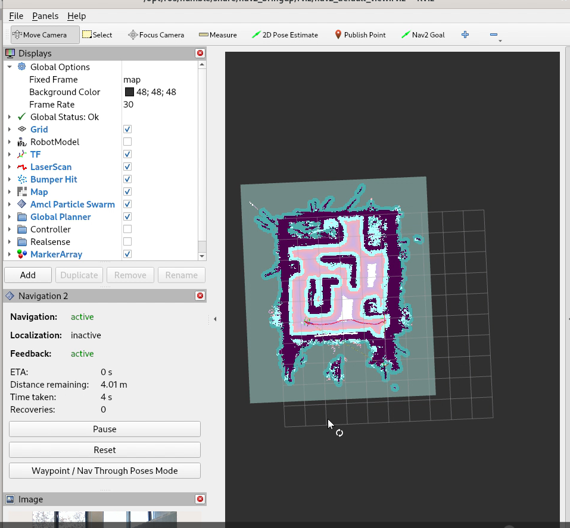

Wandering Application on AAEON robot with |realsense| Camera and RTAB-Map SLAM
=====================================================================================

This tutorial details the steps to install Wandering Application with |realsense| camera input and create a map using RTAB-Map Application.

Getting Started
----------------

Install |deb_pack|
^^^^^^^^^^^^^^^^^^^^^^^

Install the ``ros-humble-wandering-aaeon-tutorial`` |deb_pack| from the |intel| |p_amr| APT repository.

   .. code-block::

      sudo apt update
      sudo apt install ros-humble-wandering-aaeon-tutorial

Run Demo
----------------

Run the following commands to create a map using RTAB-Map and Wandering Application tutorial on the Aaeon robot.

   .. code-block::

      source /opt/ros/humble/setup.bash
      ros2 launch wandering_aaeon_tutorial wandering_aaeon.launch.py

Once the command is executed, the robot starts moving and creates a map with RTAB-Map Application.

Troubleshooting
----------------------------

- You can stop the demo anytime by pressing ``ctrl-C``.

- For general robot issues, go to: :doc:`../../../../dev_guide/tutorials_amr/robot-tutorials-troubleshooting`.
