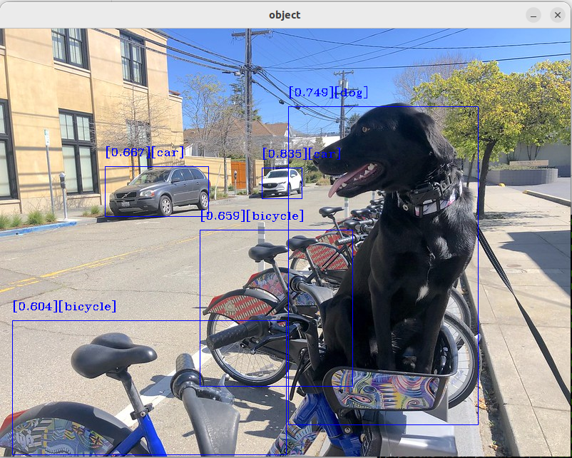

.. object-detection-tutorial:

|openvino| Object Detection Tutorial
=======================================

This tutorial is an example for understanding the utilization of the |ros| |openvino| node.
It outlines the steps for installing the node and executing the object detection model.
Object detection is performed using the |openvino| toolkit. The node is configured to accept dynamically
device parameters (NPU, GPU, or CPU) to specify which inference engine should be used.

Source Code
^^^^^^^^^^^
The source code of this component can be found here: `Object-Detection <https://github.com/open-edge-platform/edge-ai-suites/robotics-ai-suite/components/object-detection>`_

Install |openvino| tutorial packages
^^^^^^^^^^^^^^^^^^^^^^^^^^^^^^^^^^^^^^

.. code-block:: bash

   sudo apt install ros-humble-object-detection-tutorial

Run Demo with Image Input
^^^^^^^^^^^^^^^^^^^^^^^^^^^^^^^^^^^^^^

Run one of the following commands to launch the object detection node with a specific inference engine:

*  GPU  inference engine

   .. code-block:: bash

      ros2 launch object_detection_tutorial openvino_object_detection.launch.py device:=GPU

*  CPU  inference engine

   .. code-block:: bash

      ros2 launch object_detection_tutorial openvino_object_detection.launch.py device:=CPU

*  NPU  inference engine

   .. code-block:: bash

      ros2 launch object_detection_tutorial openvino_object_detection.launch.py device:=NPU

.. note::

   If no device is specified, the GPU is selected by default as an inference engine.

Once the tutorial is started, the ``mobilenetssd`` model is downloaded, converted into IR files, and the inference process begins.

Expected Output
^^^^^^^^^^^^^^^^^^^^^^^^^^^^^^^^^^^^^^

To close this application, type ``Ctrl-c`` in the terminal where you ran the launch script.

Troubleshooting
---------------

For general robot issues, go to: :doc:`../../../../dev_guide/tutorials_amr/robot-tutorials-troubleshooting`.
