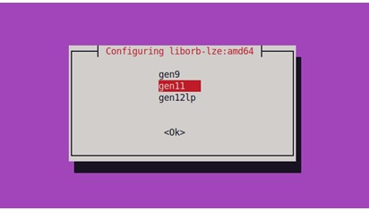

.. _orb-extractor-packge:

GPU ORB Extractor Feature Overview
====================================

The orb-extractor feature takes an input image and provides keypoints (spatial locations or points in the image that define what is interesting) 
and descriptor data for those keypoints of that input image.

The library implements the orb-extractor feature, running on a GPU.

This orb-extractor feature can be easily integrated into Visual SLAM. After initializing the orb-extractor feature object, 
the extract function can be called for every input frame. The extract function returns a set of key points and descriptors.

The orb-extractor feature is constructed from various GPU kernels, including image resize, Gaussian operations, FAST feature extraction,
and descriptor and orientation calculations. 
It interfaces with the GPU via the oneAPI Level Zero interface, with the GPU kernels developed using the C-for-Metal SDK.

The orb-extractor feature library enables users to generate multiple orb-extractor objects tailored to their applications. 
Additionally, a single orb-extractor feature object exhibits the capability to process input from one or multiple camera sources, 
providing versatile support for various configurations in the realm of Visual SLAM front-ends.

The orb-extractor feature library provides two binary files. one linked with the OpenCV library and another without it. 
The OpenCV linked version handles input and output using OpenCV objects like ``cv::Mat and cv::KeyPoints``. 
On the other hand, the version not dependent on OpenCV utilizes the internally defined input and output formats within the orb-extractor feature library.

System Requirements
-----------------------------------------------------------------------------
1) Ubuntu 22.04 LTS. 
2) OpenCV 4.5.4

Hardware Requirements
-----------------------------------------------------------------------------
Any of the following CPU with integrated |intel| GPU.

.. code-block::
  
   1) 13th Generation Intel® Core™ i3/i5/i7 Processors          
   2) 12th Generation Intel® Core™ i3/i5/i7 Processors          
   3) 11th Generation Intel® Core™ i3/i5/i7 Processors       
   4) 10th Generation Intel® Core™ i3/i5/i7 Processors       
   5) 6th to 9th Generation Intel® Core™ i3/i5/i7 Processors 

|deb_packs|
-----------------------------------------------------------------------------

.. code-block::

  1) liborb-lze - Include host libraries libgpu_orb.so, libgpu_orb_ocvfree.so and compiled GPU kernels.
  2) liborb-lze-dev - Samples code to show how to use the library.

Install |deb_packs| 
-----------------------------------------------------------------------------

.. code-block::

   sudo apt install liborb-lze-dev liborb-lze 

Upon installing the orb-extractor feature |deb_packs|, a dialog box displaying images will be presented. 
Choose the appropriate architecture from this selection.

The following information will help you select the right architecture:

.. code-block::
   
   13th Generation Intel® Core™ i3/i5/i7 Processors       - gen 12lp  
   12th Generation Intel® Core™ i3/i5/i7 Processors       - gen 12lp   
   11th Generation Intel® Core™ i3/i5/i7 Processors       - gen 12lp
   10th Generation Intel® Core™ i3/i5/i7 Processors       - gen 11
   6th to 9th Generation Intel® Core™ i3/i5/i7 Processors - gen 9
