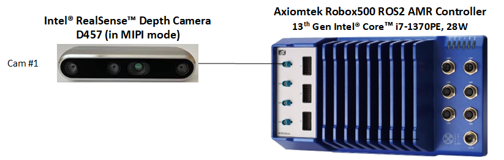

.. realsense-ros2-sample-application:

|realsense| |ros| Sample Application
==============================================================

This tutorial tells you how to:

-  Launch ROS nodes for a camera.

-  List ROS topics.

-  Confirm that |realsense| topics are publishing data.

-  Retrieve data from the |realsense| camera (data coming at FPS).

-  Visualize an image from the |realsense| camera displayed in rviz2.

This |realsense| |ros| Sample Application can be run using two different types of |realsense| cameras. The next section explains how to run this sample application using an |realsense| USB camera (for example, |realsense| D435i). The subsequent section focuses on an |intel_realsense_depth_camera_d457| in MIPI mode, which is connected to an |axiomtek_robox500_ros2_amr_controller|.

Using |realsense| USB camera
````````````````````````````

#. Connect an |realsense| USB camera (for example, |realsense| D435i) to the host.

#. Install the ``librealsense2`` and ``realsense2`` tools:

   .. code-block::

      sudo apt-get install -y ros-humble-librealsense2-tools

#. To download and install the |realsense| |ros| sample application, run the command below:

   .. code-block::

      sudo apt-get install -y ros-humble-realsense2-tutorial-demo

#. Set up the |ros| environment:

   .. code-block::

      source /opt/ros/humble/setup.bash

#. Run the |realsense| |ros| sample application:

   .. code-block::

      ros2 launch realsense2_tutorial realsense2_tutorial.launch.py

   Expected output: The image from the |realsense| camera is displayed in rviz2, on the bottom left side.

   .. image:: ../../../images/rs_tutorial_usb.png

#. To close this, do the following:

   -  Type ``Ctrl-c`` in the terminal where the tutorial was run.

Using |intel_realsense_depth_camera_d457| on an |axiomtek_robox500_ros2_amr_controller|  
```````````````````````````````````````````````````````````````````````````````````````

The following steps are required to set up the |axiomtek| to support the |realsense| Depth Camera D457.

|axiomtek| Setup
................

Connect an |realsense| Depth Camera D457 to  the |axiomtek| as shown in the below picture. Now, power-on the target.



.. Note:: Select the "MIPI" mode of the |realsense| Depth Camera D457 by moving the select switch on the camera to "M", as shown in the below picture.

   .. image:: ../../../images/MIPI_USB_Switch_in_D457.jpeg
      :width: 350
      :height: 250

BIOS settings
^^^^^^^^^^^^^
Go to the BIOS menu by pressing "``Del``" or "``Esc``" button when the board is powered on. The following BIOS settings should be set to enable |realsense| Depth Camera D457 support on an |axiomtek|.

* Intel Advanced Menu -> Power & Performance -> CPU-Power Management Control -> C States -> < Disable > (Note: If enabled, fps drops)
* Intel Advanced Menu -> System Agent (SA) Configuration -> MIPI Camera Configuration -> < Enable > (Note: Enable all four cameras in this menu)
* Camera BIOS settings.

.. list-table:: Camera BIOS settings
    :widths: 25 15 15 15 15
    :header-rows: 1

    * - BIOS setting
      - Camera 1
      - Camera 2
      - Camera 3
      - Camera 4
    * - MIPI Port
      - 0
      - 1
      - 2
      - 3
    * - Lane user
      - x2
      - x2
      - x2
      - x2
    * - Port speed
      - 2
      - 2
      - 2
      - 2
    * - I2C Channel
      - I2C5
      - I2C5
      - I2C5
      - I2C5
    * - Device0 I2C Address
      - 12
      - 14
      - 16
      - 18
    * - Device1 I2C Address
      - 42
      - 44
      - 62
      - 64
    * - Device2 I2C Address
      - 48
      - 4a
      - 68
      - 6c

Install ``librealsense2`` and ``realsense2`` tools
^^^^^^^^^^^^^^^^^^^^^^^^^^^^^^^^^^^^^^^^^^^^^^^^^^
.. code-block:: bash

    sudo apt install -y ros-humble-librealsense2-tools

Install ``intel-ipu6`` (``intel-ipu6-dkms``) driver
^^^^^^^^^^^^^^^^^^^^^^^^^^^^^^^^^^^^^^^^^^^^^^^^^^^
#. Create a ``/etc/modprobe.d/blacklist-ipu6.conf`` file and add the lines of the listing below. This will prevent the loading of the existing default ``intel_ipu6_isys`` kernel module.

   .. code-block:: console

       # kernel builtin ipu6 driver and realsense D4XX driver clash with intel-ipu6-dkms installation.
       blacklist intel_ipu6_isys
       blacklist intel_ipu6_psys
       blacklist intel_ipu6

#. Reboot the target.
#. Install the ``intel-ipu6-dkms``:

   .. code-block::

       sudo apt install -y intel-ipu6-dkms

#. Run the following command for ``dkms`` to force-install the ``intel-ipu6`` driver:

   .. code-block:: bash

       dkms install --force ipu6-drivers/20230621+iotgipu6-0eci8

#. Check the ``dkms`` status by using the following command:

   .. code-block:: bash

       $ dkms status
       ipu6-drivers/20230621+iotgipu6-0eci8, 5.15.0-1048-intel-iotg, x86_64: installed

   If the ``dkms`` status is not "installed", then rerun the command from step number 4.

#. ``modprobe`` the installed ``intel-ipu6`` driver:

   .. code-block:: bash

       sudo modprobe intel-ipu6-isys

   .. Note:: The ``modprobe`` command must be run after every system reboot. This is because the ``intel-ipu6-isys`` kernel module is not loaded by OS at boot. It must be loaded manually using the above command.

#. After installation, check the status of the loaded ``intel-ipu6-isys`` kernel module. The kernel module loaded must be ``/lib/modules/5.15.0-1048-intel-iotg/updates/dkms/intel-ipu6-isys.ko`` as shown below:

   .. code-block:: bash

       $ modinfo intel-ipu6-isys | head -3
       filename:       /lib/modules/5.15.0-1048-intel-iotg/updates/dkms/intel-ipu6-isys.ko
       description:    Intel ipu input system driver
       license:        GPL

Add the user to the *video* and *render* group
^^^^^^^^^^^^^^^^^^^^^^^^^^^^^^^^^^^^^^^^^^^^^^
.. code-block:: bash

    # Add the $USER to the video group
    sudo usermod -a -G video $USER

    # Add the $USER to the render group
    sudo usermod -a -G render $USER

Install and run the  |realsense| |ros| sample application
.........................................................

#. To download and install the |realsense| |ros| sample application run the below command:

   .. code-block::

      sudo apt-get install -y ros-humble-realsense2-tutorial-demo

#. Set up the |ros| environment:

   .. code-block::

      source /opt/ros/humble/setup.bash

#. Run the following command to bind the |realsense| Depth camera D457 with ``intel-ipu6`` driver with metadata enabled:

   .. code-block::

      rs_ipu6_d457_bind.sh

#. Run the |realsense| |ros| sample application:

   .. code-block::

      ros2 launch realsense2_tutorial realsense2_tutorial.launch.py use_sub_camera:=false

   Expected output: The image from the |realsense| camera is displayed in rviz2, on the bottom left side.

   .. image:: ../../../images/rs_tutorial_gmsl_Axiomtek.png

#. To close this, do the following:

   -  Type ``Ctrl-c`` in the terminal where the tutorial was run.
