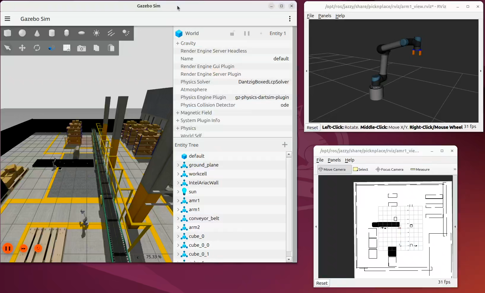

# Simulated Robotics with Gazebo

The Robotics AI Suite relies on the open source ROS 2 stack to provide dependable, tested, and expandable capabilities for your robotics use-case. When designing a new robotics platform or use-case, you'll use simulation as your proving ground, ensuring that your ROS application doesn't stress or break your real world robot beyond its means. In ROS 2, the simulator of choice is Gazebo. It provides first-class ROS integration, meaning that the nodes you create to drive your code are delivering the same messages that you would use on your real bot, while giving you a wide ecosystem of out of the box ready models, simulated sensor data, and an expressive world format that lets you create robust approximation of your real world deployment.

This software reference will walk you through setting up and using Gazebo to give you base understanding of _how_ the Robotics AI Suite uses it in the various pipelines and ingredients that you can use in your own platform.

## Source Code

The [Simulations source code](https://github.com/open-edge-platform/edge-ai-suites/tree/main/robotics-ai-suite/components/simulations)
is available with the Robotics AI Suite.

## PicknPlace Simulation

PicknPlace is a ROS 2 and Gazebo simulation of a material-transfer cell. A
cube moves on a conveyor, ARM1 picks it and places it on an AMR tray, the AMR
navigates to ARM2, and ARM2 picks the cube from the tray. Perception is
simulated: the cube controller obtains poses from Gazebo and publishes object
state directly instead of using a camera detection pipeline.

For architectural information, see [Architecture](#architecture)



### Prerequisites

Complete the [Getting Started](../../../platform_foundation/getting_started.md) guide before continuing.

### Install Debian Package

Install `picknplace-simulation` Debian package from Intel® Autonomous Mobile Robot APT repository.

<!--hide_directive::::{tab-set}hide_directive-->
<!--hide_directive:::{tab-item}hide_directive--> **Jazzy**
<!--hide_directive:sync: jazzyhide_directive-->

```bash
sudo apt update
sudo apt install ros-jazzy-picknplace-simulation
```

<!--hide_directive:::hide_directive-->
<!--hide_directive:::{tab-item}hide_directive--> **Humble**
<!--hide_directive:sync: humblehide_directive-->

```bash
sudo apt update
sudo apt install ros-humble-picknplace-simulation
```

<!--hide_directive:::hide_directive-->
<!--hide_directive::::hide_directive-->

### Run PicknPlace Simulation

<!--hide_directive::::{tab-set}hide_directive-->
<!--hide_directive:::{tab-item}hide_directive--> **Jazzy**
<!--hide_directive:sync: jazzyhide_directive-->

```bash
source /opt/ros/jazzy/setup.bash
ros2 launch picknplace warehouse.launch.py
```

<!--hide_directive:::hide_directive-->
<!--hide_directive:::{tab-item}hide_directive--> **Humble**
<!--hide_directive:sync: humblehide_directive-->

```bash
source /opt/ros/humble/setup.bash
ros2 launch picknplace warehouse.launch.py
```

<!--hide_directive:::hide_directive-->
<!--hide_directive::::hide_directive-->

FastDDS as backend some times causing stability issues. Recommended to run with Cyclone DDS. See [Cyclone DDS usage](#cyclone-dds-usage) for more information.

```bash
RMW_IMPLEMENTATION=rmw_cyclonedds_cpp ros2 launch  picknplace warehouse.launch.py
```

### PicknPlace Overview

The setup consists of:

- **Two robotic arms**: Based on the UR5 model.
- **One Autonomous Mobile Robot (AMR)**: A customized version of the TurtleBot3 robot.

The robotic arms are controlled using the MoveIt2 stack, whereas the AMR is
navigated using the Nav2 stack. Each robot operates within its own namespace,
showcasing the seamless integration of multiple robots, each with its designated
control stack, in a unified Gazebo environment.

The primary goal of this demo is to illustrate the combined and coordinated use
 of Nav2 and MoveIt2 stacks in a Gazebo simulation.

The demonstration workflow is as follows:

- One of the robotic arms (ARM1) picks up an item from a moving conveyor belt.
- The item is then placed onto the AMR, which is based on the TurtleBot3 Waffle robot design.
- Using Nav2, the AMR autonomously plans and traverses a path to the second robotic arm, referred to as ARM2.

> **Note:** This demo prioritizes the representation of combined stack usage over intricate details. Some assumptions have been made for simplicity. For instance, the item's location on the conveyor belt is sourced directly from Gazebo without integrating perception systems.

### Architecture

The solution is split into three packages with distinct responsibilities:

| Package | Responsibility |
| --- | --- |
| `picknplace` | Scenario launch, cube spawning, ARM1/ARM2 state machines, and AMR state machine |
| `robot_config` | Robot descriptions, Gazebo and robot launch helpers, MoveIt2 configurations, Nav2 configuration, map server, and bridges |
| `gazebo_plugins` | Simulation-side conveyor control and vacuum/gripper behavior, including namespace handling needed during model startup |

The default entry point is `ros2 launch picknplace warehouse.launch.py`.
That launch file passes `use_sim_time` to the stack and uses `launch_stack` to
enable or disable Nav2 and MoveIt2 bringup.

#### Simulation and integration layer

- **Gazebo** loads `worlds/warehouse.world` and simulates the conveyor, AMR,
  UR5 arms, cubes, sensors, and physics.
- **`ros_gz_bridge`** bridges `/clock` and robot-specific Gazebo topics into
  ROS 2. The clock bridge makes the simulation time source available to every
  node using `use_sim_time`.
- **Gazebo plugins** implement conveyor behavior and gripper/vacuum behavior.
  The conveyor exposes control through the custom
  `robot_config_plugins/srv/ConveyorBeltControl` service.
- **`cube_controller.py`** creates cubes through Gazebo Transport, subscribes
  to Gazebo dynamic poses, broadcasts cube TF frames, and publishes
  `picknplace/BoxState` on `/object_location`.

#### Robot execution layer

- **AMR (`/amr1`)** is a namespaced TurtleBot3 Waffle. Its robot description
  and odometry TF are published by `robot_config`; Nav2 provides localization,
  planning, and the `/amr1/navigate_to_pose` action server.
- **ARM1 (`/arm1`) and ARM2 (`/arm2`)** are namespaced UR5 instances. Each has
  `robot_state_publisher`, ros2_control controllers, MoveIt2 configuration,
  and a gripper trajectory controller.
- **`arm1_controller.py`** tracks the moving cube using object state and TF,
  plans and executes arm motion through MoveIt2, controls the gripper, stops and
  restarts the conveyor around the pick, and signals the AMR when the cube is
  loaded.
- **`amr_controller.py`** runs a SMACH state machine that waits for the ARM1
  transfer, sends a Nav2 goal, signals ARM2 to pick up the cube, and returns
  the AMR to the loading area.
- **`arm2_controller.py`** runs the receiving pick-and-place state machine.
  It receives the cube identity through ROS parameters, uses TF and MoveIt2
  to reach the tray, and commands the gripper through
  `/arm2/gripper_controller/follow_joint_trajectory`.

#### Startup and Ownership

`picknplace/launch/warehouse.launch.py` owns scenario composition. It starts
the following sequence:

1. Gazebo and the global `/clock` bridge.
2. The conveyor belt model.
3. The `amr1` model, its robot description, Gazebo bridges, and optional Nav2
   stack.
4. The global warehouse map server and lifecycle manager.
5. ARM1, including its ros2_control and optional MoveIt2 stack.
6. ARM2, after ARM1's joint trajectory action is available.
7. The cube, ARM1, AMR, and ARM2 controllers, plus visualization and TF
   support.

The arm launches are intentionally serialized. ros2_control and the Gazebo
process share controller-manager namespace state during initialization; a
second model spawned at the wrong point can collide with that state. The
`wait_on` launch mechanism and the namespace-reset plugin preserve isolation
between `arm1`, `arm2`, and `amr1`.

#### Launch Sequence

Robots are spawned in Gazebo, as illustrated in the diagram.

```{mermaid}
flowchart LR
    A["Warehouse.launch.py"]
    B["Launch Gazebo\n(gazebo.launch.py)"]
    C["Spawn ConveyorBelt"]
    D["Launch AMR\n(amr.launch.py)"]
    E["Launch ARM1\n(arm1.launch.py)"]
    F["Launch ARM2\n(arm2.launch.py)"]
    G["Launch Controllers + Rviz2"]

    A --> B
    B --> C
    C --> D
    D --> E
    E --> F
    F --> G

    classDef warehouse fill:#1f5aa8,stroke:#183f7a,color:#fff,stroke-width:2px;
    classDef launch fill:#4caf50,stroke:#2e7d32,color:#fff,stroke-width:2px;

    class A warehouse;
    class B,C,D,E,F,G launch;
```

#### Runtime Data Flow

The diagram shows the logical runtime relationships. Solid arrows represent
runtime data or commands; dashed arrows represent launch or initialization
dependencies.

```{mermaid}
flowchart LR
    User[ros2 launch picknplace warehouse.launch.py]

    subgraph Simulation[Gazebo simulation]
        GZ[Gazebo world and physics]
        Belt[Conveyor belt plugin]
        Gripper[Vacuum/gripper plugins]
        Cubes[Cubes and robot models]
        GZ --> Belt
        GZ --> Gripper
        GZ --> Cubes
    end

    subgraph Integration[ROS-Gazebo integration]
        Clock[ros_gz_bridge /clock]
        Bridges[Robot topic bridges]
        Map[Nav2 map_server + lifecycle manager]
    end

    subgraph Robots[Robot stacks]
        AMR[amr1 TurtleBot3]
        Nav2[Nav2 /amr1]
        Arm1[arm1 UR5 + ros2_control]
        MoveIt1[MoveIt2 arm1]
        Arm2[arm2 UR5 + ros2_control]
        MoveIt2[MoveIt2 arm2]
    end

    subgraph Orchestration[picknplace controllers]
        CubeCtl[cube_controller.py]
        Arm1Ctl[arm1_controller.py]
        AmrCtl[amr_controller.py]
        Arm2Ctl[arm2_controller.py]
    end

    User -.-> GZ
    User -.-> AMR
    User -.-> Arm1
    User -.-> Arm2
    GZ --> Clock
    GZ <--> Bridges
    GZ <--> CubeCtl
    Clock --> CubeCtl
    Clock --> Nav2
    Clock --> MoveIt1
    Clock --> MoveIt2
    Bridges --> AMR
    Map --> Nav2
    AMR <--> Nav2
    Arm1 <--> MoveIt1
    Arm2 <--> MoveIt2
    Gripper <--> Arm1
    Gripper <--> Arm2
    Belt <--> Arm1Ctl
    CubeCtl -->|/object_location + cube TF| Arm1Ctl
    Arm1Ctl -->|MoveIt2 + gripper action| MoveIt1
    Arm1Ctl -->|conveyor service| Belt
    Arm1Ctl -->|state/object parameters| AmrCtl
    AmrCtl -->|NavigateToPose action| Nav2
    AmrCtl -->|state/object parameters| Arm2Ctl
    Arm2Ctl -->|MoveIt2 + gripper action| MoveIt2

    Arm1 -.->|spawn before| Arm2
    AMR -.->|spawn before| Arm1
    Arm1 -.->|trajectory action ready| Arm2
```

#### Workflow

1. `cube_controller.py` spawns a marked cube on the conveyor and publishes
   its current state and TF.
2. ARM1 observes the cube position, moves to the intercept point with
   MoveIt2, pauses the conveyor through the plugin service, closes its
   gripper, and places the cube on the AMR tray.
3. ARM1 updates the AMR controller's state and transfer coordinates.
4. The AMR controller sends a `NavigateToPose` goal through Nav2 to ARM2.
5. At the destination, the AMR controller passes the cube name and a start
   state to ARM2 through ROS parameter services.
6. ARM2 locates the cube through TF, picks it from the tray, and completes the
   receiving operation. The AMR then returns to its home/loading position.

#### Key Interfaces

| Interface | Producer | Consumer | Purpose |
| --- | --- | --- | --- |
| `/clock` | Gazebo bridge | ROS 2 nodes | Shared simulation time |
| `/object_location` (`picknplace/BoxState`) | `cube_controller` | ARM1 controller | Cube identity and location |
| Cube TF frames | `cube_controller` | ARM1 and ARM2 controllers | Frame-based object tracking |
| `/amr1/navigate_to_pose` | Nav2 | AMR controller | AMR navigation goals |
| `/arm1/arm_controller/follow_joint_trajectory` | ARM1 controller | ARM1 ros2_control | Arm trajectory execution and ARM2 startup gate |
| `/arm1/gripper_controller/follow_joint_trajectory` | ARM1 controller | ARM1 ros2_control | Gripper motion |
| `/arm2/gripper_controller/follow_joint_trajectory` | ARM2 controller | ARM2 ros2_control | Gripper motion |
| `ConveyorBeltControl` service | Conveyor plugin | ARM1 controller | Pause/resume belt during grasp |
| ROS parameter services | ARM1/AMR/ARM2 controllers | Peer controllers | State and object hand-off |

#### Operational Constraints

- Run with `use_sim_time=true`; controller timing and cube tracking depend on
  Gazebo's clock.
- Cyclone DDS is recommended because the simulation creates many DDS
  participants through Gazebo and the multi-robot stacks.
- Namespaces are part of the contract: AMR topics use `/amr1`, and arm topics,
  TF frames, controllers, and MoveIt2 groups use `/arm1` or `/arm2`.
- The architecture intentionally bypasses perception. Replacing the direct
  Gazebo object-state path with a vision node would require preserving the
  `BoxState`/TF contract or adapting ARM1's tracking logic.

### Cyclone DDS usage

**Cyclone DDS usage**: It's recommended to execute the demo using Cyclone DDS
over FastDDS. We observed some instability with FastDDS, potentially due to the
multitude of nodes and associated interfaces instantiated in the ``gzserver``.
This might overload a singular DDS participant. In tests, Cyclone DDS emerged as
the more reliable choice, particularly when handling a vast number of nodes
established by a single entity. This might also be attributable to FastDDS's
default configurations, optimized for speed.

To utilize Cyclone DDS, enable it through the following commands. The apt
install command issued earlier will ensure Cyclone DDS is installed.

<!--hide_directive::::{tab-set}hide_directive-->
<!--hide_directive:::{tab-item}hide_directive--> **Jazzy**
<!--hide_directive:sync: jazzyhide_directive-->

```bash
sudo apt-get install ros-jazzy-rmw-cyclonedds-cpp
export RMW_IMPLEMENTATION=rmw_cyclonedds_cpp
```

<!--hide_directive:::hide_directive-->
<!--hide_directive:::{tab-item}hide_directive--> **Humble**
<!--hide_directive:sync: humblehide_directive-->

```bash
sudo apt-get install ros-humble-rmw-cyclonedds-cpp
export RMW_IMPLEMENTATION=rmw_cyclonedds_cpp
```

<!--hide_directive:::hide_directive-->
<!--hide_directive::::hide_directive-->

### Reusing ARM and AMR modules

The robot_config package offers a straightforward way to instantiate both AMR
(Autonomous Mobile Robot) and  UR5 ARM robotic configurations. You can
effortlessly integrate these configurations into any ROS 2 launch file to
visualize and simulate them in Gazebo.

**Spawning AMR in Gazebo**

```python
amr_launch_cmd = IncludeLaunchDescription(
      PythonLaunchDescriptionSource(
      os.path.join(robot_config_launch_dir, 'amr.launch.py')),
      launch_arguments={
         'amr_name': 'amr1',
         'x_pos': '1.0',
         'y_pos': '1.0',
         'yaw': '0.0',
         'use_sim_time': 'true',
         'launch_stack': 'true',
         'wait_on': 'service /spawn_entity'
      }.items()
)

ld.add_action(amr_launch_cmd)
```

**Spawning ARM in Gazebo**

```python
arm1_launch_cmd = IncludeLaunchDescription(
      PythonLaunchDescriptionSource(
         os.path.join(robot_config_launch_dir, 'arm.launch.py')),
      launch_arguments={ 'arm_name': 'arm1',
                     'x_pos': '2.0',
                     'y_pos': '2.0',
                     'z_pos': '0.01',
                     'yaw': '0.0',
                     'pedestal_height': '0.16',
                     'use_sim_time': 'true',
                     'launch_stack': 'true',
                     'wait_on': 'service /spawn_entity'
                     }.items()
                  )
ld.add_action(arm1_launch_cmd)
```
