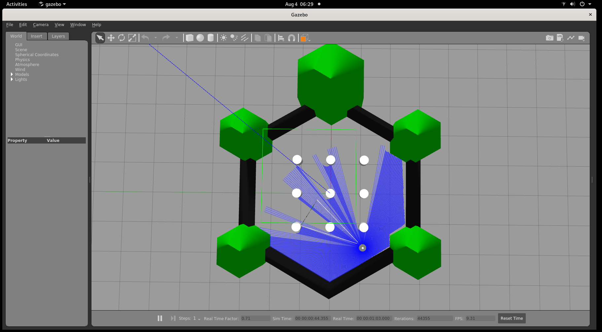
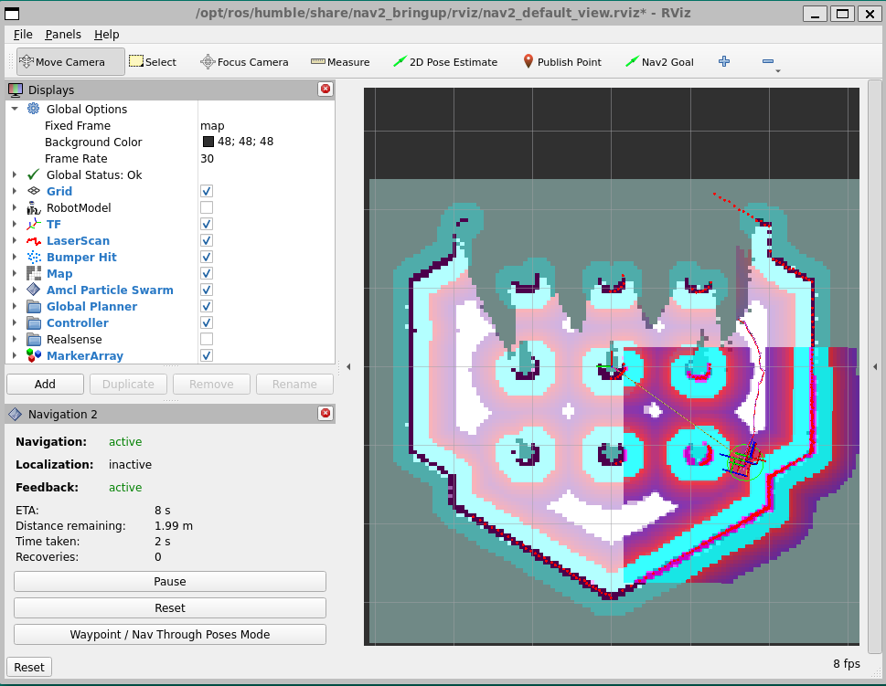

# Simulating `wandering`

In this software reference, you'll simulate the `wandering` pipeline. This pipeline is built of multiple components available in the Robotics AI Suite, showcasing how to simulate a complex perception and navigation workload in Gazebo.

`wandering` is a fully-autonomous robotics pipeline, allowing a robot to map the space around it and actually navigate to make sure its map is complete, all without human intervention. You can consider it as a demonstration of what combining multiple ingredients from Intel Robotics AI Suite can create out of the box, and give you an idea of how you can use them in your own robotics use-case.

## Architecture

Wandering combines sensor input, SLAM and mapping, navigation, and robot control.
It continuously updates an occupancy map, chooses unexplored frontiers, and
sends navigation goals through Nav2 while avoiding obstacles identified by the
perception pipeline.

## Components

- RTAB-Map creates and updates the environment map.
- Nav2 plans and executes movement toward exploration goals.
- `WanderingMapper` selects unexplored frontiers.
- `GoalCatcher` sends `NavigateToPose` goals to Nav2.

## Source Code

The [Wandering source code](https://github.com/open-edge-platform/edge-ai-suites/tree/main/robotics-ai-suite/components/wandering)
is available with the Robotics AI Suite.

## Run the Gazebo Simulation

This tutorial shows a TurtleBot3 Waffle robot performing autonomous mapping of
the TurtleBot3 robot world in the Gazebo simulation.
For more information about TurtleBot3 Waffle robot, refer to
[TurtleBot3 documentation](https://emanual.robotis.com/docs/en/platform/turtlebot3/simulation/#gazebo-simulation).

### Prerequisites

Complete the [Getting Started](../../../platform_foundation/getting_started.md) guide before continuing.

### Run the Sample Application

1. If your system has an Intel® GPU, follow the steps in the
   [Getting Started](../../../platform_foundation/getting_started.md) guide to enable the GPU for
   simulation. This step improves Gazebo simulation performance.

2. Install dependencies:

   <!--hide_directive::::{tab-set}hide_directive-->
   <!--hide_directive:::{tab-item}hide_directive--> **Jazzy**
   <!--hide_directive:sync: jazzyhide_directive-->

   ```bash
   sudo apt-get install ros-jazzy-rtabmap-ros
   ```

   <!--hide_directive:::hide_directive-->
   <!--hide_directive:::{tab-item}hide_directive--> **Humble**
   <!--hide_directive:sync: humblehide_directive-->

   ```bash
   sudo apt-get install ros-humble-rtabmap-ros
   ```

   <!--hide_directive:::hide_directive-->
   <!--hide_directive::::hide_directive-->

3. Install the Wandering Gazebo tutorial:

   <!--hide_directive::::{tab-set}hide_directive-->
   <!--hide_directive:::{tab-item}hide_directive--> **Jazzy**
   <!--hide_directive:sync: jazzyhide_directive-->

   ```bash
   sudo apt-get install ros-jazzy-wandering-gazebo-tutorial
   ```

   <!--hide_directive:::hide_directive-->
   <!--hide_directive:::{tab-item}hide_directive--> **Humble**
   <!--hide_directive:sync: humblehide_directive-->

   ```bash
   sudo apt-get install ros-humble-wandering-gazebo-tutorial
   ```

   <!--hide_directive:::hide_directive-->
   <!--hide_directive::::hide_directive-->

4. Execute the command below to start the tutorial:

   ```bash
   ros2 launch wandering_gazebo_tutorial wandering_gazebo.launch.py
   ```

   **Expected output:**

   Gazebo client, rviz2 and RTAB-Map applications start and the robot
   starts wandering inside the simulation. See the simulation
   snapshot:

   

   Rviz2 shows the mapped area and the position of the robot:

   

   To enhance performance, set the real-time update to 0 by following
   the steps below:

   1. In Gazebo's left panel, go to the **World** Tab, and click
      **Physics**.
   2. Change the real time update rate to 0.

5. To conclude, use ``Ctrl-c`` in the terminal where you are executing
   the command.

### Troubleshooting

For general robot issues, refer to
the [troubleshooting guide](../../../resources/troubleshooting).

## Next Steps

You've completed the simulation-focused software references. Continue to the
[deployment learning path](../deployment/index.md) to run the
Wandering workflow on a physical robot.