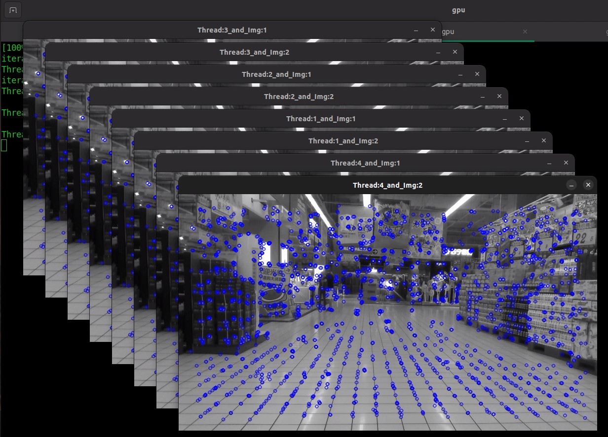

# GPU ORB Extractor

GPU ORB Extractor generates keypoints and descriptors from images for Visual
SLAM front ends. This guide covers installation, OpenCV and OpenCV-free APIs,
and operational constraints.

## Overview and Installation

The orb-extractor feature takes an input image and provides keypoints (spatial locations or points in the image that define what is interesting) and descriptor data for those keypoints of that input image.

The library implements the orb-extractor feature, running on a GPU.

This orb-extractor feature can be easily integrated into Visual SLAM. After initializing the orb-extractor feature object, the extract function can be called for every input frame. The extract function returns a set of keypoints and descriptors.

The orb-extractor feature is constructed from various GPU kernels, including image resize, Gaussian operations, FAST feature extraction, and descriptor and orientation calculations. It interfaces with the GPU via the oneAPI Level Zero interface, with the GPU kernels developed using the C-for-Metal SDK.

The orb-extractor feature library enables users to generate multiple orb-extractor objects tailored to their applications. Additionally, a single orb-extractor feature object can process input from one or multiple camera sources, providing versatile support for various configurations in Visual SLAM front-ends.

The orb-extractor feature library provides two binary files: one linked with the OpenCV library and another without it. The OpenCV-linked version handles input and output using OpenCV objects like `cv::Mat` and `cv::KeyPoints`. The version not dependent on OpenCV uses the internally defined input and output formats within the orb-extractor feature library.

### Deb Packages

- `liborb-lze` - Includes host libraries `libgpu_orb.so`, `libgpu_orb_ocvfree.so`, and compiled GPU kernels.
- `liborb-lze-dev` - Sample code to show how to use the library.

### Prerequisites

Complete the [Getting Started](../../platform_foundation/getting_started.md) guide before continuing.

### Install Deb Packages

```bash
sudo apt install liborb-lze-dev liborb-lze
```

## Use the OpenCV Library

This tutorial shows how to use the GPU orb-extractor feature library API.

The GPU orb-extractor feature library offers thread-safe support for both single and multiple cameras.

This tutorial illustrates GPU orb-extractor feature library usage with OpenCV `cv::Mat` and `cv::Keypoints`. It explains using multiple CPU threads with multiple ORB extractor objects, as well as using a single orb-extractor feature object to handle multiple camera inputs.

The multithread feature provides more flexibility for Visual SLAM to call multiple objects of the orb-extractor feature library.

### OpenCV API Prerequisites

Complete the [Getting Started](../../platform_foundation/getting_started.md) guide before continuing.

### OpenCV API Tutorial

> **Note:** This tutorial can be run both inside and outside a Docker image. It assumes that the `liborb-lze-dev` Deb package is installed and the user has copied the tutorial directory from `/opt/intel/orb_lze/samples/` to a user-writable directory.

1. Prepare the environment:

   ```bash
   sudo apt install liborb-lze-dev libgflags-dev
   cp -r /opt/intel/orb_lze/samples/ ~/orb_lze_samples
   cd ~/orb_lze_samples/
   ```

2. `main.cpp` should be in the directory. [View it on GitHub](https://github.com/open-edge-platform/edge-ai-suites/blob/main/robotics-ai-suite/docs/user-guide/software_references/amr/sources/sample/main.cpp) to read the comments for the code.

3. Build the code:

   ```bash
   mkdir build && cd build
   cmake ../
   make -j
   ```

4. Run the binary:

   ```bash
   ./feature_extract -h
   ```

   - Available command line arguments:

   ```text
   Usage: ./feature_extract --images=<> --image_path=<> --threads=<>

     --images <integer>     : Number of images or number of cameras. Default value: 1
     --image_path <string>  : Path to input image files. Default value: image.jpg
     --threads <integer>    : Number of threads to run. Default value: 1
     --iterations <integer> : Number of iterations to run. Default value: 10
   ```

   - The following command runs four threads, each thread taking two camera image inputs:

   ```bash
   ./feature_extract --images=2 --threads=4
   ```

5. Expected results example:

   ```text
   ./feature_extract --images=2 --threads=4
    iteration 10/10
    Thread:2: gpu host time=21.4233
    iteration 10/10
    Thread:1: gpu host time=21.133
    iteration 10/10
    Thread:4: gpu host time=20.9086
    iteration 10/10
    Thread:3: gpu host time=20.6155
   ```

   After execution, the input image displays keypoints as blue dots.

   

   > **Note:** You can specify the number of images per thread and the number of threads to execute. You can process multiple image inputs within a single thread of the extract API, or process one or more image inputs using multiple threads with extract API calls.

## Use the OpenCV-free Library

This tutorial demonstrates how to use the GPU orb-extractor feature OpenCV-free library.
The GPU orb-extractor feature OpenCV-free library provides similar features, except input and output structures are defined within this library.

### OpenCV-free API Tutorial

1. Prepare the environment:

   ```bash
   cd /opt/intel/orb_lze/samples/
   ```

2. `main.cpp` should be in the directory. [View it on GitHub](https://github.com/open-edge-platform/edge-ai-suites/blob/main/robotics-ai-suite/docs/user-guide/software_references/amr/sources/sample/main.cpp) to read the comments for the code.

   > **Note:** Refer to the [OpenCV API tutorial](#opencv-api-tutorial) for details on using the orb-extractor feature library API.

3. Build the code:

   ```bash
   cp -r /opt/intel/orb_lze/samples/ ~/orb_lze_samples
   cd ~/orb_lze_samples/
   mkdir build
   cd build
   cmake -DBUILD_OPENCV_FREE=ON ../
   make -j$(nproc)
   ```

4. Run the binary:

   ```bash
   ./feature_extract -h
   ```

   - Available command line arguments:

   ```text
   Usage: ./feature_extract --images=<> --image_path=<> --threads=<>

     --images <integer>     : Number of images or number of cameras. Default value: 1
     --image_path <string>  : Path to input image files. Default value: image.jpg
     --threads <integer>    : Number of threads to run. Default value: 1
     --iterations <integer> : Number of iterations to run. Default value: 10
   ```

   - The following command runs four threads, each thread taking two camera image inputs:

   ```bash
   ./feature_extract --images=2 --threads=4
   ```

5. Expected results example:

   ```text
   ./feature_extract --images=2 --threads=4
    iteration 10/10
    Thread:2: gpu host time=21.4233
    iteration 10/10
    Thread:1: gpu host time=21.133
    iteration 10/10
    Thread:4: gpu host time=20.9086
    iteration 10/10
    Thread:3: gpu host time=20.6155
   ```

   After execution, the input image displays keypoints as blue dots.

   

   > **Note:** You can specify the number of images per thread and the number of threads to execute.
   > You can process multiple image inputs within a single thread of the extract API, or process one or more image inputs using multiple threads with extract API calls.

## Limitations and Troubleshooting

1. To use the multiple camera images feature on a single orb-extractor feature object, all input images must have the same width and height.
2. For different-sized images, create a separate orb-extractor feature object for each image. Spawn a new thread for concurrent execution.

### Troubleshooting

If a segmentation fault occurs, follow these steps:

```bash
# Confirm whether the GPU driver is loaded
lsmod | grep i915

# Add the current user to the render group
sudo usermod -a -G render <userName>
```
