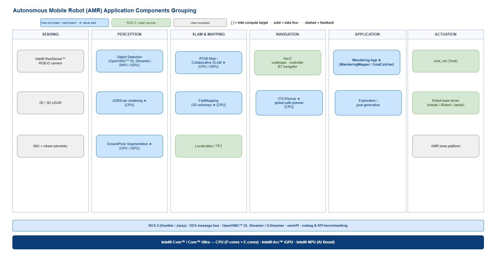
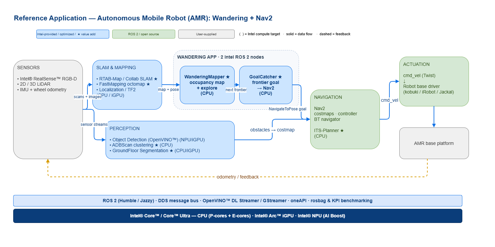

<div class="component_card_widget">
  <a class="icon_github" href="https://github.com/open-edge-platform/edge-ai-suites/tree/main/robotics-ai-suite">
     GitHub
  </a>
  <a class="icon_document" href="https://github.com/open-edge-platform/edge-ai-suites/blob/main/robotics-ai-suite/docs/user-guide/resources/release-notes.md">
     Release Notes
  </a>
  <a class="icon_document" href="https://github.com/open-edge-platform/edge-ai-suites/blob/main/robotics-ai-suite/README.md">
     Readme
  </a>
</div>


# Autonomous Mobile Robot

The Autonomous Mobile Robot provides software packages and pre-validated hardware modules for sensor data ingestion, classification, environment modeling, action planning, action control. It supports documented ROS 2 Jazzy and Humble configuration tracks, with reference algorithms and working examples.

Beyond autonomous mobility, this package demonstrates map building and Simultaneous Localization And Mapping (SLAM) loop closure functionality. It utilizes an open source version of visual SLAM with input from an RealSense camera. Optionally, the package allows you to run Light Detection and Ranging (LiDAR) based SLAM and compare those results with visual SLAM results on accuracy and performance indicators. Additionally, it detects and highlights the objects on the map. Depending on the platform that is used, workloads are executed on an integrated GPU or on Intel® CPU.

The Autonomous Mobile Robot addresses industrial, manufacturing, consumer market, and smart cities use cases, facilitating data collection, storage, and analytics across various nodes on the factory floor.
Develop, build, and deploy end-to-end mobile robot applications with this purpose-built, open, and modular software development kit that includes libraries, middleware, and sample applications based on the open source ROS 2 Humble robot operating system.

## Architecture

The Autonomous Mobile Robot collection groups its components into **sensing**, **perception**, **SLAM & mapping**, **navigation**, and the **application** layer — all on ROS 2 and accelerated on Intel® Core™ / Core™ Ultra. Intel-optimized components (marked ★) sit alongside upstream ROS 2 packages such as Nav2.



The reference `Wandering` application ties these together end-to-end. Sensors feed perception and SLAM; the Wandering application — two Intel ROS 2 nodes, `WanderingMapper` (builds the occupancy map and picks the next unexplored frontier) and `GoalCatcher` (issues `NavigateToPose` goals) — drives exploration through Nav2, while obstacles from Object Detection, ADBScan, and GroundFloor Segmentation continuously update the Nav2 costmap. Nav2 then commands the robot base.



For how this collection fits into the full stack, see the [Robotics AI Suite architecture overview](https://docs.openedgeplatform.intel.com/dev/ai-suite-robotics.html).

## Validated Configurations

The Autonomous Mobile Robot Blueprint supports the configuration tracks below.
Each track is validated with the robot, sensors, packages, and setup procedure
identified in its linked guide. A track does not imply that every AMR tutorial
supports every hardware or middleware combination.

| Configuration track | Compute platform and robot | Operating system | ROS 2 | Sensors | Setup guide |
| --- | --- | --- | --- | --- | --- |
| PTL reference platform | Intel Panther Lake (PTL) platform with an Intel 358H processor and an integrated robot kit | Canonical Ubuntu 24.04 LTS | Jazzy Jalisco | RealSense camera; additional sensors are application dependent | Consult the platform integration guide. |
| Clearpath Jackal | Clearpath Jackal onboard computer | Canonical Ubuntu 24.04 LTS | Jazzy Jalisco | RealSense D435i | [Clearpath Robotics Jackal](clearpath-jackal.md) |


## AMR Development Paths

<!--hide_directive
::::{grid} 2hide_directive-->

<!--hide_directive:::{grid-item-card}hide_directive--> **Simulation Learning Path**
<!--hide_directive:link: ../../software_references/amr/simulation/index
:link-type: doc
:link-alt: clickable cardshide_directive-->

Learn how to use the simulation-focused tools and components provided in the toolkit.
<!--hide_directive:::hide_directive-->

<!--hide_directive:::{grid-item-card}hide_directive--> **Deployment Learning Path**
<!--hide_directive:link: ../../software_references/amr/deployment/index
:link-type: doc
:link-alt: clickable cardshide_directive-->

Learn how to use the deployment-focused tools and components provided in the toolkit.
<!--hide_directive:::
::::
hide_directive-->

```{toctree}
:maxdepth: 1
:hidden:

clearpath-jackal
```
