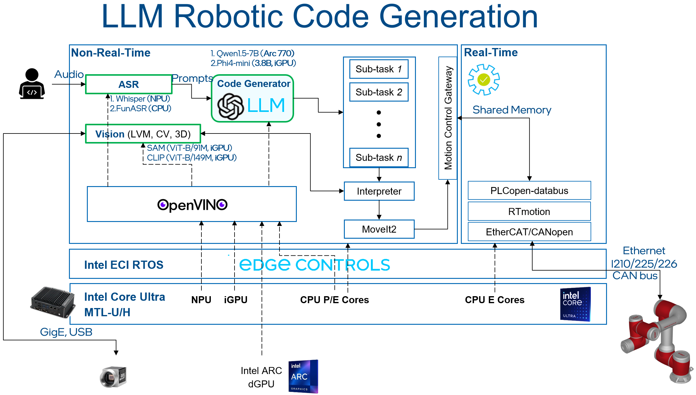
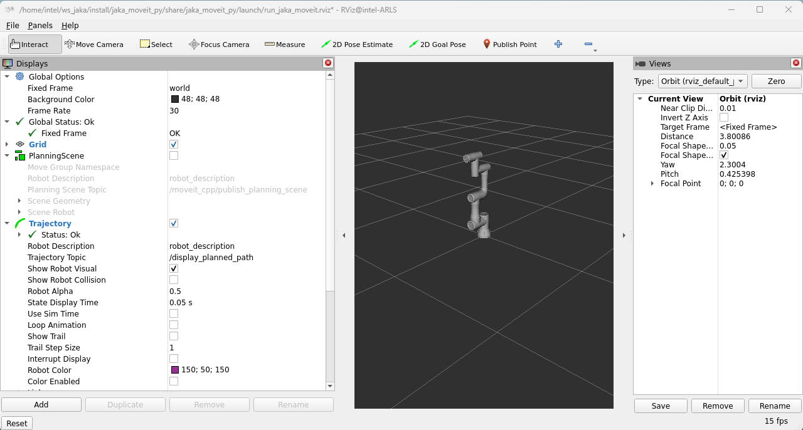
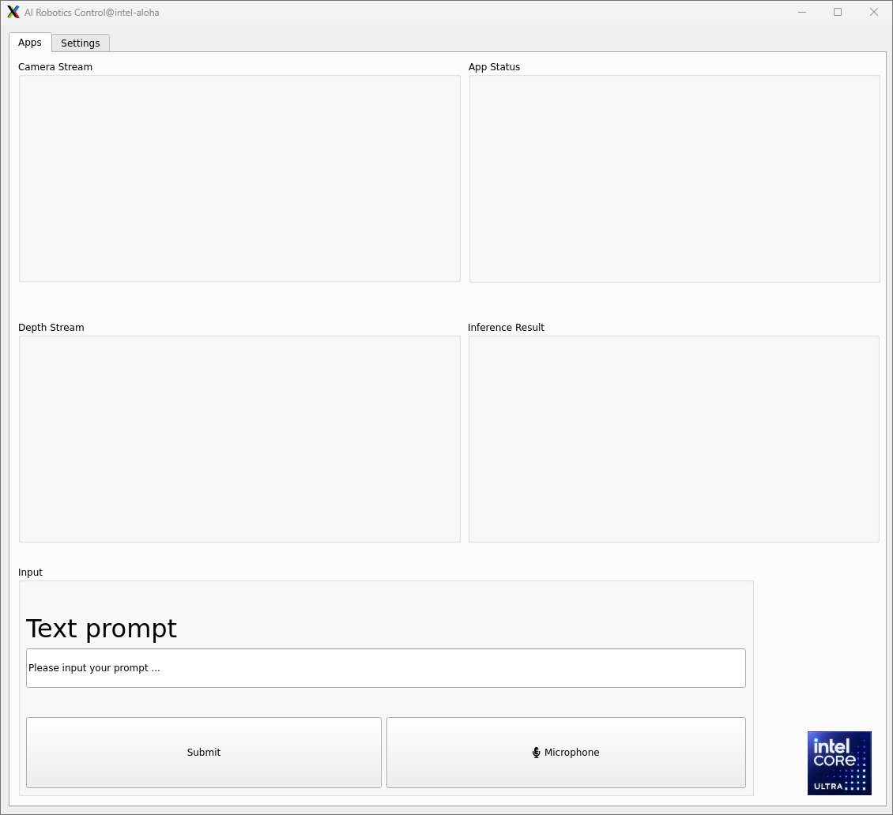
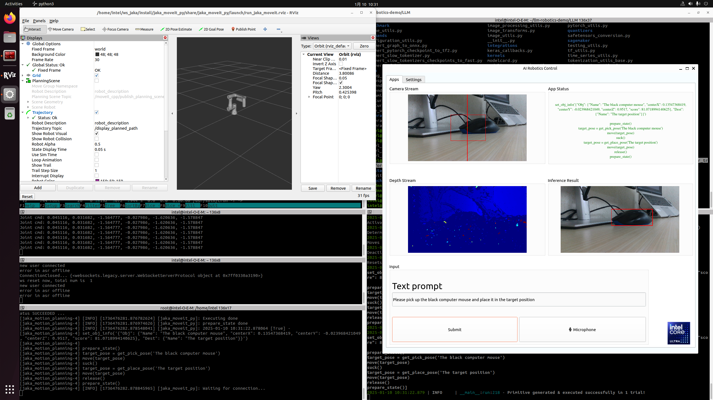

# LLM Robotics Demo

We have built a code generation pipeline for robotics, interacting with
a chat bot utilizing AI technologies such as large language models
(Phi-4) and computer vision (SAM, CLIP). It will use the user\'s voice
or enter a text commands to provide a prompt to the robotics agent to
generate corresponding actions.

This tutorial will provide a step-by-step guide to set up a real-time
system to control a JAKA robot arm with movement commands generated
using an LLM. The picture below shows the architecture of the demo:



## Component Documentation

Comprehensive documentation on this component is available here: [Link](https://docs.openedgeplatform.intel.com/edge-ai-suites/robotics-ai-suite/main/embodied/sample_pipelines/imitation_learning_act.html)

## Prerequisites

> [!IMPORTANT]
> Please make sure you have all the prerequisites and installation in
> [Installation & Setup](https://docs.openedgeplatform.intel.com/edge-ai-suites/robotics-ai-suite/main/embodied/installation_setup.html)
> and also ensure you have the following list-table prerequisites:

  -----------------------------------------------------------------------
  Specification                       Recommended
  ----------------------------------- -----------------------------------
  Processor                           Intel® Core™ Ultra 7 Processor 265H

  Storage                             256G

  Memory                              LPDDR5, 6400 MHz, 16G x 2
  -----------------------------------------------------------------------

## JAKA robot arm setup

This section will provide a step-by-step guide to setup a simulation
JAKA robot-arm ROS2 application.

### Install PLCopen library

1.  Install dependency:

    ``` bash
    $ sudo apt install libeigen3-dev python3-pip python3-venv cmake
    $ sudo python3 -m pip install pymodbus==v3.6.9
    ```

2.  Install PLCopen library:

    ``` bash
    $ sudo apt install libshmringbuf libshmringbuf-dev plcopen-ruckig plcopen-ruckig-dev plcopen-motion plcopen-motion-dev plcopen-servo plcopen-servo-dev plcopen-databus plcopen-databus-dev
    ```

### Install ROS2 Iron

1.  Install dependency:

    ``` bash
    $ sudo apt update && sudo apt install -y locales curl gnupg2 lsb-release
    ```

2.  Setup the [\|Intel\|](##SUBST##|Intel|) oneAPI APT repository:

    ``` bash
    $ sudo -E wget -O- https://apt.repos.intel.com/intel-gpg-keys/GPG-PUB-KEY-INTEL-SW-PRODUCTS.PUB | gpg --dearmor | sudo tee /usr/share/keyrings/oneapi-archive-keyring.gpg > /dev/null
    $ echo "deb [signed-by=/usr/share/keyrings/oneapi-archive-keyring.gpg] https://apt.repos.intel.com/oneapi all main" | sudo tee /etc/apt/sources.list.d/oneAPI.list
    $ sudo apt update
    ```

3.  Setup the public ROS2 Iron APT repository:

    ``` bash
    $ sudo curl -sSL https://raw.githubusercontent.com/ros/rosdistro/master/ros.key  -o /usr/share/keyrings/ros-archive-keyring.gpg
    $ echo "deb [arch=$(dpkg --print-architecture) signed-by=/usr/share/keyrings/ros-archive-keyring.gpg] http://packages.ros.org/ros2/ubuntu $(source /etc/os-release && echo $UBUNTU_CODENAME) main" | sudo tee /etc/apt/sources.list.d/ros2.list > /dev/null
    $ sudo bash -c 'echo -e "Package: *\nPin: origin eci.intel.com\nPin-Priority: -1" > /etc/apt/preferences.d/isar'
    $ sudo apt update
    ```

4.  Install ROS2 Iron packages:

    ``` bash
    $ sudo apt install -y python3-colcon-common-extensions python3-argcomplete python3-pykdl
    $ sudo apt install -y ros-iron-desktop ros-iron-moveit* ros-iron-osqp-vendor ros-iron-ament-cmake-google-benchmark librange-v3-dev ros-iron-ros-testing
    $ sudo bash -c 'echo -e "Package: *\nPin: origin eci.intel.com\nPin-Priority: 1000" > /etc/apt/preferences.d/isar'
    ```

### Install JAKA robot arm application

1.  Download the source code of JAKA robot arm:

    ``` bash
    $ cd ~/Downloads/
    $ sudo apt source ros-humble-pykdl-utils ros-humble-jaka-bringup ros-humble-jaka-description ros-humble-jaka-hardware ros-humble-jaka-moveit-config ros-humble-jaka-moveit-py ros-humble-jaka-servo ros-humble-run-jaka-moveit ros-humble-run-jaka-plc
    ```

2.  Create workspace for robot arm source code:

    ``` bash
    $ mkdir -p ~/ws_jaka/src
    $ cp -r ~/Downloads/ros-humble-jaka-bringup-3.2.0/robot_arm/ ~/ws_jaka/src
    ```

3.  Build JAKA robot arm source code:

    ``` bash
    $ cd ~/ws_jaka/ && source /opt/ros/iron/setup.bash
    $ touch src/robot_arm/jaka/jaka_servo/COLCON_IGNORE
    $ colcon build
    ```

## FunASR setup

This section will provide a step-by-step guide to setup a FunASR (A
Fundamental End-to-End Speech Recognition Toolkit) server.

### Install dependency

``` bash
$ sudo apt-get install cmake libopenblas-dev libssl-dev portaudio19-dev ffmpeg git python3-pip -y
```

### Add OpenVINO speech model to FunASR

1.  Install FunASR environment:

    ``` bash
    $ sudo apt install funasr llm-robotics
    $ cd /opt/funasr/
    $ sudo bash install_funasr.sh
    ```

2.  Install the `asr-openvino` model script:

    ``` bash
    $ sudo chown -R $USER /opt/funasr/
    $ sudo chown -R $USER /opt/llm-robotics/
    $ mkdir /opt/funasr/FunASR/funasr/models/intel/
    $ cp -r /opt/llm-robotics/asr-openvino-demo/models/* /opt/funasr/FunASR/funasr/models/intel/
    ```

3.  Create a virtual FunASR Python environment:

    ``` bash
    $ cd /opt/funasr/
    $ python3 -m venv venv-asr
    $ source venv-asr/bin/activate
    $ pip install modelscope==1.17.1 onnx==1.16.2 humanfriendly==10.0 pyaudio websocket==0.2.1 websockets==12.0 translate==3.6.1 kaldi_native_fbank==1.20.0 onnxruntime==1.18.1 torchaudio==2.4.0 openvino==2024.3.0
    ```

4.  Build `asr-openvino` model:

    ``` bash
    $ cd /opt/funasr/FunASR/
    $ pip install -e ./
    $ python ov_convert_FunASR.py
    $ cp -r ~/.cache/modelscope/hub/iic/speech_seaco_paraformer_large_asr_nat-zh-cn-16k-common-vocab8404-pytorch /opt/llm-robotics/asr-openvino-demo/
    ```

5.  Quantitative model using `ovc`:

    ``` bash
    $ cd /opt/llm-robotics/asr-openvino-demo/speech_seaco_paraformer_large_asr_nat-zh-cn-16k-common-vocab8404-pytorch/
    $ ovc model.onnx --output_model=model_bb_fp16
    $ ovc model_eb.onnx --output_model=model_eb_fp16
    ```

6.  Modify the `configuration.json` file of the speech model:

    ``` console
    # modify model_name_in_hub.ms & file_path_metas.init_param
    {
      "framework": "pytorch",
      "task" : "auto-speech-recognition",
      "model": {"type" : "funasr"},
      "pipeline": {"type":"funasr-pipeline"},
      "model_name_in_hub": {
        "ms":"",
        "hf":""},
      "file_path_metas": {
        "init_param":"model_bb_fp16.xml",
        "config":"config.yaml",
        "tokenizer_conf": {"token_list": "tokens.json", "seg_dict_file": "seg_dict"},
        "frontend_conf":{"cmvn_file": "am.mvn"}}
    }
    ```

7.  Reinstall the `funasr` model of FunASR:

    ``` bash
    $ cd /opt/funasr/FunASR/
    $ pip uninstall funasr
    $ pip install -e ./
    ```

## LLM and vision models setup

This section will provide a step-by-step guide to setup a virtual Python
environment to run LLM demo.

### Setup a virtual environment for application

1.  Install the `pip` packages for LLM:

    ``` bash
    $ cd /opt/llm-robotics/LLM/
    $ python3 -m venv venv-llm
    $ source venv-llm/bin/activate
    $ pip install -r requirement.txt
    ```

2.  Set the environment variable:

    ``` bash
    $ # If you have connection issue on HuggingFace in PRC, please set-up the networking environment by following commands:
    $ export HF_ENDPOINT="https://hf-mirror.com"
    $ # transformers offline: export TRANSFORMERS_OFFLINE=1
    ```

### Setup the SAM model

Follow the OpenVINO documentation below to export and save `SAM` model:

- SAM:
  <https://github.com/openvinotoolkit/openvino_notebooks/tree/2025.2/notebooks/segment-anything>

Modify the loading PATH of models to the exported model path, the
default path is:

> ``` console
> # /opt/llm-robotics/LLM/utils/mobilesam_helper.py:L88-L89
> ov_sam_encoder_path = f"/home/intel/ov_models/sam_image_encoder.xml"
> ov_sam_predictor_path = f"/home/intel/ov_models/sam_mask_predictor.xml"
> ```

### Setup the CLIP model

Follow the OpenVINO documentation below to export and save
`CLIP (ViT-B)` model:

- CLIP:
  <https://github.com/openvinotoolkit/openvino_notebooks/tree/2025.2/notebooks/clip-zero-shot-image-classification>

Modify the loading PATH of models to the exported model path, the
default path is:

``` console
# /opt/llm-robotics/LLM/utils/mobilesam_helper.py:L87
clip_model_path = f"/home/intel/ov_models/clip-vit-base-patch16.xml"
```

### Setup the `Phi-4-mini-instruct-int8-ov` model

Follow the below commands to download `Phi-4-mini-instruct-int8-ov`
models:

``` bash
$ sudo apt install git-lfs
$ mkdir ~/ov_models && cd ~/ov_models
$ GIT_LFS_SKIP_SMUDGE=1 git clone https://hf-mirror.com/OpenVINO/Phi-4-mini-instruct-int8-ov
$ git lfs pull
```

Set the environment variable:

Modify the loading PATH of models to the exported model path, the
default path is:

``` console
# /opt/llm-robotics/LLM/llm_bridge.py:L27
self.model_path = "/home/intel/ov_models/Phi-4-mini-instruct-int8-ov"
```

## Run pipeline

This section will provide a step-by-step guide to launch LLM robotics
demo.

### Prepare System

Please connect the following items to the [\|Core\|](##SUBST##|Core|)
Ultra IPC.

  -----------------------------------------------------------------------------------------------
  Item     Explanation                      LINK
  -------- -------------------------------- -----------------------------------------------------
  Camera   Intel® RealSense™ Depth Camera   <https://www.intelrealsense.com/depth-camera-d435/>
           D435                             

  USB Mic  Audio input device of FunASR,    UGREEN CM564
           16k sampling rate                
  -----------------------------------------------------------------------------------------------

### Launch LLM Robotic Demo

The LLM Robotic demo includes the real-time component, non-real-time
ROS2 component, and non-real-time LLM component.


> [!IMPORTANT]
> Please ensure a stable network connection before running the demo. The
> FunASR and LLM applications require an active network connection.

1.  Launch the OpenVINO FunASR server:

    ``` bash
    $ source /opt/funasr/venv-asr/bin/activate
    $ python3 /opt/funasr/FunASR/runtime/python/websocket/funasr_wss_server.py --port 10095 --certfile "" --keyfile "" --asr_model /opt/llm-robotics/asr-openvino-demo/speech_seaco_paraformer_large_asr_nat-zh-cn-16k-common-vocab8404-pytorch/
    ```

2.  Launch the real-time application:

    ``` bash
    $ # affinity real time application to core 3
    $ sudo taskset -c 3 plc_rt_pos_rtmotion
    ```

    If the real-time application launches successfully, the terminal
    will show the following:

    ``` console
    Axis 0 initialized.
    Axis 1 initialized.
    Axis 2 initialized.
    Axis 3 initialized.
    Axis 4 initialized.
    Axis 5 initialized.
    Function blocks initialized.
    ```

3.  Launch the JAKA robot arm ROS2 node:

    > [!IMPORTANT]
    > Execute the following commands as privileged user (`root`).

    ``` bash
    $ source ~/ws_jaka/install/setup.bash
    $ ros2 launch jaka_moveit_py jaka_motion_planning.launch.py
    ```

    If the ROS2 node launches successfully, RVIZ2 will display the following:

    

4.  Launch the LLM application:

    ``` bash
    $ source /opt/intel/oneapi/setvars.sh
    $ cd /opt/llm-robotics/LLM/
    $ source venv-llm/bin/activate
    $ python main.py
    ```

    If the LLM application launches successfully, the demo UI will
    display the following:

    > 

    - Camera Stream & Depth Stream: displays the real-time color and
      depth streams from the camera.
    - App status: indicates the status and outcome of code generation.
    - Inference Result: presents the results from the SAM and CLIP
      models.
    - Text prompt: enter prompts in English via keyboard or in Chinese
      using the microphone. Press the \"Submit\" button to start the
      inference process.

    Attach a demo picture with the prompt (Please pick up the black
    computer mouse and place it in the target position) as shown below:

    > 
