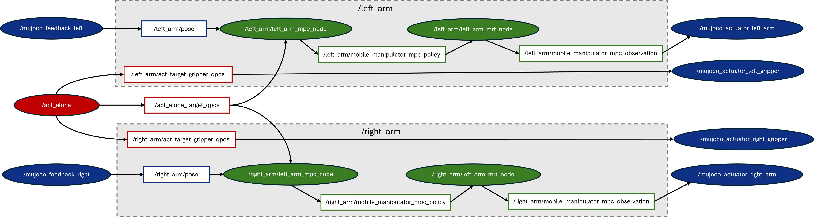

<!--
Copyright (C) 2025 Intel Corporation

SPDX-License-Identifier: Apache-2.0
-->

# Model Predictive Control

Model predictive control (MPC) is an advanced method of process control that is used to control a process while satisfying a set of constraints. Model predictive controllers rely on dynamic models of the process, most often linear empirical models obtained by system identification. The main advantage of MPC is the fact that it allows the current timeslot to be optimized, while keeping future timeslots in account. Also MPC has the ability to anticipate future events and can take control actions accordingly. These features can benefit current model-based robotics control in Perception-Action frequency gap, unsmoothness of generated trajectories, and potential collision.

Here, we adopted an open-source MPC project named Optimal Control for Switched Systems (OCS2) and built a complete pipeline consisting of AI reference model(ACT), MPC(OCS2), and simulation(MUJOCO). The picture below shows the ROS node/topic graph of this demo with three modules: ACT AI model module (marked as red), OCS2 MPC optimization module (marked as green), and Mujoco simulation module (marked as blue).




## Prerequisites

Please make sure you have finished setup steps in [Get Started](https://docs.openedgeplatform.intel.com/2026.2/edge-ai-suites/robotics-ai-suite/platform_foundation/getting_started.html) and followed refer to [oneAPI doc](https://docs.openedgeplatform.intel.com/2026.2/edge-ai-suites/robotics-ai-suite/components/ai_resources/developer_tools/oneapi.html) to setup Intel® oneAPI packages.

## ROS2 Jazzy Setup

Please refer to the [official ROS2 Jazzy installation](https://docs.ros.org/en/jazzy/Installation/Ubuntu-Install-Debs.html). The target platform for this release is Ubuntu 24.04.

> **Note:** This release is maintained for ROS2 Jazzy only. If you need ROS2 Humble, please switch to the **2026.1** release.

## ACT Setup

The required ACT module is based on the open-source [ACT](https://github.com/tonyzhaozh/act) repository and patches from 0001 to 0006 in [act-ov](../act-sample/patches/ov/) are needed:

| Patch num | Enhancement                  |
| --------- | ---------------------------- |
| 001 - 005 | Intel® OpenVINO™             |
|    006    | Add ROS2 node                |

To set up the required ACT module, please follow the ACT installation guide in the [imitation learning ACT documentation](../act-sample/README.md) except `Install ACT package`. Here, we need to install ACT source code by downloading [act-sample](../act-sample), and initialize submodules and apply patches:

```bash
cd act-sample

# initialize submodules
git submodule init
git submodule update

# apply patches
git apply ../patches/ov/0001-enable-openvino-inference-for-eval.patch
git apply ../patches/ov/0002-add-model-conversion-script.patch
git apply ../patches/ov/0003-changes-for-real-robot.patch
git apply ../patches/ov/0004-Modify-the-camera-mode-to-fixed.patch
git apply ../patches/ov/0005-Modify-the-default-cameras-config.patch
git apply ../patches/ov/0006-add-ros2-node-and-use-fixed-cube-pose.patch
```

## OCS2 Setup

The required MPC module is based on the open-source project [OCS2](https://github.com/leggedrobotics/ocs2). OCS2 is a C++ toolbox tailored for Optimal Control for Switched Systems (OCS2). It provides an efficient implementation of Continuous-time domain constrained DDP (SLQ) and many other helpful algorithms. To facilitate the application of OCS2 in robotic tasks, it provides the user with additional tools to set up the system dynamics (such as kinematic or dynamic models) and cost/constraints (such as self-collision avoidance and end-effector tracking) from a URDF model. Your can go to [OCS2 official web](https://leggedrobotics.github.io/ocs2/overview.html) for more details.

The upstream OCS2 project already provides a ROS2 baseline, so the following two patches are provided to enable it on ACT Aloha:

| Patch num | Enhancement                                              |
| --------- | -------------------------------------------------------- |
|    001    | Add dual-arm ALOHA mobile manipulator for ACT+OCS2+MUJOCO |
|    002    | Add non-ROS MPC (MPC-MRT) module and test pipeline        |

### Install OCS2

1. Install dependencies:

   ```bash
   # install basic libraries
   sudo apt update
   sudo apt-get install -y \
   build-essential cmake git \
   python3-colcon-common-extensions python3-rosdep \
   python3-dev pybind11-dev \
   libeigen3-dev libboost-all-dev libglpk-dev \
   libgmp-dev libmpfr-dev libcgal-dev libopencv-dev libpcl-dev \
   liburdfdom-dev \
   libglfw3 libglfw3-dev libosmesa6 freeglut3-dev mesa-common-dev \
   python3-pip python3-wstool wget

   # install ROS 2 Jazzy libraries
   sudo apt-get install -y \
   ros-jazzy-eigen3-cmake-module \
   ros-jazzy-hpp-fcl \
   ros-jazzy-grid-map \
   ros-jazzy-xacro \
   ros-jazzy-robot-state-publisher \
   ros-jazzy-joint-state-publisher \
   ros-jazzy-rviz2
   ```

   On Jazzy, `rosdep` resolves `pinocchio` to `ros-jazzy-pinocchio`, which is not
   released. Install Pinocchio (and coal) from OpenRobots robotpkg instead:

   ```bash
   sudo apt install -y curl ca-certificates gnupg lsb-release
   sudo install -d -m 0755 /etc/apt/keyrings
   curl -fsSL http://robotpkg.openrobots.org/packages/debian/robotpkg.asc | sudo tee /etc/apt/keyrings/robotpkg.asc >/dev/null
   echo "deb [arch=amd64 signed-by=/etc/apt/keyrings/robotpkg.asc] http://robotpkg.openrobots.org/packages/debian/pub $(. /etc/os-release && echo $VERSION_CODENAME) robotpkg" | sudo tee /etc/apt/sources.list.d/robotpkg.list >/dev/null
   sudo apt update
   sudo apt install -y robotpkg-pinocchio robotpkg-coal
   ```

   Make sure CMake and the dynamic loader can find the robotpkg installs (add these
   to your shell rc to persist across terminals):

   ```bash
   export CMAKE_PREFIX_PATH=/opt/openrobots:${CMAKE_PREFIX_PATH}
   export LD_LIBRARY_PATH=/opt/openrobots/lib:${LD_LIBRARY_PATH}
   ```

2. Create workspace for ocs2 and ocs2_robotic_assets:

   ```bash
   source /opt/ros/jazzy/setup.bash
   mkdir -p ~/ocs2_ws/src
   cd ~/ocs2_ws/src
   ```

3. Get ocs2 and ocs2_robotic_assets:

   Download [ocs2](./ocs2/) and [ocs2_robotic_assets](./ocs2_robotic_assets/) with `git clone --recursive`. Then, initialize submodules and apply patches:

   ```bash
   cd ~/ocs2_ws/src/ocs2
   ./install_ocs2_patches.sh patches/ocs2.scc
   ```

   ```bash
   cd ~/ocs2_ws/src/ocs2_robotic_assets
   ./install_ocs2_robotic_assets_patches.sh patches/ocs2_robotic_assets.scc
   ```

4. Build ocs2 and ocs2_robotic_assets:

   ```bash
   cd ~/ocs2_ws/

   # rosdep (Pinocchio is provided by robotpkg above, so skip it here)
   rosdep init
   rosdep update --rosdistro jazzy
   rosdep install --from-paths src --ignore-src -r -y --skip-keys pinocchio

   # build
   source /opt/ros/jazzy/setup.bash
   colcon build --packages-skip mujoco_ros_utils --cmake-args -DCMAKE_BUILD_TYPE=Release
   ```

## MUJOCO Setup

The required Mujoco module is based on the open-source Mujoco Plugin project [MujocoRosUtils](https://github.com/isri-aist/MujocoRosUtils/tree/main) to visualize and simulate the ACT cube transmitting task in Mujoco 2.3.7. Installation guide is as follows:

1. Download Mujoco 2.3.7 library:

   ```bash
   wget https://github.com/deepmind/mujoco/releases/download/2.3.7/mujoco-2.3.7-linux-x86_64.tar.gz
   mkdir ~/.mujoco
   tar -zxvf mujoco-2.3.7-linux-x86_64.tar.gz -C ~/.mujoco/
   rm -fr mujoco-2.3.7-linux-x86_64.tar.gz
   ```

2. Download MujocoRosUtils:

   Download [mujoco_ros_utils](./mujoco_ros_utils/) with `git clone --recursive`. Then, initialize submodules and apply patches:

   ```bash
   cd ~/ocs2_ws/src/mujoco_ros_utils
   ./install_mujoco_ros_utils_patches.sh patches/mujoco_ros_utils.scc
   ```

3. Build MujocoRosUtils

   ```bash
   source /opt/ros/jazzy/setup.bash
   source ~/ocs2_ws/install/setup.bash
   cd ~/ocs2_ws
   colcon build --packages-select mujoco_ros_utils --cmake-args -DCMAKE_BUILD_TYPE=RelWithDebInfo -DMUJOCO_ROOT_DIR=$HOME/.mujoco/mujoco-2.3.7
   ```

## Run pipeline

1. Run Mujoco:

   Open new terminal and run the following commands:

   ```bash
   source /opt/ros/jazzy/setup.bash
   source ~/ocs2_ws/install/setup.bash
   cd ~/.mujoco/mujoco-2.3.7/bin
   ./simulate [path to your MujocoRosUtils]/xml/bimanual_viperx_transfer_cube_dual_arm.xml
   ```

   If running successfully, the mujoco UI will display two opposing ALOHA robotic arms.
   If you observe collisions between the arms, don't worry; this is normal before initialization.

   > **Note:** If mujoco fails with unknown plugin, please check `ldd` and add lib path manually:
   >
   > ```bash
   > # ldd check
   > ldd ~/.mujoco/mujoco-2.3.7/bin/mujoco_plugin/libMujocoRosUtils*.so
   > # add path
   > export LD_LIBRARY_PATH=~/ocs2_ws/install/ocs2_msgs/lib:$LD_LIBRARY_PATH
   > export LD_LIBRARY_PATH=~/.mujoco/mujoco-2.3.7/bin/mujoco_plugin:$LD_LIBRARY_PATH
   > ```

2. Run MPC:

   Open new terminal and run the following commands:

   ```bash
   source /opt/ros/jazzy/setup.bash
   source ~/ocs2_ws/install/setup.bash
   ros2 launch ocs2_mobile_manipulator_ros manipulator_aloha_dual_arm.launch.py
   ```

   If launching successfully, the OCS2 terminal will print out information
   indicating that two MPC nodes have been successfully reset, and the Mujoco AI will be initialized, as shown in the figures below.

   

   

3. Run ACT:

You can download our pre-trained weights for
[transferring cube task](https://eci.intel.com/embodied-sdk-docs/_downloads/sim_transfer_cube_scripted.zip) and set the argument ``--ckpt_dir`` to the path of the pre-trained weights. Then, open new terminal and run the following commands:

   ```bash
   # env
   source /opt/ros/jazzy/setup.bash
   source ~/ocs2_ws/install/setup.bash
   source [path to your act venv]/bin/activate

   # run act-ov on GPU
   cd [your path to act]
   MUJOCO_GL=egl python3 imitate_episodes.py --task_name sim_transfer_cube_scripted --ckpt_dir [your path to checkpoints] --policy_class ACT --kl_weight 10 --chunk_size 100 --hidden_dim 512 --batch_size 8 --dim_feedforward 3200 --num_epochs 2000  --lr 1e-5 --seed 0 --eval --onscreen_render --device GPU
   ```

   After ACT running successfully, the Mujoco UI appears as follows:

   

## Non-ROS MPC Module (optional)

Patch 002 adds `ocs2_mobile_manipulator_nonros`, a ROS-free variant of the dual-arm
ALOHA demo. Instead of ROS topics, the MPC/MRT nodes, the MuJoCo viewer and the test
publisher exchange data over the ECI shared-memory transport: the nodes publish each
arm's joint state, the publisher supplies gripper targets, and the viewer renders them.
This lets you run and profile the MPC pipeline without a ROS graph.

### Dependencies

```bash
# MuJoCo and hardened XML parsing for Python
pip install mujoco==3.10.0 "defusedxml>=0.7.1"

# shared-memory transport (libshmringbuf.so must be on LD_LIBRARY_PATH,
# e.g. /usr/lib/x86_64-linux-gnu)
sudo apt install -y libshmringbuf-dev plcopen-databus-dev
```

### Build

```bash
source /opt/ros/jazzy/setup.bash
cd ~/ocs2_ws
colcon build --packages-select ocs2_mobile_manipulator_nonros
source install/setup.bash
```

### Run

The three helpers live under the patched OCS2 source tree. In the mpc-demo layout the
submodule is nested one level deep, so set a helper variable once:

```bash
export OCS2_SRC=~/ocs2_ws/src/ocs2/ocs2/ocs2_robotic_examples/ocs2_mobile_manipulator_nonros
```

Startup order does not matter — each shared-memory block is opened lazily, so the
viewer can start before the nodes.

1. Launch both MPC/MRT arm nodes:

   ```bash
   cd "$OCS2_SRC/scripts"
   ./run_aloha_dual_arm.sh
   ```

   Resources are auto-discovered via `AMENT_PREFIX_PATH`; override with
   `NODE_BIN` / `TASK_FILE` / `URDF_FILE` / `LIB_FOLDER`.

2. Start the MuJoCo viewer (one window shows both `vx300s` arms and the tabletop box,
   with full physics so the grippers can grasp and lift the box):

   ```bash
   cd "$OCS2_SRC/scripts"
   python3 mujoco_viewer.py "$OCS2_SRC/aloha_dual_arm_viewer.xml"
   ```

   Arm-joint prefixes default to `vx300s_left` / `vx300s_right` (override with
   `--left-prefix` / `--right-prefix`); adjust refresh rate with `--rate`.

3. Stream an ACT target trajectory (14 values: both arms + both grippers) to the
   nodes and viewer:

   ```bash
   TRAJ="$OCS2_SRC/test/target_trajectories_with_grippers.txt"
   BIN=~/ocs2_ws/install/ocs2_mobile_manipulator_nonros/lib/ocs2_mobile_manipulator_nonros/aloha_act_publisher
   "$BIN" --traj "$TRAJ"          # play once
   "$BIN" --traj "$TRAJ" --loop   # loop forever
   ```

   The trajectory path must be absolute — otherwise the publisher falls back to a
   single static pose. Confirm loading with the log line
   `[act_publisher] playing ... trajectory points`. With `--loop`, the viewer resets
   the box to its keyframe pose at the start of each pass. Other options:
   `--seconds N` static run duration, `--left` / `--right` arm prefixes, and
   positional numbers or `--qpos` to force a single static target.

> **Note:** The shared-memory transport currently unlinks its segment on close
> without distinguishing creator from opener, so restarting individual processes
> mid-session may misbehave. Restart the whole set if you hit shared-memory errors.
