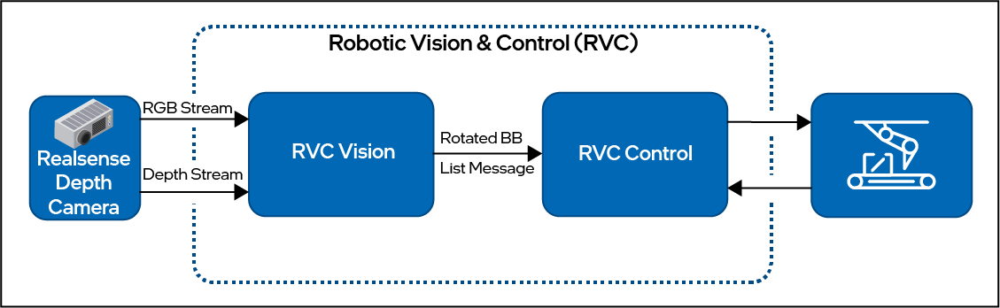

.. _components:

Components and Features of RVC
##############################

RVC Framework is composed by

- Vision Component
   Dedicated to detect and localize target pose
- Control Component
   Dedicated to control the manipulator
- API
   Communication mechanism between Vision and Control

High level design:

.. toctree::
   :maxdepth: 1

   components/rvc_vision
   components/rvc_control
   components/rvc_api

